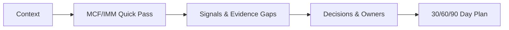
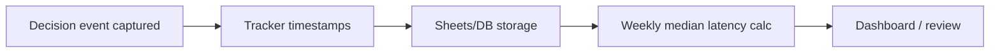

> **TL;DR** — Decision latency is the hidden tax on innovation and public value. ClarityScan® delivers, in **30–45 minutes**: a shared baseline, two proof signals, named owners, and a **30/60/90‑day plan**. Leaders who run this loop weekly cut latency by **~30% in the first 30 days** and see earlier launches, fewer escalations, and higher trust.

Reducing median decision latency shortens the path from policy idea to working service, improving outcomes and trust.

<!--truncate-->

Here’s a scenario to illustrate the problem we’re solving:

_An innovation team has three days to present to potential investors or to the EVP. They have a deck, three options for their product, and a launch window that keeps slipping. Everyone agrees **a decision** is needed, but the team can’t agree on **what proof or evidence** would make it safe to move_. That gap is **_decision latency_**: the time between **_“we need a decision”_** and **_“we made one and acted.”_**

We created [**ClarityScan®**](/services/clarityscan) to shorten that gap. In **30–45 minutes**, we talk with founders, teams, and final decision‑makers to define a successful project baseline, clarify what constraints matter, and agree on owners for each step—plus the next tests and validations. ClarityScan® is the on‑ramp to Doulab’s services and ecosystem: _evidence first_, then _cadence_, so **momentum** returns **this week**, not next quarter.

In a 2025 [report](https://www.gallup.com/workplace/653386/state-of-the-global-workplace-2025.aspx), Gallup estimated that _“low engagement costs the global economy US$9.6 trillion, or 9% of global GDP.”_ When people aren’t engaged and clarity is thin, organizations **hesitate**. Hours become days and days become weeks while opportunities slip and risks accumulate. That’s the cost of latency you can feel at work. If you’ve been here, you’ve seen how people stop engaging and the purpose of the innovation drifts.

That’s why we created ClarityScan® — [book your baseline today](https://buy.stripe.com/28E00jdhCanL5Hb3xmcZa00).

### Let’s talk about failure
Early in my engineering career, I kept hearing the same sobering stats: *“90% of IT projects fail,” “95% of transformation efforts fall short,” “90–97% of startups fail within five years.”* Different contexts, same result: wasted energy and missed opportunities. According to McKinsey, _“when corporations launch transformations, roughly 70 percent fail.”_

When the idea of what Doulab would become started to set in during 2018, we recognized a few truths and asked ourselves critical questions:

- **Entrepreneurship and innovation are hard to achieve.**
- How can we innovate while reducing the risk of failure?
- What is the right recipe for sustained, structured innovation?
- Can we develop a repeatable innovation process that scales effectively?

After many years working to produce evidence and answers, we’ve learned that _failure isn’t mysterious_. It happens when we stop learning, when ownership is unclear, when cadence is missing, or when innovation governance is weak. ClarityScan® provides a path to fix these, starting with a fast, shared read of where you are today.

According to [Forrester](https://www.forrester.com/blogs/us-cx-index-2025-results/), _“US consumer perceptions of CX quality have dropped for an unprecedented fourth year in a row.”_ Innovation projects don’t just need a clear customer experience for end users; they also need it for the teams building them. Innovation often fails because **innovation systems fail**—without clarity of goals, roadmaps, and accountability, burnout takes hold.

Customers don’t wait for alignment. They move on. We built ClarityScan® to help organizations cut through ambiguity and move toward experiences (internal and external) that are effective, easy, and emotionally resonant.

Another critical gap is **evidence** and **data**. Many organizations have weak processes to frame innovation and business‑model hypotheses, or they struggle to generate the right evidence from the right data. The result is either too little signal or too much noise. The craft is getting enough evidence with minimal noise so decisions become safe to make—fast.

One pillar of our [Innovation Maturity Model Program (IMM‑P®)](/services/innovation-maturity) is **evidence‑based decision making**. As [HBS Online notes](https://online.hbs.edu/blog/post/data-driven-decision-making), you make **more confident decisions** as you strengthen data‑driven practice.

But confidence isn’t bravado or blind trust. It comes from having the **right signal** at the **right time** with the **right owner**. That’s what ClarityScan® produces: clarity on where you are, what your objectives are, and the steps to take in the next **30/60/90 days**. 

Let's define decision latency a bit more using a formula. We have discovered almost no organization track this, so I would challenge the reader to implement this as a KPI in their organization.

### Decision Latency Formula + Mini‑Dashboard

**Decision latency = (decision_committed_at) – (decision_requested_at)**

To instrument this, track a simple mini‑dashboard of KPIs:

**Latency dashboard (this quarter):**
- Median decision latency: **21 → 7 days (target)**
- % decisions with **named owner**: **54% → 95%**
- % decisions with **pre‑agreed signals**: **18% → 90%**
- % decisions **reviewed on schedule**: **42% → 85%**

**So what changes?** When latency drops from **21 to 7 days**, teams ship pilots sooner, reduce escalations, and protect strategy from drift.

Instrument latency by adding **decision_requested_at** and **decision_committed_at** timestamps to your issue tracker; compute the **median weekly**. _Speed is earned by evidence. We don’t shortcut governance; we shorten uncertainty._

<picture>
  <source srcset="/img/social/2025-09-12-clarityscan-decision-latency.avif" type="image/avif" />
  <source srcset="/img/social/2025-09-12-clarityscan-decision-latency.webp" type="image/webp" />
  
</picture>

*ClarityScan® baseline — the first step in reducing decision latency.*

> **Book your baseline now:** [Schedule a ClarityScan®](https://buy.stripe.com/28E00jdhCanL5Hb3xmcZa00)

But let's now move to what ClarityScan® is and how it can reduce decision latency.

## The idea in a sentence

ClarityScan® is a fast, structured diagnostic based on the [**MicroCanvas® Framework (MCF) v2.1**](https://themicrocanvas.com) and the [**Innovation Maturity Model Program (IMM‑P®)**](/services/innovation-maturity) gates that produces **actionable next steps** instead of a long report or an unstructured set of comments.

## Why we built it

For two decades, across startups, established businesses, and government institutions, we kept seeing good teams work hard without a shared and unified model for fast decision‑making. Targets were broad, problems fuzzy or undefined, and “proof” ambiguous. We built **MicroCanvas®** to create shared clarity, and then **IMM‑P®** to install a 12+12‑week rhythm with evidence gates. If there wasn’t clarity at a checkpoint, we pivoted and procured evidence before moving forward.

After more than **250 experiments**, by the end of 2024 we realized a missing piece in our innovation process on MCF 2.1 and IMM‑P® was a **starting move** that’s quick and useful on day one. That became [**ClarityScan®**](/services/clarityscan), a **30–45 minute** conversation that finds bottlenecks, names owners, and sets the first **30/60/90‑day** steps.

## What happens in 30–45 minutes

We keep it tight and practical:

1. **Context** — What outcome is stuck? What constraints are real today?  
2. **Quick pass (MCF/IMM)** — Culture, processes, customer experience, and technology.  
3. **Signals** — Where proof is thin vs. strong; what we can test fast.  
4. **Decisions & owners** — Who decides what, by when.  
5. **30/60/90‑day plan** — A near‑term plan that reduces latency and builds momentum.

The **Quick pass** covers MCF 2.1: Customer & Problem Fit, Objectives & Key Results, Solution Alternatives, Proof & Experiments, and Innovation Governance; **plus** IMM‑P cadence gates.

This links to MCF by producing: **Goal gap** → MCF 2.1 Objectives & Key Results Analysis; Owner gap → MCF Decision Owner & Governance; Evidence gap → MCF Proof & Experiments; Cadence gap → IMM‑P evidence gates.**

Here’s a simple view of a typical ClarityScan session:

:::info ClarityScan flow (30–45 minutes)

:::

## Going deeper: where latency hides

Since Doulab’s founding, and after many customer engagements, we’ve learned that decision latency usually comes from four gaps:

- **Goal gap**: Teams hold competing definitions of “good enough” or unclear scope. Using our **Objectives & Key Results Analysis (MCF 2.1)**, we convert ambiguity into a crisp objective with measurable success signals.  
- **Owner gap**: Many organizations lack a **Directly Responsible Individual** for critical decisions. Without clear ownership, decisions stall or wait for a senior authority to intervene. We assign owners for each next test and gate.  
- **Evidence gap**: **Opinions outpace facts**. Teams defer to authority (even when who the authority is isn’t clear) when evidence contradicts intuition. We shift the culture by choosing **small, fast tests** that turn risk into learning. *(IMM‑P: evidence‑based decision making)*  
- **Cadence gap**: Work moves slowly or without rhythm. We add a simple weekly/bi‑weekly check‑in with visible gates and a running **evidence pack**. Teams show proof of work and either validate assumptions or pivot when evidence says to.

Reducing median decision latency shortens the path from policy or product/service idea to a working product/service/policy, which improves citizen/user outcomes and trust. ClarityScan® accelerates decisions with evidence and oversight—**never** by bypassing due process or risk controls. Every loop remains **human-in-the-loop** with documented rationale and clear appeal paths. 

After we began serving organizations with ClarityScan, we looked ahead through our foresight observatory, **[Vigía Futura](/vigia-futura)**, and recognized the urgency of reducing decision latency. For us the _Signal cadence_ comes through our monthly radar, a quarterly synthesis, and an annual refresh of said synthesis so our customers are always updated with potential future scenarios that might affect them. Let's look at how decision latency can impact organizations in the near future. 

## The foresight lens: why latency matters now

Decision latency isn’t only today’s productivity drag, it’s **tomorrow’s resilience gap**. Across industries and governments, six forces make latency reduction a strategic imperative:

- **AI acceleration** — Agentic AI can generate multiple actionable decision alternatives in minutes at very low cost; without **fast, aligned decisions** from a team with strategic clarity, that advantage evaporates. Recent work ([McKinsey](https://www.mckinsey.com/capabilities/operations/our-insights/when-can-ai-make-good-decisions-the-rise-of-ai-corporate-citizens), 2025) shows integrating AI into decision loops reduces latency and increases precision; [NBER](https://www.nber.org/digest/20236/measuring-productivity-impact-generative-ai) finds generative AI lifts frontline productivity by ~14%. With so many low-cost options, how do you decide the best path forward?  
- **Geopolitics & supply chains** — Shocks require decisions within hours. Governments without cadence risk paralysis or fast political irrelevance or **obsolescence**. [EY Global Government Forum](https://www.globalgovernmentforum.com/how-can-governments-build-trust-and-demonstrate-value-to-a-skeptical-public/) (2025) stresses integrated risk management and transparent evidence to retain legitimacy.   
- **Customer patience collapse** — Consumers trained by platforms expect instant responsiveness. [Forrester CX Index](https://www.forrester.com/blogs/us-cx-index-2025-results/) (2025) shows a fourth straight year of decline; **every week of internal debate equals market share erosion**. 
- **Institutional trust & governance** — Citizens equate latency with inaction. [OECD](https://www.oecd.org/en/publications/oecd-survey-on-drivers-of-trust-in-public-institutions-2024-results_9a20554b-en.html) (2024) found only **41%** believe government uses the best available evidence; [Pew Research](https://www.pewresearch.org/politics/2024/06/24/public-trust-in-government-1958-2024/) (2024) shows trust near historic lows. Slow or opaque decisions deepen disengagement.   
- **Regional competitiveness** — In Latin America and the Global South, administrative friction compounds latency; **reducing it is a leapfrog strategy** for digital public infrastructure and SME competitiveness. [World Bank](https://thedocs.worldbank.org/en/doc/af74c8fca6062e8e9a1ccba2771f1f9d-0350012025/original/WorldBank-2025.pdf) (2025) emphasizes agility and evidence‑based reform as competitiveness drivers.   
- **Resilience as advantage** — The future belongs to organizations that pivot quickly and repeatedly. Experimental work in [Science](https://www.science.org/doi/10.1126/science.adh2586) (2023) showed generative AI can cut task time by ~40% while improving quality—**fast loops create resilience**. 

> **Why this matters for national and enterprise leaders:** AI made options cheap; alignment made decisions scarce. In this environment, **decision latency is a competitiveness indicator**. Leaders who master **evidence‑first, low‑latency** loops respond faster to shocks, deliver services sooner, and retain trust.

In short: **latency reduction is now a national and enterprise competitiveness lever.**

---

## What you get from us

If you recognize one or several of these issues, you’ll benefit from a ClarityScan® session. You’ll receive:

- **A one‑page maturity snapshot** with priority gaps.  
- **A shortlist of risks** and the tests that shrink them.  
- **A 30/60/90‑day plan** with clear owners and milestones.  
- **Fit guidance**: whether to run a **half‑day** or **full‑day** workshop next, or move into **IMM‑P® (12+12 weeks)**.  
- **KPIs to track**: decision latency, cycle time, adoption. Aim for **a first decision in 7 days** and **~30% latency reduction within 30 days**.

---

Let’s analyze potential scenarios of different types of organizations running a ClarityScan session:

## A before/after vignette (startup)

**Before:** A cross‑functional team is debating three go‑to‑market options. The sales team expects a “production‑ready” product; but the leadership is not clear there's enough evidence and prefers to test problem-solution fit or product-market fit with a pilot. No one can name the **proof** that would unlock the decision.

**During a ClarityScan® session (30–45 minutes):** We clarify the target segment, name the **decision owner**, and pre‑agree on **two signals** (e.g., _conversion on 50–100 live prototype demos with potential customers_). We choose a **7‑day test** and book the decision review.

**After (weeks 1–4):** The team ships a narrow pilot, reports signal quality (good/weak/inconclusive), and reduces scope creep. **Decision latency drops**, confidence rises, and the next decision is easier.

## A before/after vignette (government ministry)

**Before:** A digital service reform is stuck between committees. Innovation wants to publish fast into production; the policy team waits for approval; citizens wait for a pilot.

**During:** ClarityScan® names the decision (pilot scope), the owner (DG for Digital Services), and two signals (e.g., _time‑to‑apply under 8 minutes_; _>80% completion without assistance_). Two **7‑day tests** are launched with 500 users.

**After:** In four weeks, the ministry publishes results, scales the winning flow, and reports latency and outcomes. Trust improves with **transparent evidence packs**.

## A before/after vignette (enterprise/board)

**Before:** A multi‑million transformation is drifting. Capital is allocated; decisions are ad‑hoc; timelines slip.

**During:** ClarityScan® identifies the top three stuck decisions, names owners, and sets two signals each. Weekly reviews are scheduled; a board **latency panel** is added.

**After:** **Median latency falls from 24 to 9 days** in one quarter. Two initiatives advance a quarter earlier; escalation volume drops by 35%. High latency strands capital in WIP and increases strategy drift; the board‑level latency panel keeps investment pacing honest. Lower latency de‑risks WIP, releases stranded capital earlier, and aligns pacing with strategy.

---

Working with customers, we’ve identified four habits executives use to break decision gridlock and move forward:

## Four anti‑latency habits for executives

1. **Name the decision + owner** at the start of any discussion.  
2. **Cap the proof**: two signals, one fast test per week.  
3. **Calendar the review** before the meeting ends.  
4. **Publish a 1‑page evidence pack** that is open and accessible to all by default.

---

Here’s how different organizations typically act after a ClarityScan session:

## First 30 days (Government)

- **Week 1:** Run **5 ClarityScans** on top policy bottlenecks; publish 1‑page evidence packs.  
- **Week 2:** Launch **two 7‑day tests** per policy.  
- **Week 3:** Hold decision reviews; **commit, pivot, or stop**.  
- **Week 4:** Publish outcomes; measure median latency; scale to 20 decisions.

## First 30 days (Enterprise/Board)

- Identify **top 10 capital‑intensive** decisions in flight; run ClarityScan® on each.  
- Require **owners + two signals** per decision; pre‑schedule reviews.  
- Add a **latency panel** to the monthly exec dashboard; set a **30% reduction** target.

---

And this is our recommendation of simple KPIs most organizations should add to their base KPIs to measure and improve on decision latency:

- **Median decision latency** (monthly/quarterly)  
- **% decisions with named owner**  
- **% decisions with pre‑agreed signals**  
- **% decisions reviewed on schedule**  
- **Escalation rule:** any decision **stuck >14 days** escalates with its 1‑page evidence pack.

:::tip[Instrumentation example]

Use two timestamp fields (`decision_requested_at`, `decision_committed_at`) in your tracker or spreadsheet. Compute weekly medians to see improvement trends.
:::

After starting to measure, review, and improve, this is how the ROI of an organization could improve:

## ROI mini‑example

A ministry with ~**40 priority decisions/month** that cuts median latency from **21→7 days** frees **~560 decision‑days/quarter**, accelerates two reforms by a quarter, and reduces crisis workarounds.

---

## How this ties to MCF and IMM‑P®

- **MicroCanvas® Framework v2.1** provides the shared language—customers, problems, objectives & key results, solution alternatives, purpose, business/innovation model hypotheses, and **proof**.  
- **IMM‑P®** adds the operating rhythm—**gates, owners, and evidence packs** across **Discovery → Validation → Efficiency → Scale → Continuous Improvement**.  
- **ClarityScan®** is the **starting move** that places your current work on that map and shows the next measurable step.

---

## “But can 30–45 minutes really matter?”

Yes. Because we’re not solving everything. We’re isolating **one decision** and making it **decidable**. In practice, that means:

- Naming the **decision** and the **owner**.  
- Agreeing on **two signals** you and your team will accept as proof.  
- Scheduling the **review** before leaving the call.  
- Capturing the result in a **1‑page evidence pack** (a living, linkable doc).

That small loop is the engine of momentum. It repeats across teams and scales into your program.

---

## Where it fits (and what comes next)

- Start with **[ClarityScan®](/services/clarityscan)** for the baseline and priority, or **[book a ClarityScan® online](https://buy.stripe.com/28E00jdhCanL5Hb3xmcZa00)**.  
- If you need more depth, book a **[half‑day workshop](/services/custom-workshops)** to align stakeholders and turn the plan into action.  
- If your innovation requires close guidance or if you want to establish your organization’s innovation journey, evaluate **[IMM‑P®](/services/innovation-maturity)** to install operating rhythms, governance, and instrumentation.  
- Explore more insights in our **[Research & Resources](/docs/research-resources)**.  
- Keep momentum with **[coaching & mentoring](/services/coaching-mentoring)** for founders, product owners, and teams.

---

## References

- Gallup: “low engagement costs the global economy US$9.6 trillion, or 9% of global GDP.” — [*State of the Global Workplace 2025*](https://www.gallup.com/workplace/653386/state-of-the-global-workplace-2025.aspx)  
- McKinsey: “when corporations launch transformations, roughly 70 percent fail.” — [*Why do most transformations fail?*](https://www.mckinsey.com/capabilities/transformation/our-insights/why-do-most-transformations-fail-a-conversation-with-harry-robinson)  
- Forrester: “US consumer perceptions of CX quality have dropped for an unprecedented fourth year in a row …” — [*US CX Index 2025 results*](https://www.forrester.com/blogs/us-cx-index-2025-results/)  
- HBS Online: “You’ll Make More Confident Decisions.” — [*The Advantages of Data‑Driven Decision‑Making*](https://online.hbs.edu/blog/post/data-driven-decision-making)  
- OECD: [*Survey on Drivers of Trust in Public Institutions 2024*](https://www.oecd.org/en/publications/oecd-survey-on-drivers-of-trust-in-public-institutions-2024-results_9a20554b-en.html)  
- Pew Research: [*Public Trust in Government 1958–2024*](https://www.pewresearch.org/politics/2024/06/24/public-trust-in-government-1958-2024/)  
- EY: [*How can governments build trust and demonstrate value to a skeptical public?*](https://www.globalgovernmentforum.com/how-can-governments-build-trust-and-demonstrate-value-to-a-skeptical-public/)  
- NBER: [*Measuring Productivity Impact of Generative AI*](https://www.nber.org/digest/20236/measuring-productivity-impact-generative-ai)  
- Science: [*Experimental Evidence on Productivity Effects of Generative AI*](https://www.science.org/doi/10.1126/science.adh2586)  
- World Bank: [*World Development Report 2025 – Institutions and Agility*](https://thedocs.worldbank.org/en/doc/af74c8fca6062e8e9a1ccba2771f1f9d-0350012025/original/WorldBank-2025.pdf)

---

**Privacy note** — We use privacy‑first analytics only; no third‑party pixels.
