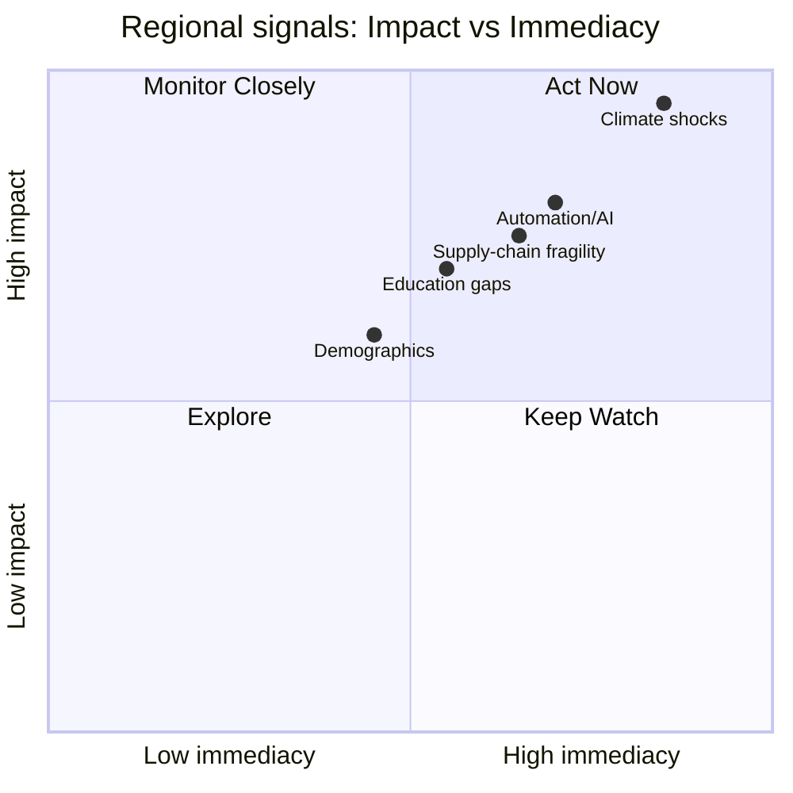
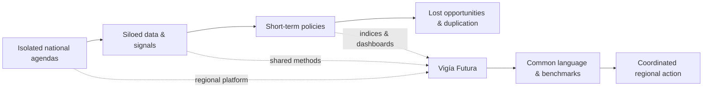
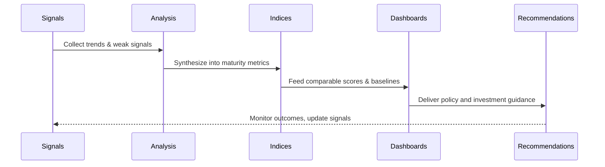
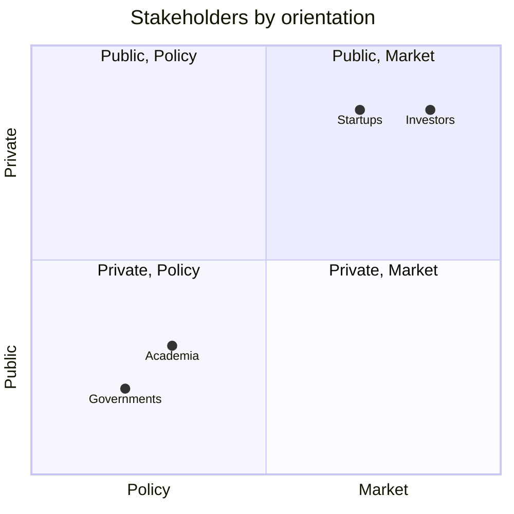
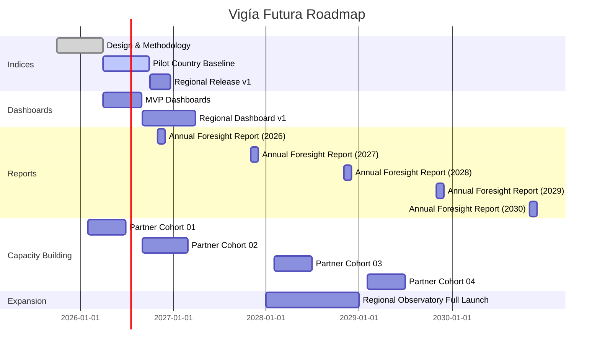

# Vigía Futura: Why Latin America Needs a Strategic Foresight Observatory

## The urgency and opportunity of foresight in Latin America
Latin America has always been shaped by those who could see beyond the horizon. On 12 October 1492, Rodrigo de Triana spotted land from the mast of the *Pinta*, ending months of uncertainty at sea. That “vigía,” the lookout, changed the course of history.

Centuries later, our region still faces moments where the ability to anticipate what lies ahead can determine survival and progress. The original peoples of the Americas could not foresee the arrival of the conquistadores, just as many of today’s governments, businesses, and institutions fail to prepare for fast-moving challenges: climate shocks, automation, and geopolitical shifts.

<!-- truncate -->

The global climate is now changing more rapidly than many models had predicted. In 2023 alone, extreme weather events affected 11 million people and caused over US$20 billion in losses across Latin America and the Caribbean (IIA Risk in Focus 2025).

Digital disruption accelerates every year: 56% of organizations expect it to become one of the top five risks within three years, as AI, automation, and unequal digital adoption reshape industries (IIA Risk in Focus 2025). At the same time, the WEF Global Risks Report 2025 shows that shifting trade, regulatory volatility, and fragile supply chains disproportionately pressure Latin America.

Education represents another critical gap. According to PISA 2022, 75% of 15-year-olds in Latin America perform at or below the basic proficiency level in mathematics, and 55% fall short in reading. This shortfall equals nearly five years of schooling compared to OECD peers (World Bank, IDB).

And yet, the region’s potential remains undeniable:
- A young working-age population, which the UNDP refers to as our “demographic bonus.”
- A unique cultural richness that blends African, Indigenous, and European heritage.
- Extraordinary biodiversity: the Amazon alone contains 1 in 10 of all known species on Earth, including around 40,000 plant species and 16,000 tree species. Colombia alone counts over 63,000 species, 8,800 of them endemic.

These conditions are not just vulnerabilities. They open opportunities for transformation if we build the foresight capacity to anticipate what is coming and act decisively.

:::tip[Signals landscape — impact vs immediacy]

*How to read:* items toward the top-right require immediate, high-impact attention.
:::

## The gap: fragmented efforts, no regional lens
Most Latin American countries already run digital or innovation agendas (for example, the Dominican Republic’s *Agenda Digital 2030* and Chile’s *Estrategia Nacional de IA*). However, these efforts remain national in scope, operate in silos, and rarely align regionally (OECD *Digital Government in LAC, 2022*).

Foresight capacity varies widely. Brazil, Chile, and Mexico nurture more developed ecosystems, whereas many others lag (UNESCO *Futures Literacy 2021–2023*). No shared benchmarks allow countries to compare foresight maturity across the region.

Public policy too often defaults to short-termism. Governments respond to inflation, political cycles, or natural disasters, rather than consider long-term implications. The *ECLAC Horizons 2050* report highlights how four- or five-year election cycles repeatedly reset strategies and undermine progress.

Regional initiatives remain mostly dialogue-based. The *Red Latinoamericana de Futuros* connects professionals but operates more as a community forum than a measurement-oriented observatory. Multilateral bodies, such as the IDB, CAF, UNDP, and ECLAC, sponsor projects; however, no permanent observatory provides data, dashboards, or indices.

This situation leaves governments, startups, and investors without a shared regional compass. As a result, they duplicate efforts, waste resources, and stay vulnerable to external shocks.

:::tip[From fragmentation to a shared compass]

*Idea:* the observatory introduces shared methods, indices, and dashboards that convert silos into coordinated action.
:::

## Why institutional foresight matters now
A foresight observatory systematically gathers signals, trends, and scenarios to inform long-term decisions (OECD *Strategic Foresight 2022*). It:
- Delivers early warning systems for risks (climate, technology, geopolitics).
- Identifies emerging opportunities (green industries, digital talent, AI adoption).
- Turns foresight into an institutionalized process, instead of leaving it to ad hoc projects.

Institutionalization ensures that organizations:
- Maintain continuity across election cycles and avoid the stop-and-go of policy.
- Build trust and legitimacy by providing neutral, evidence-based insights that offer a balanced perspective.
- Strengthen regional cooperation by aligning and pooling resources.

Without foresight, Latin America will continue to react late. With foresight, leaders can transform global volatility into a competitive advantage.

## Introducing Vigía Futura
**Vigía Futura** is a regional foresight observatory for Latin America and the Caribbean. Unlike forums or networks, it delivers actionable outputs, not just dialogue:
- **Indices**: In 2026, we will launch the Innovation Maturity Index and Foresight Maturity Index to benchmark readiness across governments, startups, and sectors. We will publish annual updates and provide sector-specific quarterly insights.
- **Dashboards**: Visual tools built from index data, showing readiness levels, scenarios, and pathways for action.
- **Reports & Insights**: Applied foresight analyses tailored to governments, startups, and investors.
- **Capacity-building**: Training programs and diagnostics built on MicroCanvas® and the IMM, enabling partners to integrate foresight into daily practice.

:::tip[From signals to action — how the observatory works]

*Loop:* continuous sensing, measurement, visualization, and action.
:::

## Who benefits from Vigía Futura?
### Governments & Policymakers
- Use long-term indices to maintain continuity across administrations.
- Leverage dashboards to anticipate shocks and align national agendas with regional foresight.
- Strengthen global credibility with evidence-based insights.

### Startups & Entrepreneurs
- Spot signals that reveal emerging markets and leapfrog into green or digital industries.
- Benchmark innovation maturity against peers through diagnostics.
- Build foresight into growth strategies with training and tools.

### Investors & Corporates
- Reduce uncertainty and guide capital allocation with indices.
- Identify high-potential sectors and risks with dashboards.
- Back investment theses with tailored foresight reports.

### Academia & Civil Society
- Gain access to structured tools and foresight training.
- Connect research with real policy and market needs through the platform.
- Utilize a shared language to facilitate collaboration across institutions.

:::tip[Stakeholder landscape — policy vs market, public vs private]

*Placement:* rough positioning to show who leans where — the observatory connects all four.
:::

## Why us: Doulab’s track record
At **Doulab**, we designed and tested the tools that underpin Vigía Futura:
- We developed the **MicroCanvas® Framework (MCF 2.1)** and observed startups and governments adopting it to structure innovation.
- We developed the **Innovation Maturity Model (IMM)** and applied it in programs such as *RedLab*, which guided 25 government institutions through structured innovation cycles.
- We partnered with *Alpha Inversiones* to train 30 employees over 12 weeks, resulting in six innovation project pitches.
- We led *Fundapec Fintech* to design new financial channels for diaspora students.

These experiences show that measurement, structure, and foresight accelerate innovation readiness. Vigía Futura represents the next step, scaling this approach into a regional observatory that empowers governments, startups, and investors alike.

## Looking ahead: from measurement to action
In 2026, Vigía Futura will release its first Innovation & Foresight Indices, followed by regional dashboards and an annual foresight report.

Alongside these outputs, we will train governments, startups, and investors to embed foresight in budgeting, policymaking, and innovation cycles. Within five years, we aim to establish a shared regional foresight platform with a common language and benchmarks across countries, enabling cross-border collaboration.

:::tip[Roadmap 2025–2030]

*Note:* dates are indicative for planning and communication.
:::

We aspire to make Vigía Futura the go-to decision-support infrastructure for Latin America and the Caribbean, providing evidence-based guidance that turns uncertainty into opportunity.

## Be part of the first foresight observatory in Latin America
**Vigía Futura is building the region’s shared compass.**

Join us now as a founding partner:
- Governments → align strategies with long-term foresight.
- Startups → identify markets before competitors.
- Investors → reduce risk and discover high-potential sectors.

Early partners will gain first access to data, shape the indices design, and position themselves as leaders in regional foresight.

📅 Book a discovery session with our team and explore how Vigía Futura can help your organization lead, not follow, in shaping the futures of Latin America and the Caribbean.
