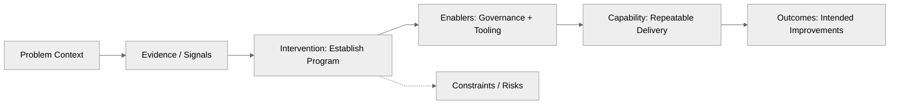
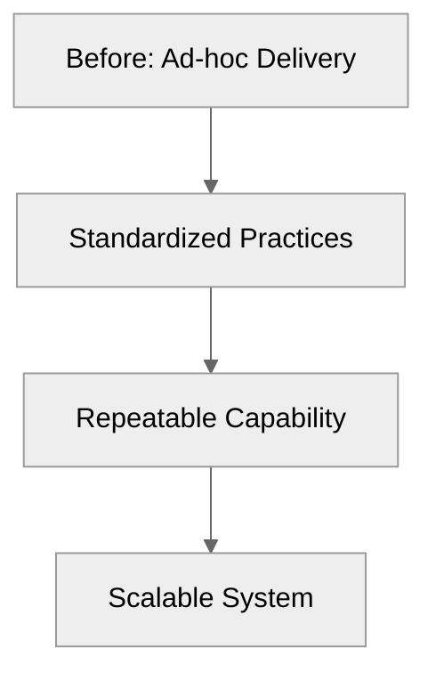

# Phase B8-P1 - Case Study Diagram System (Mermaid)

## Purpose
Define a repeatable, Mermaid-based diagram grammar for case studies that aligns with Doulab narrative standards and stays diff-friendly.

## Non-goals
- No custom visuals or per-case content.
- No image or SVG exports.
- No performance tuning.

## Canonical diagram set (case studies)

### A) System Flow Diagram (Problem -> Intervention -> Capability -> Outcomes)
Shows the causal flow and what was built or changed. This diagram must include:
- Inputs
- Intervention or Mechanism
- Capability produced
- Outcomes (stated as claims, not guarantees)

:::tip[Diagram - System Flow]

:::

### B) Capability Progression Diagram (Before -> After)
Shows maturity or capability deltas aligned with IMM or MCF vocabulary where applicable.

:::tip[Diagram - Capability Progression]

:::

## Node naming conventions
Use consistent labels:
- Problem Context
- Evidence / Signals
- Intervention (program, system, method)
- Capability (repeatable ability)
- Enablers (governance, tooling, operating model)
- Outcomes (measured / intended)
- Constraints / Risks (optional)

Use verbs for interventions ("Implement", "Adopt", "Establish") and nouns for capabilities ("Governance", "Pipeline", "Playbook").

## Evidence annotation standard (text only)
Optional evidence tags can be appended to node labels:
- `[EV: public-report-2024]`
- `[REF: docs/releases#v0-9-0]`

Keep evidence tags optional, short, and public-safe. Do not link to private sources.

## Mermaid standards
- System Flow uses `flowchart LR` (left to right).
- Capability Progression uses `flowchart TB` (top to bottom).
- Prefer simple shapes and avoid custom styling.
- Use the same Mermaid init block as shown above for consistency.
