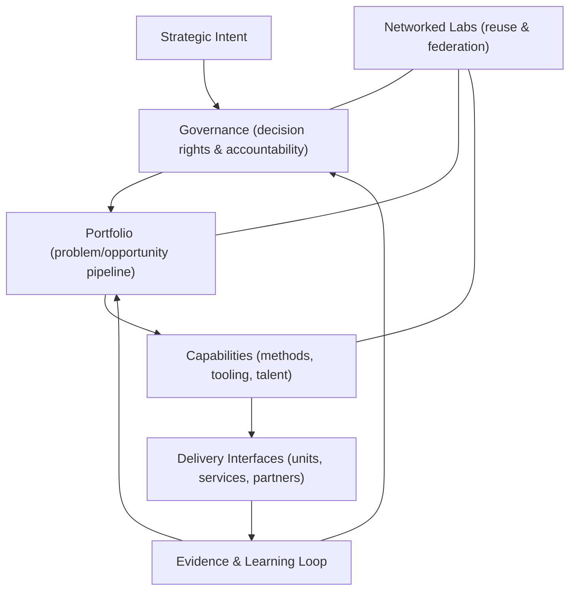
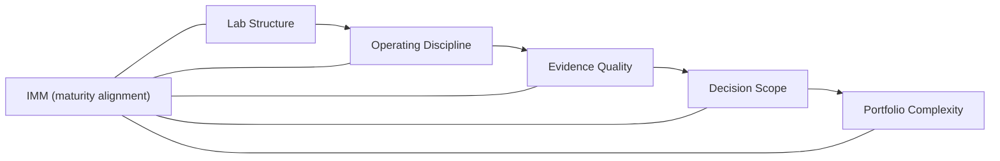
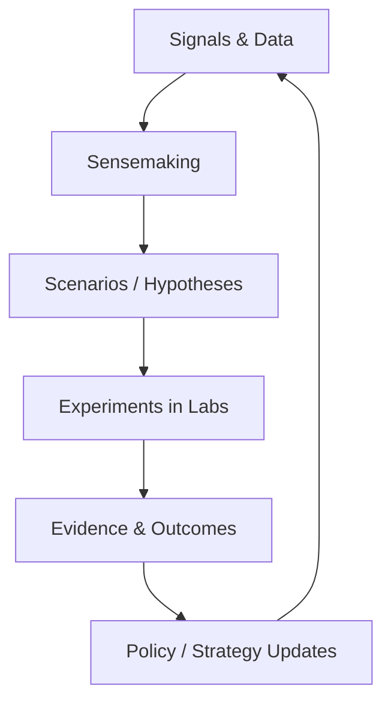

> This document is a Markdown conversion of the original PDF published in Q2 2024. 
> Content has been structurally preserved; editorial improvements will follow in a later pass.

## Executive Summary

In the rapidly evolving global market, innovation is not just a luxury; it's a necessity for survival and growth. Recognizing this imperative, "The Innovation Lab: A Guide to Accelerate Global Innovation" aims to serve as a comprehensive blueprint for entities aspiring to embed innovation into their core operations.

This guide explores the "Innovation Lab," a specialized unit designed to foster innovation, creativity, and problem-solving to drive organizational growth and measurable advantage in outcomes. The emergence of Innovation Labs marks a strategic move by organizations across various sectors to systematize and accelerate their innovation processes.

These labs offer a structured yet flexible environment where teams can nurture ideas, test, and refine their ideas away from the constraints of traditional operational frameworks. After exploring several innovation models, from internal innovation teams to external innovation cells, during a six-year research for developing the [*MicroCanvas Framework (MCF 2.2)*](https://themicrocanvas.com), the Innovation Lab emerged as a viable alternative.

MCF 2.2 is a systems-oriented innovation framework designed to preserve decision integrity under uncertainty.

This guide is not a one-size-fits-all blueprint; it is a structured operating reference that must be adapted to governance constraints, maturity level, and strategic intent.

Far enough from day-to-day operations to be influenced by the internal culture, but close enough so that failures and successes could impact the organizational innovation mindset and propel innovation forward. This guide presents a structured approach to innovation that is designed to be scalable and aligned with organizational goals.

This guide covers:

- **Why innovation labs exist**: the organizational conditions they respond to.
- **How innovation frameworks compare**: what they structure and where they fail.
- **How MCF 2.2 supports decision integrity**: framing, evidence, and iteration under uncertainty.
- **How to design lab governance**: roles, decision rights, and portfolio logic.
- **How to align labs to maturity**: using IMM to sequence capability building.
- **How to scale beyond a single lab**: networks, reuse, and operating coherence.
- **How foresight strengthens labs**: Vigía Futura as a sensing-and-learning loop.

It leverages the MicroCanvas Framework (MCF 2.2), a systematic and comprehensive strategy designed to enhance and guide the innovation process within organizations and integrate it with the innovation lab concept. This guide outlines the foundational principles of innovation, introduces readers to various innovation frameworks, and delves into the intricacies of establishing and managing an Innovation Lab.

It highlights the importance of aligning these labs with the organization's strategic vision, leveraging technology, and fostering a culture of continuous learning and adaptability. Through real-world case studies, actionable insights, and a structured operating approach for setting up an Innovation Lab, this guide is intended as a practical reference for leaders, innovators, and change-makers aiming to structure innovation practice.

Whether you are a government entity seeking to solve complex societal issues or a private corporation aiming to deliver differentiated outcomes, "The Innovation Lab: A Guide to Accelerate Innovation Within Organizations" provides structured guidance and examples to embark on this transformative journey.

Finally, we explore the role of National Innovation Lab Networks, which is fundamental to accelerating innovation at the national level and aligning countries as innovation powerhouses. By embracing the principles and processes outlined in this guide, organizations can position themselves at the forefront of innovation, driving significant impact and achieving sustainable growth in an ever-changing world.

## Introduction

"The Innovation Lab: A Guide to Accelerate Global Innovation" is the culmination of a six-year "Discovery" and "Validation" phase that ends in the creation of a comprehensive handbook designed to navigate the complexities of fostering a culture of innovation.

After facing many challenges, suffering many defeats with distinct customers, but, more importantly, celebrating several important victories, we have distilled a process to accelerate innovation both internally within organizations and even at a national level.

Innovation, the driving force behind growth, measurable advantage in outcomes, and adaptation in today's rapidly changing business environment, requires a structured approach so that team members can introduce innovation processes and effectively integrate them into an organization's fabric.

This guide introduces the concept of Innovation Labs as specialized units within or associated with organizations dedicated to nurturing, developing, and executing innovative ideas and solutions. The introduction to this guide lays the groundwork for understanding the pivotal role of innovation in ensuring organizational sustainability and success.

It explains the need for structured innovation processes and environments to incubate and mature novel ideas into tangible, impactful outcomes. The introduction sets the stage for a deep dive into the mechanics of establishing and operating an Innovation Lab by delineating the various facets of innovation-from its definition and dimensions to its lifecycle and frameworks.

Moreover, the guide presents the MicroCanvas Framework (MCF 2.2) as a central pillar in the architecture of an effective Innovation Lab. MCF 2.2's methodical approach to innovation, through its various processes, provides a scaffold for generating and refining ideas and validating, executing, and scaling them.

The introduction of MCF 2.2 supports the view that innovations are not merely creative ventures but strategic endeavors that align with organizational goals and market demands. In essence, the introduction to this guide invites readers to embark on a journey of Discovery, exploration, and transformation.

It beckons leaders, innovators, and change-makers to envision and create spaces where innovation thrives, guided by the principles and processes outlined in the subsequent sections. This guide aims to help equip organizations to navigate innovation challenges, leveraging the MicroCanvas Framework (MCF 2.2) to foster a culture of continuous improvement, adaptability, and relentless pursuit of excellence.

## The Problem, Objectives and Purpose

This guide addresses the challenge organizations face in systematically fostering and managing innovation. Despite recognizing the value of innovation for growth and competitiveness, many need help implementing a structured approach that integrates creative ideation with strategic execution. This guide solves the problem by providing a comprehensive framework and tools (MCF 2.2 and its processes) to bridge this gap.

It enables organizations to generate innovative ideas and effectively bring them to fruition, ensuring alignment with their Transformative Purpose and strategic objectives.

- **Introduce a Structured Approach to Innovation**: To present the MicroCanvas Framework (MCF 2.2) as a systematic methodology that guides organizations through the various stages of the innovation process, from ideation to market implementation to efficiency and then scale.

- **Facilitate the Establishment of Innovation Labs**: To provide a blueprint for setting up and operating Innovation Labs within organizations, focusing on how these labs can utilize MCF 2.2 to accelerate innovation projects.

- **Enhance Innovation Efficacy**: To improve the success rate of innovation projects by applying a structured approach that aligns with organizational goals, leverages customer insights, and addresses future disruptions.

- **Promote a Culture of Continuous Innovation**: To encourage organizations to adopt a mindset and culture that values continuous innovation, agility, and adaptability, supported by practical tools and processes.

- **Bridge the Gap Between Theory and Practice**: To offer actionable insights, best practices, and case studies demonstrating how we can apply MCF 2.2 principles in real-world scenarios to drive growth and impact.

- **Equip Teams with Practical Tools**: To provide teams within Innovation Labs with the methodologies, tools, and templates necessary to validate hypotheses, assess risks, and iterate rapidly based on feedback and market dynamics.

For this reason, this guide's primary Purpose is: "Empower organizations to create the future." Let's travel the journey to create better futures for all together. Luis Santiago

## Justification

The creation of "The Innovation Lab: A Guide to Accelerate Global Innovation" is driven by a pressing need for businesses and government entities to navigate and thrive in a rapidly changing world. In today's era, characterized by technological advances, shifting market dynamics, and evolving societal expectations, the capacity to innovate is not just a measurable advantage in outcomes-it's a survival necessity.

Innovation Labs have emerged as crucibles of creativity and invention, providing the structured yet flexible environments necessary for exploring new ideas, testing bold hypotheses, and developing solutions that address current and future challenges.

These labs play a pivotal role in fostering a culture of innovation, encouraging cross-disciplinary collaboration, and accelerating the transformation of insights into impactful products, services, and policies. However, establishing and running an effective Innovation Lab poses its own set of challenges. Organizations often grapple with questions about structure, function, integration, and value demonstration.

Moreover, the sheer variety of innovation frameworks and methodologies can be overwhelming, leading to confusion about best practices for fostering and managing innovation. We justify the creation of this guide by the clear need for a comprehensive, accessible, and practical resource that demystifies the concept of Innovation Labs.

It aims to equip leaders and innovation practitioners with the knowledge and tools necessary to create labs that generate novel solutions and align with and propel their organization's strategic goals.

## What is Innovation?

Innovation translates an idea or invention into a good or service that creates value or for which customers will pay. It involves the deliberate application of information, imagination, and initiative to derive greater or different values from resources and encompasses all processes by which new ideas are generated and converted into valuable products.

In business, innovation often results when ideas are applied to satisfy customers' needs and expectations further. Innovation differs from invention because invention happens when someone ideates or creates a product or service. Innovation occurs when the same product or service starts creating value for customers.

In other words, ideas are cheap; execution is everything. From a practical perspective, innovation involves combining different ideas into a reality that can change people's lives. Innovations may be products, services, technologies, processes, or business models.

These innovations can be radical, bringing about a fundamental change in how we do things, or incremental, improving or enhancing existing solutions.

- **OECD Oslo Manual**: The OECD Oslo Manual is a significant source for understanding and measuring innovation. It provides guidelines for collecting and interpreting innovation data in the industrial and service sectors. (Oslo Manual 2018: Guidelines for Collecting, Reporting and Using Data on Innovation, 4th Edition, The Measurement of Scientific, Technological and Innovation Activities, 2018)

- **Schumpeter's Theory of Economic Development**: Joseph Schumpeter introduced the concept of innovation as a critical factor in economic development. His theory highlights the role of entrepreneurs in creating innovation, leading to new products, production methods, markets, and forms of organization. *(Schumpeter, 1934)*

- **The Lean Startup**: This book provides a modern approach to developing products and businesses through continuous innovation. It introduces concepts like Minimum Viable Product (MVP) and validated learning as methods to innovate efficiently and effectively. *(Ries, 2011)*

- **Crossing the Chasm**: Moore's work is essential for understanding the diffusion of innovations in markets, particularly the challenges of moving from early adopters to the early majority. (Moore G. A., Crossing the Chasm: Marketing and Selling High-Tech Products to Mainstream Customers, 1991)

### Types of Innovation

The "types" of innovation typically refer to classifications based on the nature and impact of the innovation.

- **Incremental Innovation**: Small improvements to existing products, services, or processes.

- **Disruptive Innovation**: Innovations that create new markets by displacing existing ones.

- **Radical Innovation**: Breakthrough products or technologies that make existing ones obsolete. These types categorize innovations based on their effects on markets, technologies, and industries.

### Dimensions of Innovation

Conversely, the "dimensions" of innovation describe the areas within an organization where innovation can occur.

- **Product Innovation**: Involves changes to the products or services offered by an organization. It is about what the organization sells, ranging from minor improvements to major overhauls. (Keeley, Pikkel, Quinn, & Walters, 2013)

- Process Innovation focuses on changes to how products or services are created and delivered. It can involve manufacturing processes, software systems, or service delivery logistics.

- **Business Model Innovation**: Business conduct changes often involve how an organization creates, delivers, and captures value. Some examples of business model innovation include product changes, markets, processes, and relationships with customers and suppliers. *(Osterwalder & Pigneur, 2010)*

- **Organizational innovation is implementing a new organizational method in a firm's business practices, workplace organization, or external relations. It aims to improve a company's performance or workplace satisfaction. (Oslo Manual 2018**: Guidelines for Collecting, Reporting and Using Data on Innovation, 4th Edition, The Measurement of Scientific, Technological and Innovation Activities, 2018)

- Service Innovation is the introduction of new or significantly improved services. It can be related to changes in how a service is provided, such as using the latest technologies, methods, or concepts to enhance customer experience . *(Bettencourt, 2010)*

### Origins of Innovation

The "Origins of Innovation" refer to the sources or catalysts that spark the creative process, leading to new and transformative ideas within organizations. Organizations must understand these origins to cultivate a proactive and responsive innovation culture. Innovations can emerge from various origins, offering unique pathways to transformative and incremental advancements.

These sources can be internal, from within the organization, or external, influenced by market dynamics, technological developments, customer feedback, or regulatory changes. By identifying and leveraging these origins, companies can strategically harness innovation to maintain competitiveness, adapt to changing environments, and fulfill emerging market needs effectively.

This approach supports sustained growth and empowers organizations to shape their future through deliberate and strategic innovation efforts.

- **Technology-Driven Innovation**: arises from technological advancements, using new or improved technologies to create products, enhance processes, or redefine business models. *(McQuivey, 2013)*

- Market-driven innovation is catalyzed by customer needs, market changes, or shifts in consumer behavior, focusing on direct interactions with customers to understand their demands. *(Kim & Mauborgne, 2005)*

- Regulatory-driven innovation happens when laws, regulations, or policies prompt regulatory-driven innovation, leading to compliance -driven changes or innovations that use legal changes as a measurable advantage in outcomes. (Harvard Business Review, 2009)

- **Societal-Driven Innovation**: emerges from social shifts, cultural changes, or a commitment to ethical standards, aiming to address societal challenges such as sustainability and social well-being. *(Wagner, 2012)*

- **Competitive-Driven Innovation**: is stimulated by the need to differentiate from competitors, enter new markets, or improve market position, driven by the competitive landscape. (Christensen, Anthony, & Roth, 2004)

### Innovation Lifecycle

The innovation lifecycle stages outlined in the MicroCanvas Framework (MCF 2.2) have parallels in various other innovation models, although the terminology and emphasis might differ slightly. Several sources describe similar phases in the innovation process, often encapsulating the journey from idea generation to market implementation.

For instance, the innovation lifecycle generally starts with a Discovery *(Mitzkus, 2024)* phase, where you generate and explore ideas. This step aligns closely with what some sources describe as the ideation or initial concept phase, which focuses on understanding problems and developing innovative solutions.

In the next phase, Validation *(Joubert, 2017)* , teams test and validate the feasibility of these ideas, similar to what other models might refer to as development or proof of concept, where they build prototypes and gather initial user feedback.

Efficiency *(Joubert, 2017)*, as described in the MCF 2.2, focuses on refining the process and making the solution cost-effective, similar to optimizing production and operational processes in other frameworks. Scaling *(Mitzkus, 2024)* , which involves broad market integration and expansion, is a critical phase many models identify as crucial for adopting innovation.

Finally, the Continuous *(Mitzkus, 2024)* phase in MCF 2.2, which emphasizes ongoing improvement and adaptation, mirrors what some innovation models call continuous or iterative refinement cycles based on market feedback and technological advancements. These phases (Startup Genome, 2011) are universally recognized across different innovation models, although the specific terms and some focal points might vary.

They serve as a comprehensive guide to navigating the complex process of bringing new ideas to fruition and ensuring they are sustainable and effective in the market.

## Innovation Frameworks

Innovation frameworks (Donovan & Grace) are structured tools and methodologies that guide organizations through the complex innovation process, from ideation to implementation. They serve as blueprints that help companies systematically manage their innovation activities, ensuring that ideas are generated and selected effectively, successfully executed, and integrated into the company's fabric.

These frameworks vary widely, but they typically share common objectives: to streamline the innovation process, reduce risks associated with innovation, and enhance the ability to achieve sustainable measurable advantage in outcomess. By providing clear guidelines and stages, innovation frameworks help organizations navigate the often chaotic process of transforming creative ideas into practical and marketable innovations.

Understanding and applying the proper innovation framework can significantly impact an organization's ability to innovate effectively. Any organization must strengthen its innovation capability and support alignment of its innovation efforts with its strategic goals to explore various innovation frameworks.

### Why Are They Important?

**Innovation frameworks are vital to business strategy for several key reasons**:

- **Structured Creativity**: They provide a structured approach to creativity and innovation, which helps organizations systematically generate, develop, and implement ideas. This structure reduces the randomness and chaos often associated with innovation, making the process more predictable and manageable.

- **Risk Management**: Innovation inherently involves risk. Frameworks help manage these risks by providing methodologies for testing and validating ideas at early stages, minimizing potential losses, and focusing resources on the most promising initiatives.

- **Speed to Market**: By streamlining the innovation process, frameworks can accelerate the development and commercialization of new products and services. This rapid execution is crucial in today's fast-paced markets, where being first can be a significant advantage.

- **Alignment with Strategy**: Innovation frameworks align new ideas with the organization's overall strategy. This alignment helps keep innovation efforts contributing to the broader business objectives, thus enhancing coherence and focus.

- **Sustainability of Innovations**: Frameworks facilitate not just the creation but also the implementation and scaling of innovations, ensuring they are not just creative flashes in the pan but sustainable changes that deliver ongoing value.

- **Measurement and Improvement**: They provide tools for measuring the effectiveness of innovation activities, allowing organizations to make informed decisions about where to invest in innovation. This continuous improvement loop is essential for long-term innovation success.

- Innovation frameworks are not just tools for creating new products or services; they are integral to fostering a culture of innovation within organizations, ensuring that innovation is continuous and aligned with organizational goals. This strategic alignment is essential for maintaining measurable advantage in outcomes and achieving sustainable growth.

### Types of Innovation Frameworks

Innovation frameworks vary widely, each designed to address specific aspects of the innovation process or to fit particular industry needs. Understanding the different types of innovation frameworks can help organizations select the one that best aligns with their strategic goals and operational style. One common type is the Stage-Gate Process *(Cooper, 2001)*, developed by Dr.

Robert Cooper. This framework is widely used in product development and divides the innovation process into distinct stages separated by decision points (gates), evaluating ideas before moving to the next phase. It's particularly valued for its systematic approach to managing the progression of new products from concept to launch, helping firms minimize risks and allocate resources effectively.

Another influential framework is the Lean Startup *(Ries, 2011)* methodology, pioneered by Eric Ries. It emphasizes rapid prototyping, validated learning, and other iterative design techniques to efficiently develop products that meet consumer needs without requiring large amounts of initial funding or resources. This approach is beneficial in dynamic markets or startups needing to adapt quickly.

Design Thinking *(Brown, 2009)* is a popular framework focusing on user experience and creative problem-solving. It involves a cyclical process of understanding the user, challenging assumptions, redefining problems, and creating innovative solutions through ideation, prototyping, and testing. This framework is beneficial for developing solutions that are not only technologically feasible but also viable in the market and desirable to users.

Each framework offers distinct advantages, and organizations can implement them in various combinations depending on their needs, industry requirements, and innovation objectives. Companies may choose a single approach or integrate elements from different frameworks to create a tailored innovation strategy that maximizes their innovative potential and aligns with their overall business strategy.

### Shortcomings of Existing Frameworks

While existing innovation frameworks provide structured methodologies for managing innovation processes, they also exhibit certain limitations that can hinder their effectiveness in various contexts. One common shortcoming is their often rigid structure, which can stifle creativity and spontaneity crucial for breakthrough innovations.

For instance, while managing risk and resource allocation effectively, the Stage-Gate Process might slow down the innovation process due to its many checkpoints and approvals, potentially causing companies to miss out on first-mover advantages in fast-evolving markets.

Furthermore, frameworks like the Lean Startup methodology, which emphasize speed and agility through iterative cycles, may fragment the approach and cause the loss of the bigger strategic picture amidst rapid pivoting and minimally viable products (MVPs). Using Lean Startup in this way can sometimes result in products that solve immediate user problems but fail to align with long-term business objectives or scale effectively in the market.

Additionally, while Design Thinking fosters empathy and creativity, integrating existing business processes can be more complex, especially in more traditional or hierarchical organizations. The non-linear nature of Design Thinking can conflict with established processes that prioritize efficiency and predictability, leading to challenges in implementing and scaling innovative solutions.

These limitations highlight the importance of selecting or adapting innovation frameworks that address specific business needs and are flexible enough to evolve with changing market conditions and organizational dynamics. Adapting frameworks to fit an organization's unique Context, rather than adopting them wholesale, can help mitigate these shortcomings and enhance the overall effectiveness of the innovation process.

Sources like "The Innovator's Dilemma" (Christensen C. M., 1997) and articles from Harvard Business Review frequently discuss these issues, providing deeper insights into the practical challenges of applying innovation frameworks in real-world settings.

## The MicroCanvas Framework (MCF 2.2)

### Overview of MCF 2.2

The MicroCanvas Framework (MCF 2.2) is a systematic and comprehensive approach designed to enhance and guide organizational innovation. It offers a structured methodology for identifying, validating, developing, and scaling innovative ideas into successful projects or products.

By breaking down the innovation process into distinct, manageable micro-sprints, MCF 2.2 enables organizations to tackle complex problems methodically, ensuring effective addresses of every aspect of the innovation lifecycle. MCF 2.2 recognizes that innovation is not a linear process but a dynamic ecosystem of interconnected activities that require careful planning, execution, and adaptation.

The framework encompasses various phases of innovation, from ideation and problem-solving to market entry and scaling, providing tools and processes for each step. By providing tools for each phase of the innovation lifecycle, MCF 2.2 supports teams in creatively conceiving innovative projects and strategically align them with organizational goals, market needs, and sustainability considerations. The core components of MCF 2.2 include:

- **Problem Analysis**: Identifying and understanding the core problem to solve.

- **Objectives and Key Results (OKR)**: Setting clear goals and measurable results for which to aim.

- **Transformative Purpose**: Defining the broader mission or impact the innovation seeks to achieve.

- **Solution Alternatives**: Explores different solutions to address the identified problem.

- **Customer Analysis**: Understanding the target market's needs, behaviors, and preferences.

- **Future Disruptions**: Anticipating and planning for future trends and potential market disruptions.

- **Accelerated Growth Attributes**: Identifies factors that enable rapid scaling and growth.

- **Team Structure**: Designing an effective team to drive innovation forward.

- **Cost and Revenue Structure**: Analyzing the financial aspects of the innovation project.

- **Business Model Validation**: assesses whether the business model can sustainably deliver value to customers, generate revenue, and support the company's strategic objectives.

- **Risks Analysis and Management**: analyzes potential risks and provides alternatives to manage, mitigate, or accept said risk, according to the project's goals and objectives.

- **Unique Advantages and Product Features**: This helps define the product's features in alignment with the customer's needs and goals, as well as with the project's goals and solution alternatives.

- **Key Growth Metrics**: Help establish metrics to measure progress toward establishing the transformative purpose.

- **Key Impact Metrics**: track the social or economic impact of the innovation.

- **Sales**: Assist in creating a "sales funnel" specifically optimized for the innovation project's needs.

- **Delivery Channels**: will assist in understanding and optimizing the go-to-market strategies related to the value distribution for the project's innovation.

- **Socio-cultural context**: This guideline helps the innovation team understand the complexities of the different local environments where the innovation users reside.

- **Operations**: focus on helping describe and optimize processes for operational efficiency.

- **Financial Analysis**: Deep dive into the project's financial viability.

- **Marketing and Engagement**: helps with processes that allow the innovation team to understand market dynamics, refine their go-to-market strategies, and increase customer engagement while decreasing customer acquisition costs.

- **Legal Compliance and Strategy**: guides the innovation team in ensuring the product meets industry standards and legal requirements.

- **External Stakeholders**: will help map those who are in favor or against the innovation project, while realizing strategies for dealing with them.

- **Regulatory Constraints**: allow for a deep understanding of the regulatory environment and help define strategies for developing innovation while complying with said constraints.

- **User Stories**: help the team define how users interact with the innovative solution.

- **External System Integrations**: focus on integrating the innovation within larger systems.

- **Product Architecture**: maps the initial product and systems architecture, allowing for a unified, decentralized, and decoupled approach to developing innovation while ensuring scalability.

- **Customer Experience and Loyalty**: deal with after-sales support and customer retention strategies.

## The Innovation Lab

The concept of an Innovation Lab represents a dedicated space where creativity, technology, and strategic thinking converge to foster groundbreaking ideas and solutions. Situated at the intersection of exploration and implementation, Innovation Labs are catalysts within organizations, accelerating innovation from ideation to reality.

In public and regulated environments, this requires explicit accountability, compliance alignment, and decision governance—labs do not operate outside institutional constraints.

These labs are not just physical spaces but are dynamic environments that encourage experimentation and collaboration among diverse people. Innovation Labs are instrumental in pushing the boundaries of what is possible within a company. They offer the tools and freedom necessary to explore new technologies, business models, and processes without the constraints of day-to-day operations.

By isolating the innovation process in a supportive and resource-rich setting, these labs facilitate a deeper focus on creative solutions to complex challenges, making them essential in today's rapidly changing business landscape. Moreover, Innovation Labs are essential in cultivating an innovation-oriented culture, drawing on cross-disciplinary expertise to spur continuous improvement and measurable change.

This approach enhances an organization's capacity to innovate and aligns these innovations with strategic business goals, ensuring that they deliver real value and impact. Using structured frameworks like the MicroCanvas Framework (MCF 2.2), Innovation Labs can systematically manage and enhance innovation efforts, turning novel ideas into successful, scalable projects.

### Why do they matter?

Innovation Labs are profoundly significant within organizations for many reasons. They serve as catalysts for creativity and innovation, offering a dedicated space where radical ideas can flourish away from the operational pressures of day-to-day business activities. This separation allows for a more accessible exploration of novel concepts without the immediate constraints of standard corporate ROI expectations, accelerating market time.

By focusing resources and talent on specific projects, labs can develop and iterate on new products, services, or processes much faster than within the regular organizational structure, enhancing an organization's measurable advantage in outcomes.

Maintaining this edge in today's fast-paced business world requires continuous innovation, facilitated by integrating cutting-edge technologies and methodologies to develop unique solutions that differentiate a company in the marketplace. Furthermore, Innovation Labs fosters a culture of innovation, acting as a beacon within the company that signals the importance of creative and experimental thinking.

This mindset can permeate the entire organization, encouraging all employees to think innovatively. Labs also help manage the risks associated with new initiatives by prototyping and testing new ideas within a controlled environment. This approach allows learning and adapting strategies based on feedback before a full-scale rollout, minimizing potential failures and capital loss.

Additionally, these labs support that new projects align with the organization's strategic goals, ensuring that innovations have a clear purpose and contribute meaningfully to the company's long-term objectives. Innovation Labs secure a competitive edge and propel organizations towards sustainable growth and success by keeping innovation central to corporate strategy. This dedicated approach to innovation is crucial in today's business landscape.

Some additional sources that can help understand why innovation labs matter as innovation drivers, such as "The Corporate Startup" by Tendayi Viki, Dan Toma, and Esther Gons, often discuss the role and importance of innovation labs in modern business environments.

### Types of Innovation Labs

Innovation Labs vary widely in their focus and structure, depending on the strategic goals and industry specifics of the organizations they serve.

- **Corporate Innovation Labs *(Tidd & Bessant, 2018)***: These labs are set up within large corporations to foster creativity and innovation in a controlled environment, separate from the core business operations. They focus on developing new technologies, products, or business models that align with the company's strategic goals.

- **University-Affiliated Innovation Labs *(Etzkowitz & Leydesdorff, 2000)***: Often found on or near university campuses, these labs facilitate collaboration between academic researchers and industry professionals. They aim to leverage academic knowledge and research to solve real-world industry problems.

- **Government Innovation Labs *(Mulgan, 2014)***: These are typically funded and operated by government agencies to develop solutions for public sector challenges, such as healthcare, education, and urban planning. They often focus on improving service delivery and citizen engagement through technology.

- **Independent Innovation Labs *(Westley & Antadze, 2010)***: Operated independently of any specific firm or institution, these labs offer a neutral space for diverse organizations to collaborate and co-create solutions. They often work with multiple stakeholders to address complex societal challenges that span different sectors.

- **Community Innovation Labs *(Moore & Westley, 2011)***: These labs focus on grassroots innovation, involving local communities in the innovation process. They aim to harness community members' collective intelligence and creativity to develop solutions tailored to local needs.

### Objectives of an Innovation Lab

Innovation Labs are established with several critical objectives that guide their operations and support they contribute effectively to an organization's broader innovation strategy.

One primary goal is to foster creativity and innovation by cultivating an environment that encourages exploring new ideas and experimental approaches to problem-solving, aiming to push the boundaries of current knowledge and explore new possibilities *(Amabile, 1997)* Motivating organizational creativity *(Ries, 2011)*: Doing what you love and loving what you do. California Management Review).

Another key objective is to accelerate the development and implementation process; Innovation Labs utilize rapid prototyping and agile methodologies to speed up the development process and bring innovations to market more quickly. Additionally, Innovation Labs strives to enhance an organization's measurable advantage in outcomes by pioneering new technologies and methodologies, helping organizations stay ahead of industry trends *(Ries, 2011)*.

They also focus on improving customer experience and engagement by leveraging technology to understand better and meet customers' changing needs *(Prahalad & Ramaswamy, 2004)*. Moreover, many labs are tasked with developing solutions that promote sustainability, aiming to integrate sustainable practices into product development and business processes.

(Nidumolu, Prahalad, & Rangaswami, 2009) Finally, Innovation Labs encourage collaboration across disciplines, combining diverse skills and perspectives to foster comprehensive innovation that no single discipline could achieve alone. *(Bessant & Tidd, 2015)* These objectives collectively shape the activities of Innovation Labs, ensuring they contribute meaningfully to the organization's success and adaptability in a rapidly changing world.

### Components of Successful Innovation Labs

Successful Innovation Labs share several critical components contributing to their effectiveness and impact. Firstly, precise strategic alignment *(Bessant & Tidd, 2015)* is essential; the lab's activities must align with the organization's broader strategic goals to support relevance and support from senior management.

Another fundamental component is access to resources (Chesbrough, Open Innovation: The New Imperative for Creating and Profiting from Technology, 2006) , including funding, tools, and technologies, which allows the lab to explore and experiment without the typical constraints faced by other parts of the organization.

Multidisciplinary teams *(West, 2002)* also play a critical role; these teams bring together diverse perspectives and expertise, fostering creative problem-solving and innovation. Additionally, cultivating a culture of experimentation *(Edmondson, 2018)* is vital; Innovation Labs must create an environment where failure serves as a learning opportunity and actively encourages experimentation.

Effective leadership and management *(Kotter, 1996)* are equally important; leaders of Innovation Labs should inspire and motivate, balancing creative freedom and strategic focus. Lastly, robust processes and governance *(Osterwalder & Pigneur, 2010)* must guide the innovation process, ensuring teams develop and implement ideas efficiently and effectively while maintaining alignment with business objectives.

These components are instrumental in the successful operation of Innovation Labs. They help them generate novel ideas and implement them in ways that significantly benefit their parent organizations and support sustained impact and innovation.

## Setting Up an Innovation Lab using The MicroCanvas Framework (MCF 2.2)

Setting up an Innovation Lab using the MicroCanvas Framework (MCF 2.2) involves systematically integrating structured innovation management with organizational strategy and operational efficiency. We can break this process down into the following steps:

The [*Vigía Innovation Lab Framework (VILF)*](https://vilf.doulab.net) provides a structural model for designing and governing innovation labs as long-lived institutional systems.

- Governance-Portfolio logic-Capability reuse-Networked labs

The following diagram summarizes the lab as a governed system with reusable capabilities and an evidence loop.

**Diagram — VILF: Innovation Lab as a System**

- Ask, "What problem does this lab solve?" Use the "Problem Analysis" MCF 2.2 process to determine the central problem the lab will tackle and develop a deeper understanding of its causes and effects. Identify who has this problem and which stakeholders are interested in resolving it. This analysis paves the way for a better understanding of the lab's potential customers, potential solution alternatives, and, more importantly, the lab's Purpose.

- **Define the Strategic Alignment**: align the lab's goals with the organization's broader strategic objectives. Use the "Objectives and Key Results" MCF 2.2 process to transform the effects of the main problem into objectives that you can adequately measure through OKRs. By defining the strategic alignment, you can determine if you are progressing toward achieving the lab's strategic goals. This alignment will support that the lab's initiatives are relevant and contribute meaningfully to the company's overall mission and vision.

- **Analyze potential alternatives**: Explore which solutions you can develop to achieve the lab's strategic goals and mitigate the main problem's effects on the target customers. We suggest using the "Solution Alternative Analysis" MCF 2.2 processes to explore potential alternatives quickly.

- **Consider your transformative Purpose**: a transformative purpose, the highest achievable vision for the lab, will guide the efforts and serve as a "guiding star" that will help the lab focus on achieving its objectives without distraction. Using the "Transformative Purpose" MCF 2.2 process will allow you to envision the highest Purpose the lab will focus on.

- **Formulate the Team Structure**: Assemble a multidisciplinary team that brings diverse skills and perspectives to the lab. This team should include a mix of creative thinkers, industry experts, and operational staff who can drive projects from ideation to implementation. The lab's leadership should inspire a culture of innovation and manage the balance between creative exploration and strategic focus. The "Team Structure" process in MCF 2.2 can help you determine the right team structure and dynamic that aligns with the lab's objectives.

- **Establish the Infrastructure**: Design a physical or virtual space that fosters creativity and collaboration. Equip the lap with the necessary tools, technologies, and resources to support experimentation and innovation. This space should also be adaptable to accommodate different projects and workflows.

- **Implement MCF 2.2 Processes**: Integrate the MicroCanvas Framework (MCF 2.2) into the lab's operations. To achieve this, you must define transparent processes for each phase of the innovation lifecycle -Discovery, Validation, Efficiency, Scaling, and Continuous Improvement. Manage each phase using MCF 2.2 tools and techniques to support the systematic progression of ideas. The Operations, User Stories, Sales, Marketing and Engagement, and Customer Experience and Loyalty will be very useful in guiding you in implementing these processes.

- **Develop Governance and Metrics**: Establish governance structures to oversee the lab's activities and support alignment with the company's policies and ethical standards. Also, metrics and KPIs should be defined to measure the performance and impact of the lab's innovations. These metrics should reflect the lab's strategic goals and guide decision -making processes. We suggest using the Key Growth Metric and Key Impact Metrics MCF 2.2 processes to develop and monitor these metrics.

- **Launch Pilot Projects**: Initiate pilot projects to test the lab's setup and processes. These projects serve as a practical way to refine the lab's innovation approach and identify improvement areas. Learning from these initial projects is crucial for effectively scaling the lab's operations. As previously suggested, it's essential to follow each step in the innovation lifecycle to support that each new product, service, or business model is validated correctly before moving into the next stage, thus reducing the waste of resources.

- **Foster a Culture of Continuous Learning**: Encourage ongoing learning and adaptation based on feedback and results from initial projects. Continuous learning should be ingrained in the lab's culture, promoting an iterative approach to innovation and constantly refining strategies and processes. Business Model Validation, Socio-Cultural Context, Key Partners, Customer Analysis, Risk Analysis, and Management MCF 2.2 processes are fundamental to learning what is working and what is not continuously and, from there, deriving potential new iterations of the lab's execution.

### Infrastructure Requirements

Setting up an Innovation Lab requires careful infrastructure planning to create an environment conducive to creativity and innovation. This environment must encompass physical or virtual spaces and the necessary technological and operational support systems. The physical layout of an Innovation Lab should foster collaboration and flexibility.

It should feature modular furniture, ample whiteboard space for brainstorming, and areas designated for both quiet thinking and collaborative work, encouraging interaction and the free flow of ideas among team members *(Kelley & Kelley, 2013)*. Cutting-edge technology is critical, including high-speed internet, the latest software tools for design and development, and advanced hardware for prototyping and testing.

Access to cloud computing resources and specialized tools like 3D printers and VR equipment can significantly enhance the innovation process . (Hagel, Brown, & Davison, 2010). Robust operational support is also essential, including administrative, legal, and technical assistance to streamline processes, manage intellectual property issues, and support compliance with relevant regulations.

*(Tidd & Bessant, 2018)*. Reliable communication tools are crucial for connecting team members within the lab and with external partners, incorporating technology like video conferencing, project management software, and digital collaboration platforms.

*(Friedman, 2007)* Finally, strong security measures protect sensitive information and intellectual property, including secure data storage solutions, network security systems, and protocols for handling confidential materials.

*(Schneier, 2004)* An Innovation Lab can provide a supportive environment that is well -equipped to nurture innovations and adapt to future challenges and opportunities in the technology and business landscape, as long as you consider this during the Discovery and Validation stages for the lab's initial implementation.

### Staffing and Team Structure

- **Corporate Innovation Labs (Chesbrough, Open Innovation**: The New Imperative for Creating and Profiting from Technology, 2006):

- **Staffing and Team Structure**: Corporate innovation labs typically employ a mix of internal company talent and external experts to drive innovation. The team often includes R&D specialists, product developers, project managers, and UX/UI designers who collaborate closely with business units.

- **Example**: A large tech company might staff its corporate innovation lab with senior software engineers, data scientists for analytics tasks, and project managers to oversee development timelines.

- University-Affiliated Innovation Labs *(Etzkowitz & Leydesdorff, 2000)*:

- **Staffing and Team Structure**: These labs often employ academic researchers, students, and industry professionals who collaborate on research-driven projects. The team structure typically emphasizes interdisciplinary collaboration.

- **Example**: A university-affiliated lab might include professors specializing in renewable energy, graduate students conducting research, and industry consultants providing market insights.

- Government Innovation Labs *(Mulgan, 2014)*:

- **Staffing and Team Structure**: Government labs usually staff policy makers, subject matter experts in public administration, and technologists. They focus on public sector innovation to improve services and policy outcomes.

- **Example**: A government innovation lab focused on healthcare may include health policy analysts, public health experts, and IT specialists to develop new e-government services.

- Independent Innovation Labs *(Westley & Antadze, 2010)*:

- **Staffing and Team Structure**: Independent labs typically operate with a flexible staffing model that can include freelancers, industry experts, and academic partners. This structure allows for a dynamic team that adapts to project needs.

- **Example**: An independent lab working on environmental technology might employ environmental scientists on a project basis, along with permanent staff members skilled in commercialization and partnership management.

- Community Innovation Labs *(Moore & Westley, 2011)*:

- **Staffing and Team Structure**: Local community members, social entrepreneurs, and volunteers who bring grassroots knowledge and insights often staff community labs. They emphasize local engagement and solutions tailored to community needs.

- **Example**: A community lab addressing urban food deserts might include local farmers, urban planners, and community organizers. Each type of innovation lab requires a tailored approach to team structure and staffing, leveraging diverse skills and backgrounds to meet specific innovation goals. This strategic alignment of team composition supports the labs in addressing the unique challenges they aim to solve, whether in the corporate, academic, government, community, or independent sectors. We suggest using the previously mentioned "Team Structure" to create an initial team structure aligned with the lab's objectives and transformative Purpose, understanding that the lab will continuously adapt and learn. During the first three stages of the lab's lifecycle (Discovery, Validation, and Efficiency), the team structure will likely continuously change as the lab learns how to operate efficiently. Additionally, the lab might want to consider outsourcing some of its core functions (sales and marketing, finance and accounting, IT, and others, probably including coaching, mentoring, and other core functions) as it develops a viable business model until it reaches a maturity level that allows for permanent staffing.

### Operational Model

The operational model of an Innovation Lab outlines the methods and processes that guide how the lab functions on a day-to-day basis. This model typically incorporates aspects of project management, resource allocation, workflow design, and performance metrics, ensuring efficient project management and alignment with the organization's strategic objectives.

- **Project Management (Sutherland, Scrum**: The Art of Doing Twice the Work in Half the Time, 2014): An effective operational model establishes clear project management protocols, which help organize, plan, and execute innovation projects from inception through completion. For example, agile project management techniques can facilitate rapid iteration and responsiveness to changing project demands.

- **Resource Allocation (Kaplan S. , 2012)**: The model should actively define how to allocate resources to support various projects. Examples of resources include budgeting for materials, technology, and human resources and determining how to prioritize these resources across competing projects. For instance, you might employ a tiered funding model to allocate more resources to projects with the potential to generate significant strategic value.

- **Workflow Design (O'Reilly & Tushman, 2016)**: The operational model should streamline workflows, integrating new tools and technologies that enhance collaboration and efficiency. For example, digital collaboration platforms can enable remote teams to work together effectively, integrating seamlessly with local operations.

- **Performance Metrics (Kaplan & Norton, The Balanced Scorecard**: Translating Strategy into Action, 1996): Finally, it is critical to establish performance metrics to track the progress and impact of innovation initiatives. These metrics can include innovation outputs, such as patents filed or products launched, and outcomes, such as market share gains or revenue growth. An example would be using balanced scorecards to measure financial and non-financial performance indicators. With a robust operational model that includes clear project management protocols, strategic resource allocation, optimized workflows, and measurable performance indicators, Innovation Labs can enhance their efficiency and effectiveness, ensuring they contribute positively to the organization's innovation goals and overall success.

### Integrating MCF 2.2 Processes into the Innovation Lab's project's lifecycle

Integrating the MicroCanvas Framework (MCF 2.2) processes into the project lifecycle of an Innovation Lab enhances strategic alignment and operational efficiency across all phases of innovation. Conceptualizing, creating a lab pilot, stabilizing the lab, and then scaling it will be a "project within a project," as the lab will need to run the framework for organizing itself while following the same process for the innovation projects themselves.

Here's a detailed breakdown of how each phase of the innovation lifecycle incorporates specific MCF 2.2 processes:

**Discovery Phase** In the Discovery Phase, the Innovation Lab focuses on laying the groundwork for future innovations through extensive research and planning:

- Customer Analysis and Problem Analysis identify the target market's needs and challenges and define the core problem the innovation aims to solve. It will also allow you to gauge how big of a market opportunity the lab will focus on. Thus potentially determining the potential impact or commercial viability of the lab

- Objectives and Key Results (OKR) help set measurable goals that align with the lab's strategic aims.

- Transformative Purpose clarifies the broader impact the project aims to achieve, ensuring that the innovation aligns with the lab's mission and values.

- Solution Alternatives , Unique Advantages, and Product Features explore different ways to address the identified problems, including distinguishing characteristics that could give the product a competitive edge while aligning said features with the specific needs or challenges of the target market.

- Team Structure supports the right mix of skills and experience being available to tackle innovation projects effectively.

- Business Model Validation assesses the feasibility and sustainability of the proposed business model from the outset. **Validation Phase** During the Validation Phase, the lab tests the assumptions made during the discovery process and refines the project based on real-world feedback:

- User Stories and Key Growth Metrics will need development to capture the end-user experience and measure the project's progress toward its growth objectives.

- Key Impact Metrics track the social or economic impact of the innovation.

- Sales, Marketing and Engagement , and Customer Experience and Loyalty processes help understand market dynamics and refine go-to-market strategies.

- Business Model Validation continues as more data becomes available and you assess initial market reactions. **Efficiency Phase** The Efficiency Phase aims to optimize the solution and prepare it for scaling:

- External Stakeholders , Operations, and External System Integrations focus on improving operational efficiency and integrating innovation within larger systems.

- Product Architecture , Risks, Regulatory Constraints , and Legal Compliance and Strategy support that the product meets industry standards and legal requirements.

- Cost and Revenue Structure and Financial Analysis deeply dive into the project's financial viability while ensuring sustainability for the innovation project.

- Business Model Validation continues adding value as financial realities become clearer and require possible adjustments. Also, at this phase, the innovation project might require extensive resources, which require strong evidence of project viability. **Scaling Phase** In the Scaling Phase, the project is ready to expand its reach and impact:

- Accelerated Growth Attributes identify factors that can significantly speed up the scaling process.

- Key Partners and Delivery Channels are essential for expanding market access and distribution.

- Socio-Cultural Context supports the product remaining relevant across different markets.

- Future Disruptions, in the Context of the innovation project, will require preparing for such long-term sustainability and adaptability in a changing environment. Applying these MCF 2.2 processes throughout the innovation lifecycle, an Innovation Lab can maximize its chances of success, ensuring that each project is innovative, strategically aligned, and ready to meet the market's demands and achieve significant impact.

### Measuring Success: Metrics and KPIs to evaluate the impact and success of Innovation Labs.

Measuring the success of Innovation Labs is crucial to determine their impact and effectiveness, requiring the establishment of relevant metrics and key performance indicators (KPIs) that provide concrete data to assess their performance.

Here's how you can effectively measure the success of Innovation Labs:

**Innovation Output Metrics** (Davila, Epstein, & Shelton, 2006) such as the number of prototypes developed, patents filed , or new products launched help quantify the direct outputs of the innovation activities within the lab. **Financial Metrics** (Moore G.

A., Crossing the Chasm: Marketing and Selling High-Tech Products to Mainstream Customers, 1991) , including Return on Investment (ROI) , revenue growth from new products , and cost savings from process improvements , assess the economic impact of the innovations developed within the lab. **Market Impact Metrics** (Moore G.

A., Crossing the Chasm: Marketing and Selling High-Tech Products to Mainstream Customers, 1991) , such as market share changes, customer acquisition rates , and customer engagement metrics, gauge the market impact of innovations, showing how effectively new products or services capture customer interest.

**Operational Efficiency Metrics** *(Hammer, 2001)* such as reduction in time to market, improvement in production uptime , and efficiency in resource utilization evaluate how innovations within the lab enhance operational processes.

Additionally, **Employee Engagement and Culture Change Metrics** (Amabile, & Kramer, 2011), including employee satisfaction scores , rates of internal idea submission , and participation rates in innovation-related activities , help understand the internal cultural impact of the Innovation Lab.

Lastly, **Learning and Growth Metrics** *(Nonaka & Takeuchi, 1995)* focus on intangible benefits like skills development levels, learning outcomes from failed projects, and knowledge dissemination across the organization, emphasizing the Innovation Lab's role in knowledge creation and capability building.

Using these metrics and KPIs allows organizations to evaluate the success of their Innovation Labs comprehensively, ensuring that they innovate effectively and align with the company's broader strategic objectives.

## Innovation Labs and Maturity: The Role of the Innovation Maturity Model (IMM)

The [*Innovation Maturity Model (IMM)*](https://doulab.net/services/innovation-maturity) is a capability progression model that explains why innovation labs stall, fragment, or scale. It clarifies how institutional readiness shapes the outcomes labs can realistically deliver over time.

The following diagram shows how maturity alignment influences lab structure, evidence practices, and decision scope.

**Diagram — IMM Overlay on Innovation Labs**

Labs should be designed for their maturity level, not for an aspirational end state. Tooling without maturity alignment increases risk by creating process debt and fragile operating expectations.

### Challenges and Solutions: Common hurdles in establishing and running an Innovation Lab and strategic solutions.

Establishing and running an Innovation Lab comes with unique challenges, but strategic solutions can effectively mitigate these hurdles, ensuring the lab operates smoothly and achieves its innovation goals.

Here are some common challenges along with solutions, each described in continuous sentences, complete with examples and sources:

**Aligning Lab Goals with Business Strategy**: Ensuring the Innovation Lab's objectives tightly align with the company's strategic goals is essential. Holding regular strategy alignment sessions and establishing a governance structure that includes key business leaders can help maintain this alignment.

For example, a multinational corporation might hold quarterly alignment workshops between the lab's leaders and the company's executive management to synchronize innovation projects with strategic business objectives. This alignment discipline is consistent with established strategy-to-operations thinking *(*Kaplan & Norton, 2008*)*.

 Developing a clear business case for each innovation project to justify investment and demonstrate potential ROI is critical. Engaging external partners and investors can also provide additional funding channels.

An example is an Innovation Lab using crowdfunding or partnerships with venture capital firms to supplement internal funding for high-potential projects.

(Chesbrough, Open Services Innovation: Rethinking Your Business to Grow and Compete in a New Era, 2011)

 To overcome cultural resistance to new ideas, fostering a culture of innovation within the organization by promoting and rewarding risk -taking and creativity is vital. Implementing training programs that enhance employee engagement with innovation processes can also help.

A practical example is a tech company introducing innovation awards and recognition programs to reward teams contributing novel ideas or improvements. (Amabile, & Kramer, 2011)

 Establishing transparent processes for scaling successful innovations is crucial, including detailed market analysis and business model adjustments. A strategic approach is to use pilot projects to test scalability before full deployment.

For instance, an Innovation Lab might conduct pilot tests in different markets before scaling a new digital product to refine the business model based on diverse customer feedback. (Moore G. A., Inside the Tornado: Marketing Strategies from Silicon Valley's Cutting Edge, 1999)

 Implementing agile methodologies to adapt to changes quickly is beneficial to maintain momentum in long-term projects.

Regular progress reviews and iterative development can keep projects on track. An example of maintaining project momentum is using Scrum, Kanban boards to track progress and adapt workflows dynamically. This helps an Innovation Lab maintain energy and focus throughout complex projects.

(Sutherland & Schwaber, The Scrum Guide: The Definitive Guide to Scrum: The Rules of the Game, 2013) By addressing these challenges with strategic solutions, Innovation Labs can enhance their effectiveness and significantly contribute to their organizations' innovation capabilities, ensuring effective initiation, sustenance, and scaling of innovations.

(Sutherland & Schwaber, The Scrum Guide: The Definitive Guide to Scrum: The Rules of the Game, 2013)

## Beyond the Innovation Lab: National Networks

National Innovation Lab Networks constitute strategic collaborations designed to amplify a nation's innovative capacity by interlinking diverse local and regional labs into an expansive network. These networks enable a coherent, nationwide strategy for research and development across various sectors by leveraging the unique strengths of different regions and institutions, thereby fostering broad-based national innovation.

The premise behind National Innovation Lab Networks is that collaborative problem-solving and shared resources yield more efficient and impactful outcomes than isolated efforts. By integrating labs across geographical and institutional divides, these networks cultivate an innovation-rich environment that optimizes resource utilization and facilitates the exchange of knowledge, ideas, and technologies.

Such integration not only enhances resource efficiency but also promotes the exchange of knowledge and technologies across various sectors.

*(Etzkowitz & Leydesdorff, 2000)* These networks typically encompass a variety of stakeholders, including government entities, academic institutions, the private sector, and non-profits, all collaborating on a unified agenda to address national challenges like healthcare, energy sustainability, and technological advancement through innovation.

Each lab within the network may focus on specialized research areas, but their coordinated efforts contribute to overarching national objectives. *(Porter, 1998)* The strategic value of National Innovation Lab Networks is profound, as they mobilize the full spectrum of a country's innovative potential.

By encouraging cross-sectoral collaboration, these networks can drive significant scientific and technological advancements crucial for maintaining national competitiveness and fostering economic growth .

(Chesbrough, Open Innovation: The New Imperative for Creating and Profiting from Technology, 2006) This chapter will delve into these networks' objectives, structural dynamics, and operational mechanisms, showcasing their pivotal role in enhancing the nation's innovation landscape.

### Objectives of National Innovation Lab Networks

**National Innovation Lab Networks require implementation with several strategic objectives**: enhancing a nation's innovation capabilities and fostering economic growth through systemic collaboration and resource optimization. One primary objective of these networks is to maximize the utilization of national resources by aligning local and regional innovation efforts with national priorities.

This coordination helps keep research and development activities responsive to local needs and contribute to broader national goals. For example, a network might harness rural labs' agricultural research capabilities to advance national food security initiatives. This approach helps streamline efforts across multiple sectors.

It prevents the duplication of research efforts, ensuring efficient use of funds and resources. *(Etzkowitz & Leydesdorff, 2000)* Another key objective is stimulating economic development by driving innovation, leading to new technologies, products, and services. These networks facilitate the commercialization of research outputs by connecting academic institutions with industry leaders who can bring innovations to market.

For instance, a lab network focusing on renewable energy can partner with energy companies to develop and deploy new green technologies, potentially leading to job creation and economic diversification. Such collaborations are instrumental in transforming theoretical research into practical, market-ready solutions that bolster economic vitality.

*(Porter, 1998)* Additionally, National Innovation Lab Networks aims to enhance the nation's competitive edge on the global stage by fostering cutting-edge research and attracting international partnerships. By promoting a robust innovation ecosystem, these networks can position the country as a leader in key technological areas, attracting foreign investment and establishing international collaborations.

Countries that have developed robust biotechnology hubs serve as an example, leading to medical advancements and enhancing the country's status in global health and science arenas. (Chesbrough, Open Innovation: The New Imperative for Creating and Profiting from Technology, 2006) Ultimately, these networks strive to create a sustainable innovation ecosystem that can continually adapt to emerging challenges and opportunities.

By fostering ongoing collaboration among universities, government, and industry, National Innovation Lab Networks help keep the innovation pipeline responsive vibrant and responsive to current and future needs, securing long-term benefits for the nation and its citizens. This sustainability aspect is critical for maintaining progress and ensuring that the investments in innovation yield lasting impacts.

*(Nonaka & Takeuchi, 1995)* Each of these objectives underscores the transformative potential of National Innovation Lab Networks, positioning them as crucial drivers of national progress and prosperity in an increasingly competitive and interconnected world.

### Structure of National Innovation Lab Networks

The structure of National Innovation Lab Networks facilitates collaboration across various sectors and disciplines, optimizing resource allocation and fostering innovation at a national scale. This structure typically involves multiple layers of coordination and integration, each playing a pivotal role in streamlining the innovation process across different regions and sectors.

**Central Coordination Body**: At the core of National Innovation Lab Networks is a central coordination body responsible for overseeing the entire network's activities. This body sets strategic directions, allocates resources, and monitors progress across all labs within the network.

For example, in South Korea, the government has established a central agency coordinating research activities across various sectors, ensuring that innovations align with national economic goals. This agency plays a crucial role in managing the flow of information and resources, making strategic decisions that affect the entire network .

(Chesbrough, Open Innovation: The New Imperative for Creating and Profiting from Technology, 2006)

**Regional Innovation Hubs**: The network structure often includes regional innovation hubs that focus on specific areas of expertise relevant to their geographic or economic Context. These hubs act as innovation nodes, specializing in technologies or industries vital to their regional economy.

For instance, a coastal region might focus on marine biotechnology and renewable energy, leveraging the expertise of local universities and industries. These hubs not only drive regional economic development but also contribute to the national innovation portfolio by sharing their advancements with other parts of the network .

*(Etzkowitz & Leydesdorff, 2000)*

**Cross-Sector Collaboration Platforms**: The network structure includes platforms where industry, academia, and government representatives can discuss challenges, share knowledge, and develop joint projects.

This approach helps in making possible to foster inter-disciplinary and cross-sector collaboration, These platforms are essential for integrating diverse perspectives and expertise and addressing complex, multifaceted problems.

An example is the European Union's innovation strategy, which includes collaboration platforms facilitating partnerships across countries and sectors, driving pan -European innovation initiatives that tackle climate change and digital transformation. *(Porter, 1998)*

**Support Services and Shared Resources**: National Innovation Lab Networks often provide support services and shared resources to enhance labs' capabilities nationwide.

These include access to advanced research facilities, legal and commercial expertise, and funding opportunities. By pooling resources at the national level, the network can help keep even smaller labs able to access the tools and knowledge they need to participate effectively in the innovation ecosystem.

For instance, the Canadian government offers shared services through its national network of labs, including access to international patent databases and commercialization advisors, which help local innovators navigate global markets .

*(Nonaka & Takeuchi, 1995)* This structured approach enables National Innovation Lab Networks to operate efficiently and effectively, maximizing the impact of their collective efforts and ensuring that innovations developed within the network can significantly contribute to national development goals.

### Key Components of Successful Networks

Successful National Innovation Lab Networks depend on several key components that support their effectiveness in fostering widespread innovation nationwide. These components help structure the networks to maximize collaboration, leverage resources efficiently, and drive impactful outcomes. Here's a breakdown of these essential elements:

**Strategic Leadership and Governance**: Strong leadership sets the network's vision, direction, and priorities.

An effective governance structure supports strategic decisions that align with national innovation goals and maintains accountability at all levels. This leadership should also be capable of navigating political and economic landscapes to secure support and resources for the network.

**Integrated Communication Systems**: Seamless communication across the network is essential for effectively sharing knowledge, ideas, and resources.

This includes technological infrastructure for virtual collaboration and protocols for regular updates and feedback across different labs. Effective communication fosters a culture of openness and continuous learning.

**Diverse Funding Sources**: The sustainability of the innovation labs often hinges on diverse and robust funding mechanisms.

This can include government funding, private -sector investment, and international grants. Diversifying funding sources helps keep labs financially stable to pursue long-term projects and are less vulnerable to changes in political or economic climates.

**Adaptable Operational Models**: Adapting operational models as needed allows labs to respond swiftly to emerging challenges and opportunities.

This agility is crucial in maintaining the network's relevance and effectiveness over time, particularly in rapidly changing technological and market environments.

**Strong Industry and Academic Partnerships**: Collaborations with universities and industry leaders enrich the labs with cutting-edge research and market insights.

These partnerships enhance the quality of innovation and aid in the commercialization and practical application of research outputs.

**Clear Metrics for Success**: Establishing and monitoring clear success metrics helps evaluate the network's activities' impact and make data -driven decisions. These metrics should align with the network's strategic goals and the nation's broader economic or societal goals.

**Talent Development Programs**: Investing in talent development supports a continuous influx of skilled individuals who can drive innovation. This includes recruiting top talent and providing ongoing training and development programs to keep skills relevant and cutting-edge.

**Policy and Regulatory Support**: Supportive policies and regulations are vital for nurturing innovation.

This might involve streamlining intellectual property processes, providing tax incentives for research and development, or reducing bureaucratic hurdles for new projects.

**Cultural Emphasis on Innovation**: Cultivating a national culture that values and supports innovation can significantly enhance the effectiveness of these networks.

This involves public awareness campaigns, educational programs, and community engagement initiatives highlighting innovation's importance in national development. These components, when integrated effectively, create a robust framework that supports the success and sustainability of National Innovation Lab Networks.

By focusing on these key elements, countries can harness the full potential of their regional and national resources, driving significant advancements in innovation.

### Challenges and Solutions

Establishing and maintaining a successful National Innovation Lab Network involves navigating various challenges, each requiring strategic solutions to support the network's effectiveness and sustainability.

Here's an exploration of common challenges along with practical solutions, presented in continuous sentences:

**Coordinating Diverse Entities**: Enhancing coordination across the diverse entities involved in the network requires implementing centralized management tools and communication platforms. Regular inter-lab meetings and standardized reporting procedures also help maintain alignment and foster unity among members.

For example, creating a digital dashboard that allows real-time tracking of projects across labs and facilitates information sharing could streamline operations and decision-making.

(Chesbrough, Open Innovation: The New Imperative for Creating and Profiting from Technology, 2006)

 Developing a multifaceted funding strategy that includes government grants, private sector partnerships, and international funding can provide a stable financial base.

Advocating for steady governmental support, coupled with initiatives to demonstrate the economic and societal value of the network's outputs, is also crucial. Establishing an innovation fund that matches private investments with public funds can incentivize private sector involvement and stabilize funding .

*(Etzkowitz & Leydesdorff, 2000)*

 Defining clear national objectives while allowing local labs flexibility to tailor projects to regional needs supports alignment with national goals and the relevance of local innovations.

You can achieve this through a tiered governance model where the network provides national strategic oversight while the ability to make local operational decisions is still maintained. Setting national research priorities that all labs will have to address while permitting the exploration of additional projects that cater to local or regional interests is an effective strategy.

*(Etzkowitz & Leydesdorff, 2000)*

 Developing a robust framework for managing intellectual property that protects inventors' rights while facilitating innovation commercialization is essential. This includes clear policies on IP ownership, licensing agreements, and revenue sharing.

A centralized IP management office within the network could oversee patent filings, negotiate licensing deals, and distribute revenues according to a pre-agreed formula. *(Etzkowitz & Leydesdorff, 2000)*

 Ensuring the network remains at the cutting edge of technological advancements requires continuous professional development programs for lab staff and strategic partnerships with technology providers.

Regular technology audits and investment in state-of-the-art equipment are also essential. Partnering with a global tech company to provide ongoing training sessions and exclusive access to emerging technologies could keep the network technologically advanced.

*(Kline & Rosenberg, 1986)*

 Implementing comprehensive metrics that accurately reflect the network's impact on both the innovation landscape and broader societal and economic indicators is critical. Regular impact assessments and public reports can demonstrate value and support continued funding.

Developing a standardized impact assessment tool that measures economic outcomes and societal benefits such as job creation, environmental impact, and enhancement of scientific capabilities is a robust approach.

*(Freeman, 1987)* By effectively addressing these challenges with targeted solutions, National Innovation Lab Networks can enhance their capacity to drive national innovation agendas, fostering economic growth and technological advancement across the country.

### Future Trends and Opportunities

As National Innovation Lab Networks continue to evolve, several future trends and opportunities are emerging that could significantly shape their impact and effectiveness. These developments offer exciting possibilities for enhancing innovation capabilities and addressing broader societal challenges.

**Increased Integration of Artificial Intelligence (AI)**: Artificial Intelligence is set to play a pivotal role in the future of National Innovation Lab Networks, enhancing their ability to process vast amounts of data and generate insights at an unprecedented scale. For example, AI can be used to identify emerging technological trends and market needs, facilitating more proactive and targeted innovation efforts.

The potential for AI to revolutionize innovation processes by accelerating research and development is immense, providing networks with the tools to remain competitive in a rapidly evolving technological landscape. *(Russell & Norvig, 2016)*

 **Focus on Sustainable Innovations**: There is a growing emphasis on developing innovations that drive economic growth and address environmental and social sustainability.

National Innovation Labs increasingly focus on projects that contribute to sustainable development goals, such as renewable energy technologies or sustainable agriculture practices. This shift responds to global climate challenges and aligns with public and governmental priorities for sustainable development, opening up new funding and collaboration opportunities.

*(Elkington, 1997)*

 **Expansion of Global Collaboration Networks**: As challenges such as climate change and pandemics transcend national borders, there is a significant opportunity for National Innovation Lab Networks to expand their collaboration beyond national boundaries. Establishing partnerships with international labs and innovation hubs can facilitate the exchange of knowledge and resources, fostering global solutions to global challenges.

For instance, a network focused on healthcare innovations might collaborate with similar networks abroad to develop vaccines or treatment strategies that benefit populations worldwide. *(Friedman, 2007)*

 **Enhanced Public Engagement and Innovation Literacy**: Future trends also suggest an increased focus on enhancing public engagement and innovation literacy.

By involving citizens and end -users early in the innovation process, labs can support their developments are closely aligned with user needs and societal values. Moreover, educating the public about the benefits and processes of innovation can enhance support for innovation initiatives, leading to a more informed and supportive societal environment.

An example is innovation labs hosting public workshops and open days to demystify the innovation process and gather public input. *(Lane, 1999)* Embracing these trends and opportunities, National Innovation Lab Networks can enhance their capabilities and contribute more effectively to global and societal progress.

These developments promise to transform the landscape of national and international innovation, driving forward a future where collaborative, intelligent, and sustainable innovation practices are at the forefront.

## Innovation Labs in a World of Uncertainty: Strategic Foresight and Vigía Futura

Innovation labs without foresight become reactive, responding to external shocks instead of shaping opportunity spaces. Trend monitoring is useful for tracking surface signals, but strategic foresight reframes uncertainty into actionable choices.

[*Vigía Futura*](https://doulab.net/vigia-futura) is a regional observatory that produces signals, scenarios, and indices to inform innovation priorities. Foresight feeds labs; labs test futures. This interaction turns uncertainty into a continuous learning loop across strategy, experimentation, and scale.

The following diagram shows the closed loop between foresight inputs, experimentation, and strategy updates.

**Diagram — Foresight–Lab Feedback Loop**

## Conclusion

In conclusion, National Innovation Lab Networks embody a transformative approach to fostering widespread innovation across diverse geographic and sectoral landscapes. By leveraging the collective strength and expertise of various local and regional labs, these networks significantly enhance a nation's ability to innovate, adapt, and thrive in an increasingly competitive global environment.

Establishing and effectively operating these networks requires careful attention to structure, governance, and collaboration, ensuring that every component functions synergistically to achieve broad national goals. Securing sustainable funding, ensuring effective communication, and maintaining alignment are substantial challenges that, when encountered, can be managed with strategic planning and execution.

The integration of advanced technologies like artificial intelligence, the emphasis on sustainable development, and the expansion of global collaborations represent key opportunities for these networks. These elements will drive the efficiency and output of innovation labs and support that their contributions are impactful and aligned with global needs and priorities.

Moreover, as public engagement and innovation literacy continue to grow, there is a tremendous opportunity to democratize innovation further, making it more inclusive and aligned with the needs and values of society at large. By focusing on these areas, National Innovation Lab Networks can continue to evolve and play a crucial role in shaping a resilient and prosperous future.

This guide has explored the multifaceted aspects of establishing, running, and scaling National Innovation Lab Networks, providing a roadmap for nations seeking to capitalize on collective intelligence and creativity. The system-level view that connects MicroCanvas Framework (MCF 2.2), IMM, VILF, and Vigía Futura emphasizes adaptability, institutional learning, and decision integrity under uncertainty. It is a call to action for policymakers, industry leaders, and academics to invest in and nurture these networks while keeping their innovation systems responsive rather than final.

## References

- Amabile, T. M. (1997). *Motivating creativity in organizations: On doing what you love and loving what you do*. California Management Review.
- Amabile, T. M., & Kramer, S. J. (2011). *The Progress Principle: Using Small Wins to Ignite Joy, Engagement, and Creativity at Work*. Boston: Harvard Business Review Press.
- Bessant, J., & Tidd, J. (2015). *Innovation and Entrepreneurship*. Wiley.
- Bettencourt, L. (2010). *Service Innovation: How to Go from Customer Needs to Breakthrough Services*. McGraw-Hill Education.
- Brown, T. (2009). *Change by Design: How Design Thinking Transforms Organizations and Inspires Innovation*. HarperBusiness.
- Chesbrough, H. (2006). *Open Innovation: The New Imperative for Creating and Profiting from Technology*. Harvard Business School Press.
- Chesbrough, H. (2011). *Open Services Innovation: Rethinking Your Business to Grow and Compete in a New Era*. San Francisco, CA: Jossey-Bass.
- Christensen, C. M. (1997). *The Innovator's Dilemma: When New Technologies Cause Great Firms to Fail*. Harvard Business School Press.
- Christensen, C. M., Anthony, S. D., & Roth, E. A. (2004). *Seeing What's Next: Using Theories of Innovation to Predict Industry Change*. Harvard Business School Press.
- Cooper, R. G. (2001). *Winning at New Products: Creating Value Through Innovation*. Perseus Publishing.
- Davila, T., Epstein, M. J., & Shelton, R. (2006). *Making innovation work: How to manage it, measure it, and profit from it*. Upper Saddle River, NJ: Wharton School Publishing.
- Donovan, M., & Grace, A. (n.d.). *Innovation Frameworks: What They Are and How to Build One*. From GP Strategies: [link](https://www.gpstrategies.com/resources/article/innovation-frameworks-what-they-are-and-how-to-build-one/)
- Edmondson, A. C. (2018). *The Fearless Organization: Creating Psychological Safety in the Workplace for Learning, Innovation, and Growth*. Wiley.
- Elkington, J. (1997). *Cannibals with Forks: The Triple Bottom Line of 21st Century Business*. Capstone.
- Etzkowitz, H., & Leydesdorff, L. (2000). *The dynamics of innovation: from National Systems and "Mode 2" to a Triple Helix of university -industry-government relations*. Research Policy.
- Freeman, C. (1987). *Technology policy and economic performance: Lessons from Japan*. Pinter Publishers.
- Friedman, T. L. (2007). *The World Is Flat 3.0: A Brief History of the Twenty -first Century*. Picador.
- Hagel, J., Brown, J. S., & Davison, L. (2010). *The Power of Pull: How Small Moves, Smartly Made, Can Set Big Things in Motion*. Basic Books.
- Hammer, M. (2001). *The Agenda: What Every Business Must Do to Dominate the Decade*. New York: Crown Business.
- Harvard Business Review. (2009). *Innovator's Toolkit: 10 Practical Strategies to Help You Develop and Implement Innovation*. Harvard Business Review Press.
- Joubert, S. (2017, December 21). *The Innovation Process: A Step-by-Step Guide*. From Digital Leadership: [link](https://digitalleadership.com/blog/innovation-lifecycle/)
- Kaplan, R. S., & Norton, D. P . (1996). *The Balanced Scorecard: Translating Strategy into Action*. Harvard Business School Press.
- Kaplan, R. S., & Norton, D. P . (2008). *The Execution Premium: Linking Strategy to Operations for Competitive Advantage*. Boston, MA: Harvard Business Press.
- Kaplan, S. (2012). *The Business Model Innovation Factory: How to Stay Relevant When The World is Changing*. Wiley.
- Keeley, L., Pikkel, R., Quinn, B., & Walters, H. (2013). *The Ten Types of Innovation*. Wiley.
- Kelley, T., & Kelley, D. (2013). *Creative Confidence: Unleashing the Creative Potential Within Us All*. Crown Business.
- Kim, W. C., & Mauborgne, R. (2005). *Blue Ocean Strategy: How to Create Uncontested Market Space and Make the Competition Irrelevant*. Harvard Business Review Press.
- Kline, S. J., & Rosenberg, N. (1986). *An overview of innovation*.
- Kotter, J. P . (1996). *Leading Change*. Harvard Business Review Press.
- Kurzweil, R., & Meyer, C. (2003, May 3). *Understanding the Accelerating Rate of Change*. From the Kurzweil Library + collections: [link](https://www.thekurzweillibrary.com/understanding-the-accelerating-rate-of-change)
- Lane, N. (1999). *Why do we need an innovation policy? In Science and Technology Policy Yearbook*. American Association for the Advancement of Science.
- LeFave, D. (2023, September 7). *Entrepreneurs in Survival Mode: How Stress Hormones Control Their Future*. From linkedin: [link](https://www.linkedin.com/pulse/entrepreneurs-survival-mode-how-stress-hormones-control-dan-lefave)
- McKinsey & Company. (2018). *Disruptive forces in the industrial sectors: Global executive survey*. From mckinsey.com: [link](https://www.mckinsey.com/~/media/mckinsey/industries/automotive%20and%20assembly/our%20insights/how%20industrial%20companies%20can%20respond%20to%20disruptive%20forces/disruptive-forces-in-the-industrial-sectors.pdf)
- McQuivey, J. (2013). *Digital Disruption: Unleashing the Next Wave of Innovation*. Amazon Publishing.
- Mitzkus, S. (2024). *Innovation Lifecycle: Understanding the Curve & the Cycle of Innovation*. From Digital Leadership: [link](https://digitalleadership.com/blog/innovation-lifecycle/)
- Moore, G. A. (1991). *Crossing the Chasm: Marketing and Selling High-Tech Products to Mainstream Customers*. HarperBusiness.
- Moore, G. A. (1999). *Inside the Tornado: Marketing Strategies from Silicon Valley's Cutting Edge*. New York: HarperBusiness.
- Moore, M. -L., & Westley, F. (2011). *Surmountable Chasms: Networks and Social Innovation for Resilient Systems*. Ecology and Society.
- Mulgan, G. (2014). *Design in Public and Social Innovation: What Works and What Could Work Better*. Nesta.
- Nidumolu, R., Prahalad, C. K., & Rangaswami, M. R. (2009). *Why sustainability is now the key driver of innovation*. Harvard Business Review.
- Nonaka, I., & Takeuchi, H. (1995). *The Knowledge-Creating Company: How Japanese Companies Create the Dynamics of Innovation*. New York: Oxford University Press.
- O'Reilly, C. A., & Tushman, M. L. (2016). *Lead and Disrupt: How to Solve the Innovator's Dilemma*. Stanford University Press.
- *Oslo Manual 2018: Guidelines for Collecting, Reporting and Using Data on Innovation, 4th Edition, The Measurement of Scientific, Technological and Innovation Activities.* (2018). Paris/Eurostat, Luxembourg: OECD Publishing.
- Osterwalder, A., & Pigneur, Y. (2010). *Business Model Generation: A Handbook for Visionaries, Game Changers, and Challengers*. Wiley.
- Porter, M. E. (1998). *On Competition*. Harvard Business Review Press.
- Prahalad, C. K., & Ramaswamy, V. (2004). *Co-creation experiences: The next practice in value creation*. Journal of Interactive Marketing.
- Ries, E. (2011). *The Lean Startup: How Today's Entrepreneurs Use Continuous Innovation to Create Radically Successful Businesses*. Crown Publishing Group.
- Russell, S., & Norvig, P . (2016). *Artificial Intelligence: A Modern Approach*. Pearson Education.
- Schneier, B. (2004). *Secrets and Lies: Digital Security in a Networked World*. Wiley.
- Schumpeter, J. A. (1934). *The theory of economic development: An inquiry into profits, capital, credit, interest, and the business cycle*. Harvard University Press.
- Startup Genome. (2011, September 02). *A Deep Dive Into The Anatomy Of Premature Scaling*. From Startup Genome: [link](https://startupgenome.com/articles/a-deep-dive-into-the-anatomy-of-premature-scaling-new-infographic)
- Sutherland, J. (2014). *Scrum: The Art of Doing Twice the Work in Half the Time*. Crown Business.
- Sutherland, J., & Schwaber, K. (2013). *The Scrum Guide: The Definitive Guide to Scrum: The Rules of the Game*. Scrum.org.
- Tidd, J., & Bessant, J. (2018). *Managing Innovation: Integrating Technological, Market and Organizational Change*. Wiley.
- Wagner, T. (2012). *Creating Innovators: The Making of Young People Who Will Change the World*. Scribner.
- West, M. A. (2002). *Sparkling fountains or stagnant ponds: An integrative model of creativity and innovation implementation in work groups*. Applied Psychology: An International Review.
- Westley, F., & Antadze, N. (2010). *Making a difference: Strategies for scaling social innovation for more significant impact*. The Innovation Journal.
- Wired Insider. (n.d.). *Innovation is accelerating. Here's how to keep up with the pace*. From Wired.

## Appendices

### Introduction to the MicroCanvas Framework (MCF 2.2) and the structure of innovation projects using Micro Sprints

MCF 2.2-Tools-Core v2.0 - EN Luis Santiago (luis@lsantiago.net) April 10, 2024

### The motivation behind an innovation framework

The MicroCanvas Framework (MCF 2.2) is the culmination of a six-year research, beginning in 2018, at NASA Ames Campus, in Mountain View, California. During this time, as an Entrepreneur in Residence for Singularity University's ( https://su.org) Graduate Studies Program, I was pondering how to accelerate innovation and transformation in organizations based outside the United States mecca of innovation, Silicon Valley.

As a software developer from the Dominican Republic myself, I'm no stranger to survival entrepreneurship and how the "stress response" as a survival mechanism can lead you to poor decisions during your entrepreneurship journey. *(LeFave, 2023)*. At the time, the question of "How can I guide my customers to "accelerated innovation" with a "recipe" that works across cultural contexts and economic realities, globally?

It dawned on me that most innovation frameworks only cover part of the innovation lifecycle and that, for most people, the knowledge required to properly manage innovation at an accelerated pace was still out of reach. Thus, a new "meta framework", one that would logically connect aspects or "micro-processes" of the full innovation lifecycle was needed. This was the moment when the "MicroCanvas" Framework was born.

### External disruptions are affecting all industries and all types of organizations.

According to a 2018 McKinsey report " The industrial sectors will see more disruption within the next five years than in the past 20 years combined " *(McKinsey & Company, 2018)*. These disruptions will only accelerate as the " the 21st century will be equivalent to 20,000 years of progress at today's rate of progress " *(Kurzweil & Meyer, 2003)* .

This means that tremendous amounts of stress are already straining most organizations' ability to understand and apply meaningful measures to tackle challenges produced by rapidly changing market conditions.

### Developing innovation in an accelerated and constant way is not easy.

Most organizations fail at maintaining a fast and constant pace of innovation development. Sometimes it feels like innovation is an art, more than a science. During the first stages of our exploration of innovation frameworks we realized that innovating, more than an art, is a meticulous process, that can be quantified and measured and that can not only be learned but that most organizations can implement.

Although we doubt creating new products and services will ever be "easy", failure rates tend to diminish greatly when "uncertainty" is reduced by having a structured innovation process. How can we then, adapt our organizations to these accelerated changes? Initiating a transformation process towards an accelerated organization completely focused on a transformative purpose.

According to a team at PA Consulting, the "secret sauce" of " Developing life -changing technology at pace is an artform " and it's " and its list of magic ingredients begins with defining your purpose" (Wired Insider).

At Doulab, we realized that to master the art of developing a transformative purpose, we needed to master the art of understanding our customers, their pains, needs and goals, and, more importantly, profoundly understanding the root cause of the problem we wanted to solve for them and what causes and effects were producing said problem.

That's why the MicroCanvas Framework (MCF 2.2) core value proposition was dividing the innovation lifecycle into short "Micro Sprints", small experiments designed to help the organization reduce risk and volatility by implementing continuous agile innovation.

These micro sprints would shorten innovation cycles and allow for obtaining problem/solution fit during the "Discovery" phase of innovation projects, as well as Product/Market fit, during the "Validation" phase, much faster, thus accelerating each of these phases and reducing the cost and volatility associated with faster innovation cycles. More importantly, by building each micro sprint in a modular fashion, a linear path was not needed.

As long as the previous steps of the innovation process had well-defined outputs (for example, a well-defined understanding of the problem), there was no reason why an organization would have to follow the "innovation recipe" from the start, but rather start with a module in a later process.

Additionally, the MicroCanvas Framework (MCF 2.2) was designed to accommodate each phase of the innovation lifecycle and each of the "Contexts", a logical sub-division of the framework, designed to organize each of the micro-processes depending on what part aspect of the organization was designed to work for, was also logically connected through the whole innovation process.

### The Life cycle of innovation and entrepreneurship development.

We decided to adopt the "standard model" of innovation and entrepreneurship development that divides the innovation process in the following stages:

- **Discovery**: It involves identifying unmet market needs, generating innovative ideas and exploring potential solutions. It is a critical phase in which entrepreneurs and organizations evaluate the viability of their concepts through research and analysis before moving to more concrete stages such as validation, efficiency optimization and scalability.

- **MCF 2.2 processes associated with this stage**: Customer Analysis, Problem Analysis, Objectives and Key Results, Solution Alternative Analysis, Unique Advantages and Product Features , Transformative Purpose, Team Structure and Business Model Validation.

- **Validation**: It involves approving and confirming that a product, service or business model meets the identified needs of the market and has the potential for success. This often includes conducting experiments, collecting feedback from potential customers, and refining the offering based on that feedback to support it aligns with customer demands and preferences.

- **MCF 2.2 processes associated with this stage**: Key Growth Metrics, Key Impact Metrics, Sales, Marketing and Engagement, User Stories, Customer Experience and Loyalty and Business Model Validation.

- **Efficiency**: It involves evaluating and improving operations, workflows, and product features to support they are delivered with minimal resources while maintaining or improving customer value. It is about making the delivery of the product or service as efficient and simple as possible, ensuring that the company can grow and scale sustainably.

- **MCF 2.2 processes associated with this stage**: Cost and Revenue Structure, Risks, Operations, Financial Analysis, Legal Compliance and Strategy, External Stakeholders, Regulatory Constraints, External System Integrations, Product Architecture and Business Model Validation.

- **Scalability**: It involves optimizing and improving processes, infrastructure and systems to support growth, increase the ability to deliver products or services to a larger market segment and support that the business model can sustain increased sales and operations efficiently.

- **MCF 2.2 processes associated with this stage**: Future Disruptions, Accelerated Growth Attributes, Key Partners, Delivery Channels, Socio-cultural Context and Business Model Validation.

- **Continuous**: it involves continuously analyzing each aspect of the business model to continuously adapt by experimenting, monitoring, learning and improving.

- **MCF 2.2 processes associated with this stage**: Customer Analysis, Key Impact Metrics, Key Growth Metrics, Cost and Revenue Structure, Risks, Future Disruptions and Business Model Validation.

### Conclusion

The journey to develop MCF 2.2 2.0 has been incredibly interesting.

After more than 250 micro sprints with customers ranging from the financial and educational sectors, health, technology and others, coming from countries in the US, Europe and Latin America, with some notable failed experiments but many more successes, we have been able to distill and refine an innovation process that can help not only with innovation projects but also with organizational transformation.

As we move forward, MCF 2.2 will be improved and new tools built with new technologies, like artificial intelligence, will be incorporated to accelerate innovation development even further. Perhaps in a few years, your next coach will be completely artificial, and your innovation journey will move exponentially faster.