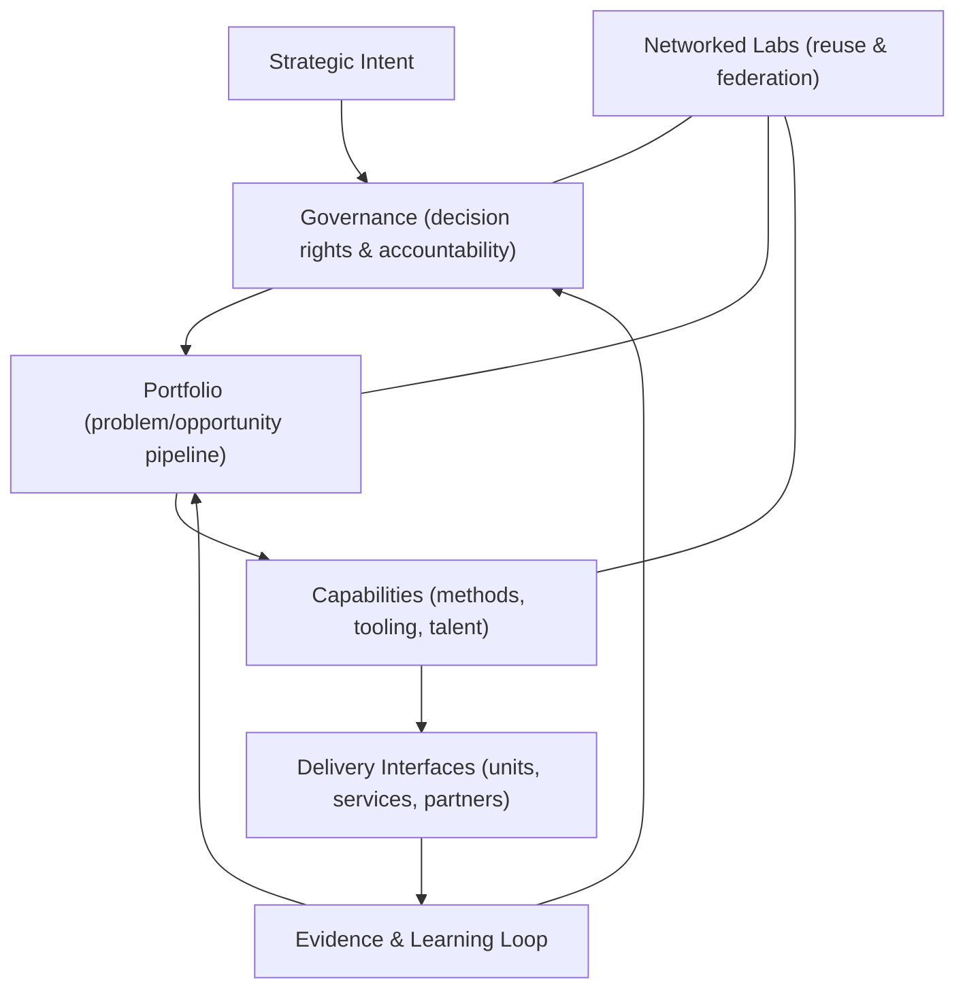
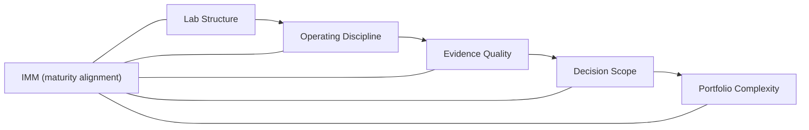
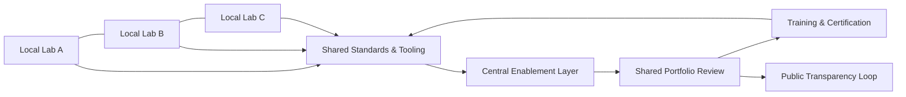
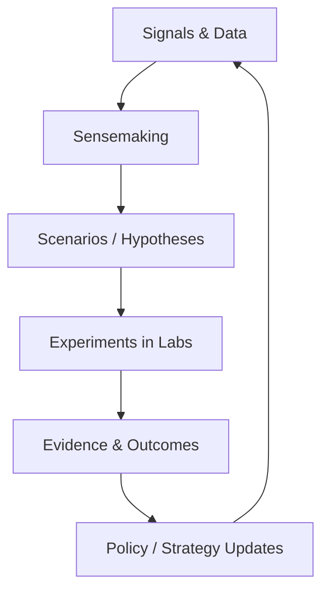

  <section className="heroBanner" aria-labelledby="innovation-lab-hero-title">
    <h1 id="innovation-lab-hero-title" className="heroTitle">
      The Innovation Lab A Guide to Accelerate Global Innovation
    </h1>
    

      Designing, governing, and scaling innovation labs and lab networks using MCF 2.2, IMM, VILF, and strategic foresight.
    

    
    
Luis Santiago (Doulab) · Updated 2026-01-28 · ~80 min read

    

      <a className="btn-primary" href="#executive-summary">Jump to guide</a>
    

  </section>

**On this page**
- [Executive Summary](#executive-summary)
- [How to Use This Guide](#how-to-use-this-guide-and-what-success-looks-like)
- [The Core Logic](#the-core-logic-one-page)
- [Innovation Labs](#the-innovation-lab)
- [MCF 2.2 in Practice](#mcf-22-operating-loop-lab-level)
- [Maturity, Networks, and Foresight](#innovation-labs-and-maturity-the-role-of-the-innovation-maturity-model-imm)

## Executive Summary

In many sectors facing rapid change, innovation is often treated as a necessity for survival and growth. Recognizing this imperative, "The Innovation Lab: A Guide to Accelerate Global Innovation" aims to serve as a structured reference for entities aspiring to embed innovation into their core operations.

This guide explores the "Innovation Lab," a specialized unit intended to foster innovation, creativity, and problem-solving to drive organizational growth and measurable outcomes. The emergence of Innovation Labs has been treated as a strategic move in many sectors to systematize and accelerate innovation processes.

These labs can offer a structured yet flexible environment where teams can nurture ideas, test, and refine their ideas away from the constraints of traditional operational frameworks. After exploring several innovation models, from internal innovation teams to external innovation cells, during a six-year research for developing the [*MicroCanvas Framework (MCF 2.2)*](https://themicrocanvas.com), the Innovation Lab is presented here as a viable alternative.

MCF 2.2 is a systems-oriented innovation framework designed to preserve decision integrity under uncertainty.

This guide is not a one-size-fits-all blueprint; it is a structured operating reference that should be adapted to governance constraints, maturity level, and strategic intent.

In practice, labs are often far enough from day-to-day operations to be influenced by internal culture, but close enough so that failures and successes can affect the organizational innovation mindset and propel innovation forward. This guide presents a structured approach to innovation with governance, cadence, and evidence standards that support scale and alignment with organizational goals.

This guide covers:

- **Why innovation labs exist**: the organizational conditions they respond to.
- **How innovation frameworks compare**: what they structure and where they fail.
- **How MCF 2.2 supports decision integrity**: framing, evidence, and iteration under uncertainty.
- **How to design lab governance**: roles, decision rights, and portfolio logic.
- **How to align labs to maturity**: using [*Innovation Maturity Model (IMM)*](https://doulab.net/services/innovation-maturity) to sequence capability building.
- **How to scale beyond a single lab**: networks, reuse, and operating coherence.
- **How foresight strengthens labs**: [*Vigía Futura*](https://doulab.net/vigia-futura) as a sensing-and-learning loop.

It leverages the MicroCanvas Framework (MCF 2.2), a structured operating approach used to guide the innovation process within organizations and integrate it with the innovation lab concept. This guide outlines the foundational principles of innovation, introduces readers to various innovation frameworks, and delves into the intricacies of establishing and managing an Innovation Lab.

It highlights the importance of aligning these labs with the organization's strategic vision, leveraging technology, and fostering a culture of continuous learning and adaptability. Through real-world case studies, actionable insights, and a structured operating approach for setting up an Innovation Lab, this guide is intended as a practical reference for leaders, innovators, and change-makers aiming to structure innovation practice.

Operationally, this shows up as documented intake criteria, evidence thresholds, and decision gates that can be applied consistently.

Whether you are a government entity seeking to solve complex societal issues or a private corporation aiming to deliver differentiated outcomes, "The Innovation Lab: A Guide to Accelerate Innovation Within Organizations" provides structured guidance and examples to structure innovation practice.

Finally, we explore the role of National Innovation Lab Networks, which can accelerate innovation at the national level and align cross-institution portfolios. By applying the principles and processes outlined in this guide, organizations can build durable innovation capacity and adapt as conditions change.

**Case vignette**
- **Context:** A cross-government scan of innovation labs examined mandate clarity and evidence standards. 
- **Intervention:** Comparative review of mandates and evidence practices across public labs.
- **Outcome:** The scan linked mandate clarity and evidence standards to public value outcomes.
- **Lesson:** Mandate clarity and evidence standards shape public value outcomes.
- **Source:** OECD OPSI, 2023 (https://oecd-opsi.org/blog/innovation-labs-through-the-looking-glass/)

**Key takeaway:** Evidence standards and mandate clarity should be treated as explicit inputs to lab design decisions.

## How to Use This Guide (and What "Success" Looks Like)

:::tip[Definitions]
**Portfolio governance**: The decision rights, cadence, and criteria used to allocate resources across innovation bets.
**Decision gate**: A formal Go / Review / No-Go checkpoint based on minimum evidence thresholds.
:::

### Who this is for

- **Public-sector leaders:** Translate mission priorities into evidence-backed portfolios and delivery outcomes.
- **Innovation lab directors:** Establish governance, cadence, and decision gates that sustain throughput.
- **Policy and strategy owners:** Align lab work with national or institutional priorities and measurable outcomes.
- **Delivery teams:** Operate within a repeatable loop that converts discovery into validated pilots.

### What you can do in 30 days, 90 days, and 12 months

- **30 days:** Publish a lab charter, define intake criteria, and baseline three operating metrics.
- **90 days:** Complete two discovery cycles, one validation gate, and one evidence review memo.
- **12 months:** Run quarterly portfolio reviews, scale three pilots, and document impact metrics by category.

### What “good” looks like (minimum viable lab vs. mature lab)

- **Minimum viable lab:** Clear charter, a single decision gate, and a small portfolio with defined outcomes.
- **Mature lab:** Portfolio governance, repeatable evidence standards, and cross-institution delivery agreements.
- **Minimum viable evidence:** A written hypothesis, one experiment, and a decision memo.
- **Mature evidence:** Comparable baselines, longitudinal outcomes, and public transparency when appropriate.
- **Decision cadence:** Monthly operating reviews at minimum; quarterly portfolio decisions at maturity.

### How MCF 2.2, IMM, VILF, and Vigía Futura fit together

- **MCF 2.2:** Defines the operating loop and evidence requirements for each phase of innovation.
- **IMM:** Aligns lab ambition to maturity, resource levels, and governance readiness.
- **VILF:** [*Vigía Innovation Lab Framework (VILF)*](https://vilf.doulab.net) establishes network design and governance for multi-lab coordination at scale.
- **Vigía Futura:** Can provide foresight inputs that shape portfolio choices and capability bets.
- **Integration:** The four elements connect evidence, maturity, governance, and foresight into a single system.

**Case vignette**
- **Context:** DARPA uses structured questions to test assumptions before scaling.
- **Intervention:** The Heilmeier Catechism frames decision gates and evidence thresholds.
- **Outcome:** Assumptions are tested earlier in the lifecycle.
- **Lesson:** Structured questions can support evidence-based scaling decisions.
- **Source:** DARPA, n.d. (https://www.darpa.mil/about/heilmeier-catechism)

## The Core Logic (One Page)

Innovation labs exist because complex problems require disciplined experimentation under uncertainty. Without a structured operating system, innovation effort drifts, evidence stays weak, and delivery timelines become unstable. The guide organizes innovation work so that investment decisions remain credible over time.

Operationally, this shows up as explicit decision gates, evidence criteria, and portfolio review cadence.

**If-Then chain**

- If uncertainty rises, then discovery and validation should be disciplined and time-bound.
- If discovery is disciplined, then the lab can operate as a reliable operating system.
- If the lab is an operating system, then portfolio governance can allocate resources transparently.
- If portfolio governance is clear, then maturity can be managed rather than assumed.
- If maturity is managed, then network scaling can be intentional and resilient.
- If networks are resilient, then national outcomes compound through shared evidence.

**Definitions**

- **Innovation Lab:** A governed operating unit that converts hypotheses into evidence and delivery decisions.
- **Portfolio:** A managed set of innovation bets with shared criteria, cadence, and resource allocation.
- **Maturity:** The capability level that determines how much complexity a lab can sustain.
- **Network:** A coordinated system of labs sharing standards, governance, and learning loops.
- **Foresight:** A structured capability that supplies signals, scenarios, and strategic options.

**Case vignette**
- **Context:** Xerox PARC is used as a reference point for lab output that struggled to scale.
- **Intervention:** Analysis focused on governance choices and capability reuse.
- **Outcome:** Governance and reuse patterns were linked to whether lab output scaled into durable impact.
- **Lesson:** Governance design and reuse mechanisms affect scale-out of lab outputs.
- **Source:** Roland Berger, 2025 (https://www.rolandberger.com/en/Insights/Publications/What-innovators-can-still-learn-from-Xerox-PARC.html)

**Decision implication:** Governance and reuse mechanisms should be treated as design variables, not afterthoughts.

## Introduction

"The Innovation Lab: A Guide to Accelerate Global Innovation" summarizes a six-year "Discovery" and "Validation" phase into a guide for fostering a culture of innovation.

After multiple iterations with clients, we distilled a process to support innovation both internally within organizations and at a national level.

Innovation, the driving force behind growth, measurable advantage in outcomes, and adaptation in today's rapidly changing business environment, requires a structured approach so that team members can introduce innovation processes and effectively integrate them into an organization's fabric.

In practice, this means translating ideas into documented hypotheses, evidence checkpoints, and delivery decisions.

This guide introduces the concept of Innovation Labs as specialized units within or associated with organizations dedicated to nurturing, developing, and executing innovative ideas and solutions. The introduction to this guide lays the groundwork for understanding the role of innovation in organizational sustainability and delivery outcomes.

It explains the need for structured innovation processes and environments to incubate and mature ideas into tangible outcomes. The introduction sets the stage for a deep dive into the mechanics of establishing and operating an Innovation Lab by delineating the various facets of innovation from its definition and dimensions to its lifecycle and frameworks.

Moreover, the guide presents the MicroCanvas Framework (MCF 2.2) as a central pillar in the architecture of an effective Innovation Lab. MCF 2.2's methodical approach to innovation, through its various processes, provides a scaffold for generating and refining ideas and validating, executing, and scaling them.

The introduction of MCF 2.2 supports the view that innovations are not merely creative ventures but strategic endeavors that align with organizational goals and market demands. In essence, the introduction to this guide frames the work as a cycle of discovery, exploration, and change.

It encourages leaders, innovators, and change-makers to create spaces where innovation can be tested and governed, guided by the principles and processes outlined in the subsequent sections. This guide aims to help organizations navigate innovation challenges, leveraging the MicroCanvas Framework (MCF 2.2) to foster a culture of continuous improvement and adaptability.

**Case vignette**
- **Context:** Manufacturing leaders reported disruption pressure in industrial sectors.
- **Intervention:** Structured innovation programs were framed as a response to that pressure.
- **Outcome:** The report connected disruption pressure to the adoption of structured programs.
- **Lesson:** Disruption pressure can motivate structured innovation programs in manufacturing.
- **Source:** McKinsey & Company, 2018 (https://www.mckinsey.com/~/media/mckinsey/industries/automotive%20and%20assembly/our%20insights/how%20industrial%20companies%20can%20respond%20to%20disruptive%20forces/disruptive-forces-in-the-industrial-sectors.pdf)

**Common misinterpretation:** Innovation labs are only idea generators rather than evidence-driven operating units.

## The Problem, Objectives and Purpose

This guide addresses the challenge organizations face in systematically fostering and managing innovation. Despite recognizing the value of innovation for growth and competitiveness, many need help implementing a structured approach that integrates creative ideation with strategic execution. This guide addresses that gap by providing a framework and tools (MCF 2.2 and its processes) to bridge theory and practice.

Operationally, this shows up as a shared operating cadence and evidence standards that reduce ambiguity between ideation and execution.

It can support organizations in generating innovative ideas and bringing them to fruition while aligning with Transformative Purpose and strategic objectives.

The objectives below translate that purpose into operational aims.

- **Introduce a Structured Approach to Innovation**: To present the MicroCanvas Framework (MCF 2.2) as a systematic methodology that guides organizations through the various stages of the innovation process, from ideation to market implementation to efficiency and then scale.

- **Facilitate the Establishment of Innovation Labs**: To provide a blueprint for setting up and operating Innovation Labs within organizations, focusing on how these labs can utilize MCF 2.2 to accelerate innovation projects.

- **Enhance Innovation Efficacy**: To improve the success rate of innovation projects by applying a structured approach that aligns with organizational goals, leverages customer insights, and addresses future disruptions.

- **Promote a Culture of Continuous Innovation**: To encourage organizations to adopt a mindset and culture that values continuous innovation, agility, and adaptability, supported by practical tools and processes.

- **Bridge the Gap Between Theory and Practice**: To offer actionable insights, documented practices, and case studies demonstrating how we can apply MCF 2.2 principles in real-world scenarios to drive growth and impact.

- **Equip Teams with Practical Tools**: To provide teams within Innovation Labs with the methodologies, tools, and templates necessary to validate hypotheses, assess risks, and iterate rapidly based on feedback and market dynamics.

For this reason, this guide's primary purpose is: "Support organizations in shaping future outcomes." The rest of the guide focuses on practical steps and evidence-led decisions. Luis Santiago

**Case vignette**
- **Context:** A financial services innovation program needed to move from ideas to delivery with clearer evidence gates.
- **Intervention:** Evidence thresholds were used to decide which initiatives moved forward.
- **Outcome:** Decision gates clarified which ideas could proceed to delivery.
- **Lesson:** Evidence gates can reduce ambiguity between ideation and delivery.
- **Source:** Doulab, n.d. (https://doulab.net/case-studies/afp-siembra)

**What to measure:** Evidence quality at each gate, decision cycle time, and outcome tracking against stated objectives.

## Justification

The creation of "The Innovation Lab: A Guide to Accelerate Global Innovation" responds to a need for businesses and government entities to navigate a rapidly changing environment. In today's era, characterized by technological advances, shifting market dynamics, and evolving societal expectations, the capacity to innovate is often treated as a measurable advantage in outcomes and, in some contexts, a survival requirement.

Innovation Labs have emerged as environments for exploring new ideas, testing hypotheses, and developing solutions that address current and future challenges.

These labs can foster a culture of innovation, encourage cross-disciplinary collaboration, and accelerate the transformation of insights into products, services, and policies. However, establishing and running an effective Innovation Lab poses its own set of challenges. Organizations often grapple with questions about structure, function, integration, and value demonstration.

Moreover, the sheer variety of innovation frameworks and methodologies can be overwhelming, leading to confusion about documented practices for fostering and managing innovation. We justify the creation of this guide by the clear need for a comprehensive, accessible, and practical resource that demystifies the concept of Innovation Labs.

It aims to equip leaders and innovation practitioners with the knowledge and tools needed to create labs that generate solutions and align with organizational strategic goals.

**Case vignette**
- **Context:** Public-sector labs face scrutiny on how investments align to mission outcomes.
- **Intervention:** Comparative reviews assessed portfolio alignment to mission outcomes.
- **Outcome:** Portfolio alignment was used to justify lab investment decisions.
- **Lesson:** Mission-aligned portfolios can support investment justification in public labs.
- **Source:** OECD OPSI, 2023 (https://oecd-opsi.org/blog/innovation-labs-through-the-looking-glass/)

## What is Innovation?

Innovation translates an idea or invention into a good or service that creates value or for which customers will pay. It involves the deliberate application of information, imagination, and initiative to derive greater or different values from resources and encompasses all processes by which new ideas are generated and converted into valuable products.

In practice, this means showing evidence that an idea delivers value beyond a prototype or concept.

In business, innovation often results when ideas are applied to satisfy customers' needs and expectations further. Innovation differs from invention because invention happens when someone ideates or creates a product or service. Innovation occurs when the same product or service starts creating value for customers.

In other words, ideas are cheap; execution is everything. From a practical perspective, innovation involves combining different ideas into a reality that can change people's lives. Innovations may be products, services, technologies, processes, or business models.

These innovations can be radical, bringing about a fundamental change in how we do things, or incremental, improving or enhancing existing solutions.

The following sources anchor commonly cited definitions and dimensions:

- **OECD Oslo Manual**: The OECD Oslo Manual is a significant source for understanding and measuring innovation. It provides guidelines for collecting and interpreting innovation data in the industrial and service sectors. *(*OECD, 2018*)*

- **Schumpeter's Theory of Economic Development**: Joseph Schumpeter introduced the concept of innovation as an important factor in economic development. His theory highlights the role of entrepreneurs in creating innovation, leading to new products, production methods, markets, and forms of organization. *(*Schumpeter, 1934*)*

- **The Lean Startup**: This book provides a modern approach to developing products and businesses through continuous innovation. It introduces concepts like Minimum Viable Product (MVP) and validated learning as methods to innovate efficiently and effectively. *(*Ries, 2011*)*

- **Crossing the Chasm**: Moore's work is often used to understand the diffusion of innovations in markets, particularly the challenges of moving from early adopters to the early majority. *(*Moore, 1991*)*

### Types of Innovation

The "types" of innovation typically refer to classifications based on the nature and impact of the innovation.

- **Incremental Innovation**: Small improvements to existing products, services, or processes.

- **Disruptive Innovation**: Innovations that create new markets by displacing existing ones.

- **Radical Innovation**: Breakthrough products or technologies that make existing ones obsolete. These types categorize innovations based on their effects on markets, technologies, and industries.

### Dimensions of Innovation

Conversely, the "dimensions" of innovation describe the areas within an organization where innovation can occur.

- **Product Innovation**: Involves changes to the products or services offered by an organization. It is about what the organization sells, ranging from minor improvements to major overhauls. *(*Keeley, Pikkel, Quinn, & Walters, 2013*)*

- Process Innovation focuses on changes to how products or services are created and delivered. It can involve manufacturing processes, software systems, or service delivery logistics.

- **Business Model Innovation**: Business conduct changes often involve how an organization creates, delivers, and captures value. Some examples of business model innovation include product changes, markets, processes, and relationships with customers and suppliers. *(*Osterwalder & Pigneur, 2010*)*

- **Organizational innovation**: Implementing a new organizational method in a firm's business practices, workplace organization, or external relations. It aims to improve a company's performance or workplace satisfaction. *(*OECD, 2018*)*

- Service Innovation is the introduction of new or significantly improved services. It can be related to changes in how a service is provided, such as using the latest technologies, methods, or concepts to enhance customer experience. *(*Bettencourt, 2010*)*

### Origins of Innovation

The "Origins of Innovation" refer to the sources or catalysts that spark the creative process, leading to new and transformative ideas within organizations. Organizations often benefit from understanding these origins to cultivate a proactive and responsive innovation culture. Innovations can emerge from various origins, offering unique pathways to transformative and incremental advancements.

These sources can be internal, from within the organization, or external, influenced by market dynamics, technological developments, customer feedback, or regulatory changes. By identifying and leveraging these origins, companies can strategically harness innovation to maintain competitiveness, adapt to changing environments, and fulfill emerging market needs effectively.

This approach supports sustained growth and empowers organizations to shape their future through deliberate and strategic innovation efforts.

- **Technology-Driven Innovation**: arises from technological advancements, using new or improved technologies to create products, enhance processes, or redefine business models. *(*McQuivey, 2013*)*

- Market-driven innovation is catalyzed by customer needs, market changes, or shifts in consumer behavior, focusing on direct interactions with customers to understand their demands. *(*Kim & Mauborgne, 2005*)*

- Regulatory-driven innovation happens when laws, regulations, or policies prompt regulatory-driven innovation, leading to compliance-driven changes or innovations that use legal changes as a measurable advantage in outcomes. *(*Harvard Business Review, 2009*)*

- **Societal-Driven Innovation**: emerges from social shifts, cultural changes, or a commitment to ethical standards, aiming to address societal challenges such as sustainability and social well-being. *(*Wagner, 2012*)*

- **Competitive-Driven Innovation**: is stimulated by the need to differentiate from competitors, enter new markets, or improve market position, driven by the competitive landscape. *(*Christensen, Anthony, & Roth, 2004*)*

### Innovation Lifecycle

The innovation lifecycle stages outlined in the MicroCanvas Framework (MCF 2.2) have parallels in various other innovation models, although the terminology and emphasis might differ slightly. Several sources describe similar phases in the innovation process, often encapsulating the journey from idea generation to market implementation.

The innovation lifecycle generally starts with a Discovery *(*Mitzkus, 2024*)* phase, where you generate and explore ideas. This step aligns closely with what some sources describe as the ideation or initial concept phase, which focuses on understanding problems and developing innovative solutions.

In the next phase, Validation *(*Joubert, 2017*)*, teams test and validate the feasibility of these ideas, similar to what other models might refer to as development or proof of concept, where they build prototypes and gather initial user feedback.

Efficiency *(*Joubert, 2017*)*, as described in the MCF 2.2, focuses on refining the process and making the solution cost-effective, similar to optimizing production and operational processes in other frameworks. Scaling *(*Mitzkus, 2024*)*, which involves broad market integration and expansion, is often treated as a significant phase in adopting innovation.

Finally, the Continuous *(*Mitzkus, 2024*)* phase in MCF 2.2, which emphasizes ongoing improvement and adaptation, mirrors what some innovation models call continuous or iterative refinement cycles based on market feedback and technological advancements. These phases *(*Startup Genome, 2011*)* are widely recognized across different innovation models, although the specific terms and some focal points might vary.

They serve as a comprehensive guide to navigating the complex process of bringing new ideas to fruition and ensuring they are sustainable and effective in the market.

**Case vignette**
- **Context:** Digital platforms faced early scaling pressure without validated evidence.
- **Intervention:** Validation gates were emphasized before scaling.
- **Outcome:** The pattern of premature scaling and stall risk was documented.
- **Lesson:** Disciplined validation can reduce premature scaling risk.
- **Source:** Startup Genome, 2011 (https://startupgenome.com/articles/a-deep-dive-into-the-anatomy-of-premature-scaling-new-infographic)

## Innovation Frameworks

Innovation frameworks *(*Donovan & Grace, n.d.*)* are structured tools and methodologies that guide organizations through the complex innovation process, from ideation to implementation. They serve as blueprints that help companies systematically manage their innovation activities, ensuring that ideas are generated and selected effectively, successfully executed, and integrated into the company's fabric.

In practice, this means selecting a framework that fits evidence requirements, governance cadence, and delivery constraints.

These frameworks vary widely, but they often aim to streamline the innovation process, reduce risks associated with innovation, and enhance the ability to achieve sustainable measurable advantage in outcomes. By providing clear guidelines and stages, innovation frameworks can help organizations navigate the often chaotic process of transforming creative ideas into practical and marketable innovations.

Operationally, this shows up as defined intake criteria, decision gates, and comparable evidence standards.

Understanding and applying the proper innovation framework can influence an organization's ability to innovate effectively. Many organizations strengthen innovation capability and align innovation efforts with strategic goals when exploring various frameworks.

### Why Are They Important?

**Innovation frameworks are often treated as relevant to business strategy for several reasons**:

- **Structured Creativity**: They provide a structured approach to creativity and innovation, which helps organizations systematically generate, develop, and implement ideas. This structure reduces the randomness and chaos often associated with innovation, making the process more predictable and manageable.

- **Risk Management**: Innovation inherently involves risk. Frameworks help manage these risks by providing methodologies for testing and validating ideas at early stages, minimizing potential losses, and focusing resources on the higher-potential initiatives.

- **Speed to Market**: By streamlining the innovation process, frameworks can accelerate the development and commercialization of new products and services. This rapid execution is crucial in today's fast-paced markets, where being first can be a significant advantage.

- **Alignment with Strategy**: Innovation frameworks align new ideas with the organization's overall strategy. This alignment helps keep innovation efforts contributing to the broader business objectives, thus enhancing coherence and focus.

- **Sustainability of Innovations**: Frameworks facilitate not just the creation but also the implementation and scaling of innovations, ensuring they are not just creative flashes in the pan but sustainable changes that deliver ongoing value.

- **Measurement and Improvement**: They provide tools for measuring the effectiveness of innovation activities, allowing organizations to make informed decisions about where to invest in innovation. This continuous improvement loop is often treated as commonly required for long-term innovation success.

- Innovation frameworks are not just tools for creating new products or services; they can be integral to fostering a culture of innovation within organizations, supporting continuous innovation and alignment with organizational goals. This strategic alignment is often treated as commonly required for maintaining measurable advantage in outcomes and achieving sustainable growth.

### Types of Innovation Frameworks

Innovation frameworks vary widely, each designed to address specific aspects of the innovation process or to fit particular industry needs. Understanding the different types of innovation frameworks can help organizations select the approach that is best aligned with their strategic goals and operational style. One common type is the Stage-Gate Process *(*Cooper, 2001*)*, developed by Dr.

Robert Cooper. This framework is widely used in product development and divides the innovation process into distinct stages separated by decision points (gates), evaluating ideas before moving to the next phase. It's particularly valued for its systematic approach to managing the progression of new products from concept to launch, helping firms minimize risks and allocate resources effectively.

Another influential framework is the Lean Startup *(*Ries, 2011*)* methodology, pioneered by Eric Ries. It emphasizes rapid prototyping, validated learning, and other iterative design techniques to efficiently develop products that meet consumer needs without requiring large amounts of initial funding or resources. This approach is beneficial in dynamic markets or startups needing to adapt quickly.

Design Thinking *(*Brown, 2009*)* is a popular framework focusing on user experience and creative problem-solving. It involves a cyclical process of understanding the user, challenging assumptions, redefining problems, and creating innovative solutions through ideation, prototyping, and testing. This framework is beneficial for developing solutions that are not only technologically feasible but also viable in the market and desirable to users.

Each framework offers distinct advantages, and organizations can implement them in various combinations depending on their needs, industry requirements, and innovation objectives. Companies may choose a single approach or integrate elements from different frameworks to create a tailored innovation strategy that maximizes their innovative potential and aligns with their overall business strategy.

### Shortcomings of Existing Frameworks

While existing innovation frameworks provide structured methodologies for managing innovation processes, they also exhibit certain limitations that can hinder their effectiveness in various contexts. One common shortcoming is their often rigid structure, which can stifle creativity and spontaneity crucial for breakthrough innovations.

These limitations highlight the importance of selecting or adapting innovation frameworks that address specific business needs and are flexible enough to evolve with changing market conditions and organizational dynamics. Adapting frameworks to fit an organization's unique context, rather than adopting them wholesale, can help mitigate these shortcomings and enhance the overall effectiveness of the innovation process.

**Case vignette**
- **Context:** A product organization used Stage-Gate, Lean Startup, and Design Thinking within a traditional governance environment.
- **Intervention:** Stage-Gate checkpoints, rapid pivots, and non-linear ideation were used concurrently.
- **Outcome:** Governance cadence slowed approvals and strategic coherence weakened across iterations.
- **Lesson:** Frameworks often need adaptation to organizational cadence and decision rights.
- **Source:** Practitioner observation (illustrative)

Sources like "The Innovator's Dilemma" *(*Christensen C. M., 1997*)* and articles from Harvard Business Review frequently discuss these issues, providing deeper insights into the practical challenges of applying innovation frameworks in real-world settings.

**Case vignette**
- **Context:** An overview of innovation frameworks summarized common structure and adaptation choices.
- **Intervention:** Framework types and selection considerations were described for practitioners.
- **Outcome:** The overview provided guidance on structuring frameworks for organizational fit.
- **Lesson:** Framework selection benefits from alignment to context and execution constraints.
- **Source:** Donovan & Grace, n.d. (https://www.gpstrategies.com/resources/article/innovation-frameworks-what-they-are-and-how-to-build-one/)

**Key takeaway:** Framework selection works best when evidence standards and governance cadence are explicit.

## The MicroCanvas Framework (MCF 2.2)

### Overview of MCF 2.2

The MicroCanvas Framework (MCF 2.2) is a structured approach designed to guide organizational innovation. It offers a repeatable methodology for identifying, validating, developing, and scaling innovative ideas into successful projects or products.

By breaking down the innovation process into distinct, manageable micro-sprints, MCF 2.2 can support organizations in tackling complex problems methodically and addressing each aspect of the innovation lifecycle. MCF 2.2 frames innovation as a dynamic ecosystem of interconnected activities that require careful planning, execution, and adaptation.

In practice, this means teams commit to short evidence loops with explicit decision checkpoints before scaling.

The framework encompasses various phases of innovation, from ideation and problem-solving to market entry and scaling, providing tools and processes for each step. By providing tools for each phase of the innovation lifecycle, MCF 2.2 can support teams in conceiving innovative projects and aligning them with organizational goals, market needs, and sustainability considerations.

A concrete signal of this is a documented progression from hypothesis to validated pilots before scaling.

The core components of MCF 2.2 include:

Expand for the full MCF 2.2 component list

- **Problem Analysis**: Identifying and understanding the core problem to solve.

- **Objectives and Key Results (OKR)**: Setting clear goals and measurable results for which to aim.

- **Transformative Purpose**: Defining the broader mission or impact the innovation seeks to achieve.

- **Solution Alternatives**: Explores different solutions to address the identified problem.

- **Customer Analysis**: Understanding the target market's needs, behaviors, and preferences.

- **Future Disruptions**: Anticipating and planning for future trends and potential market disruptions.

- **Accelerated Growth Attributes**: Identifies factors that enable rapid scaling and growth.

- **Team Structure**: Designing an effective team to drive innovation forward.

- **Cost and Revenue Structure**: Analyzing the financial aspects of the innovation project.

- **Business Model Validation**: assesses whether the business model can sustainably deliver value to customers, generate revenue, and support the company's strategic objectives.

- **Risks Analysis and Management**: analyzes potential risks and provides alternatives to manage, mitigate, or accept said risk, according to the project's goals and objectives.

- **Unique Advantages and Product Features**: This helps define the product's features in alignment with the customer's needs and goals, as well as with the project's goals and solution alternatives.

- **Key Growth Metrics**: Help establish metrics to measure progress toward establishing the transformative purpose.

- **Key Impact Metrics**: track the social or economic impact of the innovation.

- **Sales**: Assist in creating a "sales funnel" specifically optimized for the innovation project's needs.

- **Delivery Channels**: will assist in understanding and optimizing the go-to-market strategies related to the value distribution for the project's innovation.

- **Socio-cultural context**: This guideline helps the innovation team understand the complexities of the different local environments where the innovation users reside.

- **Operations**: focus on helping describe and optimize processes for operational efficiency.

- **Financial Analysis**: Deep dive into the project's financial viability.

- **Marketing and Engagement**: helps with processes that allow the innovation team to understand market dynamics, refine their go-to-market strategies, and increase customer engagement while decreasing customer acquisition costs.

- **Legal Compliance and Strategy**: guides the innovation team in ensuring the product meets industry standards and legal requirements.

- **External Stakeholders**: will help map those who are in favor or against the innovation project, while realizing strategies for dealing with them.

- **Regulatory Constraints**: allow for a deep understanding of the regulatory environment and help define strategies for developing innovation while complying with said constraints.

- **User Stories**: help the team define how users interact with the innovative solution.

- **External System Integrations**: focus on integrating the innovation within larger systems.

- **Product Architecture**: maps the initial product and systems architecture, allowing for a unified, decentralized, and decoupled approach to developing innovation while ensuring scalability.

- **Customer Experience and Loyalty**: deal with after-sales support and customer retention strategies.

**Case vignette**
- **Context:** A public-sector network sought to align lab methods and decision gates.
- **Intervention:** Shared methods and decision gates were documented and applied across labs.
- **Outcome:** Labs aligned around common evidence standards.
- **Lesson:** Shared methods and decision gates can support cross-lab alignment.
- **Source:** Doulab, n.d. (https://doulab.net/case-studies/ogtic-redlab)

## The Innovation Lab

The concept of an Innovation Lab represents a dedicated space where creativity, technology, and strategic thinking converge to test and implement ideas and solutions. Situated at the intersection of exploration and implementation, Innovation Labs operate as units that translate ideation into validated delivery steps.

In public and regulated environments, this requires explicit accountability, compliance alignment, and decision governance; labs do not operate outside institutional constraints.

These labs are not just physical spaces but are environments that encourage experimentation and collaboration among diverse people. Innovation Labs can widen the range of options considered within a company by enabling exploration of new technologies, business models, and processes without the constraints of day-to-day operations.

By isolating the innovation process in a supportive setting, these labs can facilitate a deeper focus on creative solutions to complex challenges, making them relevant in today's rapidly changing business landscape. Moreover, Innovation Labs are often treated as relevant in cultivating an innovation-oriented culture, drawing on cross-disciplinary expertise to spur continuous improvement and measurable change.

This approach enhances an organization's capacity to innovate and aligns these innovations with strategic business goals, ensuring that they deliver real value and impact. Using structured frameworks like the MicroCanvas Framework (MCF 2.2), Innovation Labs can systematically manage and enhance innovation efforts, turning novel ideas into successful, scalable projects.

In practice, this means clarifying decision rights, evidence thresholds, and delivery pathways before pilots scale.

### Why do they matter?

Innovation Labs can be relevant within organizations for many reasons. They offer a dedicated space where new ideas can be explored away from the operational pressures of day-to-day business activities. This separation can allow for a more accessible exploration of novel concepts without the immediate constraints of standard corporate ROI expectations, improving decision speed.

By focusing resources and talent on specific projects, labs can develop and iterate on new products, services, or processes faster than within the regular organizational structure, supporting measurable advantage in outcomes.

Maintaining this edge in today's fast-paced business world requires continuous innovation, facilitated by integrating technologies and methodologies to develop solutions that differentiate a company in the marketplace. Furthermore, Innovation Labs foster a culture of innovation, signaling the importance of creative and experimental thinking.

This mindset can permeate the entire organization, encouraging all employees to think innovatively. Labs also help manage the risks associated with new initiatives by prototyping and testing new ideas within a controlled environment. This approach allows learning and adapting strategies based on feedback before a full-scale rollout, minimizing potential failures and capital loss.

Additionally, these labs support the alignment of new projects with the organization's strategic goals, ensuring that innovations have a clear purpose and contribute meaningfully to the company's long-term objectives. Innovation Labs can help sustain competitive positioning by keeping innovation central to corporate strategy. This dedicated approach to innovation is commonly required in today's business landscape.

Some additional sources that can help understand why innovation labs matter as innovation drivers, such as "The Corporate Startup" by Tendayi Viki, Dan Toma, and Esther Gons, often discuss the role and importance of innovation labs in modern business environments.

### Types of Innovation Labs

Innovation labs differ from incubators, accelerators, and R&D units. Incubators support external ventures with mentoring and access, accelerators compress venture development into short programs, and R&D focuses on internal technical advancement. Innovation labs operate as governed systems that manage portfolios and evidence across discovery, validation, and delivery.

Innovation Labs vary widely in their focus and structure, depending on the strategic goals and industry specifics of the organizations they serve.

- **Corporate Innovation Labs**: These labs are set up within large corporations to foster creativity and innovation in a controlled environment, separate from the core business operations. They focus on developing new technologies, products, or business models that align with the company's strategic goals. *(*Tidd & Bessant, 2018*)*.

- **University-Affiliated Innovation Labs**: Often found on or near university campuses, these labs facilitate collaboration between academic researchers and industry professionals. They aim to leverage academic knowledge and research to solve real-world industry problems. *(*Etzkowitz & Leydesdorff, 2000*)*.

- **Government Innovation Labs**: These are typically funded and operated by government agencies to develop solutions for public sector challenges, such as healthcare, education, and urban planning. They often focus on improving service delivery and citizen engagement through technology. *(*Mulgan, 2014*)*.

- **Independent Innovation Labs**: Operated independently of any specific firm or institution, these labs offer a neutral space for diverse organizations to collaborate and co-create solutions. They often work with multiple stakeholders to address complex societal challenges that span different sectors. *(*Westley & Antadze, 2010*)*.

- **Community Innovation Labs**: These labs focus on grassroots innovation, involving local communities in the innovation process. They aim to harness community members' collective intelligence and creativity to develop solutions tailored to local needs. *(*Moore & Westley, 2011*)*.

### Objectives of an Innovation Lab

Innovation Labs are often established with several relevant objectives that guide their operations and support their contribution to an organization's broader innovation strategy.

- Foster creativity and innovation by cultivating an environment that encourages exploring new ideas and experimental approaches to problem-solving. *(*Amabile, 1997; Ries, 2011*)*
- Accelerate the development and implementation process through rapid prototyping and agile methodologies. *(*Ries, 2011*)*
- Enhance an organization's measurable advantage in outcomes by pioneering new technologies and methodologies. *(*Ries, 2011*)*
- Improve customer experience and engagement by leveraging technology to understand and meet changing needs. *(*Prahalad & Ramaswamy, 2004*)*
- Develop solutions that promote sustainability by integrating sustainable practices into product development and business processes. *(*Nidumolu, Prahalad, & Rangaswami, 2009*)*
- Encourage collaboration across disciplines, combining diverse skills and perspectives to support comprehensive innovation. *(*Bessant & Tidd, 2015*)*

These objectives collectively shape the activities of Innovation Labs, ensuring they contribute meaningfully to the organization's success and adaptability in a rapidly changing world.

### Components of Successful Innovation Labs

Successful Innovation Labs often share several relevant components contributing to their effectiveness and impact.

- **Strategic alignment:** Align lab activities with broader strategic goals to support relevance and senior sponsorship. *(*Bessant & Tidd, 2015*)*
- **Access to resources:** Ensure funding, tools, and technologies that allow experimentation without typical operational constraints. *(*Chesbrough, 2006*)*
- **Multidisciplinary teams:** Combine diverse perspectives to support creative problem-solving and innovation. *(*West, 2002*)*
- **Culture of experimentation:** Encourage experimentation where failure is treated as a learning opportunity. *(*Edmondson, 2018*)*
- **Leadership and management:** Balance creative freedom with strategic focus through consistent leadership. *(*Kotter, 1996*)*
- **Processes and governance:** Provide structures that guide idea development and maintain alignment with business objectives. *(*Osterwalder & Pigneur, 2010*)*

These components are often instrumental in the successful operation of Innovation Labs. They help them generate novel ideas and implement them in ways that significantly benefit their parent organizations and support sustained impact and innovation.

**Case vignette**
- **Context:** Public labs were reviewed across multiple jurisdictions.
- **Intervention:** Reviews compared governance, evidence standards, and delivery alignment.
- **Outcome:** Evidence and delivery alignment emerged as recurring concerns.
- **Lesson:** Governance and evidence standards shape delivery alignment in public labs.
- **Source:** OECD OPSI, 2023 (https://oecd-opsi.org/blog/innovation-labs-through-the-looking-glass/)

## The 5 Failure Modes of Innovation Labs (and How to Prevent Them)

Common failure modes observed in practice include:

:::caution[Failure modes]
1. **Symptom:** Activity increases but evidence remains thin.  
   **Root cause (structural):** Incentives reward activity over decision quality.  
   **Prevention mechanism (governance/process):** Require decision gates with minimum evidence.  
   **Metric to watch:** Percentage of projects with validated hypotheses.

2. **Symptom:** The lab becomes isolated from delivery teams.  
   **Root cause (structural):** Governance separates experimentation from implementation owners.  
   **Prevention mechanism (governance/process):** Joint portfolio reviews with delivery leaders.  
   **Metric to watch:** Share of pilots adopted by business or public units.

3. **Symptom:** Portfolio expands without strategic alignment.  
   **Root cause (structural):** Intake lacks shared criteria or decision rights.  
   **Prevention mechanism (governance/process):** Formal intake rubric tied to strategy outcomes.  
   **Metric to watch:** Portfolio items mapped to strategic objectives.

4. **Symptom:** Tools proliferate but capability does not mature.  
   **Root cause (structural):** Tooling decisions outpace training and governance.  
   **Prevention mechanism (governance/process):** Maturity-based resourcing and training plan.  
   **Metric to watch:** Capability assessment scores by cohort.

5. **Symptom:** Network initiatives stall after pilot cohorts.  
   **Root cause (structural):** Coordination costs are not matched with shared standards.  
   **Prevention mechanism (governance/process):** Common standards, shared portfolio review, and enablement layer.  
   **Metric to watch:** Reuse rate of methods and artifacts across labs.
:::

**Case vignette**
- **Context:** Xerox PARC is referenced in analysis of lab outputs that did not scale.
- **Intervention:** Governance gaps and capability reuse were assessed.
- **Outcome:** Gaps and limited reuse were linked to scaling barriers.
- **Lesson:** Governance design and reuse mechanisms affect scale-out of lab outputs.
- **Source:** Roland Berger, 2025 (https://www.rolandberger.com/en/Insights/Publications/What-innovators-can-still-learn-from-Xerox-PARC.html)

## Setting Up an Innovation Lab using The MicroCanvas Framework (MCF 2.2)

Setting up an Innovation Lab using the MicroCanvas Framework (MCF 2.2) involves systematically integrating structured innovation management with organizational strategy and operational efficiency. We can break this process down into the following steps:

In practice, this means sequencing decisions across evidence gates, resourcing, and governance checkpoints.

### MCF 2.2 Operating Loop (Lab Level)

:::note[Decision gates]
Decision support: determine whether evidence is sufficient to move from one phase to the next.
:::

1. **Discovery**
   - **Output artifact:** Problem framing brief.
   - **Decision gate:** Go / Review / No-Go.
   - **Primary risks:** Mis-specified problem or weak stakeholder alignment.
   - **Minimum evidence required:** Verified user pain points and baseline metrics.

2. **Validation**
   - **Output artifact:** Experiment results memo.
   - **Decision gate:** Go / Review / No-Go.
   - **Primary risks:** Confirmation bias and weak sample quality.
   - **Minimum evidence required:** Test outcomes with defined success thresholds.

3. **Efficiency**
   - **Output artifact:** Process optimization plan.
   - **Decision gate:** Go / Review / No-Go.
   - **Primary risks:** Cost overruns and operational bottlenecks.
   - **Minimum evidence required:** Cost and cycle-time comparisons.

4. **Scaling**
   - **Output artifact:** Scale readiness assessment.
   - **Decision gate:** Go / Review / No-Go.
   - **Primary risks:** Unstable delivery capacity or governance gaps.
   - **Minimum evidence required:** Replication results and capacity plan.

5. **Continuous Improvement**
   - **Output artifact:** Learning and iteration backlog.
   - **Decision gate:** Go / Review / No-Go.
   - **Primary risks:** Stagnation or drift from strategic outcomes.
   - **Minimum evidence required:** Performance trends and post-implementation reviews.

### Micro-sprints (Cadence That Sustains Output)

- **2-week sprints:** Use when problem scope is narrow and evidence is fast to collect.
- **4-week sprints:** Use when coordination or data collection requires longer cycles.
- **Sprint agenda:** Intake → Hypothesis → Build/Measure → Review → Next decision.
- **Anti-patterns:** Endless discovery, demo theater, backlog bloat.

The Vigía Innovation Lab Framework (VILF) provides a structural model for designing and governing innovation labs and lab networks as long-lived institutional systems.

- Governance
- Portfolio logic
- Capability reuse
- Networked labs

The following diagram summarizes the lab as a governed system with reusable capabilities and an evidence loop.

**Diagram — VILF: Innovation Lab as a System**

- Ask, "What problem does this lab solve?" Use the "Problem Analysis" MCF 2.2 process to determine the central problem the lab will tackle and develop a deeper understanding of its causes and effects. Identify who has this problem and which stakeholders are interested in resolving it. This analysis paves the way for a better understanding of the lab's potential customers, potential solution alternatives, and, more importantly, the lab's Purpose.

- **Define the Strategic Alignment**: align the lab's goals with the organization's broader strategic objectives. Use the "Objectives and Key Results" MCF 2.2 process to transform the effects of the main problem into objectives that you can adequately measure through OKRs. By defining the strategic alignment, you can determine if you are progressing toward achieving the lab's strategic goals. This alignment will support that the lab's initiatives are relevant and contribute meaningfully to the company's overall mission and vision.

- **Analyze potential alternatives**: Explore which solutions you can develop to achieve the lab's strategic goals and mitigate the main problem's effects on the target customers. We suggest using the "Solution Alternative Analysis" MCF 2.2 processes to explore potential alternatives quickly.

- **Consider your transformative Purpose**: a transformative purpose, the highest achievable vision for the lab, will guide the efforts and serve as a "guiding star" that will help the lab focus on achieving its objectives without distraction. Using the "Transformative Purpose" MCF 2.2 process will allow you to envision the highest Purpose the lab will focus on.

- **Formulate the Team Structure**: Assemble a multidisciplinary team that brings diverse skills and perspectives to the lab. This team should include a mix of creative thinkers, industry experts, and operational staff who can drive projects from ideation to implementation. The lab's leadership should inspire a culture of innovation and manage the balance between creative exploration and strategic focus. The "Team Structure" process in MCF 2.2 can help you determine the right team structure and dynamic that aligns with the lab's objectives.

- **Establish the Infrastructure**: Design a physical or virtual space that fosters creativity and collaboration. Equip the lab with the necessary tools, technologies, and resources to support experimentation and innovation. This space should also be adaptable to accommodate different projects and workflows.

- **Implement MCF 2.2 Processes**: Integrate the MicroCanvas Framework (MCF 2.2) into the lab's operations. To achieve this, you must define transparent processes for each phase of the innovation lifecycle: Discovery, Validation, Efficiency, Scaling, and Continuous Improvement. Manage each phase using MCF 2.2 tools and techniques to support the systematic progression of ideas. The Operations, User Stories, Sales, Marketing and Engagement, and Customer Experience and Loyalty will be very useful in guiding you in implementing these processes.

- **Develop Governance and Metrics**: Establish governance structures to oversee the lab's activities and support alignment with the company's policies and ethical standards. Also, metrics and KPIs should be defined to measure the performance and impact of the lab's innovations. These metrics should reflect the lab's strategic goals and guide decision-making processes. We suggest using the Key Growth Metric and Key Impact Metrics MCF 2.2 processes to develop and monitor these metrics.

- **Launch Pilot Projects**: Initiate pilot projects to test the lab's setup and processes. These projects serve as a practical way to refine the lab's innovation approach and identify improvement areas. Learning from these initial projects is relevant for scaling the lab's operations. As previously suggested, it is commonly required to follow each step in the innovation lifecycle to support that each new product, service, or business model is validated correctly before moving into the next stage, thus reducing the waste of resources.

- **Foster a Culture of Continuous Learning**: Encourage ongoing learning and adaptation based on feedback and results from initial projects. Continuous learning should be ingrained in the lab's culture, promoting an iterative approach to innovation and constantly refining strategies and processes. Business Model Validation, Socio-Cultural Context, Key Partners, Customer Analysis, Risk Analysis, and Management MCF 2.2 processes are fundamental to learning what is working and what is not continuously and, from there, deriving potential new iterations of the lab's execution.

### Infrastructure Requirements

Setting up an Innovation Lab typically requires careful infrastructure planning to create an environment conducive to creativity and innovation. This environment should encompass physical or virtual spaces and the necessary technological and operational support systems. The physical layout of an Innovation Lab should foster collaboration and flexibility.

It should feature modular furniture, ample whiteboard space for brainstorming, and areas designated for both quiet thinking and collaborative work, encouraging interaction and the free flow of ideas among team members. *(*Kelley & Kelley, 2013*)*.

Access to suitable technology is commonly required, including high-speed internet, software tools for design and development, and hardware for prototyping and testing. Access to cloud computing resources and specialized tools like 3D printers and VR equipment can support the innovation process. *(*Hagel, Brown, & Davison, 2010*)*.

Robust operational support is also commonly required, including administrative, legal, and technical assistance to streamline processes, manage intellectual property issues, and support compliance with relevant regulations. *(*Tidd & Bessant, 2018*)*.

Reliable communication tools are crucial for connecting team members within the lab and with external partners, incorporating technology like video conferencing, project management software, and digital collaboration platforms. *(*Friedman, 2007*)*.

Finally, strong security measures protect sensitive information and intellectual property, including secure data storage solutions, network security systems, and protocols for handling confidential materials. *(*Schneier, 2004*)*.

An Innovation Lab can provide a supportive environment that is well-equipped to nurture innovations and adapt to future challenges and opportunities in the technology and business landscape, as long as you consider this during the Discovery and Validation stages for the lab's initial implementation.

### Staffing and Team Structure

- **Corporate Innovation Labs**: **Staffing and team structure:** Corporate innovation labs typically employ a mix of internal company talent and external experts to drive innovation. The team often includes R&D specialists, product developers, project managers, and UX/UI designers who collaborate closely with business units.

- **University-Affiliated Innovation Labs**: **Staffing and team structure:** These labs often employ academic researchers, students, and industry professionals who collaborate on research-driven projects. The team structure typically emphasizes interdisciplinary collaboration.

- **Government Innovation Labs**: **Staffing and team structure:** Government labs usually staff policy makers, subject matter experts in public administration, and technologists. They focus on public sector innovation to improve services and policy outcomes.

- **Independent Innovation Labs**: **Staffing and team structure:** Independent labs typically operate with a flexible staffing model that can include freelancers, industry experts, and academic partners. This structure allows for a dynamic team that adapts to project needs.

- **Community Innovation Labs**: **Staffing and team structure:** Local community members, social entrepreneurs, and volunteers who bring grassroots knowledge and insights often staff community labs. They emphasize local engagement and solutions tailored to community needs.

Each type of innovation lab requires a tailored approach to team structure and staffing, leveraging diverse skills and backgrounds to meet specific innovation goals. This strategic alignment of team composition supports the labs in addressing the unique challenges they aim to solve, whether in the corporate, academic, government, community, or independent sectors.

**Case vignette**
- **Context:** A corporate innovation lab needed deep technical and delivery skills.
- **Intervention:** Senior engineers, data scientists, and product managers were staffed alongside business unit leads.
- **Outcome:** Cross-functional staffing supported prototype delivery and integration.
- **Lesson:** Mixed internal and external roles can support corporate lab delivery.
- **Source:** Chesbrough, 2006

**Case vignette**
- **Context:** A university-affiliated lab operated across academic and industry domains.
- **Intervention:** Faculty, graduate researchers, and industry consultants collaborated on research-driven projects.
- **Outcome:** Interdisciplinary staffing supported applied research delivery.
- **Lesson:** Academic-industry teams can support research-driven lab missions.
- **Source:** Etzkowitz & Leydesdorff, 2000

**Case vignette**
- **Context:** A government innovation lab focused on service delivery in healthcare.
- **Intervention:** Policy analysts, public health experts, and technologists were staffed together.
- **Outcome:** Service design and delivery alignment improved.
- **Lesson:** Public-sector labs benefit from policy and technical staffing alignment.
- **Source:** Mulgan, 2014

**Case vignette**
- **Context:** An independent lab worked on environmental technology programs.
- **Intervention:** Project-based environmental scientists joined permanent commercialization staff.
- **Outcome:** Technical research and commercialization planning were paired.
- **Lesson:** Flexible staffing can support independent lab adaptability.
- **Source:** Westley & Antadze, 2010

**Case vignette**
- **Context:** A community lab addressed urban food access challenges.
- **Intervention:** Local farmers, urban planners, and community organizers staffed the lab.
- **Outcome:** Community needs informed project selection and delivery.
- **Lesson:** Community staffing can align lab work with local needs.
- **Source:** Moore & Westley, 2011

We suggest using the previously mentioned Team Structure process to create an initial team structure aligned with the lab's objectives and transformative purpose. During the first three stages of the lab's lifecycle (Discovery, Validation, and Efficiency), the team structure will likely change as the lab learns how to operate efficiently. The lab might also consider outsourcing some of its core functions (sales and marketing, finance and accounting, IT, and other support functions, including coaching and mentoring) as it develops a viable business model until it reaches a maturity level that allows for permanent staffing.

### Operational Model

The operational model of an Innovation Lab outlines the methods and processes that guide how the lab functions on a day-to-day basis. This model typically incorporates aspects of project management, resource allocation, workflow design, and performance metrics, ensuring efficient project management and alignment with the organization's strategic objectives.

- **Project Management**: An effective operational model establishes clear project management protocols, which help organize, plan, and execute innovation projects from inception through completion.

- **Resource Allocation**: The model should actively define how to allocate resources to support various projects. Examples of resources include budgeting for materials, technology, and human resources and determining how to prioritize these resources across competing projects.

- **Workflow Design**: The operational model should streamline workflows, integrating new tools and technologies that enhance collaboration and efficiency.

- **Performance Metrics**: It is relevant to establish performance metrics to track the progress and impact of innovation initiatives. These metrics can include innovation outputs, such as patents filed or products launched, and outcomes, such as market share gains or revenue growth.

With a robust operational model that includes project management protocols, resource allocation, workflows, and performance indicators, Innovation Labs can enhance their efficiency and effectiveness while contributing to organizational innovation goals.

**Case vignette**
- **Context:** A lab needed faster iteration cycles across projects.
- **Intervention:** Agile project management practices were adopted in the operating model.
- **Outcome:** Iteration cadence improved and project flow became more predictable.
- **Lesson:** Agile practices can support iteration cadence in lab operations.
- **Source:** Sutherland, 2014

**Case vignette**
- **Context:** A lab portfolio required differentiated funding levels.
- **Intervention:** A tiered funding model prioritized resources by strategic value.
- **Outcome:** Funding decisions aligned with portfolio tiers and evidence gates.
- **Lesson:** Tiered funding can support resource allocation discipline.
- **Source:** Kaplan, 2012

**Case vignette**
- **Context:** Distributed teams needed shared workflows and coordination.
- **Intervention:** Collaboration platforms were integrated into the workflow design.
- **Outcome:** Remote coordination improved and workflows became more consistent.
- **Lesson:** Collaboration platforms can support workflow consistency.
- **Source:** O'Reilly & Tushman, 2016

**Case vignette**
- **Context:** Leadership needed consistent performance visibility across projects.
- **Intervention:** Balanced scorecard metrics were applied to innovation outputs and outcomes.
- **Outcome:** Performance reporting became consistent across financial and non-financial indicators.
- **Lesson:** Balanced scorecards can support multi-dimensional performance tracking.
- **Source:** Kaplan & Norton, 1996

### Integrating MCF 2.2 Processes into the Innovation Lab's project lifecycle

Integrating the MicroCanvas Framework (MCF 2.2) processes into the project lifecycle of an Innovation Lab enhances strategic alignment and operational efficiency across all phases of innovation. Conceptualizing, creating a lab pilot, stabilizing the lab, and then scaling it is a project within a project, as the lab runs the framework for organizing itself while following the same process for the innovation projects themselves.

Here's a detailed breakdown of how each phase of the innovation lifecycle incorporates specific MCF 2.2 processes:

#### Discovery Phase

- Customer Analysis and Problem Analysis identify the target market's needs and challenges and define the core problem the innovation aims to solve. It will also allow you to gauge how big of a market opportunity the lab will focus on, helping determine the potential impact or commercial viability of the lab.

- Objectives and Key Results (OKR) help set measurable goals that align with the lab's strategic aims.

- Transformative Purpose clarifies the broader impact the project aims to achieve, ensuring that the innovation aligns with the lab's mission and values.

- Solution Alternatives, Unique Advantages, and Product Features explore different ways to address the identified problems, including distinguishing characteristics that could give the product a competitive edge while aligning said features with the specific needs or challenges of the target market.

- Team Structure supports the right mix of skills and experience being available to tackle innovation projects effectively.

- Business Model Validation assesses the feasibility and sustainability of the proposed business model from the outset.

#### Validation Phase

- User Stories and Key Growth Metrics need development to capture the end-user experience and measure the project's progress toward its growth objectives.

- Key Impact Metrics track the social or economic impact of the innovation.

- Sales, Marketing and Engagement, and Customer Experience and Loyalty processes help understand market dynamics and refine go-to-market strategies.

- Business Model Validation continues as more data becomes available and you assess initial market reactions.

#### Efficiency Phase

- External Stakeholders, Operations, and External System Integrations focus on improving operational efficiency and integrating innovation within larger systems.

- Product Architecture, Risks, Regulatory Constraints, and Legal Compliance and Strategy ensure the product meets industry standards and legal requirements.

- Cost and Revenue Structure and Financial Analysis dive into the project's financial viability while ensuring sustainability for the innovation project.

- Business Model Validation continues adding value as financial realities become clearer and require possible adjustments. At this phase, the innovation project might require extensive resources, which require strong evidence of project viability.

#### Scaling Phase

- Accelerated Growth Attributes identify factors that can significantly speed up the scaling process.

- Key Partners and Delivery Channels are often required for expanding market access and distribution.

- Socio-Cultural Context supports the product remaining relevant across different markets.

- Future Disruptions in the context of the innovation project will require preparing for long-term sustainability and adaptability in a changing environment.

Applying these MCF 2.2 processes throughout the innovation lifecycle can improve the likelihood of success and help projects remain strategically aligned and ready to meet market demands.

### Measuring Success: Metrics and KPIs to evaluate the impact and success of Innovation Labs.

Measuring the success of Innovation Labs is relevant for determining impact and effectiveness, requiring the establishment of metrics and key performance indicators (KPIs) that provide concrete data to assess performance.

Here's how you can effectively measure the success of Innovation Labs:

- **Innovation Output Metrics**: The number of prototypes developed, patents filed, or new products launched helps quantify the direct outputs of the innovation activities within the lab. *(*Davila et al., 2006*)*.

- **Financial Metrics**: Return on Investment (ROI), revenue growth from new products, and cost savings from process improvements assess the economic impact of the innovations developed within the lab. *(*Moore, 1991*)*.

- **Market Impact Metrics**: Market share changes, customer acquisition rates, and customer engagement metrics gauge how effectively new products or services capture customer interest. *(*Moore, 1991*)*.

- **Operational Efficiency Metrics**: Reduction in time to market, improvement in production uptime, and efficiency in resource utilization evaluate how innovations within the lab enhance operational processes. *(*Hammer, 2001*)*.

- **Employee Engagement and Culture Change Metrics**: Employee satisfaction scores, rates of internal idea submission, and participation rates in innovation-related activities help understand the internal cultural impact of the Innovation Lab. *(*Amabile & Kramer, 2011*)*.

- **Learning and Growth Metrics**: Skills development levels, learning outcomes from failed projects, and knowledge dissemination across the organization reflect the Innovation Lab's role in knowledge creation and capability building. *(*Nonaka & Takeuchi, 1995*)*.

Using these metrics and KPIs allows organizations to evaluate the success of their Innovation Labs comprehensively and align innovation work with broader strategic objectives.

**Case vignette**
- **Context:** Labs needed a consistent way to define decision gates and evidence thresholds.
- **Intervention:** Structured questions from the Heilmeier Catechism were used to frame gates.
- **Outcome:** Decision gates and evidence needs were clarified before scaling.
- **Lesson:** Structured questions can support evidence-based gate design.
- **Source:** DARPA, n.d. (https://www.darpa.mil/about/heilmeier-catechism)

## Innovation Labs and Maturity: The Role of the Innovation Maturity Model (IMM)

The Innovation Maturity Model (IMM) is a capability progression model used to help explain why innovation labs stall, fragment, or scale. It frames how institutional readiness shapes the outcomes labs can realistically deliver over time.

In practice, this means maturity assessments should influence resourcing, governance load, and portfolio scope.

#### IMM Snapshot (Example)

| IMM Pillar | Early-stage signals | Mature signals | Metric | Typical intervention |
| --- | --- | --- | --- | --- |
| Governance clarity | Roles and decision rights unclear | Decision rights documented and enforced | Decision turnaround time | Update decision matrix |
| Evidence discipline | Ad hoc experiments | Standardized experiment templates | Hypothesis validation rate | Evidence templates and review |
| Portfolio logic | Opportunistic intake | Prioritized portfolio tiers | Portfolio balance ratio | Intake rubric and cadence |
| Capability reuse | One-off tooling | Reusable toolkits and playbooks | Reuse rate | Shared methods library |
| Talent readiness | Skill gaps by role | Cross-functional skill coverage | Role coverage index | Training and staffing plan |
| Delivery alignment | Weak handoffs | Formal delivery agreements | Adoption rate | Joint delivery governance |

:::note[Decision gates]
Decision support: align governance load, portfolio scope, and resource model to the assessed maturity level.
:::

Maturity-based resourcing rule: staffing, tooling, and governance should scale with demonstrated maturity rather than ambition. Use evidence thresholds and decision-cycle metrics to prevent premature scaling, such as decision turnaround time and hypothesis validation rate.

:::tip[Definition]
**Innovation accounting**: A measurement discipline that tracks evidence, learning velocity, and decision quality across the portfolio.
:::

The following diagram shows how maturity alignment influences lab structure, evidence practices, and decision scope.

**Diagram — IMM Overlay on Innovation Labs**

Labs are often more effective when designed for their maturity level rather than an aspirational end state. Tooling without maturity alignment can increase risk by creating process debt and fragile operating expectations.

**Case vignette**
- **Context:** An innovation maturity program aligned capability growth to evidence thresholds.
- **Intervention:** Maturity assessments were tied to resourcing decisions.
- **Outcome:** Capability growth followed evidence thresholds rather than ambition alone.
- **Lesson:** Maturity-aligned resourcing can reduce premature scaling risks.
- **Source:** Doulab, n.d. (https://doulab.net/services/innovation-maturity)

**Decision implication:** Maturity assessment should determine governance load and resourcing before expanding portfolio scope.

## Beyond the Innovation Lab: National Networks

National networks can coordinate multiple labs under shared standards, governance, and evidence practices. VILF can be central here by describing how multiple labs operate as a system rather than standalone projects.

In practice, this means shared intake criteria, evidence standards, and cross-lab portfolio review.

:::tip[Definition]
**Network enablement**: The shared standards, training, tooling, and governance that allow labs to operate consistently across institutions.
:::

National Innovation Lab Networks constitute strategic collaborations designed to amplify a nation's innovative capacity by interlinking diverse local and regional labs into an expansive network. These networks enable a coherent, nationwide strategy for research and development across various sectors by leveraging the unique strengths of different regions and institutions, thereby fostering broad-based national innovation.

Operationally, this shows up as coordination layers that balance local specialization with national priorities.

The premise behind National Innovation Lab Networks is that collaborative problem-solving and shared resources yield more efficient and impactful outcomes than isolated efforts. By integrating labs across geographical and institutional divides, these networks cultivate an innovation-rich environment that optimizes resource utilization and facilitates the exchange of knowledge, ideas, and technologies.

Such integration not only enhances resource efficiency but also promotes the exchange of knowledge and technologies across various sectors. These networks typically encompass a variety of stakeholders, including government entities, academic institutions, the private sector, and non-profits, all collaborating on a unified agenda to address national challenges like healthcare, energy sustainability, and technological advancement through innovation. *(*Etzkowitz & Leydesdorff, 2000*)*.

Each lab within the network may focus on specialized research areas, but their coordinated efforts contribute to overarching national objectives. The strategic value of National Innovation Lab Networks is that they mobilize the full spectrum of a country's innovative potential. *(*Porter, 1998*)*.

By encouraging cross-sectoral collaboration, these networks can drive scientific and technological advancements that support national competitiveness and economic growth. *(*Chesbrough, 2006*)*.

### Why networks fail (coordination + governance)

Networks often fail when coordination costs exceed shared benefits, or when decision rights are unclear across institutions. Common breakdowns include fragmented intake, inconsistent evidence standards, and weak portfolio arbitration *(*OECD OPSI, 2023*)*.

### Minimal viable network (MVN) design

- **Shared intake rubric:** One intake standard for all labs.
- **Minimum evidence standard:** A common template for experiments and decision gates.
- **Cross-lab portfolio review:** Quarterly governance forum for allocation decisions.
- **Enablement unit:** A small central team that maintains tools, training, and cadence.

### Network governance primitives

- **Decision rights matrix:** Defines who can approve, pause, or terminate initiatives.
- **Portfolio tiers:** Separates exploration, validation, and scaling across labs.
- **Common evidence log:** Ensures cross-institution learning is visible.
- **Peer review protocol:** Builds trust in results and avoids duplicate efforts.

### Evidence and learning loops across institutions

Evidence often needs to travel across labs rather than stay local. Shared review cycles, comparable metrics, and standardized documentation allow networks to reuse insights and avoid redundant experimentation. This is where VILF supports durable coordination over time.

### Diagram: From Single Lab → Multi-Lab Network (VILF)

:::note[Decision gates]
Decision support: clarify which governance layer owns portfolio review, capability reuse, and shared standards.
:::

### Case vignette: RedLab (Dominican Republic) - From Lab Design to Network Enablement

**Publicly documented facts:** RedLab is a national network of public innovation labs with published governance and program details in the [Doulab case study](https://doulab.net/case-studies/ogtic-redlab) and public launch coverage in [El Caribe](https://www.elcaribe.com.do/panorama/ogtic-lanza-la-red-de-laboratorios-de-innovacion-redlab/) *(*Doulab, n.d.; El Caribe, 2023*)*.

**Practitioner note (non-public detail):** Some enablement practices described in workshops are not publicly documented and are noted here only in general terms.

- **Design elements that enabled scaling:** Shared language, governance cadence, cohort structure, enablement layer, and evidence handoffs.
- **Transferable lessons for other countries:** Start small, align incentives, standardize evidence, make governance explicit, and invest in enablement.
- **What to measure in year 1:** Cohort throughput, evidence quality, adoption rate, reuse rate, and decision cycle time.

### Objectives of National Innovation Lab Networks

National Innovation Lab Networks require implementation with several strategic objectives: enhancing a nation's innovation capabilities and fostering economic growth through systemic collaboration and resource optimization.

- **Maximize resource utilization and alignment**: Align local and regional innovation efforts with national priorities to streamline research and development activities and reduce duplicative investment. *(*Etzkowitz & Leydesdorff, 2000*)*.

- **Stimulate economic development and commercialization**: Drive innovation to produce new technologies, products, and services by connecting academic institutions with industry leaders who can bring innovations to market. *(*Porter, 1998*)*.

- **Enhance global competitiveness and partnerships**: Build a robust innovation ecosystem that positions the country as a leader in key technological areas, attracting foreign investment and international collaborations. *(*Chesbrough, 2006*)*.

- **Sustain a responsive innovation ecosystem**: Foster ongoing collaboration among universities, government, and industry to keep the innovation pipeline responsive to current and future needs. This sustainability emphasis helps keep investments in innovation producing long-term benefits. *(*Nonaka & Takeuchi, 1995*)*.

**Case vignette**
- **Context:** Distributed rural labs focused on agricultural research in regions with distinct needs.
- **Intervention:** A national network aligned local agricultural research to a shared food security agenda.
- **Outcome:** Research pipelines were coordinated across labs to reduce duplication and focus on shared priorities.
- **Lesson:** Alignment mechanisms help convert localized research into national innovation capacity.
- **Source:** Etzkowitz & Leydesdorff, 2000

**Case vignette**
- **Context:** A national innovation agenda prioritized renewable energy commercialization.
- **Intervention:** Universities and energy firms coordinated through a lab network to develop and test technologies.
- **Outcome:** Joint projects supported the path from research to market-ready pilots.
- **Lesson:** Cross-sector coordination can shorten the path from discovery to commercialization.
- **Source:** Porter, 1998

**Case vignette**
- **Context:** A country sought to build international competitiveness in biotechnology.
- **Intervention:** A national network concentrated funding and talent to support biotech hubs and shared infrastructure.
- **Outcome:** The network supported cluster visibility and attracted partner interest.
- **Lesson:** Concentrated capability development can raise global visibility when governance supports it.
- **Source:** Chesbrough, 2006

### Structure of National Innovation Lab Networks

The structure of National Innovation Lab Networks facilitates collaboration across various sectors and disciplines, optimizing resource allocation and fostering innovation at a national scale. This structure typically involves multiple layers of coordination and integration, each playing a pivotal role in streamlining the innovation process across different regions and sectors.

- **Central Coordination Body**: At the core of National Innovation Lab Networks is a central coordination body responsible for overseeing the entire network's activities. This body sets strategic directions, allocates resources, and monitors progress across all labs within the network. *(*Chesbrough, 2006*)*.

- **Regional Innovation Hubs**: The network structure often includes regional innovation hubs that focus on specific areas of expertise relevant to their geographic or economic context. These hubs act as innovation nodes, specializing in technologies or industries vital to their regional economy. *(*Etzkowitz & Leydesdorff, 2000*)*.

- **Cross-Sector Collaboration Platforms**: The network structure includes platforms where industry, academia, and government representatives can discuss challenges, share knowledge, and develop joint projects. These platforms integrate diverse perspectives and expertise to address complex, multifaceted problems. *(*Porter, 1998*)*.

- **Support Services and Shared Resources**: National Innovation Lab Networks often provide support services and shared resources to enhance labs' capabilities nationwide. These include access to advanced research facilities, legal and commercial expertise, and funding opportunities. *(*Nonaka & Takeuchi, 1995*)*.

**Case vignette**
- **Context:** Multiple sectors required coordination under a national economic plan.
- **Intervention:** A central agency coordinated research priorities across labs.
- **Outcome:** Resource allocation decisions became more consistent across sectors.
- **Lesson:** Central coordination clarifies priority trade-offs when multiple labs compete for resources.
- **Source:** Chesbrough, 2006

**Case vignette**
- **Context:** A coastal region built specialization in marine biotechnology.
- **Intervention:** Regional hubs aligned with local universities and industry partners.
- **Outcome:** Domain expertise deepened and knowledge sharing improved across regions.
- **Lesson:** Regional hubs can focus specialization while staying connected to national standards.
- **Source:** Etzkowitz & Leydesdorff, 2000

**Case vignette**
- **Context:** Cross-border innovation required shared platforms for collaboration.
- **Intervention:** A multi-country network established joint forums and shared project pipelines.
- **Outcome:** Joint initiatives were launched across sectors and geographies.
- **Lesson:** Collaboration platforms reduce friction in multi-institution innovation.
- **Source:** Porter, 1998

**Case vignette**
- **Context:** Labs needed shared commercialization services without duplicating investment.
- **Intervention:** A network offered shared access to legal, patent, and market advisory services.
- **Outcome:** Labs reduced time-to-market and improved access to specialized expertise.
- **Lesson:** Shared services can reduce costs while raising baseline capability.
- **Source:** Nonaka & Takeuchi, 1995

This structured approach enables National Innovation Lab Networks to operate efficiently and effectively, maximizing the impact of their collective efforts and ensuring that innovations developed within the network can significantly contribute to national development goals.

### Key Components of Successful Networks

Successful National Innovation Lab Networks depend on several components that support their effectiveness in fostering widespread innovation nationwide. These components structure the networks to maximize collaboration, leverage resources efficiently, and drive impactful outcomes.

Expand for key network components

- **Strategic Leadership and Governance**: Strong leadership sets the network's vision, direction, and priorities. An effective governance structure supports strategic decisions that align with national innovation goals and maintains accountability at all levels.

- **Integrated Communication Systems**: Seamless communication across the network supports sharing knowledge, ideas, and resources. This includes technological infrastructure for virtual collaboration and protocols for regular updates and feedback across different labs.

- **Diverse Funding Sources**: The sustainability of the innovation labs often hinges on diverse and robust funding mechanisms. This can include government funding, private-sector investment, and international grants.

- **Adaptable Operational Models**: Adapting operational models as needed allows labs to respond to emerging challenges and opportunities. This agility supports network relevance and effectiveness over time, particularly in rapidly changing technological and market environments.

- **Strong Industry and Academic Partnerships**: Collaborations with universities and industry leaders enrich the labs with research and market insights. These partnerships enhance the quality of innovation and aid in the commercialization and practical application of research outputs.

- **Clear Metrics for Success**: Establishing and monitoring clear success metrics helps evaluate the network's activities and make data-driven decisions. These metrics should align with the network's strategic goals and the nation's broader economic or societal goals.

- **Talent Development Programs**: Investing in talent development supports a continuous influx of skilled individuals who can drive innovation. This includes recruiting talent and providing ongoing training and development programs to keep skills relevant.

- **Policy and Regulatory Support**: Supportive policies and regulations are vital for nurturing innovation. This might involve streamlining intellectual property processes, providing tax incentives for research and development, or reducing bureaucratic hurdles for new projects.

- **Cultural Emphasis on Innovation**: Cultivating a national culture that values and supports innovation enhances the effectiveness of these networks. This involves public awareness campaigns, educational programs, and community engagement initiatives highlighting innovation's importance in national development.

These components, when integrated effectively, create a robust framework that supports the success and sustainability of National Innovation Lab Networks. By focusing on these core elements, countries can harness the full potential of their regional and national resources, driving significant advancements in innovation.

### Challenges and Solutions

Establishing and maintaining a successful National Innovation Lab Network involves navigating various challenges, each requiring strategic solutions to support the network's effectiveness and sustainability.

- **Coordinating diverse entities**: Enhance coordination across the diverse entities involved in the network by implementing centralized management tools and communication platforms. Regular inter-lab meetings and standardized reporting procedures help maintain alignment and foster unity among members.

- **Sustaining funding stability**: Build a multifaceted funding strategy that includes government grants, private-sector partnerships, and international funding. Advocacy for steady governmental support, coupled with evidence of economic and societal value, supports stability.

- **Balancing national objectives with local autonomy**: Define clear national objectives while allowing local labs flexibility to tailor projects to regional needs.

- **Managing intellectual property**: Develop a robust framework for managing intellectual property that protects inventors' rights while facilitating innovation commercialization.

- **Staying technologically current**: Maintain technological relevance through continuous professional development and partnerships with technology providers.

- **Measuring impact consistently**: Implement comprehensive metrics that accurately reflect the network's impact on both innovation outcomes and broader societal and economic indicators.

**Case vignette**
- **Context:** Network coordination required visibility across multiple labs.
- **Intervention:** A shared dashboard tracked projects and decisions across labs.
- **Outcome:** Decision-making cadence improved through shared visibility.
- **Lesson:** Shared visibility tools can support coordination across entities.
- **Source:** Chesbrough, 2006 (Practitioner observation aligned with cited context)

**Case vignette**
- **Context:** Multi-lab programs needed stable funding to sustain operations.
- **Intervention:** Matching funds combined public and private investment.
- **Outcome:** Funding stability improved through shared incentives.
- **Lesson:** Matching funds can improve funding stability in networks.
- **Source:** Etzkowitz & Leydesdorff, 2000

**Case vignette**
- **Context:** National objectives and local priorities needed alignment.
- **Intervention:** A tiered governance model set national direction with local discretion.
- **Outcome:** Local labs retained flexibility while aligning to national priorities.
- **Lesson:** Tiered governance can balance national objectives and local autonomy.
- **Source:** Etzkowitz & Leydesdorff, 2000

**Case vignette**
- **Context:** Network IP ownership required consistent treatment across labs.
- **Intervention:** A centralized IP office managed filings, licensing, and revenue terms.
- **Outcome:** IP decisions followed shared standards across institutions.
- **Lesson:** Centralized IP management can reduce fragmentation in networks.
- **Source:** Etzkowitz & Leydesdorff, 2000

**Case vignette**
- **Context:** Technology capability in labs risked lagging behind market change.
- **Intervention:** Regular technology audits paired with targeted equipment upgrades.
- **Outcome:** Labs maintained up-to-date tools and practices.
- **Lesson:** Periodic audits can maintain technological relevance.
- **Source:** Kline & Rosenberg, 1986

**Case vignette**
- **Context:** Network impact was difficult to compare across institutions.
- **Intervention:** Standardized impact assessment tools were adopted.
- **Outcome:** Impact reporting became more comparable and consistent.
- **Lesson:** Common metrics can improve impact reporting consistency.
- **Source:** Freeman, 1987

### Future Trends and Opportunities

As National Innovation Lab Networks continue to evolve, several future trends and opportunities are emerging that could shape their impact and effectiveness. These developments offer possibilities for enhancing innovation capabilities and addressing broader societal challenges.

- **Increased Integration of Artificial Intelligence (AI)**: Artificial Intelligence can enhance the ability to process data and generate insights at scale.

- **Focus on Sustainable Innovations**: There is a growing emphasis on developing innovations that drive economic growth and address environmental and social sustainability.

- **Expansion of Global Collaboration Networks**: As challenges such as climate change and pandemics transcend national borders, there is a significant opportunity to expand collaboration beyond national boundaries.

- **Enhanced Public Engagement and Innovation Literacy**: Future trends suggest increased focus on public engagement and innovation literacy.

**Case vignette**
- **Context:** Networks sought faster signal detection in complex innovation portfolios.
- **Intervention:** AI tools were used to scan emerging technologies and market needs.
- **Outcome:** Portfolio teams identified signals more quickly.
- **Lesson:** AI tooling can support earlier signal detection.
- **Source:** Russell & Norvig, 2016

**Case vignette**
- **Context:** National labs pursued sustainability-aligned innovation priorities.
- **Intervention:** Programs focused on renewable energy and sustainable agriculture.
- **Outcome:** Portfolio focus shifted toward sustainability outcomes.
- **Lesson:** Sustainability priorities can shape innovation portfolios.
- **Source:** Elkington, 1997

**Case vignette**
- **Context:** Cross-border challenges required coordinated responses.
- **Intervention:** Labs partnered with peers abroad on shared problem domains.
- **Outcome:** Collaboration expanded beyond national boundaries.
- **Lesson:** Cross-border partnerships can extend network capacity.
- **Source:** Friedman, 2007

**Case vignette**
- **Context:** Labs sought public input on innovation priorities.
- **Intervention:** Public workshops and early-stage engagement were used.
- **Outcome:** Input informed portfolio choices and increased legitimacy.
- **Lesson:** Early public engagement can inform portfolio direction.
- **Source:** Lane, 1999

These developments are often described as reshaping national and international innovation practice over time, with a stronger emphasis on collaboration, intelligence, and sustainability.

**Case vignette**
- **Context:** RedLab launched as a national network of public innovation labs.
- **Intervention:** Governance and shared methods were documented publicly.
- **Outcome:** The launch narrative emphasized shared methods and evidence.
- **Lesson:** Public documentation can clarify how networks coordinate shared methods.
- **Source:** Doulab, n.d.; El Caribe, 2023 (https://doulab.net/case-studies/ogtic-redlab, https://www.elcaribe.com.do/panorama/ogtic-lanza-la-red-de-laboratorios-de-innovacion-redlab/)

## Innovation Labs in a World of Uncertainty: Strategic Foresight and Vigía Futura

Innovation labs without foresight can become reactive, responding to external shocks instead of shaping opportunity spaces. Trend monitoring is useful for tracking surface signals, but strategic foresight reframes uncertainty into actionable choices.

Operationally, this shows up as explicit handoffs from foresight outputs into portfolio review and experiment selection.

Vigía Futura is a strategic foresight capability and regional observatory that produces signals, scenarios, and indices to inform portfolio choices over time. Foresight can feed labs; labs can test futures. This interaction can turn uncertainty into a continuous learning loop across strategy, experimentation, and scale.

### The 3 Foresight Outputs Labs Actually Need

- **Scenarios:**
  - **Output artifact:** Scenario set with implications for mission priorities.
  - **Cadence:** Semi-annual refresh.
  - **Owner:** Foresight lead with portfolio governance input.
  - **How it changes portfolio decisions:** Shifts investment toward robust options.
- **Early signals:**
  - **Output artifact:** Signal log with assessed relevance.
  - **Cadence:** Monthly review.
  - **Owner:** Research and intelligence team.
  - **How it changes portfolio decisions:** Triggers exploratory discovery sprints.
- **Capability bets:**
  - **Output artifact:** Capability roadmap with evidence thresholds.
  - **Cadence:** Quarterly update.
  - **Owner:** Lab director and governance committee.
  - **How it changes portfolio decisions:** Protects long-horizon capabilities from short-term bias.

**Case vignette**
- **Context:** Public innovation labs sought to link foresight signals to portfolio choices.
- **Intervention:** Practice reviews documented how signals informed portfolio decisions.
- **Outcome:** Foresight inputs were linked to portfolio decisions in public labs.
- **Lesson:** Foresight signals can inform portfolio choice when documented and reviewed.
- **Source:** OECD OPSI, 2023

:::note[Decision gates]
Decision support: determine when foresight inputs justify a portfolio shift or new experimentation cycle.
:::

The following diagram shows the closed loop between foresight inputs, experimentation, and strategy updates.

**Diagram — Foresight–Lab Feedback Loop**

**Case vignette**
- **Context:** Global practice reviews assessed foresight inputs in public labs.
- **Intervention:** Reviews compared how inputs shaped portfolio choices.
- **Outcome:** Foresight inputs were linked to portfolio choice patterns.
- **Lesson:** Practice reviews can show how foresight inputs shape portfolios.
- **Source:** OECD OPSI, 2023 (https://oecd-opsi.org/blog/innovation-labs-through-the-looking-glass/)

**Common misinterpretation:** Foresight replaces experimentation rather than supplying inputs that labs must test and validate.

## Implementation Checklist (Copy/Paste)

### Day 0–7

- Define the lab charter and publish a one-page brief.
- Assign decision rights and publish a named decision matrix.
- Set intake criteria and release a one-page intake rubric.
- Baseline three outcome metrics and log a baseline table.
- Select two priority problems and document problem briefs.
- Establish a review cadence and publish a 90-day calendar.
- Form a cross-functional core team and list role coverage.
- Set evidence standards and publish an experiment template.

### Day 8–30

- Run two discovery sprints and publish two evidence memos.
- Validate one hypothesis and record a Go / Review / No-Go decision.
- Build a portfolio list and assign each item to a tier.
- Establish a stakeholder map and publish a dependency register.
- Define a learning backlog and log ten prioritized items.
- Launch a pilot and document success thresholds.
- Capture resource utilization and publish a monthly cost summary.
- Conduct a retro and publish a decision improvement log.

### Quarter 2

- Scale one validated pilot and publish a scale readiness brief.
- Complete a portfolio review and issue a written allocation memo.
- Run a cross-lab review and publish shared evidence standards.
- Update maturity assessment and log changes by pillar.
- Train two cohorts and publish certification outcomes.
- Publish a public transparency update with outcome metrics.
- Reduce cycle time by a defined percentage and log the delta.
- Deliver a governance review and publish updated decision rules.

**Case vignette**
- **Context:** National lab programs used cadence and evidence gates to manage delivery.
- **Intervention:** Checklists and decision gates were documented in program guidance.
- **Outcome:** Cadence and evidence gates were used to manage portfolio flow.
- **Lesson:** Cadenced checklists can support evidence gates in national lab programs.
- **Source:** Doulab, n.d. (https://doulab.net/case-studies/ogtic-redlab)

## Conclusion

In conclusion, National Innovation Lab Networks can represent a structured approach to fostering widespread innovation across diverse geographic and sectoral landscapes. By leveraging the collective strength and expertise of various local and regional labs, these networks can enhance a nation's ability to innovate and adapt in a competitive global environment.

Establishing and effectively operating these networks requires careful attention to structure, governance, and collaboration, with the intent that components function together to achieve broad national goals. Securing sustainable funding, ensuring effective communication, and maintaining alignment are substantial challenges that, when encountered, can often be managed with strategic planning and execution.

The integration of advanced technologies like artificial intelligence, the emphasis on sustainable development, and the expansion of global collaborations represent relevant opportunities for these networks. These elements can influence the efficiency and output of innovation labs and help align contributions with global needs and priorities.

Moreover, as public engagement and innovation literacy grow, there is an opportunity to make innovation more inclusive and aligned with the needs and values of society at large. By focusing on these areas, National Innovation Lab Networks can continue to evolve and contribute to long-term resilience.

This guide has explored the multifaceted aspects of establishing, running, and scaling National Innovation Lab Networks, providing a roadmap for nations seeking to coordinate collective capabilities. The system-level view that connects MicroCanvas Framework (MCF 2.2), IMM, VILF, and Vigía Futura emphasizes adaptability, institutional learning, and decision integrity under uncertainty. It suggests that policymakers, industry leaders, and academics can support these networks while keeping their innovation systems responsive rather than final.

**Case vignette**
- **Context:** Cross-country lab reviews assessed governance and evidence practices.
- **Intervention:** Reviews compared governance models and evidence standards.
- **Outcome:** Evidence-led governance was linked to network sustainability.
- **Lesson:** Evidence-led governance can support network durability over time.
- **Source:** OECD OPSI, 2023 (https://oecd-opsi.org/blog/innovation-labs-through-the-looking-glass/)

**What to measure:** Portfolio reuse rate, evidence quality over time, and decision-cycle stability across labs.

## References

- Amabile, T. M. (1997). *Motivating creativity in organizations: On doing what you love and loving what you do*. California Management Review.
- Amabile, T. M., & Kramer, S. J. (2011). *The Progress Principle: Using Small Wins to Ignite Joy, Engagement, and Creativity at Work*. Boston: Harvard Business Review Press.
- Bessant, J., & Tidd, J. (2015). *Innovation and Entrepreneurship*. Wiley.
- Bettencourt, L. (2010). *Service Innovation: How to Go from Customer Needs to Breakthrough Services*. McGraw-Hill Education.
- Brown, T. (2009). *Change by Design: How Design Thinking Transforms Organizations and Inspires Innovation*. HarperBusiness.
- Chesbrough, H. (2006). *Open Innovation: The New Imperative for Creating and Profiting from Technology*. Harvard Business School Press.
- Chesbrough, H. (2011). *Open Services Innovation: Rethinking Your Business to Grow and Compete in a New Era*. San Francisco, CA: Jossey-Bass.
- Christensen, C. M. (1997). *The Innovator's Dilemma: When New Technologies Cause Great Firms to Fail*. Harvard Business School Press.
- Christensen, C. M., Anthony, S. D., & Roth, E. A. (2004). *Seeing What's Next: Using Theories of Innovation to Predict Industry Change*. Harvard Business School Press.
- Cooper, R. G. (2001). *Winning at New Products: Creating Value Through Innovation*. Perseus Publishing.
- Davila, T., Epstein, M. J., & Shelton, R. (2006). *Making innovation work: How to manage it, measure it, and profit from it*. Upper Saddle River, NJ: Wharton School Publishing.
- DARPA. (n.d.). *The Heilmeier Catechism*. From DARPA: [link](https://www.darpa.mil/about/heilmeier-catechism)
- Doulab. (n.d.). *AFP Siembra case study*. From Doulab: [link](https://doulab.net/case-studies/afp-siembra)
- Doulab. (n.d.). *Innovation Maturity Model program*. From Doulab: [link](https://doulab.net/services/innovation-maturity)
- Doulab. (n.d.). *OGTIC RedLab Innovation Network case study*. From Doulab: [link](https://doulab.net/case-studies/ogtic-redlab)
- Donovan, M., & Grace, A. (n.d.). *Innovation Frameworks: What They Are and How to Build One*. From GP Strategies: [link](https://www.gpstrategies.com/resources/article/innovation-frameworks-what-they-are-and-how-to-build-one/)
- Edmondson, A. C. (2018). *The Fearless Organization: Creating Psychological Safety in the Workplace for Learning, Innovation, and Growth*. Wiley.
- El Caribe. (2023). *OGTIC lanza la Red de Laboratorios de Innovación (RedLab).* From El Caribe: [link](https://www.elcaribe.com.do/panorama/ogtic-lanza-la-red-de-laboratorios-de-innovacion-redlab/)
- Elkington, J. (1997). *Cannibals with Forks: The Triple Bottom Line of 21st Century Business*. Capstone.
- Etzkowitz, H., & Leydesdorff, L. (2000). *The dynamics of innovation: from National Systems and "Mode 2" to a Triple Helix of university-industry-government relations*. Research Policy.
- Freeman, C. (1987). *Technology policy and economic performance: Lessons from Japan*. Pinter Publishers.
- Friedman, T. L. (2007). *The World Is Flat 3.0: A Brief History of the Twenty-first Century*. Picador.
- Hagel, J., Brown, J. S., & Davison, L. (2010). *The Power of Pull: How Small Moves, Smartly Made, Can Set Big Things in Motion*. Basic Books.
- Hammer, M. (2001). *The Agenda: What Every Business Must Do to Dominate the Decade*. New York: Crown Business.
- Harvard Business Review. (2009). *Innovator's Toolkit: 10 Practical Strategies to Help You Develop and Implement Innovation*. Harvard Business Review Press.
- Joubert, S. (2017, December 21). *The Innovation Process: A Step-by-Step Guide*. From Digital Leadership: [link](https://digitalleadership.com/blog/innovation-lifecycle/)
- Kaplan, R. S., & Norton, D. P. (1996). *The Balanced Scorecard: Translating Strategy into Action*. Harvard Business School Press.
- Kaplan, R. S., & Norton, D. P. (2008). *The Execution Premium: Linking Strategy to Operations for Competitive Advantage*. Boston, MA: Harvard Business Press.
- Kaplan, S. (2012). *The Business Model Innovation Factory: How to Stay Relevant When The World is Changing*. Wiley.
- Keeley, L., Pikkel, R., Quinn, B., & Walters, H. (2013). *The Ten Types of Innovation*. Wiley.
- Kelley, T., & Kelley, D. (2013). *Creative Confidence: Unleashing the Creative Potential Within Us All*. Crown Business.
- Kim, W. C., & Mauborgne, R. (2005). *Blue Ocean Strategy: How to Create Uncontested Market Space and Make the Competition Irrelevant*. Harvard Business Review Press.
- Kline, S. J., & Rosenberg, N. (1986). *An overview of innovation*.
- Kotter, J. P. (1996). *Leading Change*. Harvard Business Review Press.
- Kurzweil, R., & Meyer, C. (2003, May 3). *Understanding the Accelerating Rate of Change*. From the Kurzweil Library + collections: [link](https://www.thekurzweillibrary.com/understanding-the-accelerating-rate-of-change)
- Lane, N. (1999). *Why do we need an innovation policy? In Science and Technology Policy Yearbook*. American Association for the Advancement of Science.
- LeFave, D. (2023, September 7). *Entrepreneurs in Survival Mode: How Stress Hormones Control Their Future*. From linkedin: [link](https://www.linkedin.com/pulse/entrepreneurs-survival-mode-how-stress-hormones-control-dan-lefave)
- McKinsey & Company. (2018). *Disruptive forces in the industrial sectors: Global executive survey*. From mckinsey.com: [link](https://www.mckinsey.com/~/media/mckinsey/industries/automotive%20and%20assembly/our%20insights/how%20industrial%20companies%20can%20respond%20to%20disruptive%20forces/disruptive-forces-in-the-industrial-sectors.pdf)
- McQuivey, J. (2013). *Digital Disruption: Unleashing the Next Wave of Innovation*. Amazon Publishing.
- Mitzkus, S. (2024). *Innovation Lifecycle: Understanding the Curve & the Cycle of Innovation*. From Digital Leadership: [link](https://digitalleadership.com/blog/innovation-lifecycle/)
- Moore, G. A. (1991). *Crossing the Chasm: Marketing and Selling High-Tech Products to Mainstream Customers*. HarperBusiness.
- Moore, G. A. (1999). *Inside the Tornado: Marketing Strategies from Silicon Valley's Cutting Edge*. New York: HarperBusiness.
- Moore, M.-L., & Westley, F. (2011). *Surmountable Chasms: Networks and Social Innovation for Resilient Systems*. Ecology and Society.
- Mulgan, G. (2014). *Design in Public and Social Innovation: What Works and What Could Work Better*. Nesta.
- Nidumolu, R., Prahalad, C. K., & Rangaswami, M. R. (2009). *Why sustainability is now the key driver of innovation*. Harvard Business Review.
- Nonaka, I., & Takeuchi, H. (1995). *The Knowledge-Creating Company: How Japanese Companies Create the Dynamics of Innovation*. New York: Oxford University Press.
- O'Reilly, C. A., & Tushman, M. L. (2016). *Lead and Disrupt: How to Solve the Innovator's Dilemma*. Stanford University Press.
- OECD OPSI. (2023, December 18). *Innovation labs through the looking glass: Experiences across the globe*. From OECD OPSI: [link](https://oecd-opsi.org/blog/innovation-labs-through-the-looking-glass/)
- *Oslo Manual 2018: Guidelines for Collecting, Reporting and Using Data on Innovation, 4th Edition, The Measurement of Scientific, Technological and Innovation Activities.* (2018). Paris/Eurostat, Luxembourg: OECD Publishing.
- Osterwalder, A., & Pigneur, Y. (2010). *Business Model Generation: A Handbook for Visionaries, Game Changers, and Challengers*. Wiley.
- Porter, M. E. (1998). *On Competition*. Harvard Business Review Press.
- Prahalad, C. K., & Ramaswamy, V. (2004). *Co-creation experiences: The next practice in value creation*. Journal of Interactive Marketing.
- Ries, E. (2011). *The Lean Startup: How Today's Entrepreneurs Use Continuous Innovation to Create Radically Successful Businesses*. Crown Publishing Group.
- Roland Berger. (2025, May). *What innovators can still learn from Xerox PARC*. From Roland Berger: [link](https://www.rolandberger.com/en/Insights/Publications/What-innovators-can-still-learn-from-Xerox-PARC.html)
- Russell, S., & Norvig, P. (2016). *Artificial Intelligence: A Modern Approach*. Pearson Education.
- Schneier, B. (2004). *Secrets and Lies: Digital Security in a Networked World*. Wiley.
- Schumpeter, J. A. (1934). *The theory of economic development: An inquiry into profits, capital, credit, interest, and the business cycle*. Harvard University Press.
- Startup Genome. (2011, September 02). *A Deep Dive Into The Anatomy Of Premature Scaling*. From Startup Genome: [link](https://startupgenome.com/articles/a-deep-dive-into-the-anatomy-of-premature-scaling-new-infographic)
- Sutherland, J. (2014). *Scrum: The Art of Doing Twice the Work in Half the Time*. Crown Business.
- Sutherland, J., & Schwaber, K. (2013). *The Scrum Guide: The Definitive Guide to Scrum: The Rules of the Game*. Scrum.org.
- Tidd, J., & Bessant, J. (2018). *Managing Innovation: Integrating Technological, Market and Organizational Change*. Wiley.
- Wagner, T. (2012). *Creating Innovators: The Making of Young People Who Will Change the World*. Scribner.
- West, M. A. (2002). *Sparkling fountains or stagnant ponds: An integrative model of creativity and innovation implementation in work groups*. Applied Psychology: An International Review.
- Westley, F., & Antadze, N. (2010). *Making a difference: Strategies for scaling social innovation for more significant impact*. The Innovation Journal.
- Wired Insider. (n.d.). *Innovation is accelerating. Here's how to keep up with the pace*. From Wired.

**Case vignette**
- **Context:** Reference sources document lab operations across sectors.
- **Intervention:** OECD OPSI reviews were used to compare governance and evidence practices.
- **Outcome:** Cross-sector patterns in lab operations were identified.
- **Lesson:** Comparative reviews can surface governance and evidence patterns.
- **Source:** OECD OPSI, 2023 (https://oecd-opsi.org/blog/innovation-labs-through-the-looking-glass/)

## Appendices

### Introduction to the MicroCanvas Framework (MCF 2.2) and the structure of innovation projects using Micro Sprints

MCF 2.2-Tools-Core v2.0 - EN Luis Santiago (luis@lsantiago.net) April 10, 2024

### The motivation behind an innovation framework

The MicroCanvas Framework (MCF 2.2) is the result of a six-year research effort beginning in 2018 at NASA Ames Campus in Mountain View, California. During this time, as an Entrepreneur in Residence for Singularity University's (https://su.org) Graduate Studies Program, I focused on how to improve innovation practice in organizations based outside Silicon Valley.

As a software developer from the Dominican Republic myself, I'm familiar with survival entrepreneurship and how the "stress response" can lead to constrained decisions during entrepreneurship. *(*LeFave, 2023*)*. At the time, the question was, "How can I guide my customers to faster innovation cycles with an approach that works across cultural contexts and economic realities, globally?"

It became clear that many innovation frameworks only cover part of the innovation lifecycle and that, for many teams, the knowledge required to manage innovation at a sustained pace was still out of reach. Thus, a new "meta framework", one that would logically connect aspects or "micro-processes" of the full innovation lifecycle was needed. This was the point when the "MicroCanvas" Framework was defined.

### External disruptions are affecting all industries and all types of organizations.

According to a 2018 McKinsey report, "The industrial sectors will see more disruption within the next five years than in the past 20 years combined." *(*McKinsey & Company, 2018*)*. These disruptions will only accelerate as the "the 21st century will be equivalent to 20,000 years of progress at today's rate of progress." *(*Kurzweil & Meyer, 2003*)*.

This means that significant stress is already straining many organizations' ability to understand and apply meaningful measures to tackle challenges produced by rapidly changing market conditions.

In practice, this means leadership teams need measurable signals for when to adjust portfolio decisions.

### Developing innovation at a sustained and consistent pace is not easy.

Many organizations struggle to maintain a consistent pace of innovation development. Sometimes it feels like innovation is an art more than a science. During the first stages of our exploration of innovation frameworks, we realized that innovation can be measured and learned as a process that organizations can implement.

Operationally, this shows up as inconsistent cadence and unclear decision gates.

Although creating new products and services may never be "easy", failure rates can decrease when "uncertainty" is reduced by having a structured innovation process. This raises the question of how organizations adapt to faster change, often through an organizational change process focused on a transformative purpose.

According to a team at PA Consulting, the statement that "Developing life-changing technology at pace is an artform" emphasizes defining purpose early. *(*Wired Insider, n.d.*)*.

At Doulab, we found that developing a transformative purpose required a deeper understanding of customers, their pains, needs, and goals, and a clearer view of the root causes behind the problems being addressed.

For that reason, the MicroCanvas Framework (MCF 2.2) focused on dividing the innovation lifecycle into short "Micro Sprints", small experiments designed to help the organization reduce risk and volatility by implementing continuous agile innovation.

These micro sprints were intended to shorten innovation cycles and support problem/solution fit during the "Discovery" phase of innovation projects, as well as product/market fit during the "Validation" phase. This can reduce cost and volatility associated with faster innovation cycles. By building each micro sprint in a modular fashion, a linear path was not needed.

As long as the previous steps of the innovation process had well-defined outputs (for example, a well-defined understanding of the problem), there may be no requirement for an organization to follow the innovation process from the start, but rather start with a module in a later process.

Additionally, the MicroCanvas Framework (MCF 2.2) was designed to accommodate each phase of the innovation lifecycle and each of the "Contexts", a logical sub-division of the framework, designed to organize each of the micro-processes depending on what part aspect of the organization was designed to work for, was also logically connected through the whole innovation process.

### The Life cycle of innovation and entrepreneurship development.

We decided to adopt the "standard model" of innovation and entrepreneurship development that divides the innovation process in the following stages:

- **Discovery**: It involves identifying unmet market needs, generating innovative ideas and exploring potential solutions. It is a relevant phase in which entrepreneurs and organizations evaluate the viability of their concepts through research and analysis before moving to more concrete stages such as validation, efficiency optimization and scalability.

- **MCF 2.2 processes associated with this stage**: Customer Analysis, Problem Analysis, Objectives and Key Results, Solution Alternative Analysis, Unique Advantages and Product Features, Transformative Purpose, Team Structure and Business Model Validation.

- **Validation**: It involves approving and confirming that a product, service or business model meets the identified needs of the market and has the potential for success. This often includes conducting experiments, collecting feedback from potential customers, and refining the offering based on that feedback to support it aligns with customer demands and preferences.

- **MCF 2.2 processes associated with this stage**: Key Growth Metrics, Key Impact Metrics, Sales, Marketing and Engagement, User Stories, Customer Experience and Loyalty and Business Model Validation.

- **Efficiency**: It involves evaluating and improving operations, workflows, and product features to support they are delivered with minimal resources while maintaining or improving customer value. It is about making the delivery of the product or service as efficient and simple as possible while supporting sustainable growth and scaling.

- **MCF 2.2 processes associated with this stage**: Cost and Revenue Structure, Risks, Operations, Financial Analysis, Legal Compliance and Strategy, External Stakeholders, Regulatory Constraints, External System Integrations, Product Architecture and Business Model Validation.

- **Scalability**: It involves optimizing and improving processes, infrastructure and systems to support growth, increase the ability to deliver products or services to a larger market segment and support that the business model can sustain increased sales and operations efficiently.

- **MCF 2.2 processes associated with this stage**: Future Disruptions, Accelerated Growth Attributes, Key Partners, Delivery Channels, Socio-cultural Context and Business Model Validation.

- **Continuous**: it involves continuously analyzing each aspect of the business model to continuously adapt by experimenting, monitoring, learning and improving.

- **MCF 2.2 processes associated with this stage**: Customer Analysis, Key Impact Metrics, Key Growth Metrics, Cost and Revenue Structure, Risks, Future Disruptions and Business Model Validation.

### Conclusion

The development of MCF 2.2 v2.0 reflects iterative work across multiple cycles.

After more than 250 micro sprints with customers ranging from the financial and educational sectors, health, technology and others, coming from countries in the US, Europe and Latin America, with some notable failed experiments but many more successes, we have been able to distill and refine an innovation process that can help not only with innovation projects but also with organizational transformation.

As work continues, MCF 2.2 may evolve and incorporate new tools as technologies mature, including artificial intelligence. This section is a forward-looking observation rather than a prediction of outcomes.

**Case vignette**
- **Context:** R&D contexts used structured question frameworks to guide decisions.
- **Intervention:** Decision gates and evidence logs aligned to structured question formats.
- **Outcome:** Evidence logs mapped to gate decisions.
- **Lesson:** Structured question frameworks can support decision gate design.
- **Source:** DARPA, n.d. (https://www.darpa.mil/about/heilmeier-catechism)

