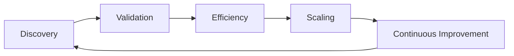
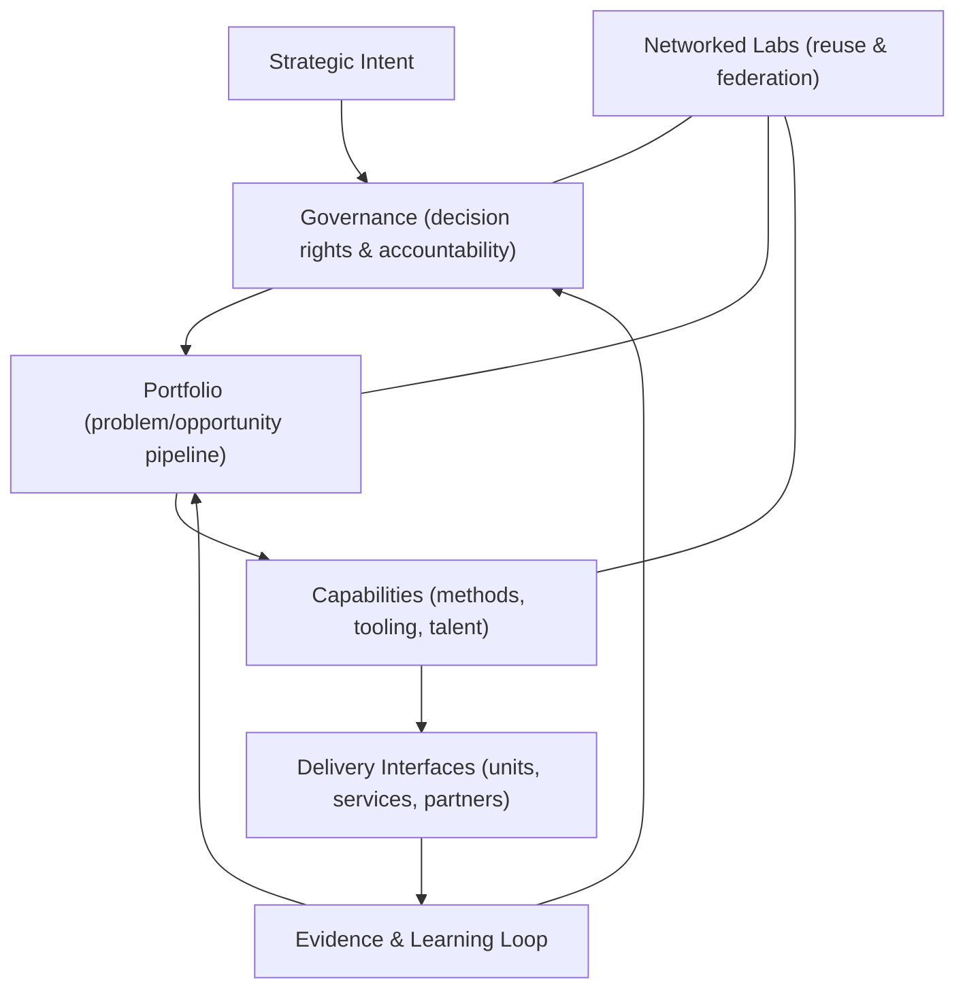

import CaseVignetteCard from "@site/src/components/CaseVignetteCard/CaseVignetteCard";

## Setting Up an Innovation Lab using The MicroCanvas Framework (MCF 2.2)

Setting up an Innovation Lab using the MicroCanvas Framework (MCF 2.2) involves systematically integrating structured innovation management with organizational strategy and operational efficiency. We can break this process down into the following steps:

In practice, this means sequencing decisions across evidence gates, resourcing, and governance checkpoints.

### MCF 2.2 Operating Loop (Lab Level)

:::note[Decision gates]
Decision support: determine whether evidence is sufficient to move from one phase to the next.
:::

1. **Discovery**
   - **Output artifact:** Problem framing brief.
   - **Decision gate:** Go / Review / No-Go.
   - **Primary risks:** Mis-specified problem or weak stakeholder alignment.
   - **Minimum evidence required:** Verified user pain points and baseline metrics.

2. **Validation**
   - **Output artifact:** Experiment results memo.
   - **Decision gate:** Go / Review / No-Go.
   - **Primary risks:** Confirmation bias and weak sample quality.
   - **Minimum evidence required:** Test outcomes with defined success thresholds.

3. **Efficiency**
   - **Output artifact:** Process optimization plan.
   - **Decision gate:** Go / Review / No-Go.
   - **Primary risks:** Cost overruns and operational bottlenecks.
   - **Minimum evidence required:** Cost and cycle-time comparisons.

4. **Scaling**
   - **Output artifact:** Scale readiness assessment.
   - **Decision gate:** Go / Review / No-Go.
   - **Primary risks:** Unstable delivery capacity or governance gaps.
   - **Minimum evidence required:** Replication results and capacity plan.

5. **Continuous Improvement**
   - **Output artifact:** Learning and iteration backlog.
   - **Decision gate:** Go / Review / No-Go.
   - **Primary risks:** Stagnation or drift from strategic outcomes.
   - **Minimum evidence required:** Performance trends and post-implementation reviews.

### Micro-sprints (Cadence That Sustains Output)

- **2-week sprints:** Use when problem scope is narrow and evidence is fast to collect.
- **4-week sprints:** Use when coordination or data collection requires longer cycles.
- **Sprint agenda:** Intake → Hypothesis → Build/Measure → Review → Next decision.
- **Anti-patterns:** Endless discovery, demo theater, backlog bloat.

The Vigía Innovation Lab Framework (VILF) provides a structural model for designing and governing innovation labs and lab networks as long-lived institutional systems.

- Governance
- Portfolio logic
- Capability reuse
- Networked labs

The following diagram summarizes the lab as a governed system with reusable capabilities and an evidence loop.

**Diagram — VILF: Innovation Lab as a System**

- Ask, "What problem does this lab solve?" Use the "Problem Analysis" MCF 2.2 process to determine the central problem the lab will tackle and develop a deeper understanding of its causes and effects. Identify who has this problem and which stakeholders are interested in resolving it. This analysis paves the way for a better understanding of the lab's potential customers, potential solution alternatives, and, more importantly, the lab's Purpose.

- **Define the Strategic Alignment**: align the lab's goals with the organization's broader strategic objectives. Use the "Objectives and Key Results" MCF 2.2 process to transform the effects of the main problem into objectives that you can adequately measure through OKRs. By defining the strategic alignment, you can determine if you are progressing toward achieving the lab's strategic goals. This alignment will support that the lab's initiatives are relevant and contribute meaningfully to the company's overall mission and vision.

- **Analyze potential alternatives**: Explore which solutions you can develop to achieve the lab's strategic goals and mitigate the main problem's effects on the target customers. We suggest using the "Solution Alternative Analysis" MCF 2.2 processes to explore potential alternatives quickly.

- **Consider your transformative Purpose**: a transformative purpose, the highest achievable vision for the lab, will guide the efforts and serve as a "guiding star" that will help the lab focus on achieving its objectives without distraction. Using the "Transformative Purpose" MCF 2.2 process will allow you to envision the highest Purpose the lab will focus on.

- **Formulate the Team Structure**: Assemble a multidisciplinary team that brings diverse skills and perspectives to the lab. This team should include a mix of creative thinkers, industry experts, and operational staff who can drive projects from ideation to implementation. The lab's leadership should inspire a culture of innovation and manage the balance between creative exploration and strategic focus. The "Team Structure" process in MCF 2.2 can help you determine the right team structure and dynamic that aligns with the lab's objectives.

- **Establish the Infrastructure**: Design a physical or virtual space that fosters creativity and collaboration. Equip the lab with the necessary tools, technologies, and resources to support experimentation and innovation. This space should also be adaptable to accommodate different projects and workflows.

- **Implement MCF 2.2 Processes**: Integrate the MicroCanvas Framework (MCF 2.2) into the lab's operations. To achieve this, you must define transparent processes for each phase of the innovation lifecycle: Discovery, Validation, Efficiency, Scaling, and Continuous Improvement. Manage each phase using MCF 2.2 tools and techniques to support the systematic progression of ideas. The Operations, User Stories, Sales, Marketing and Engagement, and Customer Experience and Loyalty will be very useful in guiding you in implementing these processes.

- **Develop Governance and Metrics**: Establish governance structures to oversee the lab's activities and support alignment with the company's policies and ethical standards. Also, metrics and KPIs should be defined to measure the performance and impact of the lab's innovations. These metrics should reflect the lab's strategic goals and guide decision-making processes. We suggest using the Key Growth Metric and Key Impact Metrics MCF 2.2 processes to develop and monitor these metrics.

- **Launch Pilot Projects**: Initiate pilot projects to test the lab's setup and processes. These projects serve as a practical way to refine the lab's innovation approach and identify improvement areas. Learning from these initial projects is relevant for scaling the lab's operations. As previously suggested, it is commonly required to follow each step in the innovation lifecycle to support that each new product, service, or business model is validated correctly before moving into the next stage, thus reducing the waste of resources.

- **Foster a Culture of Continuous Learning**: Encourage ongoing learning and adaptation based on feedback and results from initial projects. Continuous learning should be ingrained in the lab's culture, promoting an iterative approach to innovation and constantly refining strategies and processes. Business Model Validation, Socio-Cultural Context, Key Partners, Customer Analysis, Risk Analysis, and Management MCF 2.2 processes are fundamental to learning what is working and what is not continuously and, from there, deriving potential new iterations of the lab's execution.

### Infrastructure Requirements

Setting up an Innovation Lab typically requires careful infrastructure planning to create an environment conducive to creativity and innovation. This environment should encompass physical or virtual spaces and the necessary technological and operational support systems. The physical layout of an Innovation Lab should foster collaboration and flexibility.

It should feature modular furniture, ample whiteboard space for brainstorming, and areas designated for both quiet thinking and collaborative work, encouraging interaction and the free flow of ideas among team members. *(*Kelley & Kelley, 2013*)*.

Access to suitable technology is commonly required, including high-speed internet, software tools for design and development, and hardware for prototyping and testing. Access to cloud computing resources and specialized tools like 3D printers and VR equipment can support the innovation process. *(*Hagel, Brown, & Davison, 2010*)*.

Robust operational support is also commonly required, including administrative, legal, and technical assistance to streamline processes, manage intellectual property issues, and support compliance with relevant regulations. *(*Tidd & Bessant, 2018*)*.

Reliable communication tools are crucial for connecting team members within the lab and with external partners, incorporating technology like video conferencing, project management software, and digital collaboration platforms. *(*Friedman, 2007*)*.

Finally, strong security measures protect sensitive information and intellectual property, including secure data storage solutions, network security systems, and protocols for handling confidential materials. *(*Schneier, 2004*)*.

An Innovation Lab can provide a supportive environment that is well-equipped to nurture innovations and adapt to future challenges and opportunities in the technology and business landscape, as long as you consider this during the Discovery and Validation stages for the lab's initial implementation.

### Staffing and Team Structure

- **Corporate Innovation Labs**: **Staffing and team structure:** Corporate innovation labs typically employ a mix of internal company talent and external experts to drive innovation. The team often includes R&D specialists, product developers, project managers, and UX/UI designers who collaborate closely with business units.

- **University-Affiliated Innovation Labs**: **Staffing and team structure:** These labs often employ academic researchers, students, and industry professionals who collaborate on research-driven projects. The team structure typically emphasizes interdisciplinary collaboration.

- **Government Innovation Labs**: **Staffing and team structure:** Government labs usually staff policy makers, subject matter experts in public administration, and technologists. They focus on public sector innovation to improve services and policy outcomes.

- **Independent Innovation Labs**: **Staffing and team structure:** Independent labs typically operate with a flexible staffing model that can include freelancers, industry experts, and academic partners. This structure allows for a dynamic team that adapts to project needs.

- **Community Innovation Labs**: **Staffing and team structure:** Local community members, social entrepreneurs, and volunteers who bring grassroots knowledge and insights often staff community labs. They emphasize local engagement and solutions tailored to community needs.

Each type of innovation lab requires a tailored approach to team structure and staffing, leveraging diverse skills and backgrounds to meet specific innovation goals. This strategic alignment of team composition supports the labs in addressing the unique challenges they aim to solve, whether in the corporate, academic, government, community, or independent sectors.

<CaseVignetteCard
  title="Corporate lab staffing mix"
  context="A corporate innovation lab needed deep technical and delivery skills."
  intervention="Senior engineers, data scientists, and product managers were staffed alongside business unit leads."
  outcome="Cross-functional staffing supported prototype delivery and integration."
  lesson="Mixed internal and external roles can support corporate lab delivery."
  source={<>Chesbrough, 2006</>}
/>

<CaseVignetteCard
  title="University lab staffing"
  context="A university-affiliated lab operated across academic and industry domains."
  intervention="Faculty, graduate researchers, and industry consultants collaborated on research-driven projects."
  outcome="Interdisciplinary staffing supported applied research delivery."
  lesson="Academic-industry teams can support research-driven lab missions."
  source={<>Etzkowitz & Leydesdorff, 2000</>}
/>

<CaseVignetteCard
  title="Government lab staffing"
  context="A government innovation lab focused on service delivery in healthcare."
  intervention="Policy analysts, public health experts, and technologists were staffed together."
  outcome="Service design and delivery alignment improved."
  lesson="Public-sector labs benefit from policy and technical staffing alignment."
  source={<>Mulgan, 2014</>}
/>

<CaseVignetteCard
  title="Independent lab staffing"
  context="An independent lab worked on environmental technology programs."
  intervention="Project-based environmental scientists joined permanent commercialization staff."
  outcome="Technical research and commercialization planning were paired."
  lesson="Flexible staffing can support independent lab adaptability."
  source={<>Westley & Antadze, 2010</>}
/>

<CaseVignetteCard
  title="Community lab staffing"
  context="A community lab addressed urban food access challenges."
  intervention="Local farmers, urban planners, and community organizers staffed the lab."
  outcome="Community needs informed project selection and delivery."
  lesson="Community staffing can align lab work with local needs."
  source={<>Moore & Westley, 2011</>}
/>

We suggest using the previously mentioned Team Structure process to create an initial team structure aligned with the lab's objectives and transformative purpose. During the first three stages of the lab's lifecycle (Discovery, Validation, and Efficiency), the team structure will likely change as the lab learns how to operate efficiently. The lab might also consider outsourcing some of its core functions (sales and marketing, finance and accounting, IT, and other support functions, including coaching and mentoring) as it develops a viable business model until it reaches a maturity level that allows for permanent staffing.

### Operational Model

The operational model of an Innovation Lab outlines the methods and processes that guide how the lab functions on a day-to-day basis. This model typically incorporates aspects of project management, resource allocation, workflow design, and performance metrics, ensuring efficient project management and alignment with the organization's strategic objectives.

- **Project Management**: An effective operational model establishes clear project management protocols, which help organize, plan, and execute innovation projects from inception through completion.

- **Resource Allocation**: The model should actively define how to allocate resources to support various projects. Examples of resources include budgeting for materials, technology, and human resources and determining how to prioritize these resources across competing projects.

- **Workflow Design**: The operational model should streamline workflows, integrating new tools and technologies that enhance collaboration and efficiency.

- **Performance Metrics**: It is relevant to establish performance metrics to track the progress and impact of innovation initiatives. These metrics can include innovation outputs, such as patents filed or products launched, and outcomes, such as market share gains or revenue growth.

With a robust operational model that includes project management protocols, resource allocation, workflows, and performance indicators, Innovation Labs can enhance their efficiency and effectiveness while contributing to organizational innovation goals.

<CaseVignetteCard
  title="Agile lab cadence"
  context="A lab needed faster iteration cycles across projects."
  intervention="Agile project management practices were adopted in the operating model."
  outcome="Iteration cadence improved and project flow became more predictable."
  lesson="Agile practices can support iteration cadence in lab operations."
  source={<>Sutherland, 2014</>}
/>

<CaseVignetteCard
  title="Tiered funding discipline"
  context="A lab portfolio required differentiated funding levels."
  intervention="A tiered funding model prioritized resources by strategic value."
  outcome="Funding decisions aligned with portfolio tiers and evidence gates."
  lesson="Tiered funding can support resource allocation discipline."
  source={<>Kaplan, 2012</>}
/>

<CaseVignetteCard
  title="Collaboration platform workflows"
  context="Distributed teams needed shared workflows and coordination."
  intervention="Collaboration platforms were integrated into the workflow design."
  outcome="Remote coordination improved and workflows became more consistent."
  lesson="Collaboration platforms can support workflow consistency."
  source={<>O'Reilly & Tushman, 2016</>}
/>

<CaseVignetteCard
  title="Balanced scorecard tracking"
  context="Leadership needed consistent performance visibility across projects."
  intervention="Balanced scorecard metrics were applied to innovation outputs and outcomes."
  outcome="Performance reporting became consistent across financial and non-financial indicators."
  lesson="Balanced scorecards can support multi-dimensional performance tracking."
  source={<>Kaplan & Norton, 1996</>}
/>

### Integrating MCF 2.2 Processes into the Innovation Lab's project lifecycle

Integrating the MicroCanvas Framework (MCF 2.2) processes into the project lifecycle of an Innovation Lab enhances strategic alignment and operational efficiency across all phases of innovation. Conceptualizing, creating a lab pilot, stabilizing the lab, and then scaling it is a project within a project, as the lab runs the framework for organizing itself while following the same process for the innovation projects themselves.

Here's a detailed breakdown of how each phase of the innovation lifecycle incorporates specific MCF 2.2 processes:

#### Discovery Phase

- Customer Analysis and Problem Analysis identify the target market's needs and challenges and define the core problem the innovation aims to solve. It will also allow you to gauge how big of a market opportunity the lab will focus on, helping determine the potential impact or commercial viability of the lab.

- Objectives and Key Results (OKR) help set measurable goals that align with the lab's strategic aims.

- Transformative Purpose clarifies the broader impact the project aims to achieve, ensuring that the innovation aligns with the lab's mission and values.

- Solution Alternatives, Unique Advantages, and Product Features explore different ways to address the identified problems, including distinguishing characteristics that could give the product a competitive edge while aligning said features with the specific needs or challenges of the target market.

- Team Structure supports the right mix of skills and experience being available to tackle innovation projects effectively.

- Business Model Validation assesses the feasibility and sustainability of the proposed business model from the outset.

#### Validation Phase

- User Stories and Key Growth Metrics need development to capture the end-user experience and measure the project's progress toward its growth objectives.

- Key Impact Metrics track the social or economic impact of the innovation.

- Sales, Marketing and Engagement, and Customer Experience and Loyalty processes help understand market dynamics and refine go-to-market strategies.

- Business Model Validation continues as more data becomes available and you assess initial market reactions.

#### Efficiency Phase

- External Stakeholders, Operations, and External System Integrations focus on improving operational efficiency and integrating innovation within larger systems.

- Product Architecture, Risks, Regulatory Constraints, and Legal Compliance and Strategy ensure the product meets industry standards and legal requirements.

- Cost and Revenue Structure and Financial Analysis dive into the project's financial viability while ensuring sustainability for the innovation project.

- Business Model Validation continues adding value as financial realities become clearer and require possible adjustments. At this phase, the innovation project might require extensive resources, which require strong evidence of project viability.

#### Scaling Phase

- Accelerated Growth Attributes identify factors that can significantly speed up the scaling process.

- Key Partners and Delivery Channels are often required for expanding market access and distribution.

- Socio-Cultural Context supports the product remaining relevant across different markets.

- Future Disruptions in the context of the innovation project will require preparing for long-term sustainability and adaptability in a changing environment.

Applying these MCF 2.2 processes throughout the innovation lifecycle can improve the likelihood of success and help projects remain strategically aligned and ready to meet market demands.

### Measuring Success: Metrics and KPIs to evaluate the impact and success of Innovation Labs.

Measuring the success of Innovation Labs is relevant for determining impact and effectiveness, requiring the establishment of metrics and key performance indicators (KPIs) that provide concrete data to assess performance.

Here's how you can effectively measure the success of Innovation Labs:

- **Innovation Output Metrics**: The number of prototypes developed, patents filed, or new products launched helps quantify the direct outputs of the innovation activities within the lab. *(*Davila et al., 2006*)*.

- **Financial Metrics**: Return on Investment (ROI), revenue growth from new products, and cost savings from process improvements assess the economic impact of the innovations developed within the lab. *(*Moore, 1991*)*.

- **Market Impact Metrics**: Market share changes, customer acquisition rates, and customer engagement metrics gauge how effectively new products or services capture customer interest. *(*Moore, 1991*)*.

- **Operational Efficiency Metrics**: Reduction in time to market, improvement in production uptime, and efficiency in resource utilization evaluate how innovations within the lab enhance operational processes. *(*Hammer, 2001*)*.

- **Employee Engagement and Culture Change Metrics**: Employee satisfaction scores, rates of internal idea submission, and participation rates in innovation-related activities help understand the internal cultural impact of the Innovation Lab. *(*Amabile & Kramer, 2011*)*.

- **Learning and Growth Metrics**: Skills development levels, learning outcomes from failed projects, and knowledge dissemination across the organization reflect the Innovation Lab's role in knowledge creation and capability building. *(*Nonaka & Takeuchi, 1995*)*.

Using these metrics and KPIs allows organizations to evaluate the success of their Innovation Labs comprehensively and align innovation work with broader strategic objectives.

<CaseVignetteCard
  title="Heilmeier gate design"
  context="Labs needed a consistent way to define decision gates and evidence thresholds."
  intervention="Structured questions from the Heilmeier Catechism were used to frame gates."
  outcome="Decision gates and evidence needs were clarified before scaling."
  lesson="Structured questions can support evidence-based gate design."
  source={<>
    DARPA (n.d.).{" "}
    <a
      href="https://www.darpa.mil/about/heilmeier-catechism"
      target="_blank"
      rel="noopener noreferrer"
    >
      The Heilmeier Catechism
    </a>
  </>}
/>
