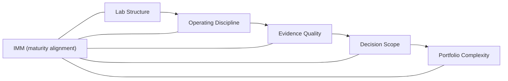

import CaseVignetteCard from "@site/src/components/CaseVignetteCard/CaseVignetteCard";

## Innovation Labs and Maturity: The Role of the Innovation Maturity Model (IMM)

The Innovation Maturity Model (IMM) is a capability progression model used to help explain why innovation labs stall, fragment, or scale. It frames how institutional readiness shapes the outcomes labs can realistically deliver over time.

In practice, this means maturity assessments should influence resourcing, governance load, and portfolio scope.

#### IMM Snapshot (Example)

| IMM Pillar | Early-stage signals | Mature signals | Metric | Typical intervention |
| --- | --- | --- | --- | --- |
| Governance clarity | Roles and decision rights unclear | Decision rights documented and enforced | Decision turnaround time | Update decision matrix |
| Evidence discipline | Ad hoc experiments | Standardized experiment templates | Hypothesis validation rate | Evidence templates and review |
| Portfolio logic | Opportunistic intake | Prioritized portfolio tiers | Portfolio balance ratio | Intake rubric and cadence |
| Capability reuse | One-off tooling | Reusable toolkits and playbooks | Reuse rate | Shared methods library |
| Talent readiness | Skill gaps by role | Cross-functional skill coverage | Role coverage index | Training and staffing plan |
| Delivery alignment | Weak handoffs | Formal delivery agreements | Adoption rate | Joint delivery governance |

:::note[Decision gates]
Decision support: align governance load, portfolio scope, and resource model to the assessed maturity level.
:::

Maturity-based resourcing rule: staffing, tooling, and governance should scale with demonstrated maturity rather than ambition. Use evidence thresholds and decision-cycle metrics to prevent premature scaling, such as decision turnaround time and hypothesis validation rate.

:::tip[Definition]
**Innovation accounting**: A measurement discipline that tracks evidence, learning velocity, and decision quality across the portfolio.
:::

The following diagram shows how maturity alignment influences lab structure, evidence practices, and decision scope.

**Diagram — IMM Overlay on Innovation Labs**

Labs are often more effective when designed for their maturity level rather than an aspirational end state. Tooling without maturity alignment can increase risk by creating process debt and fragile operating expectations.

<CaseVignetteCard
  title="Maturity-based resourcing"
  context="An innovation maturity program aligned capability growth to evidence thresholds."
  intervention="Maturity assessments were tied to resourcing decisions."
  outcome="Capability growth followed evidence thresholds rather than ambition alone."
  lesson="Maturity-aligned resourcing can reduce premature scaling risks."
  source={<>
    Doulab (n.d.).{" "}
    <a
      href="https://doulab.net/services/innovation-maturity"
      target="_blank"
      rel="noopener noreferrer"
    >
      Innovation Maturity Model program
    </a>
  </>}
/>

**Decision implication:** Maturity assessment should determine governance load and resourcing before expanding portfolio scope.
