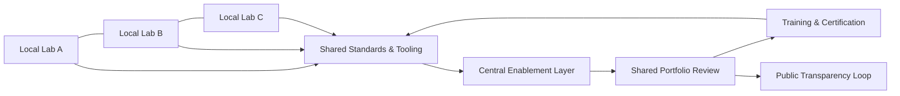

import CaseVignetteCard from "@site/src/components/CaseVignetteCard/CaseVignetteCard";

## Beyond the Innovation Lab: National Networks

National networks can coordinate multiple labs under shared standards, governance, and evidence practices. VILF can be central here by describing how multiple labs operate as a system rather than standalone projects.

In practice, this means shared intake criteria, evidence standards, and cross-lab portfolio review.

:::tip[Definition]
**Network enablement**: The shared standards, training, tooling, and governance that allow labs to operate consistently across institutions.
:::

National Innovation Lab Networks constitute strategic collaborations designed to amplify a nation's innovative capacity by interlinking diverse local and regional labs into an expansive network. These networks enable a coherent, nationwide strategy for research and development across various sectors by leveraging the unique strengths of different regions and institutions, thereby fostering broad-based national innovation.

Operationally, this shows up as coordination layers that balance local specialization with national priorities.

The premise behind National Innovation Lab Networks is that collaborative problem-solving and shared resources yield more efficient and impactful outcomes than isolated efforts. By integrating labs across geographical and institutional divides, these networks cultivate an innovation-rich environment that optimizes resource utilization and facilitates the exchange of knowledge, ideas, and technologies.

Such integration not only enhances resource efficiency but also promotes the exchange of knowledge and technologies across various sectors. These networks typically encompass a variety of stakeholders, including government entities, academic institutions, the private sector, and non-profits, all collaborating on a unified agenda to address national challenges like healthcare, energy sustainability, and technological advancement through innovation. *(*Etzkowitz & Leydesdorff, 2000*)*.

Each lab within the network may focus on specialized research areas, but their coordinated efforts contribute to overarching national objectives. The strategic value of National Innovation Lab Networks is that they mobilize the full spectrum of a country's innovative potential. *(*Porter, 1998*)*.

By encouraging cross-sectoral collaboration, these networks can drive scientific and technological advancements that support national competitiveness and economic growth. *(*Chesbrough, 2006*)*.

### Why networks fail (coordination + governance)

Networks often fail when coordination costs exceed shared benefits, or when decision rights are unclear across institutions. Common breakdowns include fragmented intake, inconsistent evidence standards, and weak portfolio arbitration *(*OECD OPSI, 2023*)*.

### Minimal viable network (MVN) design

- **Shared intake rubric:** One intake standard for all labs.
- **Minimum evidence standard:** A common template for experiments and decision gates.
- **Cross-lab portfolio review:** Quarterly governance forum for allocation decisions.
- **Enablement unit:** A small central team that maintains tools, training, and cadence.

### Network governance primitives

- **Decision rights matrix:** Defines who can approve, pause, or terminate initiatives.
- **Portfolio tiers:** Separates exploration, validation, and scaling across labs.
- **Common evidence log:** Ensures cross-institution learning is visible.
- **Peer review protocol:** Builds trust in results and avoids duplicate efforts.

### Evidence and learning loops across institutions

Evidence often needs to travel across labs rather than stay local. Shared review cycles, comparable metrics, and standardized documentation allow networks to reuse insights and avoid redundant experimentation. This is where VILF supports durable coordination over time.

### Diagram: From Single Lab → Multi-Lab Network (VILF)

:::note[Decision gates]
Decision support: clarify which governance layer owns portfolio review, capability reuse, and shared standards.
:::

### Case vignette: RedLab (Dominican Republic) - From Lab Design to Network Enablement

**Publicly documented facts:** RedLab is a national network of public innovation labs with published governance and program details in the [Doulab case study](https://doulab.net/case-studies/ogtic-redlab) and public launch coverage in [El Caribe](https://www.elcaribe.com.do/panorama/ogtic-lanza-la-red-de-laboratorios-de-innovacion-redlab/) *(*Doulab, n.d.; El Caribe, 2023*)*.

**Practitioner note (non-public detail):** Some enablement practices described in workshops are not publicly documented and are noted here only in general terms.

- **Design elements that enabled scaling:** Shared language, governance cadence, cohort structure, enablement layer, and evidence handoffs.
- **Transferable lessons for other countries:** Start small, align incentives, standardize evidence, make governance explicit, and invest in enablement.
- **What to measure in year 1:** Cohort throughput, evidence quality, adoption rate, reuse rate, and decision cycle time.

### Objectives of National Innovation Lab Networks

National Innovation Lab Networks require implementation with several strategic objectives: enhancing a nation's innovation capabilities and fostering economic growth through systemic collaboration and resource optimization.

- **Maximize resource utilization and alignment**: Align local and regional innovation efforts with national priorities to streamline research and development activities and reduce duplicative investment. *(*Etzkowitz & Leydesdorff, 2000*)*.

- **Stimulate economic development and commercialization**: Drive innovation to produce new technologies, products, and services by connecting academic institutions with industry leaders who can bring innovations to market. *(*Porter, 1998*)*.

- **Enhance global competitiveness and partnerships**: Build a robust innovation ecosystem that positions the country as a leader in key technological areas, attracting foreign investment and international collaborations. *(*Chesbrough, 2006*)*.

- **Sustain a responsive innovation ecosystem**: Foster ongoing collaboration among universities, government, and industry to keep the innovation pipeline responsive to current and future needs. This sustainability emphasis helps keep investments in innovation producing long-term benefits. *(*Nonaka & Takeuchi, 1995*)*.

<CaseVignetteCard
  title="Rural labs food security"
  context="Distributed rural labs focused on agricultural research in regions with distinct needs."
  intervention="A national network aligned local agricultural research to a shared food security agenda."
  outcome="Research pipelines were coordinated across labs to reduce duplication and focus on shared priorities."
  lesson="Alignment mechanisms help convert localized research into national innovation capacity."
  source={<>Etzkowitz & Leydesdorff, 2000</>}
/>

<CaseVignetteCard
  title="Renewable energy commercialization"
  context="A national innovation agenda prioritized renewable energy commercialization."
  intervention="Universities and energy firms coordinated through a lab network to develop and test technologies."
  outcome="Joint projects supported the path from research to market-ready pilots."
  lesson="Cross-sector coordination can shorten the path from discovery to commercialization."
  source={<>Porter, 1998</>}
/>

<CaseVignetteCard
  title="Biotech cluster scaling"
  context="A country sought to build international competitiveness in biotechnology."
  intervention="A national network concentrated funding and talent to support biotech hubs and shared infrastructure."
  outcome="The network supported cluster visibility and attracted partner interest."
  lesson="Concentrated capability development can raise global visibility when governance supports it."
  source={<>Chesbrough, 2006</>}
/>

### Structure of National Innovation Lab Networks

The structure of National Innovation Lab Networks facilitates collaboration across various sectors and disciplines, optimizing resource allocation and fostering innovation at a national scale. This structure typically involves multiple layers of coordination and integration, each playing a pivotal role in streamlining the innovation process across different regions and sectors.

- **Central Coordination Body**: At the core of National Innovation Lab Networks is a central coordination body responsible for overseeing the entire network's activities. This body sets strategic directions, allocates resources, and monitors progress across all labs within the network. *(*Chesbrough, 2006*)*.

- **Regional Innovation Hubs**: The network structure often includes regional innovation hubs that focus on specific areas of expertise relevant to their geographic or economic context. These hubs act as innovation nodes, specializing in technologies or industries vital to their regional economy. *(*Etzkowitz & Leydesdorff, 2000*)*.

- **Cross-Sector Collaboration Platforms**: The network structure includes platforms where industry, academia, and government representatives can discuss challenges, share knowledge, and develop joint projects. These platforms integrate diverse perspectives and expertise to address complex, multifaceted problems. *(*Porter, 1998*)*.

- **Support Services and Shared Resources**: National Innovation Lab Networks often provide support services and shared resources to enhance labs' capabilities nationwide. These include access to advanced research facilities, legal and commercial expertise, and funding opportunities. *(*Nonaka & Takeuchi, 1995*)*.

<CaseVignetteCard
  title="Central coordination agency"
  context="Multiple sectors required coordination under a national economic plan."
  intervention="A central agency coordinated research priorities across labs."
  outcome="Resource allocation decisions became more consistent across sectors."
  lesson="Central coordination clarifies priority trade-offs when multiple labs compete for resources."
  source={<>Chesbrough, 2006</>}
/>

<CaseVignetteCard
  title="Marine biotech regional hubs"
  context="A coastal region built specialization in marine biotechnology."
  intervention="Regional hubs aligned with local universities and industry partners."
  outcome="Domain expertise deepened and knowledge sharing improved across regions."
  lesson="Regional hubs can focus specialization while staying connected to national standards."
  source={<>Etzkowitz & Leydesdorff, 2000</>}
/>

<CaseVignetteCard
  title="Cross-border collaboration platforms"
  context="Cross-border innovation required shared platforms for collaboration."
  intervention="A multi-country network established joint forums and shared project pipelines."
  outcome="Joint initiatives were launched across sectors and geographies."
  lesson="Collaboration platforms reduce friction in multi-institution innovation."
  source={<>Porter, 1998</>}
/>

<CaseVignetteCard
  title="Shared commercialization services"
  context="Labs needed shared commercialization services without duplicating investment."
  intervention="A network offered shared access to legal, patent, and market advisory services."
  outcome="Labs reduced time-to-market and improved access to specialized expertise."
  lesson="Shared services can reduce costs while raising baseline capability."
  source={<>Nonaka & Takeuchi, 1995</>}
/>

This structured approach enables National Innovation Lab Networks to operate efficiently and effectively, maximizing the impact of their collective efforts and ensuring that innovations developed within the network can significantly contribute to national development goals.

### Key Components of Successful Networks

Successful National Innovation Lab Networks depend on several components that support their effectiveness in fostering widespread innovation nationwide. These components structure the networks to maximize collaboration, leverage resources efficiently, and drive impactful outcomes.

Expand for key network components

- **Strategic Leadership and Governance**: Strong leadership sets the network's vision, direction, and priorities. An effective governance structure supports strategic decisions that align with national innovation goals and maintains accountability at all levels.

- **Integrated Communication Systems**: Seamless communication across the network supports sharing knowledge, ideas, and resources. This includes technological infrastructure for virtual collaboration and protocols for regular updates and feedback across different labs.

- **Diverse Funding Sources**: The sustainability of the innovation labs often hinges on diverse and robust funding mechanisms. This can include government funding, private-sector investment, and international grants.

- **Adaptable Operational Models**: Adapting operational models as needed allows labs to respond to emerging challenges and opportunities. This agility supports network relevance and effectiveness over time, particularly in rapidly changing technological and market environments.

- **Strong Industry and Academic Partnerships**: Collaborations with universities and industry leaders enrich the labs with research and market insights. These partnerships enhance the quality of innovation and aid in the commercialization and practical application of research outputs.

- **Clear Metrics for Success**: Establishing and monitoring clear success metrics helps evaluate the network's activities and make data-driven decisions. These metrics should align with the network's strategic goals and the nation's broader economic or societal goals.

- **Talent Development Programs**: Investing in talent development supports a continuous influx of skilled individuals who can drive innovation. This includes recruiting talent and providing ongoing training and development programs to keep skills relevant.

- **Policy and Regulatory Support**: Supportive policies and regulations are vital for nurturing innovation. This might involve streamlining intellectual property processes, providing tax incentives for research and development, or reducing bureaucratic hurdles for new projects.

- **Cultural Emphasis on Innovation**: Cultivating a national culture that values and supports innovation enhances the effectiveness of these networks. This involves public awareness campaigns, educational programs, and community engagement initiatives highlighting innovation's importance in national development.

These components, when integrated effectively, create a robust framework that supports the success and sustainability of National Innovation Lab Networks. By focusing on these core elements, countries can harness the full potential of their regional and national resources, driving significant advancements in innovation.

### Challenges and Solutions

Establishing and maintaining a successful National Innovation Lab Network involves navigating various challenges, each requiring strategic solutions to support the network's effectiveness and sustainability.

- **Coordinating diverse entities**: Enhance coordination across the diverse entities involved in the network by implementing centralized management tools and communication platforms. Regular inter-lab meetings and standardized reporting procedures help maintain alignment and foster unity among members.

- **Sustaining funding stability**: Build a multifaceted funding strategy that includes government grants, private-sector partnerships, and international funding. Advocacy for steady governmental support, coupled with evidence of economic and societal value, supports stability.

- **Balancing national objectives with local autonomy**: Define clear national objectives while allowing local labs flexibility to tailor projects to regional needs.

- **Managing intellectual property**: Develop a robust framework for managing intellectual property that protects inventors' rights while facilitating innovation commercialization.

- **Staying technologically current**: Maintain technological relevance through continuous professional development and partnerships with technology providers.

- **Measuring impact consistently**: Implement comprehensive metrics that accurately reflect the network's impact on both innovation outcomes and broader societal and economic indicators.

<CaseVignetteCard
  title="Network dashboard visibility"
  context="Network coordination required visibility across multiple labs."
  intervention="A shared dashboard tracked projects and decisions across labs."
  outcome="Decision-making cadence improved through shared visibility."
  lesson="Shared visibility tools can support coordination across entities."
  source={<>Chesbrough, 2006 (Practitioner observation aligned with cited context)</>}
/>

<CaseVignetteCard
  title="Matching funds stability"
  context="Multi-lab programs needed stable funding to sustain operations."
  intervention="Matching funds combined public and private investment."
  outcome="Funding stability improved through shared incentives."
  lesson="Matching funds can improve funding stability in networks."
  source={<>Etzkowitz & Leydesdorff, 2000</>}
/>

<CaseVignetteCard
  title="Tiered governance alignment"
  context="National objectives and local priorities needed alignment."
  intervention="A tiered governance model set national direction with local discretion."
  outcome="Local labs retained flexibility while aligning to national priorities."
  lesson="Tiered governance can balance national objectives and local autonomy."
  source={<>Etzkowitz & Leydesdorff, 2000</>}
/>

<CaseVignetteCard
  title="Centralized IP management"
  context="Network IP ownership required consistent treatment across labs."
  intervention="A centralized IP office managed filings, licensing, and revenue terms."
  outcome="IP decisions followed shared standards across institutions."
  lesson="Centralized IP management can reduce fragmentation in networks."
  source={<>Etzkowitz & Leydesdorff, 2000</>}
/>

<CaseVignetteCard
  title="Technology audit cadence"
  context="Technology capability in labs risked lagging behind market change."
  intervention="Regular technology audits paired with targeted equipment upgrades."
  outcome="Labs maintained up-to-date tools and practices."
  lesson="Periodic audits can maintain technological relevance."
  source={<>Kline & Rosenberg, 1986</>}
/>

<CaseVignetteCard
  title="Standardized impact metrics"
  context="Network impact was difficult to compare across institutions."
  intervention="Standardized impact assessment tools were adopted."
  outcome="Impact reporting became more comparable and consistent."
  lesson="Common metrics can improve impact reporting consistency."
  source={<>Freeman, 1987</>}
/>

### Future Trends and Opportunities

As National Innovation Lab Networks continue to evolve, several future trends and opportunities are emerging that could shape their impact and effectiveness. These developments offer possibilities for enhancing innovation capabilities and addressing broader societal challenges.

- **Increased Integration of Artificial Intelligence (AI)**: Artificial Intelligence can enhance the ability to process data and generate insights at scale.

- **Focus on Sustainable Innovations**: There is a growing emphasis on developing innovations that drive economic growth and address environmental and social sustainability.

- **Expansion of Global Collaboration Networks**: As challenges such as climate change and pandemics transcend national borders, there is a significant opportunity to expand collaboration beyond national boundaries.

- **Enhanced Public Engagement and Innovation Literacy**: Future trends suggest increased focus on public engagement and innovation literacy.

<CaseVignetteCard
  title="AI signal scanning"
  context="Networks sought faster signal detection in complex innovation portfolios."
  intervention="AI tools were used to scan emerging technologies and market needs."
  outcome="Portfolio teams identified signals more quickly."
  lesson="AI tooling can support earlier signal detection."
  source={<>Russell & Norvig, 2016</>}
/>

<CaseVignetteCard
  title="Sustainability portfolio shift"
  context="National labs pursued sustainability-aligned innovation priorities."
  intervention="Programs focused on renewable energy and sustainable agriculture."
  outcome="Portfolio focus shifted toward sustainability outcomes."
  lesson="Sustainability priorities can shape innovation portfolios."
  source={<>Elkington, 1997</>}
/>

<CaseVignetteCard
  title="Cross-border lab partnerships"
  context="Cross-border challenges required coordinated responses."
  intervention="Labs partnered with peers abroad on shared problem domains."
  outcome="Collaboration expanded beyond national boundaries."
  lesson="Cross-border partnerships can extend network capacity."
  source={<>Friedman, 2007</>}
/>

<CaseVignetteCard
  title="Public engagement workshops"
  context="Labs sought public input on innovation priorities."
  intervention="Public workshops and early-stage engagement were used."
  outcome="Input informed portfolio choices and increased legitimacy."
  lesson="Early public engagement can inform portfolio direction."
  source={<>Lane, 1999</>}
/>

These developments are often described as reshaping national and international innovation practice over time, with a stronger emphasis on collaboration, intelligence, and sustainability.

<CaseVignetteCard
  title="RedLab public launch"
  context="RedLab launched as a national network of public innovation labs."
  intervention="Governance and shared methods were documented publicly."
  outcome="The launch narrative emphasized shared methods and evidence."
  lesson="Public documentation can clarify how networks coordinate shared methods."
  source={<>
    Doulab (n.d.).{" "}
    <a
      href="https://doulab.net/case-studies/ogtic-redlab"
      target="_blank"
      rel="noopener noreferrer"
    >
      OGTIC RedLab Innovation Network case study
    </a>;{" "}
    El Caribe (2023).{" "}
    <a
      href="https://www.elcaribe.com.do/panorama/ogtic-lanza-la-red-de-laboratorios-de-innovacion-redlab/"
      target="_blank"
      rel="noopener noreferrer"
    >
      OGTIC lanza la Red de Laboratorios de Innovación (RedLab)
    </a>
  </>}
/>
