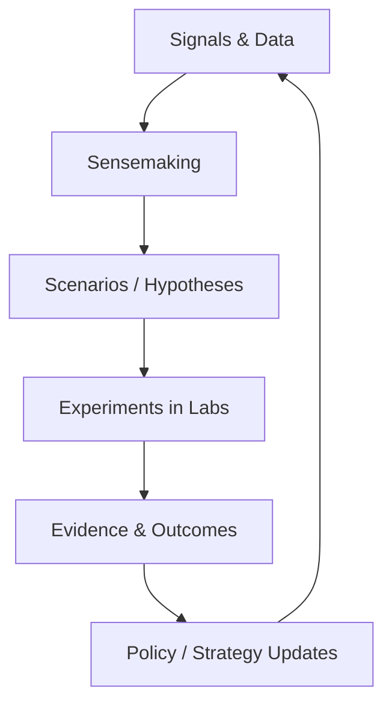

import CaseVignetteCard from "@site/src/components/CaseVignetteCard/CaseVignetteCard";

## Innovation Labs in a World of Uncertainty: Strategic Foresight and Vigía Futura

Innovation labs without foresight can become reactive, responding to external shocks instead of shaping opportunity spaces. Trend monitoring is useful for tracking surface signals, but strategic foresight reframes uncertainty into actionable choices.

Operationally, this shows up as explicit handoffs from foresight outputs into portfolio review and experiment selection.

Vigía Futura is a strategic foresight capability and regional observatory that produces signals, scenarios, and indices to inform portfolio choices over time. Foresight can feed labs; labs can test futures. This interaction can turn uncertainty into a continuous learning loop across strategy, experimentation, and scale.

### The 3 Foresight Outputs Labs Actually Need

- **Scenarios:**
  - **Output artifact:** Scenario set with implications for mission priorities.
  - **Cadence:** Semi-annual refresh.
  - **Owner:** Foresight lead with portfolio governance input.
  - **How it changes portfolio decisions:** Shifts investment toward robust options.
- **Early signals:**
  - **Output artifact:** Signal log with assessed relevance.
  - **Cadence:** Monthly review.
  - **Owner:** Research and intelligence team.
  - **How it changes portfolio decisions:** Triggers exploratory discovery sprints.
- **Capability bets:**
  - **Output artifact:** Capability roadmap with evidence thresholds.
  - **Cadence:** Quarterly update.
  - **Owner:** Lab director and governance committee.
  - **How it changes portfolio decisions:** Protects long-horizon capabilities from short-term bias.

<CaseVignetteCard
  title="Foresight signal linkage"
  context="Public innovation labs sought to link foresight signals to portfolio choices."
  intervention="Practice reviews documented how signals informed portfolio decisions."
  outcome="Foresight inputs were linked to portfolio decisions in public labs."
  lesson="Foresight signals can inform portfolio choice when documented and reviewed."
  source={<>OECD OPSI, 2023</>}
/>

:::note[Decision gates]
Decision support: determine when foresight inputs justify a portfolio shift or new experimentation cycle.
:::

The following diagram shows the closed loop between foresight inputs, experimentation, and strategy updates.

**Diagram — Foresight–Lab Feedback Loop**

<CaseVignetteCard
  title="Foresight practice reviews"
  context="Global practice reviews assessed foresight inputs in public labs."
  intervention="Reviews compared how inputs shaped portfolio choices."
  outcome="Foresight inputs were linked to portfolio choice patterns."
  lesson="Practice reviews can show how foresight inputs shape portfolios."
  source={<>
    OECD OPSI (2023).{" "}
    <a
      href="https://oecd-opsi.org/blog/innovation-labs-through-the-looking-glass/"
      target="_blank"
      rel="noopener noreferrer"
    >
      Innovation labs through the looking glass: Experiences across the globe
    </a>
  </>}
/>

**Common misinterpretation:** Foresight replaces experimentation rather than supplying inputs that labs must test and validate.

## Implementation Checklist (Copy/Paste)

### Day 0–7

- Define the lab charter and publish a one-page brief.
- Assign decision rights and publish a named decision matrix.
- Set intake criteria and release a one-page intake rubric.
- Baseline three outcome metrics and log a baseline table.
- Select two priority problems and document problem briefs.
- Establish a review cadence and publish a 90-day calendar.
- Form a cross-functional core team and list role coverage.
- Set evidence standards and publish an experiment template.

### Day 8–30

- Run two discovery sprints and publish two evidence memos.
- Validate one hypothesis and record a Go / Review / No-Go decision.
- Build a portfolio list and assign each item to a tier.
- Establish a stakeholder map and publish a dependency register.
- Define a learning backlog and log ten prioritized items.
- Launch a pilot and document success thresholds.
- Capture resource utilization and publish a monthly cost summary.
- Conduct a retro and publish a decision improvement log.

### Quarter 2

- Scale one validated pilot and publish a scale readiness brief.
- Complete a portfolio review and issue a written allocation memo.
- Run a cross-lab review and publish shared evidence standards.
- Update maturity assessment and log changes by pillar.
- Train two cohorts and publish certification outcomes.
- Publish a public transparency update with outcome metrics.
- Reduce cycle time by a defined percentage and log the delta.
- Deliver a governance review and publish updated decision rules.

<CaseVignetteCard
  title="National program checklists"
  context="National lab programs used cadence and evidence gates to manage delivery."
  intervention="Checklists and decision gates were documented in program guidance."
  outcome="Cadence and evidence gates were used to manage portfolio flow."
  lesson="Cadenced checklists can support evidence gates in national lab programs."
  source={<>
    Doulab (n.d.).{" "}
    <a
      href="https://doulab.net/case-studies/ogtic-redlab"
      target="_blank"
      rel="noopener noreferrer"
    >
      OGTIC RedLab Innovation Network case study
    </a>
  </>}
/>
