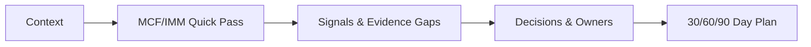
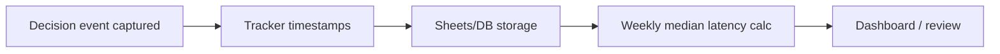

> **TL;DR**: La latencia de decisión es el impuesto oculto sobre la innovación y el valor público. ClarityScan® entrega, en **30–45 minutos**: una línea base compartida, dos señales de prueba, responsables nombrados y un **plan a 30/60/90 días**. Los líderes que ejecutan este ciclo semanalmente reducen la latencia en **~30% en los primeros 30 días** y ven lanzamientos más tempranos, menos escalamientos y mayor confianza.

Reducir la latencia mediana de decisión acorta el camino de la idea de política al servicio en funcionamiento, mejorando los resultados y la confianza.

{/* truncate */}

Aquí va un escenario para ilustrar el problema que estamos resolviendo:

_Un equipo de innovación tiene tres días para presentar ante potenciales inversionistas o ante el EVP. Tienen una presentación, tres opciones para su producto y una ventana de lanzamiento que sigue corriéndose. Todos coinciden en que **se necesita una decisión**, pero el equipo no logra ponerse de acuerdo sobre **qué prueba o evidencia** haría seguro avanzar_. Esa brecha es la ***latencia de decisión***: el tiempo entre ***"necesitamos una decisión"*** y ***"la tomamos y actuamos"***.

Creamos [**ClarityScan®**](/services/clarityscan) para acortar esa brecha. En **30–45 minutos**, conversamos con fundadores, equipos y tomadores de decisiones finales para definir una línea base exitosa del proyecto, clarificar qué restricciones importan y acordar responsables por cada paso, además de las próximas pruebas y validaciones. ClarityScan® es la rampa de entrada a los servicios y al ecosistema de Doulab: _primero la evidencia_, luego la _cadencia_, para que el **impulso** regrese **esta semana**, no el próximo trimestre.

En un [reporte](https://www.gallup.com/workplace/653386/state-of-the-global-workplace-2025.aspx) de 2025, Gallup estimó que _"el bajo compromiso le cuesta a la economía global US$9.6 billones, o el 9% del PIB global"._ Cuando las personas no están comprometidas y la claridad es escasa, las organizaciones **dudan**. Las horas se vuelven días y los días se vuelven semanas mientras las oportunidades se escapan y los riesgos se acumulan. Ese es el costo de la latencia que se siente en el trabajo. Si has estado aquí, has visto cómo las personas dejan de comprometerse y el propósito de la innovación se desvía.

Por eso creamos ClarityScan®, [agenda tu línea base hoy](https://buy.stripe.com/28E00jdhCanL5Hb3xmcZa00).

### Hablemos del fracaso
Al inicio de mi carrera como ingeniero, escuchaba una y otra vez las mismas estadísticas inquietantes: *"el 90% de los proyectos de TI fracasan", "el 95% de los esfuerzos de transformación se quedan cortos", "del 90 al 97% de las startups fracasan en cinco años".* Distintos contextos, el mismo resultado: energía desperdiciada y oportunidades perdidas. Según McKinsey, _"cuando las corporaciones lanzan transformaciones, aproximadamente el 70 por ciento fracasa"._

Cuando la idea de lo que sería Doulab comenzó a tomar forma en 2018, reconocimos algunas verdades y nos hicimos preguntas críticas:

- **El emprendimiento y la innovación son difíciles de lograr.**
- ¿Cómo podemos innovar reduciendo el riesgo de fracaso?
- ¿Cuál es la receta correcta para una innovación sostenida y estructurada?
- ¿Podemos desarrollar un proceso de innovación repetible que escale efectivamente?

Tras muchos años trabajando para producir evidencia y respuestas, hemos aprendido que _el fracaso no es misterioso_. Ocurre cuando dejamos de aprender, cuando la propiedad no es clara, cuando falta cadencia, o cuando la gobernanza de innovación es débil. ClarityScan® ofrece un camino para corregir esto, comenzando con una lectura compartida y rápida de dónde estás hoy.

Según [Forrester](https://www.forrester.com/blogs/us-cx-index-2025-results/), _"las percepciones de los consumidores estadounidenses sobre la calidad de la CX han caído por un cuarto año consecutivo sin precedentes"._ Los proyectos de innovación no solo necesitan una experiencia de cliente clara para los usuarios finales; también la necesitan para los equipos que los construyen. La innovación frecuentemente fracasa porque **los sistemas de innovación fracasan**: sin claridad de objetivos, hojas de ruta y rendición de cuentas, el agotamiento se instala.

Los clientes no esperan a la alineación. Siguen adelante. Construimos ClarityScan® para ayudar a las organizaciones a atravesar la ambigüedad y avanzar hacia experiencias (internas y externas) que sean efectivas, fáciles y emocionalmente resonantes.

Otra brecha crítica es la **evidencia** y los **datos**. Muchas organizaciones tienen procesos débiles para enmarcar hipótesis de innovación y de modelo de negocio, o luchan por generar la evidencia correcta a partir de los datos correctos. El resultado es muy poca señal o demasiado ruido. El oficio consiste en obtener suficiente evidencia con mínimo ruido, para que las decisiones sean seguras de tomar, y rápido.

Un pilar de nuestro [Programa del Modelo de Madurez en Innovación (IMM-P®)](/services/innovation-maturity) es la **toma de decisiones basada en evidencia**. Como [señala HBS Online](https://online.hbs.edu/blog/post/data-driven-decision-making), tomas **decisiones más confiables** a medida que fortaleces la práctica basada en datos.

Pero la confianza no es bravuconería ni fe ciega. Viene de tener la **señal correcta** en el **momento correcto** con el **responsable correcto**. Eso es lo que produce ClarityScan®: claridad sobre dónde estás, cuáles son tus objetivos y los pasos a tomar en los próximos **30/60/90 días**. 

Definamos un poco más la latencia de decisión con una fórmula. Hemos descubierto que casi ninguna organización la rastrea, así que retaría al lector a implementarla como un KPI en su organización.

### Fórmula de latencia de decisión + mini-tablero

**Latencia de decisión = (decision_committed_at) – (decision_requested_at)**

Para instrumentarla, rastrea un mini-tablero simple de KPI:

**Tablero de latencia (este trimestre):**
- Latencia mediana de decisión: **21 → 7 días (objetivo)**
- % decisiones con **responsable nombrado**: **54% → 95%**
- % decisiones con **señales pre-acordadas**: **18% → 90%**
- % decisiones **revisadas en el calendario**: **42% → 85%**

**¿Qué cambia?** Cuando la latencia baja de **21 a 7 días**, los equipos lanzan pilotos antes, reducen escalamientos y protegen la estrategia de la deriva.

Instrumenta la latencia agregando los timestamps **decision_requested_at** y **decision_committed_at** a tu rastreador de incidencias; calcula la **mediana semanalmente**. _La velocidad se gana con evidencia. No tomamos atajos en la gobernanza; acortamos la incertidumbre._

<picture>
  <source srcset="/img/social/2025-09-12-clarityscan-decision-latency.avif" type="image/avif" />
  <source srcset="/img/social/2025-09-12-clarityscan-decision-latency.webp" type="image/webp" />
  
</picture>

*Línea base ClarityScan®: el primer paso para reducir la latencia de decisión.*

> **Agenda tu línea base ahora:** [Reserva un ClarityScan®](https://buy.stripe.com/28E00jdhCanL5Hb3xmcZa00)

Pero pasemos ahora a qué es ClarityScan® y cómo puede reducir la latencia de decisión.

## La idea en una oración

ClarityScan® es un diagnóstico rápido y estructurado basado en el [**MicroCanvas® Framework (MCF) v2.1**](https://themicrocanvas.com) y las puntos de control del [**Programa del Modelo de Madurez en Innovación (IMM-P®)**](/services/innovation-maturity) que produce **próximos pasos accionables** en lugar de un informe largo o un conjunto desestructurado de comentarios.

## Por qué lo construimos

Durante dos décadas, en startups, empresas establecidas e instituciones gubernamentales, seguimos viendo equipos buenos trabajando duro sin un modelo compartido y unificado para la toma de decisiones rápida. Los objetivos eran amplios, los problemas difusos o indefinidos, y la "prueba" ambigua. Construimos **MicroCanvas®** para crear claridad compartida, y luego **IMM-P®** para instalar un ritmo de 12+12 semanas con puntos de control de evidencia. Si no había claridad en un punto de control, pivoteábamos y procurábamos evidencia antes de avanzar.

Tras más de **250 experimentos**, a finales de 2024 nos dimos cuenta de que una pieza faltante en nuestro proceso de innovación sobre MCF 2.1 e IMM-P® era un **movimiento inicial** rápido y útil desde el día uno. Eso se convirtió en [**ClarityScan®**](/services/clarityscan), una conversación de **30–45 minutos** que encuentra cuellos de botella, nombra responsables y establece los primeros pasos a **30/60/90 días**.

## Qué pasa en 30–45 minutos

Lo mantenemos breve y práctico:

1. **Contexto.** ¿Qué resultado está atascado? ¿Qué restricciones son reales hoy?  
2. **Pasada rápida (MCF/IMM).** Cultura, procesos, experiencia de cliente y tecnología.  
3. **Señales.** Dónde la prueba es escasa vs. sólida; qué podemos probar rápido.  
4. **Decisiones y responsables.** Quién decide qué, para cuándo.  
5. **Plan a 30/60/90 días.** Un plan de corto plazo que reduce la latencia y construye impulso.

La **Pasada rápida** cubre MCF 2.1: Ajuste Cliente y Problema, Objetivos y Resultados Clave, Alternativas de Solución, Prueba y Experimentos, y Gobernanza de Innovación; **más** las puntos de control de cadencia del IMM-P.

Esto se conecta con MCF produciendo: **Brecha de objetivo** → Análisis de Objetivos y Resultados Clave de MCF 2.1; Brecha de responsable → Responsable de Decisión y Gobernanza de MCF; Brecha de evidencia → Prueba y Experimentos de MCF; Brecha de cadencia → puntos de control de evidencia del IMM-P.**

Aquí hay una vista simple de una sesión típica de ClarityScan:

:::info Flujo de ClarityScan (30–45 minutos)

:::

## Profundizando: dónde se esconde la latencia

Desde la fundación de Doulab, y tras muchas colaboraciones con clientes, hemos aprendido que la latencia de decisión usualmente proviene de cuatro brechas:

- **Brecha de objetivo**: Los equipos sostienen definiciones contrapuestas de "suficientemente bueno" o un alcance poco claro. Usando nuestro **Análisis de Objetivos y Resultados Clave (MCF 2.1)**, convertimos la ambigüedad en un objetivo nítido con señales medibles de éxito.  
- **Brecha de responsable**: Muchas organizaciones carecen de un **Individuo Directamente Responsable** para decisiones críticas. Sin propiedad clara, las decisiones se estancan o esperan a que una autoridad superior intervenga. Asignamos responsables para cada próxima prueba y punto de control.  
- **Brecha de evidencia**: **Las opiniones superan a los hechos**. Los equipos ceden ante la autoridad (incluso cuando no está claro quién es la autoridad) cuando la evidencia contradice la intuición. Cambiamos la cultura eligiendo **pruebas pequeñas y rápidas** que convierten el riesgo en aprendizaje. *(IMM-P: toma de decisiones basada en evidencia)*  
- **Brecha de cadencia**: El trabajo avanza lentamente o sin ritmo. Agregamos un check-in simple semanal o quincenal con puntos de control visibles y un **paquete de evidencia** vigente. Los equipos muestran prueba de trabajo y validan supuestos o pivotean cuando la evidencia lo indica.

Reducir la latencia mediana de decisión acorta el camino de la idea de política o producto/servicio a un producto/servicio/política en funcionamiento, lo que mejora los resultados ciudadanos/de usuario y la confianza. ClarityScan® acelera decisiones con evidencia y supervisión, **nunca** saltándose el debido proceso o los controles de riesgo. Cada ciclo permanece **con humano en el ciclo**, con racional documentado y caminos claros de apelación. 

Después de comenzar a atender organizaciones con ClarityScan, miramos hacia adelante a través de nuestro observatorio de prospectiva, **[Vigía Futura](/vigia-futura)**, y reconocimos la urgencia de reducir la latencia de decisión. Para nosotros la _cadencia de señal_ llega a través de nuestro radar mensual, una síntesis trimestral y una actualización anual de dicha síntesis, para que nuestros clientes estén siempre actualizados con posibles escenarios futuros que podrían afectarlos. Veamos cómo la latencia de decisión puede impactar a las organizaciones en el futuro cercano. 

## La lente prospectiva: por qué importa la latencia ahora

La latencia de decisión no es solo un lastre de productividad de hoy, es **la brecha de resiliencia de mañana**. Entre industrias y gobiernos, seis fuerzas hacen de la reducción de latencia un imperativo estratégico:

- **Aceleración de la IA**. La IA agéntica puede generar múltiples alternativas accionables de decisión en minutos y a muy bajo costo; sin **decisiones rápidas y alineadas** de un equipo con claridad estratégica, esa ventaja se evapora. Trabajo reciente ([McKinsey](https://www.mckinsey.com/capabilities/operations/our-insights/when-can-ai-make-good-decisions-the-rise-of-ai-corporate-citizens), 2025) muestra que integrar la IA en los ciclos de decisión reduce la latencia y aumenta la precisión; [NBER](https://www.nber.org/digest/20236/measuring-productivity-impact-generative-ai) encuentra que la IA generativa eleva la productividad de primera línea en ~14%. Con tantas opciones de bajo costo, ¿cómo decides el mejor camino a seguir?  
- **Geopolítica y cadenas de suministro**. Los choques requieren decisiones en cuestión de horas. Los gobiernos sin cadencia se arriesgan a la parálisis o a la rápida irrelevancia política u **obsolescencia**. [EY Global Government Forum](https://www.globalgovernmentforum.com/how-can-governments-build-trust-and-demonstrate-value-to-a-skeptical-public/) (2025) enfatiza la gestión integrada de riesgos y la evidencia transparente para retener la legitimidad.   
- **Colapso de la paciencia del cliente**. Los consumidores entrenados por las plataformas esperan respuesta instantánea. [Forrester CX Index](https://www.forrester.com/blogs/us-cx-index-2025-results/) (2025) muestra un cuarto año consecutivo de caída; **cada semana de debate interno equivale a erosión de cuota de mercado**. 
- **Confianza y gobernanza institucional**. Los ciudadanos equiparan latencia con inacción. [OECD](https://www.oecd.org/en/publications/oecd-survey-on-drivers-of-trust-in-public-institutions-2024-results_9a20554b-en.html) (2024) encontró que solo el **41%** cree que el gobierno usa la mejor evidencia disponible; [Pew Research](https://www.pewresearch.org/politics/2024/06/24/public-trust-in-government-1958-2024/) (2024) muestra que la confianza está cerca de mínimos históricos. Las decisiones lentas u opacas profundizan la desafección.   
- **Competitividad regional**. En América Latina y el Sur Global, la fricción administrativa amplifica la latencia; **reducirla es una estrategia de salto** para la infraestructura pública digital y la competitividad de las pymes. [World Bank](https://thedocs.worldbank.org/en/doc/af74c8fca6062e8e9a1ccba2771f1f9d-0350012025/original/WorldBank-2025.pdf) (2025) enfatiza la agilidad y la reforma basada en evidencia como impulsores de competitividad.   
- **La resiliencia como ventaja**. El futuro pertenece a las organizaciones que pivotean rápida y repetidamente. Trabajo experimental en [Science](https://www.science.org/doi/10.1126/science.adh2586) (2023) mostró que la IA generativa puede reducir el tiempo de tarea en ~40% mejorando la calidad: **los ciclos rápidos crean resiliencia**. 

> **Por qué esto importa para líderes nacionales y empresariales:** La IA volvió baratas las opciones; la alineación volvió escasas las decisiones. En este entorno, **la latencia de decisión es un indicador de competitividad**. Los líderes que dominan ciclos **basados en evidencia y de baja latencia** responden más rápido a los choques, entregan servicios antes y retienen la confianza.

En resumen: **la reducción de la latencia es ahora una palanca de competitividad nacional y empresarial.**

---

## Qué obtienes de nosotros

Si reconoces uno o varios de estos problemas, te beneficiarás de una sesión de ClarityScan®. Recibirás:

- **Una instantánea de madurez de una página** con brechas prioritarias.  
- **Una lista corta de riesgos** y las pruebas que los reducen.  
- **Un plan a 30/60/90 días** con responsables claros e hitos.  
- **Guía de ajuste**: si ejecutar un taller de **medio día** o de **día completo** a continuación, o pasar al **IMM-P® (12+12 semanas)**.  
- **KPI a rastrear**: latencia de decisión, tiempo de ciclo, adopción. Apunta a **una primera decisión en 7 días** y **~30% de reducción de latencia en 30 días**.

---

Analicemos posibles escenarios de distintos tipos de organizaciones ejecutando una sesión de ClarityScan:

## Una viñeta antes/después (startup)

**Antes:** Un equipo multifuncional debate tres opciones de salida al mercado. El equipo de ventas espera un producto "listo para producción"; pero el liderazgo no tiene claro que haya suficiente evidencia y prefiere probar el ajuste problema-solución o producto-mercado con un piloto. Nadie puede nombrar la **prueba** que desbloquearía la decisión.

**Durante una sesión de ClarityScan® (30–45 minutos):** Clarificamos el segmento objetivo, nombramos al **responsable de la decisión** y pre-acordamos **dos señales** (por ejemplo, _conversión en 50–100 demos en vivo del prototipo con potenciales clientes_). Elegimos una **prueba de 7 días** y agendamos la revisión de la decisión.

**Después (semanas 1–4):** El equipo lanza un piloto acotado, reporta la calidad de la señal (buena/débil/inconcluso) y reduce la fluencia de alcance. **La latencia de decisión baja**, la confianza sube y la próxima decisión es más fácil.

## Una viñeta antes/después (ministerio de gobierno)

**Antes:** Una reforma de servicio digital está atascada entre comités. Innovación quiere publicar rápido en producción; el equipo de política espera la aprobación; los ciudadanos esperan un piloto.

**Durante:** ClarityScan® nombra la decisión (alcance del piloto), al responsable (Director General de Servicios Digitales) y dos señales (por ejemplo, _tiempo para postularse menor a 8 minutos_; _>80% de finalización sin asistencia_). Se lanzan dos **pruebas de 7 días** con 500 usuarios.

**Después:** En cuatro semanas, el ministerio publica resultados, escala el flujo ganador y reporta latencia y resultados. La confianza mejora con **paquetes de evidencia transparentes**.

## Una viñeta antes/después (empresa/junta directiva)

**Antes:** Una transformación de varios millones está a la deriva. El capital está asignado; las decisiones son ad hoc; los plazos se corren.

**Durante:** ClarityScan® identifica las tres decisiones estancadas principales, nombra responsables y establece dos señales para cada una. Se agendan revisiones semanales; se añade un **panel de latencia** para la junta.

**Después:** **La latencia mediana cae de 24 a 9 días** en un trimestre. Dos iniciativas avanzan un trimestre antes; el volumen de escalamiento baja 35%. La latencia alta deja capital varado en trabajo en proceso y aumenta la deriva estratégica; el panel de latencia a nivel de junta mantiene honesto el ritmo de inversión. Una menor latencia desriesga el WIP, libera capital varado antes y alinea el ritmo con la estrategia.

---

Trabajando con clientes, hemos identificado cuatro hábitos que los ejecutivos usan para romper el bloqueo de decisiones y avanzar:

## Cuatro hábitos anti-latencia para ejecutivos

1. **Nombra la decisión + responsable** al inicio de cualquier discusión.  
2. **Acota la prueba**: dos señales, una prueba rápida por semana.  
3. **Agenda la revisión** antes de que termine la reunión.  
4. **Publica un paquete de evidencia de 1 página** abierto y accesible para todos por defecto.

---

Así actúan típicamente distintas organizaciones después de una sesión de ClarityScan:

## Primeros 30 días (Gobierno)

- **Semana 1:** Ejecutar **5 ClarityScans** sobre los principales cuellos de botella de política; publicar paquetes de evidencia de 1 página.  
- **Semana 2:** Lanzar **dos pruebas de 7 días** por política.  
- **Semana 3:** Realizar revisiones de decisión; **comprometer, pivotear o detener**.  
- **Semana 4:** Publicar resultados; medir la latencia mediana; escalar a 20 decisiones.

## Primeros 30 días (Empresa/Junta)

- Identificar las **10 principales decisiones intensivas en capital** en curso; ejecutar ClarityScan® en cada una.  
- Requerir **responsables + dos señales** por decisión; pre-agendar revisiones.  
- Añadir un **panel de latencia** al tablero ejecutivo mensual; fijar un objetivo de **30% de reducción**.

---

Y esta es nuestra recomendación de KPI simples que la mayoría de las organizaciones deberían añadir a su base de KPI para medir y mejorar la latencia de decisión:

- **Latencia mediana de decisión** (mensual/trimestral)  
- **% decisiones con responsable nombrado**  
- **% decisiones con señales pre-acordadas**  
- **% decisiones revisadas en el calendario**  
- **Regla de escalamiento:** cualquier decisión **estancada >14 días** escala con su paquete de evidencia de 1 página.

:::tip[Ejemplo de instrumentación]

Usa dos campos de timestamp (`decision_requested_at`, `decision_committed_at`) en tu rastreador u hoja de cálculo. Calcula medianas semanales para ver tendencias de mejora.
:::

Después de comenzar a medir, revisar y mejorar, así podría mejorar el ROI de una organización:

## Mini-ejemplo de ROI

Un ministerio con ~**40 decisiones prioritarias/mes** que reduce la latencia mediana de **21→7 días** libera **~560 días-decisión/trimestre**, acelera dos reformas en un trimestre y reduce los parches de crisis.

---

## Cómo esto se conecta con MCF e IMM-P®

- **MicroCanvas® Framework v2.1** proporciona el lenguaje compartido: clientes, problemas, objetivos y resultados clave, alternativas de solución, propósito, hipótesis de modelo de negocio/innovación y **prueba**.  
- **IMM-P®** añade el ritmo operativo: **puntos de control, responsables y paquetes de evidencia** a lo largo de **Descubrimiento → Validación → Eficiencia → Escala → Mejora Continua**.  
- **ClarityScan®** es el **movimiento inicial** que ubica tu trabajo actual en ese mapa y muestra el próximo paso medible.

---

## "¿Pero pueden 30–45 minutos realmente importar?"

Sí. Porque no estamos resolviendo todo. Estamos aislando **una decisión** y haciéndola **decidible**. En la práctica, eso significa:

- Nombrar la **decisión** y al **responsable**.  
- Acordar **dos señales** que tú y tu equipo aceptarán como prueba.  
- Agendar la **revisión** antes de salir de la llamada.  
- Capturar el resultado en un **paquete de evidencia de 1 página** (un documento vivo y enlazable).

Ese pequeño ciclo es el motor del impulso. Se repite entre equipos y escala en tu programa.

---

## Dónde encaja (y qué viene a continuación)

- Empieza con **[ClarityScan®](/services/clarityscan)** para la línea base y la prioridad, o **[agenda un ClarityScan® en línea](https://buy.stripe.com/28E00jdhCanL5Hb3xmcZa00)**.  
- Si necesitas más profundidad, agenda un **[taller de medio día](/services/custom-workshops)** para alinear stakeholders y convertir el plan en acción.  
- Si tu innovación requiere guía cercana o si quieres establecer el recorrido de innovación de tu organización, evalúa **[IMM-P®](/services/innovation-maturity)** para instalar ritmos operativos, gobernanza e instrumentación.  
- Explora más perspectivas en nuestro **[Investigación y Recursos](/docs/research-resources)**.  
- Mantén el impulso con **[coaching y mentoría](/services/coaching-mentoring)** para fundadores, dueños de producto y equipos.

---

## Referencias

- Gallup: “low engagement costs the global economy US$9.6 trillion, or 9% of global GDP.” [*State of the Global Workplace 2025*](https://www.gallup.com/workplace/653386/state-of-the-global-workplace-2025.aspx)  
- McKinsey: “when corporations launch transformations, roughly 70 percent fail.” [*Why do most transformations fail?*](https://www.mckinsey.com/capabilities/transformation/our-insights/why-do-most-transformations-fail-a-conversation-with-harry-robinson)  
- Forrester: “US consumer perceptions of CX quality have dropped for an unprecedented fourth year in a row …” [*US CX Index 2025 results*](https://www.forrester.com/blogs/us-cx-index-2025-results/)  
- HBS Online: “You’ll Make More Confident Decisions.” [*The Advantages of Data‑Driven Decision‑Making*](https://online.hbs.edu/blog/post/data-driven-decision-making)  
- OECD: [*Survey on Drivers of Trust in Public Institutions 2024*](https://www.oecd.org/en/publications/oecd-survey-on-drivers-of-trust-in-public-institutions-2024-results_9a20554b-en.html)  
- Pew Research: [*Public Trust in Government 1958–2024*](https://www.pewresearch.org/politics/2024/06/24/public-trust-in-government-1958-2024/)  
- EY: [*How can governments build trust and demonstrate value to a skeptical public?*](https://www.globalgovernmentforum.com/how-can-governments-build-trust-and-demonstrate-value-to-a-skeptical-public/)  
- NBER: [*Measuring Productivity Impact of Generative AI*](https://www.nber.org/digest/20236/measuring-productivity-impact-generative-ai)  
- Science: [*Experimental Evidence on Productivity Effects of Generative AI*](https://www.science.org/doi/10.1126/science.adh2586)  
- World Bank: [*World Development Report 2025 – Institutions and Agility*](https://thedocs.worldbank.org/en/doc/af74c8fca6062e8e9a1ccba2771f1f9d-0350012025/original/WorldBank-2025.pdf)

---

**Nota de privacidad.** Usamos solo analítica que prioriza la privacidad; sin píxeles de terceros.
