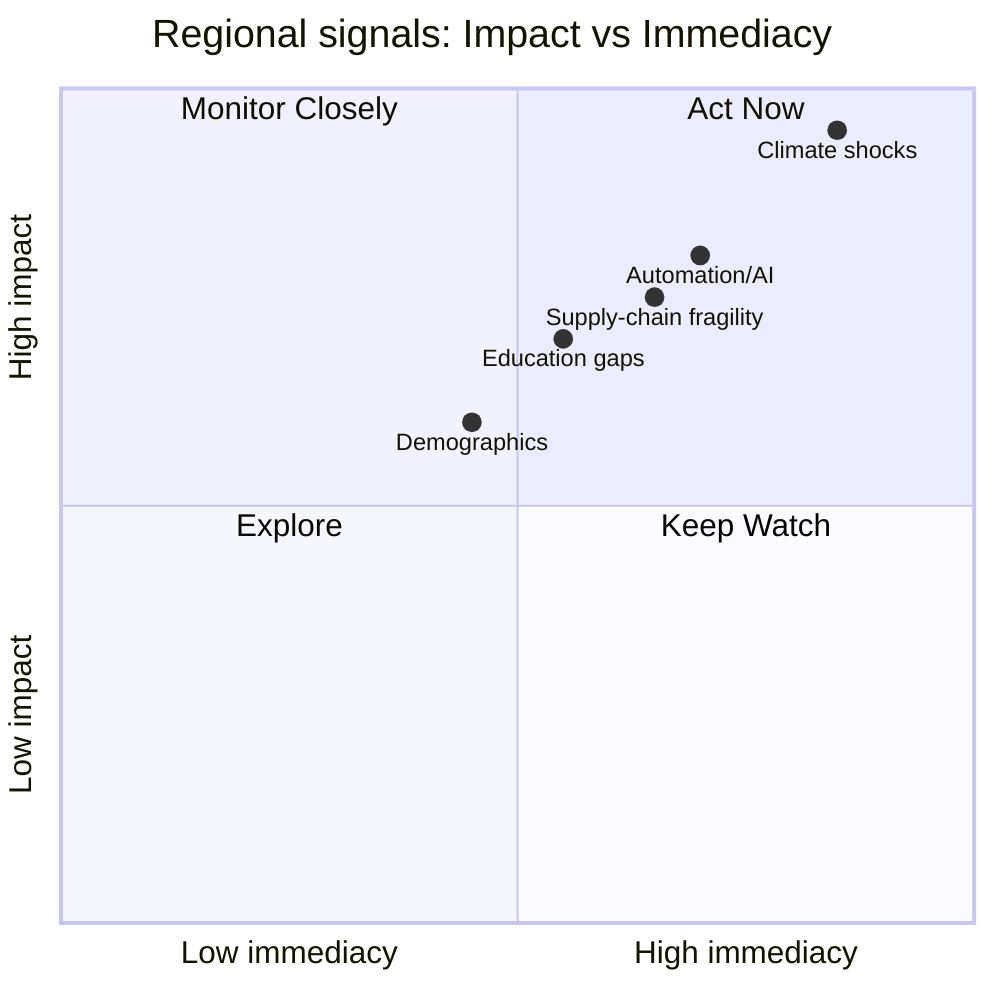
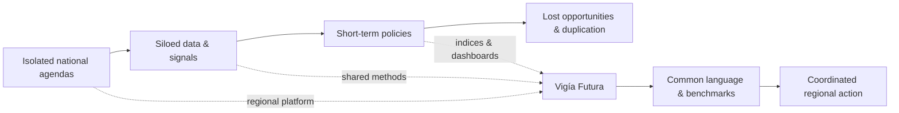
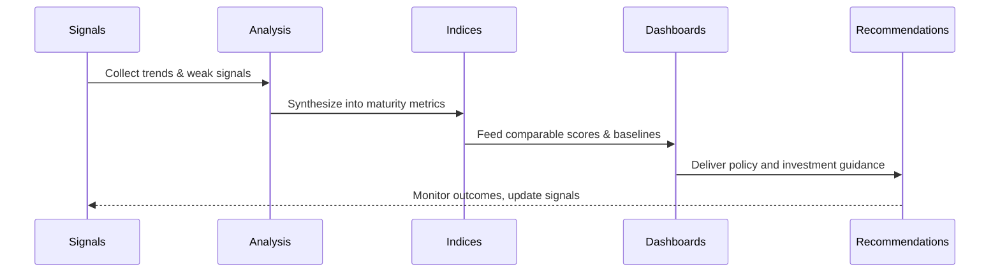
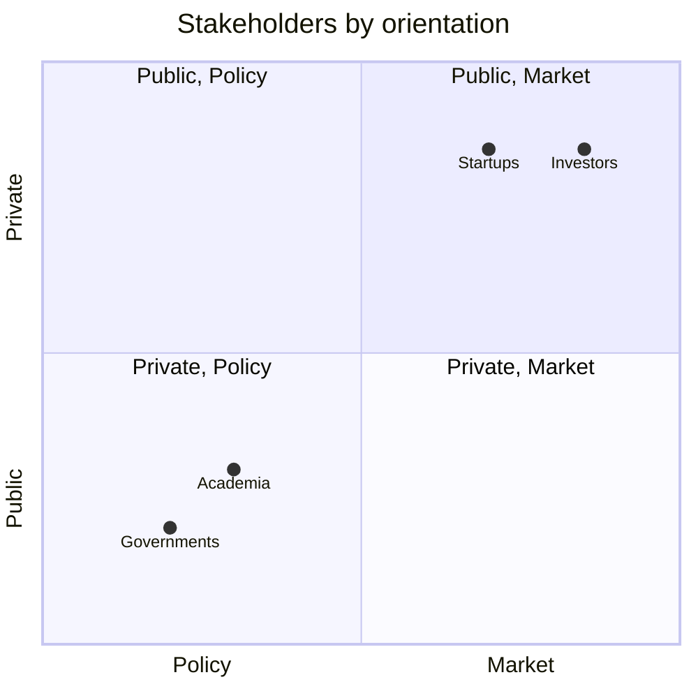
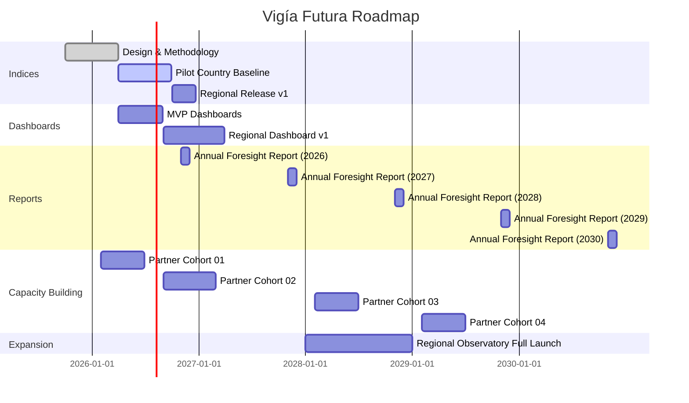

# Vigía Futura: por qué América Latina necesita un Observatorio de Prospectiva Estratégica

## La urgencia y la oportunidad de la prospectiva en América Latina
América Latina siempre ha sido moldeada por quienes podían ver más allá del horizonte. El 12 de octubre de 1492, Rodrigo de Triana avistó tierra desde el mástil de la *Pinta*, poniendo fin a meses de incertidumbre en el mar. Aquel "vigía" cambió el curso de la historia.

Siglos después, nuestra región sigue enfrentando momentos en los que la capacidad de anticipar lo que viene puede determinar la supervivencia y el progreso. Los pueblos originarios de las Américas no pudieron prever la llegada de los conquistadores, así como muchos gobiernos, empresas e instituciones de hoy no logran prepararse para retos de rápido movimiento: choques climáticos, automatización y giros geopolíticos.

{/* truncate */}

El clima global está cambiando ahora más rápidamente de lo que muchos modelos habían predicho. Solo en 2023, eventos climáticos extremos afectaron a 11 millones de personas y causaron más de US$20 mil millones en pérdidas en América Latina y el Caribe (IIA Risk in Focus 2025).

La disrupción digital se acelera cada año: el 56% de las organizaciones espera que se convierta en uno de los cinco principales riesgos en tres años, a medida que la IA, la automatización y la adopción digital desigual reconfiguran las industrias (IIA Risk in Focus 2025). Al mismo tiempo, el WEF Global Risks Report 2025 muestra que los cambios comerciales, la volatilidad regulatoria y las cadenas de suministro frágiles presionan desproporcionadamente a América Latina.

La educación representa otra brecha crítica. Según PISA 2022, el 75% de los jóvenes de 15 años en América Latina se desempeña en o por debajo del nivel básico de competencia en matemáticas, y el 55% se queda corto en lectura. Esta deficiencia equivale a casi cinco años de escolaridad en comparación con los pares de la OCDE (World Bank, IDB).

Y, sin embargo, el potencial de la región sigue siendo innegable:
- Una población joven en edad de trabajar, que el UNDP denomina nuestro "bono demográfico".
- Una riqueza cultural única que combina herencia africana, indígena y europea.
- Biodiversidad extraordinaria: solo la Amazonía contiene 1 de cada 10 de todas las especies conocidas en la Tierra, incluyendo alrededor de 40,000 especies de plantas y 16,000 especies de árboles. Solo Colombia cuenta con más de 63,000 especies, 8,800 de ellas endémicas.

Estas condiciones no son solo vulnerabilidades. Abren oportunidades de transformación si construimos la capacidad de prospectiva para anticipar lo que viene y actuar decisivamente.

:::tip[Panorama de señales: impacto vs. inmediatez]

*Cómo leerlo:* los elementos hacia la esquina superior derecha requieren atención inmediata y de alto impacto.
:::

## La brecha: esfuerzos fragmentados, sin lente regional
La mayoría de los países latinoamericanos ya ejecutan agendas digitales o de innovación (por ejemplo, la *Agenda Digital 2030* de la República Dominicana y la *Estrategia Nacional de IA* de Chile). Sin embargo, estos esfuerzos siguen siendo de alcance nacional, operan en silos y rara vez se alinean regionalmente (OECD *Digital Government in LAC, 2022*).

La capacidad de prospectiva varía ampliamente. Brasil, Chile y México nutren ecosistemas más desarrollados, mientras que muchos otros se rezagan (UNESCO *Futures Literacy 2021–2023*). Ningún referente compartido permite a los países comparar la madurez en prospectiva a través de la región.

La política pública con demasiada frecuencia recurre al cortoplacismo. Los gobiernos responden a la inflación, los ciclos políticos o los desastres naturales, en lugar de considerar las implicaciones de largo plazo. El informe *ECLAC Horizons 2050* destaca cómo los ciclos electorales de cuatro o cinco años reinician repetidamente las estrategias y socavan el progreso.

Las iniciativas regionales siguen siendo en su mayoría basadas en el diálogo. La *Red Latinoamericana de Futuros* conecta a profesionales pero opera más como un foro comunitario que como un observatorio orientado a la medición. Organismos multilaterales como el BID, CAF, UNDP y CEPAL patrocinan proyectos; sin embargo, ningún observatorio permanente provee datos, tableros o índices.

Esta situación deja a gobiernos, startups e inversionistas sin una brújula regional compartida. Como resultado, duplican esfuerzos, desperdician recursos y permanecen vulnerables a choques externos.

:::tip[De la fragmentación a una brújula compartida]

*Idea:* el observatorio introduce métodos, índices y tableros compartidos que convierten los silos en acción coordinada.
:::

## Por qué importa ahora la prospectiva institucional
Un observatorio de prospectiva recopila sistemáticamente señales, tendencias y escenarios para informar decisiones de largo plazo (OECD *Strategic Foresight 2022*). Este:
- Entrega sistemas de alerta temprana para riesgos (clima, tecnología, geopolítica).
- Identifica oportunidades emergentes (industrias verdes, talento digital, adopción de IA).
- Convierte la prospectiva en un proceso institucionalizado, en lugar de dejarla a proyectos puntuales.

La institucionalización asegura que las organizaciones:
- Mantengan continuidad a través de los ciclos electorales y eviten el avance-retroceso de la política.
- Construyan confianza y legitimidad al proveer perspectivas neutrales basadas en evidencia que ofrecen una visión equilibrada.
- Fortalezcan la cooperación regional alineando y mancomunando recursos.

Sin prospectiva, América Latina seguirá reaccionando tarde. Con prospectiva, los líderes pueden transformar la volatilidad global en una ventaja competitiva.

## Presentamos Vigía Futura
**Vigía Futura** es un observatorio regional de prospectiva para América Latina y el Caribe. A diferencia de los foros o redes, entrega productos accionables, no solo diálogo:
- **Índices**: En 2026, lanzaremos el Índice de Madurez en Innovación y el Índice de Madurez en Prospectiva para comparar la preparación entre gobiernos, startups y sectores. Publicaremos actualizaciones anuales y proveeremos análisis sectoriales trimestrales.
- **Tableros**: Herramientas visuales construidas a partir de los datos de los índices, mostrando niveles de preparación, escenarios y caminos de acción.
- **Informes y análisis**: Análisis prospectivos aplicados, hechos a la medida de gobiernos, startups e inversionistas.
- **Construcción de capacidades**: Programas de formación y diagnósticos construidos sobre MicroCanvas® y el IMM, que permiten a los socios integrar la prospectiva en la práctica diaria.

:::tip[De las señales a la acción: cómo funciona el observatorio]

*Ciclo:* sensado continuo, medición, visualización y acción.
:::

## ¿Quién se beneficia de Vigía Futura?
### Gobiernos y formuladores de política
- Usar índices de largo plazo para mantener la continuidad entre administraciones.
- Apoyarse en tableros para anticipar choques y alinear las agendas nacionales con la prospectiva regional.
- Fortalecer la credibilidad global con perspectivas basadas en evidencia.

### Startups y emprendedores
- Detectar señales que revelen mercados emergentes y dar el salto a industrias verdes o digitales.
- Comparar la madurez en innovación frente a los pares mediante diagnósticos.
- Integrar la prospectiva en las estrategias de crecimiento con formación y herramientas.

### Inversionistas y corporativos
- Reducir la incertidumbre y guiar la asignación de capital con índices.
- Identificar sectores y riesgos de alto potencial con tableros.
- Respaldar tesis de inversión con informes prospectivos hechos a la medida.

### Academia y sociedad civil
- Acceder a herramientas estructuradas y formación en prospectiva.
- Conectar la investigación con necesidades reales de política y mercado a través de la plataforma.
- Utilizar un lenguaje compartido para facilitar la colaboración entre instituciones.

:::tip[Panorama de actores: política vs. mercado, público vs. privado]

*Ubicación:* posicionamiento aproximado para mostrar quién se inclina hacia dónde; el observatorio conecta a los cuatro.
:::

## Por qué nosotros: la trayectoria de Doulab
En **Doulab**, diseñamos y probamos las herramientas que sustentan Vigía Futura:
- Desarrollamos el **MicroCanvas® Framework (MCF 2.1)** y observamos a startups y gobiernos adoptarlo para estructurar la innovación.
- Desarrollamos el **Modelo de Madurez en Innovación (IMM)** y lo aplicamos en programas como *RedLab*, que guió a 25 instituciones gubernamentales a través de ciclos estructurados de innovación.
- Nos asociamos con *Alpha Inversiones* para capacitar a 30 empleados durante 12 semanas, lo que resultó en seis presentaciones de proyectos de innovación.
- Lideramos *Fundapec Fintech* para diseñar nuevos canales financieros para estudiantes de la diáspora.

Estas experiencias muestran que la medición, la estructura y la prospectiva aceleran la preparación para la innovación. Vigía Futura representa el siguiente paso, escalando este enfoque hacia un observatorio regional que empodera por igual a gobiernos, startups e inversionistas.

## Mirando hacia adelante: de la medición a la acción
En 2026, Vigía Futura publicará sus primeros Índices de Innovación y Prospectiva, seguidos por tableros regionales y un informe anual de prospectiva.

Junto a estos productos, capacitaremos a gobiernos, startups e inversionistas para integrar la prospectiva en la presupuestación, la formulación de políticas y los ciclos de innovación. En cinco años, aspiramos a establecer una plataforma regional compartida de prospectiva con un lenguaje común y referentes entre países, facilitando la colaboración transfronteriza.

:::tip[Hoja de ruta 2025–2030]

*Nota:* las fechas son indicativas para planificación y comunicación.
:::

Aspiramos a convertir a Vigía Futura en la infraestructura de apoyo a la decisión de referencia para América Latina y el Caribe, proveyendo guía basada en evidencia que convierte la incertidumbre en oportunidad.

## Sé parte del primer observatorio de prospectiva en América Latina
**Vigía Futura está construyendo la brújula compartida de la región.**

Únete ahora como socio fundador:
- Gobiernos → alinea las estrategias con la prospectiva de largo plazo.
- Startups → identifica mercados antes que los competidores.
- Inversionistas → reduce el riesgo y descubre sectores de alto potencial.

Los socios tempranos obtendrán acceso anticipado a los datos, darán forma al diseño de los índices y se posicionarán como líderes en prospectiva regional.

📅 [Agenda una sesión de descubrimiento](https://booking.doulab.net/discovery) con nuestro equipo y explora cómo Vigía Futura puede ayudar a tu organización a liderar, no a seguir, en la configuración de los futuros de América Latina y el Caribe.
