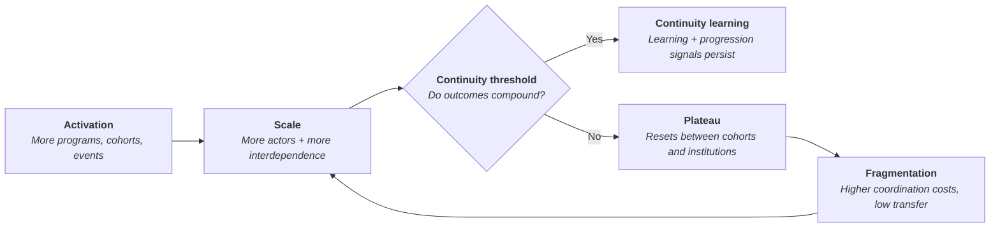
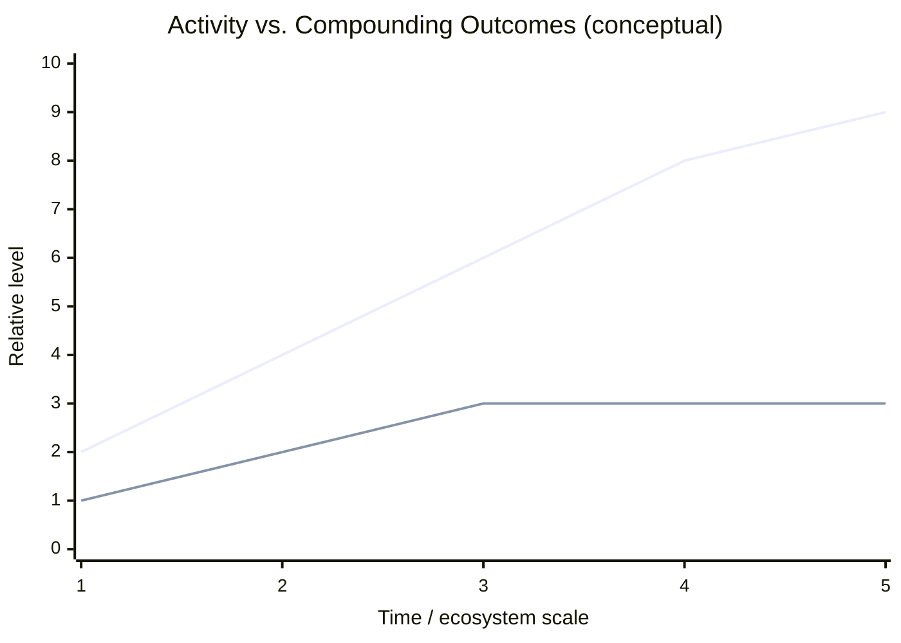
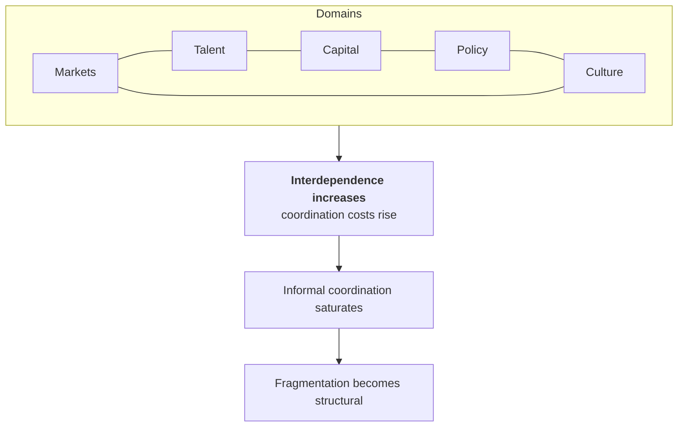
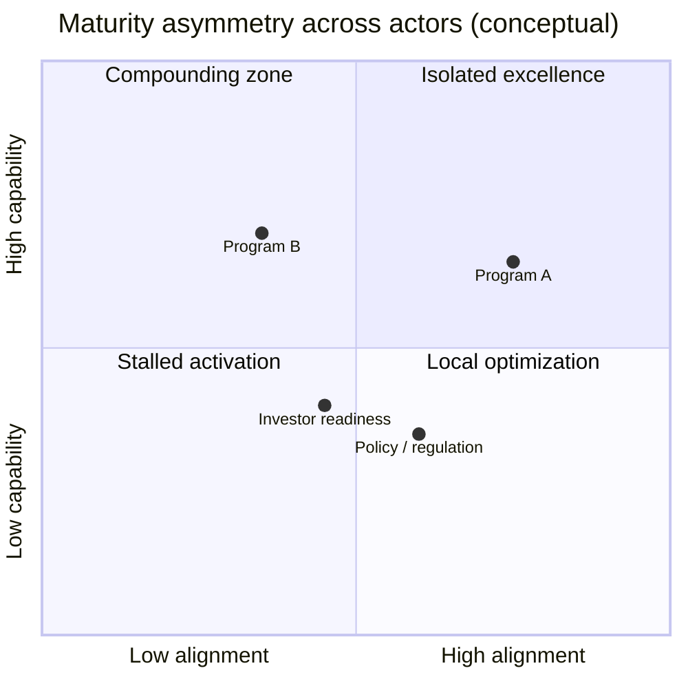

> **TL;DR** — Muchos ecosistemas de startups generan creciente actividad pero les cuesta acumular resultados con el tiempo. Una vez que los ecosistemas alcanzan cierta escala, la **capacidad de coordinación, los arreglos de gobernanza y la madurez en innovación** se vuelven restricciones vinculantes. Sin aprendizaje compartido, lógica de progresión y continuidad institucional, los resultados se reinician entre cohortes en lugar de acumularse a través de ellas.

{/* truncate */}

  <picture>
    <source srcSet="/img/blog/2026/2026-01-19-coordination-threshold-hero.avif" type="image/avif" />
    <source srcSet="/img/blog/2026/2026-01-19-coordination-threshold-hero.webp" type="image/webp" />
    
  </picture>

## Resumen
- Muchos ecosistemas de startups, particularmente en América Latina y el Caribe, muestran fuerte impulso emprendedor y creciente actividad.
- Sin embargo, más allá del crecimiento en etapa temprana, los resultados a menudo tienen dificultades para acumularse entre cohortes, instituciones y tiempo.
- Este ensayo explora por qué aparece esa meseta y propone una forma de interpretarla a través de las lentes de coordinación, gobernanza y madurez en innovación.
- La arquitectura y la madurez se presentan como perspectivas habilitantes, no como prescripciones o garantías.

## Tesis central
**A medida que los ecosistemas de startups avanzan más allá de la activación temprana, los resultados tienden a estancarse a menos que la capacidad de coordinación, los arreglos de gobernanza y los mecanismos de aprendizaje a nivel de ecosistema maduren al ritmo de la actividad** (Stam, 2015; OECD, 2025; CARIBEquity, 2025).

---

## Contexto y perspectiva
A lo largo de los últimos veinticinco años, he trabajado como emprendedor y practicante de la innovación: construyendo (y fracasando con) startups, y validando hipótesis de propuesta de valor en más de veinticinco organizaciones. Esta experiencia abarca emprendimientos en etapa temprana, fondos de pensiones, firmas de corretaje, organizaciones gubernamentales y tres startups propias.

Esta experiencia informa la perspectiva que sigue, pero el argumento en sí descansa sobre patrones observables del ecosistema más que sobre resultados personales.

El progreso alcanzado a través del Caribe y América Latina merece reconocimiento. Se ha construido mediante el esfuerzo sostenido de fundadores, inversionistas, funcionarios públicos, universidades y constructores de ecosistemas, a menudo bajo condiciones restrictivas. La pregunta que aquí se explora no es si existe progreso, sino **por qué al progreso a menudo le cuesta acumularse una vez que los ecosistemas alcanzan cierta escala y nivel de complejidad**.

---

## Por qué esto importa

### Señales de impulso
Evaluaciones recientes como el *CARIBEquity Regional Ecosystem Report* destacan señales alentadoras a través del Caribe. Solo en República Dominicana, veinticinco startups progresaron de idea a tracción temprana en un solo año (CARIBEquity, 2025). Aunque modesto en términos absolutos, esto representa un impulso significativo dentro de un ecosistema relativamente pequeño.

CARIBEquity clasifica a gran parte de la región como en una **Fase de Activación**, identificando restricciones relacionadas con conectividad, preparación para financiamiento en etapa temprana, disponibilidad de mentoría y entorno regulatorio (CARIBEquity, 2025).

### La brecha de acumulación
Los programas de aceleración y apoyo en etapa temprana han demostrado efectividad en el corto plazo. Al mismo tiempo, aparecen patrones similares a lo largo de América Latina: los resultados tienden a reiniciarse entre cohortes, instituciones y ciclos de financiamiento en lugar de acumularse. Esto puede interpretarse como una restricción de continuidad: el problema ya no es la actividad en sí, sino **cómo se traslada el progreso hacia adelante**.

Experiencias en países como Colombia y Chile ilustran esta tensión. Programas como Startup Chile generaron impulso sustancial, pero muchas startups no permanecieron ancladas a largo plazo dentro del ecosistema local. Esto no debería leerse como una crítica, sino como una oportunidad para revisar la estrategia de ecosistema.

---

## Interpretación visual: del umbral de activación al de continuidad

:::tip[Diagrama: del umbral de activación al de continuidad]

:::

## Argumentos clave
### 1) La actividad escala más rápido que los resultados
Una interpretación plausible no es la escasez de ideas o talento, sino la débil acumulación entre programas (Stam, 2015).

CARIBEquity identifica varias restricciones que plausiblemente interrumpen la acumulación, entre ellas la limitada conectividad del ecosistema, capacidad desigual de mentoría, preparación para financiamiento en etapa temprana y fricciones regulatorias (CARIBEquity, 2025). La investigación de la OCDE igualmente enfatiza que los sistemas fragmentados de incubación y aceleración reducen la navegabilidad y debilitan la continuidad post-programa (OECD, 2024).

Los ecosistemas tempranos pueden eludir temporalmente esta restricción. A medida que los ecosistemas maduran, la discontinuidad se vuelve más difícil de ignorar.

:::tip[Diagrama: actividad vs. acumulación de resultados]

:::

### 2) Los costos de coordinación suben a medida que aumenta la interdependencia
A medida que los ecosistemas crecen, la coordinación pasa de opcional a esencial.

Históricamente, la coordinación de ecosistemas en América Latina ha sido en gran medida informal. Este enfoque funcionó razonablemente bien cuando los ecosistemas eran pequeños y relativamente homogéneos.

A medida que los ecosistemas evolucionan, la interdependencia entre actores aumenta. Los dominios de capital, política, talento y tecnología interactúan cada vez más, a menudo bajo condiciones de rápido cambio. La capacidad de coordinación se vuelve por tanto una propiedad de primer orden del sistema, en lugar de un subproducto emergente (dos Santos et al., 2022).

El término hiperconvergencia se usa aquí como un atajo descriptivo para la interdependencia acelerada entre dominios, en lugar de como una construcción teórica formal. Bajo tales condiciones, los mecanismos informales de coordinación tienden a perder efectividad a medida que aumenta la complejidad.

La investigación sobre gobernanza de ecosistemas de innovación destaca la importancia de estructuras de coordinación adaptativas y resilientes capaces de operar bajo incertidumbre y turbulencia (Könnölä et al., 2021). Los análisis del Foro Económico Mundial respaldan además la visión de que los ecosistemas abarcan múltiples dominios interdependientes: mercados, talento, capital, política y cultura, cada uno amplificando las demandas de coordinación (World Economic Forum, 2013; 2014).

Cuando los costos de coordinación suben más rápido que la capacidad de coordinación, la fragmentación se vuelve el equilibrio por defecto.

:::tip[Diagrama: interdependencia y costos de coordinación]

:::

### 3) La madurez en innovación explica la discontinuidad
Se presta considerable atención a los fundadores, y con razón. Sin embargo, los resultados a nivel de ecosistema dependen no solo de la capacidad de las startups, sino de la madurez del sistema circundante.

Aquí, la madurez en innovación se usa de forma descriptiva, como una manera de interpretar la preparación y alineación del sistema, no como un ranking normativo o una certificación. Cuando los programas enfatizan la ideación y la validación temprana sin atención correspondiente a la eficiencia, el escalamiento y la mejora continua, se les pide a las startups repetidamente que vuelvan a probar lo que ya se ha validado en otra parte.

Los diagnósticos de ecosistema de la OCDE enmarcan explícitamente los ecosistemas como sistemas de entradas-salidas en los que los desajustes entre entradas, como la preparación financiera, la conectividad o la alineación institucional, restringen las salidas (OECD, 2025). Las asimetrías de madurez entre instituciones amplifican este efecto: el progreso reconocido en un programa puede ser descontado en otro debido a métricas, supuestos o definiciones de etapa diferentes.

En tales contextos, el éxito aparente puede reflejar fundadores excepcionales que escalan a pesar de las condiciones sistémicas, en lugar de gracias a ellas (Stam, 2015).

:::tip[Diagrama: asimetría de madurez entre actores]

:::

## Del diagnóstico a la interpretación
Tomados en conjunto, estos patrones sugieren que la restricción vinculante ya no es la actividad emprendedora en sí, sino cómo los ecosistemas coordinan el aprendizaje, la progresión y la toma de decisiones a medida que crecen.

En esta etapa, agregar más programas, concursos o eventos aislados tiende a producir retornos decrecientes. La literatura cada vez más trata a la coordinación y la gobernanza como capacidades del ecosistema que requieren diseño deliberado en lugar de emergencia informal (Cao, 2025; Könnölä et al., 2021).

## Los frameworks como lentes, no soluciones
Si el reto es estructural en lugar de episódico, entonces se requieren lentes analíticas para hacer visible la estructura antes de intentar el cambio.

El MicroCanvas Framework (MCF 2.2) proporciona un lenguaje compartido para la definición de problemas, la evidencia y la trazabilidad de las decisiones entre actores.

El Modelo de Madurez en Innovación (IMM) apoya la interpretación de la preparación y la progresión a nivel del sistema, conceptualmente alineado con enfoques de diagnóstico de ecosistemas (OECD, 2025).

Vigía Futura introduce prospectiva y sensado para apoyar la gobernanza anticipatoria bajo incertidumbre, consistente con modelos de gobernanza orientados a la resiliencia (Könnölä et al., 2021).

En conjunto, estas lentes desplazan la atención de actividades aisladas a la capacidad del ecosistema como un todo.

## Lo que esta perspectiva no afirma
Esta perspectiva no reemplaza a los mercados, la formación de capital, la reforma de políticas o la ejecución de los fundadores. No supone control centralizado, no requiere nuevas instituciones, ni garantiza resultados.

La arquitectura y la madurez en innovación se tratan como habilitadores, no como determinantes.

## Conclusión
Muchos ecosistemas de startups ahora parecen estar cruzando un umbral donde la coordinación, la continuidad del aprendizaje y la madurez importan tanto, si no más, que la actividad.

Reconocer esta transición ayuda a explicar por qué a veces el impulso se estanca a pesar del esfuerzo continuo, en particular cuando las historias individuales de éxito oscurecen las restricciones sistémicas. Enfoques como VIF representan una manera de pensar en cómo apoyar esta próxima fase, por diseño en lugar de por acumulación.

  

    
¿Prefieres un briefing?

    
Usa la ruta de briefing si ya tienes contexto y quieres alinear los próximos pasos.

    <a className="button button--primary" href="https://booking.doulab.net/briefing">Solicita un briefing</a>
  

  

    
¿Empiezas desde cero?

    
Agenda una llamada de descubrimiento para mapear restricciones, objetivos y el camino recomendado.

    <a className="button button--secondary" href="https://booking.doulab.net/discovery">Agenda una llamada de descubrimiento</a>
  

## References
CARIBEquity (2025). CARIBEquity Regional Ecosystem Report I: Assessment. IDB Lab & European Union.

CARIBEquity (2025). CARIBEquity Regional Ecosystem Report II: Recommendations. IDB Lab & European Union.

Cao, Z. (2025). Toward a Coordination-Centered Theory of Innovation Ecosystem Policy. SSRN Working Paper.

dos Santos, D.A.G., et al. (2022). Coordination of Innovation Ecosystems across Life-Cycle Stages. Redalyc.

Könnölä, T., Eloranta, V., Turunen, T., & Salo, A. (2021). Transformative governance of innovation ecosystems. Technological Forecasting and Social Change, 173, 121106.

OECD (2024). Start-Up Globalisation through Incubation and Acceleration. OECD Publishing.

OECD (2025). Entrepreneurial Ecosystem Diagnostics. OECD Publishing.

Stam, E. (2015). Entrepreneurial Ecosystems and Regional Policy: A Sympathetic Critique. Utrecht University.

World Economic Forum (2013). Entrepreneurial Ecosystems Around the Globe and Company Growth Dynamics.

World Economic Forum (2014). Entrepreneurial Ecosystems Around the Globe and Early-Stage Company Growth Dynamics.
