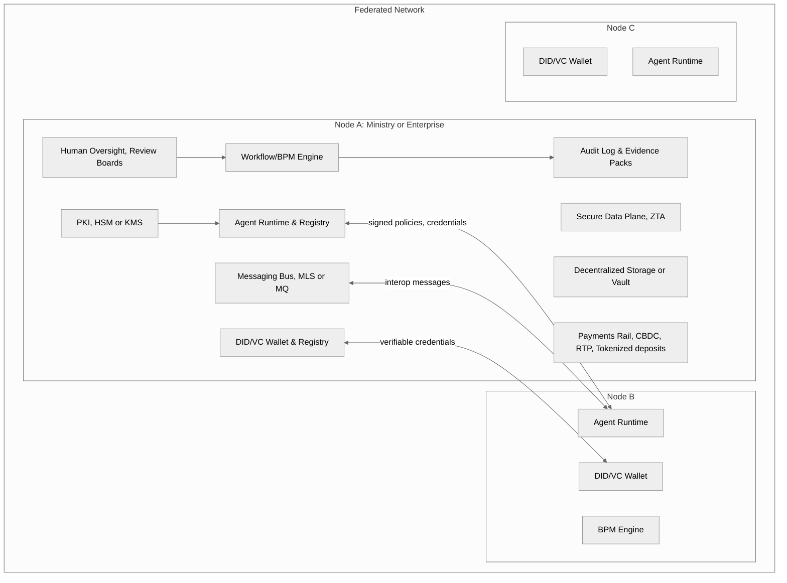
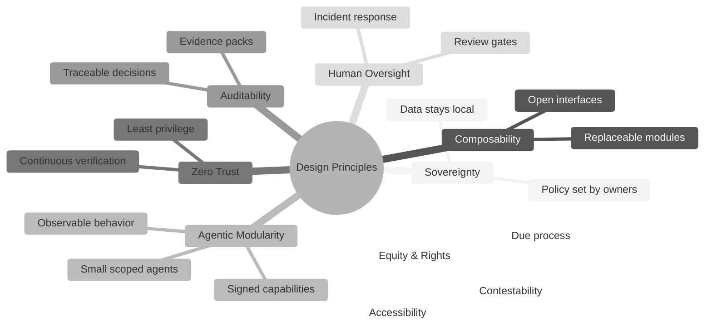
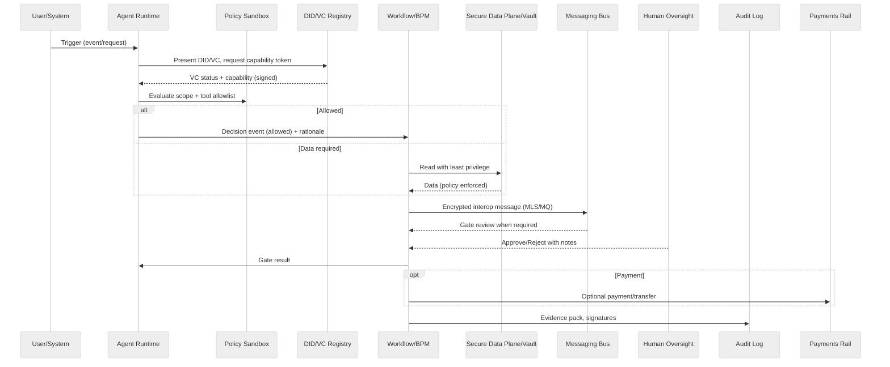
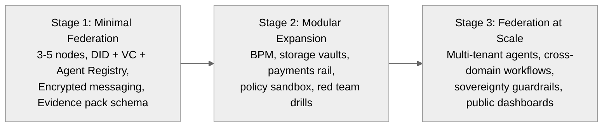
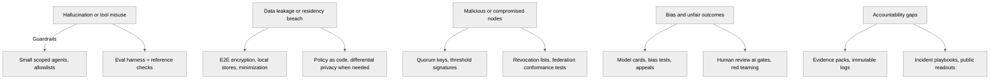

## Un plano para la gobernanza descentralizada de próxima generación

### Resumen ejecutivo

Este documento delinea un plano por etapas para una **infraestructura de IA federada y basada en agentes** que equilibra **soberanía, privacidad y rendición de cuentas**. Combina estándares abiertos de identidad, credenciales verificables, redes zero trust, registros auditables de agentes y flujos de trabajo programables. El objetivo es una **autonomía creíble con supervisión humana**, apta para gobierno y empresa. El diseño se alinea con **W3C DID/VC**, **NIST AI RMF**, **ISO 42001** y la guía **Zero Trust**, anticipando obligaciones bajo la **EU AI Act**.

---

### 1) Por qué un nuevo modelo

La infraestructura digital escaló más rápido que nuestra capacidad para **gobernarla**. Las plataformas centralizadas generan preocupaciones sobre concentración de poder, transferencia de datos y lock-in. Los sistemas de IA aumentan los riesgos, ya que los errores y sesgos pueden propagarse a escala. Un enfoque **federado y agéntico** permite a las instituciones mantener control, compartir protocolos y coordinar a través de interfaces abiertas y auditables.

**Meta de diseño:** pasar de la dependencia de plataformas a la **interoperación soberana basada en estándares** con líneas claras de rendición de cuentas.

---

### 2) Arquitectura en general

Una red de **nodos autónomos** (ministerios, agencias, empresas estatales, municipios, firmas) comparten protocolos comunes pero **mantienen datos y política localmente**. Cada nodo ejecuta **agentes** pequeños y específicos a la tarea con capacidades firmadas y comportamiento observable.

:::info Diagrama de arquitectura

:::

**Componentes clave**

- **Identidad y confianza:** registros DID, credenciales verificables, X.509 para infraestructura. Llaves alojadas en HSM o KMS en la nube.
- **Capa de agentes:** modelos pequeños, herramientas y adaptadores con alcances explícitos, manifiestos firmados y runbooks.
- **Mensajería:** bus cifrado para interoperación, cola o cifrado grupal estilo MLS.
- **Flujos de trabajo:** reglas BPM que vinculan decisiones a paquetes de evidencia y revisiones en puntos de control.
- **Plano de datos:** Zero Trust, aplicación de políticas, cómputo confidencial cuando se necesite.
- **Riel de pagos:** rieles minoristas o mayoristas, incluyendo pilotos CBDC, pagos instantáneos, depósitos tokenizados.
- **Supervisión:** revisión humana, respuesta a incidentes, red team y registros públicos cuando sea apropiado.

---

### 3) Principios de diseño

Mantenerlo simple, componible y auditable. Favorecer partes pequeñas y comprobables sobre monolitos.

:::tip Mindmap de principios de diseño

:::

**Lo que esto previene:** lock-in de proveedor, decisiones opacas, modelos de talla única, gravedad de datos insegura.

---

### 4) Módulos de referencia

**Identidad y Acceso.** DIDs y Credenciales Verificables para personas, organizaciones y agentes. Usar FIDO/WebAuthn para autenticación resistente al phishing. Mapear el aseguramiento a los niveles NIST 800-63.

**PKI y Confianza.** X.509 para infraestructura, firmas de umbral para control basado en quórum, manifiestos firmados de agentes.

**Agent Runtime.** Sandbox de política, tokens de capacidad, allowlists de herramientas, prompts reproducibles y dataset cards.

**Mensajería e Interoperación.** Esquemas de mensajes para evidencia, decisiones y eventos. Soporte de canales confidenciales entre nodos.

**Workflow/BPM.** Puntos de control por etapa, roles, escalamiento y registros inmutables de evidencia.

**Ledger o Log.** Auditoría append-only con retención, presupuesto de privacidad y registros de acceso.

**Pagos.** Piloto CBDC, pagos instantáneos o depósitos tokenizados, con rieles claros de cumplimiento.

**Observabilidad.** Model cards, trazas de evaluación, monitores de drift, linaje de datos y kill switches.

#### Cómo interactúan los módulos

- Identidad emite y verifica credenciales usadas por el Agent Runtime y los puntos de control de Workflow.
- Agent Runtime firma acciones y emite eventos a Messaging; Messaging los reenvía a otros nodos.
- Workflow consume eventos y escribe Paquetes de Evidencia al Audit Log.
- El Plano de Datos Seguro aplica decisiones de acceso de Workflow y Política.
- Los Pagos son opcionales pero pueden ser activados por Workflow una vez pasen los puntos de control.
- La Supervisión Humana puede aprobar, denegar o solicitar más evidencia en puntos de control definidos.

:::info Secuencia de interacción

:::

---

### 5) Casos de uso

**Sector público**

- Beneficios y permisos con pruebas verificables, datos locales y apelaciones transparentes.
- Asistentes de planificación presupuestaria con rastros de auditoría y registros de participación.
- Gestión de casos entre ministerios con compartición de datos delimitada.

**Empresa**

- Verificaciones de cumplimiento transfronterizo con pruebas verificables.
- Agentes de negociación de contratos con aprobación humana en los puntos de control.
- Radar de riesgo de cadena de suministro con señales compartidas y procedencia.

**Ecosistemas multi-actor**

- Colaboración de municipio a nivel nacional sin servidores compartidos.
- Pilotos público-privados con playbooks abiertos, evidencia y readouts.

---

### 6) Ruta de implementación

Empezar pequeño, probar valor, luego escalar con confianza.

:::info Etapas del programa

:::

**Etapa 1**

- Levantar DID/VC, emitir roles, configurar WebAuthn, definir el esquema de paquete de evidencia, registrar los primeros agentes.
- Pilotear uno o dos flujos de trabajo entre organizaciones, por ejemplo permisos o referencias de casos.

**Etapa 2**

- Agregar BPM, vaults y un riel de pagos.
- Ejecutar revisiones de privacidad, pruebas de seguridad y ejercicios de red team.
- Publicar model cards y dataset cards, definir deprecación y rollback.

**Etapa 3**

- Expandir a más nodos con catálogos compartidos, pruebas de conformidad y controles continuos.
- Publicar dashboards sobre niveles de servicio, apelaciones e incidentes que el público pueda leer cuando sea apropiado.

---

### 7) Registro de riesgos y salvaguardas

:::warning Riesgos y salvaguardas

:::

**Prácticas operativas**

- **Aseguramiento por diseño:** mapear controles a las funciones de NIST AI RMF (govern, map, measure, manage).
- **Sistema de gestión:** adoptar ISO 42001 para incorporar la gobernanza de IA en las operaciones diarias.
- **Postura Zero Trust:** verificación continua, privilegio mínimo y segmentación por defecto.
- **Preparación legal:** clasificar sistemas bajo los niveles de riesgo de la EU AI Act, mantener documentación técnica y monitoreo post-mercado.
- **Confianza pública:** habilitar la impugnación, publicar resúmenes y ejecutar bucles de retroalimentación.

---

### 8) Alineación de políticas y normas

- **Identidad y credenciales:** W3C DID Core y VC Data Model 2.0 apoyan la confianza portable. Reducen el lock-in de proveedor y simplifican las verificaciones transfronterizas.
- **Aseguramiento de identidad digital:** NIST SP 800-63 alinea la prueba de identidad y la autenticación con el riesgo.
- **Seguridad:** NIST SP 800-207 define Zero Trust. Combinar con WebAuthn y firmas de umbral para control de quórum.
- **Sistemas de gestión:** ISO 42001 proporciona un marco auditable de gestión de IA.
- **Regulación:** la EU AI Act introduce obligaciones para IA de alto riesgo, documentación, gestión de calidad y reporte de incidentes.
- **Rieles monetarios:** los pilotos CBDC y depósitos tokenizados continúan madurando. Tratarlos como módulos opcionales con estricto cumplimiento.

---

### 9) Plano de programa con MCF 2.2 e IMM-P®

Esto no es solo una arquitectura técnica. Es un programa de entrega que usa **MicroCanvas Framework (MCF) 2.2** y el **Innovation Maturity Model Program (IMM-P®)** para reducir el riesgo y construir capacidad.

**Puntos de control y cadencia**

- **Punto de control 0: Alineación.** Los canvases MCF capturan metas, usuarios, riesgos y señales de éxito. Salida: alcance, dueños, salvaguardas.
- **Punto de control 1: Descubrimiento.** La evidencia muestra necesidades de usuario, restricciones y segmentos tempranos. Salida: memo de decisión, riesgos principales, plan de experimentos.
- **Punto de control 2: Validación.** Pilotos controlados, revisiones de seguridad y privacidad, y runbooks operativos. Salida: revisión de control y go/no-go.
- **Punto de control 3: Eficiencia.** BPM y observabilidad en su lugar, verificaciones de conformidad pasadas. Salida: SLOs de servicio, playbooks.
- **Punto de control 4: Escala.** Federación multi-nodo, dashboards públicos donde aplique. Salida: métricas de adopción y riesgo.

**RACI**

- **Sponsor (R).** Presupuesto y salvaguardas de política.
- **Líder de programa (A).** Resultados y cadencia.
- **Seguridad y privacidad (C).** Revisiones y excepciones.
- **Equipos de entrega (R).** Agentes, flujos de trabajo, integraciones.
- **Comité de supervisión (I/C).** Revisiones de control y apelaciones.

**Criterios del punto de control**

- Completitud del paquete de evidencia, registro de riesgos, model cards y dataset cards, resultados de red team, flujo de consentimiento de usuario y apelación, y presupuesto de privacidad cuando aplique.

**Lista de comprobación inicial de conformidad**

- Conformidad DID/VC, MFA/WebAuthn para administradores, mensajería cifrada, retención de log de auditoría, respuesta a incidentes y rollback probado.

---

### 10) Desafíos abiertos

- **Autonomía interpretable:** cuánto comportamiento codificar en política versus modelos aprendidos.
- **Datos transfronterizos:** reconciliar reglas de residencia con analítica federada.
- **Compras y lock-in:** escribir estándares abiertos y cláusulas de salida en los contratos.
- **Brechas de capacidad:** capacitar equipos y publicar playbooks para evitar dependencia del proveedor.

---

### 11) Conclusión

No automatizamos instituciones. Las equipamos. Un diseño federado y agéntico permite a los líderes adoptar IA manteniendo control, transparencia y legitimidad. Empieza con una federación pequeña, prueba valor en semanas, luego crece con confianza.

---

### Glosario

- **Agent Runtime:** el entorno de ejecución para agentes de IA pequeños y delimitados con capacidades firmadas.
- **BPM:** motor de gestión de procesos de negocio usado para puntos de control y orquestación.
- **CBDC:** moneda digital de banco central.
- **DID:** identificador descentralizado, un estándar W3C para identidad portable.
- **HSM/KMS:** módulo de seguridad de hardware o servicio de gestión de claves.
- **MLS:** seguridad de capa de mensajería para mensajería grupal cifrada.
- **VC:** credencial verificable.
- **ZTA:** arquitectura zero trust.

---

### Referencias

- W3C, Decentralized Identifiers (DID) Core, W3C Recommendation, 2022. https://www.w3.org/TR/did-core/
- W3C, Verifiable Credentials Data Model 2.0, W3C Recommendation, 2024. https://www.w3.org/TR/vc-data-model-2.0/
- NIST, AI Risk Management Framework 1.0, 2023. https://www.nist.gov/itl/ai-risk-management-framework
- NIST, SP 800-207 Zero Trust Architecture, 2020. https://csrc.nist.gov/publications/detail/sp/800-207/final
- ISO/IEC 42001, AI Management System, 2023. https://www.iso.org/standard/81230.html
- IETF RFC 9380, BLS Signatures, 2023. https://www.rfc-editor.org/rfc/rfc9380
- W3C, WebAuthn Level 2, 2021. https://www.w3.org/TR/webauthn-2/
- NIST, SP 800-63 Digital Identity Guidelines (suite). https://pages.nist.gov/800-63-3/ and https://nvlpubs.nist.gov/nistpubs/SpecialPublications/NIST.SP.800-63-4.pdf
- EU, Artificial Intelligence Act, 2024. https://artificialintelligenceact.eu/the-act/
- BIS, CBDC surveys 2023-2024. https://www.bis.org/publ/bppdf/bispap159.htm

## Preguntas de investigación e hipótesis

- RQ1: ¿Aumenta un modelo federado y con puntos de control de evidencia la confianza y rendición de cuentas frente a operaciones centralizadas de IA?
- RQ2: ¿Reduce la maduración por etapas (MCF 2.2 x IMM-P®) el riesgo operativo y de gobernanza durante el escalamiento?
- RQ3: ¿Reducen las puntos de control con humano en el bucle más los paquetes de evidencia los resultados dañinos y el sesgo sin bloquear la entrega?
- H1: Los nodos con puntos de control de evidencia y pruebas de conformidad mostrarán tasas de incidentes más bajas y recuperación más rápida que la línea base.
- H2: La transparencia más las apelaciones mejora los puntajes de confianza del usuario y reduce las tasas de disputa.

## Metodología

- Ciencia del diseño + estudio de caso multi-sitio: diseñar, pilotar y evaluar iterativamente el plano de federación.
- Fuentes de datos: paquetes de evidencia (logs, decisiones, métricas), dashboards de SLO, revisiones de seguridad/privacidad, retroalimentación de usuarios, evaluaciones de sesgo/drift.
- Evaluación: comparaciones pre/post sobre confianza, fiabilidad, sesgo, latencia y resultados de apelaciones; entrevistas cualitativas sobre legitimidad.
- Métricas: tasa de incidentes, MTTR, cumplimiento de SLO, volumen de apelaciones y tiempo de resolución, deltas de sesgo/drift, puntajes de encuestas de confianza.
- Replicabilidad: publicar playbooks, configuraciones y esquemas anonimizados de paquetes de evidencia; versionar diagramas y tablas.

## Esquema de piloto y caso de estudio

- Alcance: 3-5 nodos, 1-2 flujos de trabajo entre nodos (p. ej., permisos, referencias de casos), línea base de DID/VC más log de auditoría.
- Pasos: scan de preparación (Punto de control 0-1); Problem Canvas y Paquete de Evidencia v1; piloto controlado con runbook v1 y rollback probado; revisiones de red team y privacidad; dashboard de SLO en vivo.
- Salidas: Paquete de Evidencia v2, memo de decisión, reporte de conformidad, resumen de retroalimentación de usuarios, resultados de sesgo/eval, reporte de simulacro de incidente.

## Análisis comparativo

- Comparar contra operaciones de IA centralizadas y federaciones no gestionadas: confianza/apelaciones, tasas de incidentes, latencia, costo y riesgo de cambio.
- Trade-offs: sobrecarga de gobernanza añadida vs. riesgo reducido de incidentes/cumplimiento; impactos de latencia de las puntos de control de evidencia vs. ganancias de rendición de cuentas.
- Guía: cuándo preferir lo centralizado (prototipos de bajo riesgo) vs. federado (regulado, multi-actor, contextos de alta confianza).

## Amenazas a la validez y limitaciones

- Internas: factores de confusión (madurez del equipo, herramientas); mitigar con runbooks consistentes y métricas compartidas.
- Externas: generalizabilidad entre jurisdicciones o sectores; documentar contexto y restricciones.
- Constructo: medición de confianza y legitimidad; usar instrumentos de encuesta validados y datos de apelaciones/quejas.
- Conclusión: pilotos de muestra pequeña; expandir nodos y duración para inferencia más fuerte.
- Limitaciones: restricciones de datos transfronterizos; dependencia de la preparación de la infraestructura de credenciales.

## Mapeo de ética y cumplimiento

- EU AI Act: mapear el nivel de riesgo del sistema; mantener documentación técnica, gobernanza de datos, registros de incidentes y monitoreo post-mercado.
- ISO 42001: alinear artefactos del sistema de gestión (política, riesgo, controles, monitoreo); revisiones de control como revisión de gestión.
- NIST AI RMF: controles govern/map/measure/manage; los paquetes de evidencia vinculan controles a resultados.
- Privacidad: residencia, minimización, retención; evaluación de impacto de protección de datos cuando se requiera.
- Equidad/sesgo: pruebas de sesgo, impugnabilidad, flujo de apelación; publicar model/dataset cards cuando aplique.

## Consideraciones económicas y de TCO

- Impulsores de costo: cantidad de nodos, infraestructura de identidad/credenciales, observabilidad, almacenamiento de evidencia, personal de supervisión.
- Beneficios: costo reducido de incidentes/rollback, preparación de cumplimiento, auditorías más rápidas, mayor confianza y adopción.
- Sensibilidad: modelar escenarios para crecimiento de nodos, retención de evidencia, objetivos de disponibilidad y personal de runbook.

## Repetibilidad e implementación de referencia

- Artefactos: playbooks, listas de comprobación de puntos de control, esquemas de paquetes de evidencia, pruebas de conformidad, archivos fuente de diagramas, configuraciones de ejemplo.
- Ruta de referencia: federación mínima (DID/VC, log de auditoría, dashboard de SLO, runbook) -> agregar BPM, vault y pagos como módulos opcionales.
- Pasos de reproducción: publicar configuraciones versionadas, datos de prueba, muestras anonimizadas de evidencia; documentar dependencias y scripts de configuración.

## Supuestos y fuera de alcance

- Los nodos participantes pueden operar DID/VC, logging de auditoría y monitoreo de SLO/SLA.
- Existe patrocinio ejecutivo para las puntos de control de gobernanza y la publicación de evidencia.
- Sin prescripción de proveedores de nube, LLMs o rieles de pago específicos; estos son pluggables.
- Los detalles específicos de transferencia transfronteriza de datos están fuera de alcance; aplicar reglas locales de residencia.

## Riesgos y mitigaciones

| Riesgo | Mitigación | Artefacto de evidencia | Dueño |
| --- | --- | --- | --- |
| Compromiso de identidad o credenciales | Llaves de quórum, listas de revocación, WebAuthn/FIDO para admins | Log de rotación de llaves, log de revocación | Seguridad |
| Sesgo o comportamiento inseguro del modelo | Arnés de evaluación, pruebas de sesgo, punto de control humana, playbook de rollback | Reporte de evaluación, pruebas de sesgo, aprobaciones de punto de control | Seguridad de IA |
| Fuga de datos/violación de residencia | Acceso de privilegio mínimo, cifrado, minimización de datos | Logs de acceso, verificaciones DP/política, configuración de vault | Privacidad |
| No conformidad de la federación | Pruebas de conformidad, playbook compartido, auditorías periódicas | Reporte de conformidad, hallazgos de auditoría | Arquitectura |
| Brechas de fiabilidad del servicio | SLOs/SLIs, runbooks, simulacros de caos/recuperación | Dashboard de SLO, reportes de simulacro, RCAs de incidentes | SRE |
| Drift de gobernanza | Revisiones de punto de control, comité de supervisión, métricas publicadas | Actas de punto de control, readouts de supervisión, reporte de OKR | PMO/Gobernanza |

## Lista de comprobación de UX y transparencia

- Resúmenes en lenguaje sencillo para aprobaciones/denegaciones y apelaciones.
- Notificaciones al usuario sobre resultados de punto de control, con marcas de tiempo y enlaces a paquetes de evidencia.
- Accesibilidad: contraste legible, jerarquía de encabezados y texto alternativo para diagramas.
- Impugnabilidad: rutas claras de apelación y puntos de contacto.
- Observabilidad para humanos: visor de rastro de auditoría con filtros (tiempo, agente, nodo).
- Resúmenes de cara al público donde sea apropiado: métricas y resultados sanitizados.

## Evidencia mínima para lanzar (alineada a puntos de control)

- Punto de control 0-1: Reporte de preparación, matriz OKR, clasificación de datos, registro inicial de riesgos.
- Punto de control 1-2: Problem Canvas validado, Mapa de Contexto, Paquete de Evidencia v1, memo de decisión.
- Punto de control 2-3: Paquete de Evidencia v2, runbook v1, revisión de seguridad/privacidad, resultados de piloto, rollback probado.
- Punto de control 3-4: Dashboard de SLO en vivo, reporte de red team, pruebas de conformidad, simulacro de respuesta a incidentes.
- Punto de control 4-5: Playbook de política, dashboard de conformidad, plan de escalamiento, modelo de costo/TCO.
- Punto de control 5-6: Dashboard de impacto, plan del siguiente ciclo, brief de prospectiva, log de lecciones aprendidas.

## Glosario

- Evidence Pack: un paquete de artefactos (logs, decisiones, métricas) atados a una punto de control.
- Gate: un punto de control de gobernanza mapeado a las etapas IMM-P® y MCF.
- SLO/SLI: objetivo/indicador de nivel de servicio para fiabilidad operativa.
- Vigia Futura: observatorio de prospectiva que alimenta señales a Pre-Discovery.
- Federation Node: un dominio autónomo que participa con protocolos compartidos.
- DID/VC: identificadores descentralizados y credenciales verificables para confianza.

## Snapshot de estilo y formato

- Usar símbolos solo ASCII; escapar comparaciones (p. ej., `&gt;=`, `&lt;=`) en tablas.
- Mantener encabezados concisos; un concepto por sección.
- Diagramas: añadir una leyenda de una línea indicando "qué notar".
- Tablas: incluir encabezados de columna claros y unidades.
- Mantener el emparejamiento claim/cita ajustado; cada afirmación externa recibe una fuente.

**Copyright &copy; 2018-2025 Luis A. Santiago / Santiago Arias Consulting (Doulab).**
Licenciado bajo Creative Commons Attribution - NonCommercial - NoDerivatives 4.0 International (CC BY-NC-ND 4.0).
