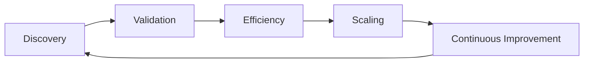
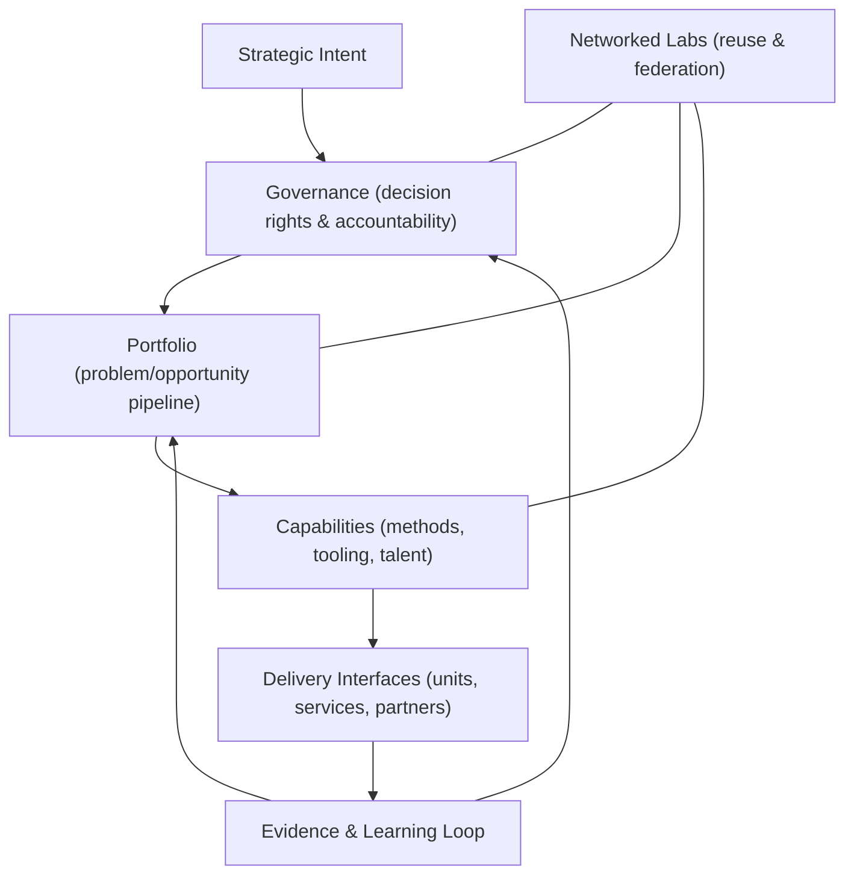

import CaseVignetteCard from "@site/src/components/CaseVignetteCard/CaseVignetteCard";

## Establecer un Laboratorio de Innovación usando el MicroCanvas Framework (MCF 2.2)

Establecer un Laboratorio de Innovación usando el MicroCanvas Framework (MCF 2.2) involucra integrar sistemáticamente la gestión estructurada de innovación con la estrategia organizacional y la eficiencia operativa. Podemos descomponer este proceso en los siguientes pasos:

En la práctica, esto significa secuenciar decisiones a través de puntos de control de evidencia, asignación de recursos y puntos de verificación de gobernanza.

### Bucle Operativo MCF 2.2 (nivel laboratorio)

:::note[Puntos de control de decisión]
Apoyo a la decisión: determinar si la evidencia es suficiente para pasar de una fase a la siguiente.
:::

1. **Descubrimiento**
   - **Artefacto de salida:** brief de encuadre del problema.
   - **Punto de control de decisión:** Go / Revisar / No-Go.
   - **Riesgos principales:** problema mal especificado o alineación débil con las partes interesadas.
   - **Evidencia mínima requerida:** puntos de dolor de usuario verificados y métricas de línea base.

2. **Validación**
   - **Artefacto de salida:** memo de resultados de experimentos.
   - **Punto de control de decisión:** Go / Revisar / No-Go.
   - **Riesgos principales:** sesgo de confirmación y calidad débil de la muestra.
   - **Evidencia mínima requerida:** resultados de prueba con umbrales de éxito definidos.

3. **Eficiencia**
   - **Artefacto de salida:** plan de optimización de procesos.
   - **Punto de control de decisión:** Go / Revisar / No-Go.
   - **Riesgos principales:** sobrecostos y cuellos de botella operativos.
   - **Evidencia mínima requerida:** comparaciones de costo y tiempo de ciclo.

4. **Escalamiento**
   - **Artefacto de salida:** evaluación de preparación para escala.
   - **Punto de control de decisión:** Go / Revisar / No-Go.
   - **Riesgos principales:** capacidad de entrega inestable o brechas de gobernanza.
   - **Evidencia mínima requerida:** resultados de replicación y plan de capacidad.

5. **Mejora Continua**
   - **Artefacto de salida:** backlog de aprendizaje e iteración.
   - **Punto de control de decisión:** Go / Revisar / No-Go.
   - **Riesgos principales:** estancamiento o desviación de los resultados estratégicos.
   - **Evidencia mínima requerida:** tendencias de desempeño y revisiones post-implementación.

### Micro-sprints (cadencia que sostiene la producción)

- **Sprints de 2 semanas:** usar cuando el alcance del problema es estrecho y la evidencia es rápida de recolectar.
- **Sprints de 4 semanas:** usar cuando la coordinación o recolección de datos requiere ciclos más largos.
- **Agenda de sprint:** admisión → hipótesis → construir/medir → revisar → siguiente decisión.
- **Antipatrones:** descubrimiento sin fin, teatro de demos, inflación del backlog.

El Vigía Innovation Lab Framework (VILF) proporciona un modelo estructural para diseñar y gobernar laboratorios de innovación y redes de laboratorios como sistemas institucionales de larga vida.

- Gobernanza
- Lógica de portafolio
- Reutilización de capacidad
- Laboratorios en red

El siguiente diagrama resume el laboratorio como un sistema gobernado con capacidades reutilizables y un bucle de evidencia.

**Diagrama — VILF: Laboratorio de Innovación como sistema**

- Pregunta, "¿Qué problema resuelve este laboratorio?" Usa el proceso "Análisis del Problema" de MCF 2.2 para determinar el problema central que el laboratorio abordará y desarrollar un entendimiento más profundo de sus causas y efectos. Identifica quién tiene este problema y qué partes interesadas están interesadas en resolverlo. Este análisis allana el camino para un mejor entendimiento de los clientes potenciales del laboratorio, alternativas potenciales de solución y, más importantemente, el Propósito del laboratorio.

- **Definir la alineación estratégica**: alinea las metas del laboratorio con los objetivos estratégicos más amplios de la organización. Usa el proceso "Objetivos y Resultados Clave" de MCF 2.2 para transformar los efectos del problema principal en objetivos que puedas medir adecuadamente a través de OKRs. Definiendo la alineación estratégica, puedes determinar si estás progresando hacia el logro de las metas estratégicas del laboratorio. Esta alineación apoyará que las iniciativas del laboratorio sean relevantes y contribuyan significativamente a la misión y visión general de la empresa.

- **Analizar alternativas potenciales**: explora qué soluciones puedes desarrollar para lograr las metas estratégicas del laboratorio y mitigar los efectos del problema principal en los clientes objetivo. Sugerimos usar los procesos "Análisis de Alternativas de Solución" de MCF 2.2 para explorar alternativas potenciales rápidamente.

- **Considera tu Propósito transformador**: un propósito transformador, la visión más alta alcanzable para el laboratorio, guiará los esfuerzos y servirá como una "estrella guía" que ayudará al laboratorio a enfocarse en lograr sus objetivos sin distracción. Usar el proceso "Propósito Transformador" de MCF 2.2 te permitirá visionar el Propósito más alto en el cual el laboratorio se enfocará.

- **Formular la Estructura del Equipo**: ensambla un equipo multidisciplinario que aporte habilidades y perspectivas diversas al laboratorio. Este equipo debe incluir una mezcla de pensadores creativos, expertos de la industria y personal operativo que puedan impulsar proyectos desde la ideación hasta la implementación. El liderazgo del laboratorio debe inspirar una cultura de innovación y gestionar el equilibrio entre la exploración creativa y el enfoque estratégico. El proceso "Estructura del Equipo" en MCF 2.2 puede ayudarte a determinar la estructura y dinámica de equipo adecuadas que se alineen con los objetivos del laboratorio.

- **Establecer la infraestructura**: diseña un espacio físico o virtual que fomente la creatividad y la colaboración. Equipa el laboratorio con las herramientas, tecnologías y recursos necesarios para apoyar la experimentación y la innovación. Este espacio también debe ser adaptable para acomodar diferentes proyectos y flujos de trabajo.

- **Implementar procesos de MCF 2.2**: integra el MicroCanvas Framework (MCF 2.2) en las operaciones del laboratorio. Para lograr esto, debes definir procesos transparentes para cada fase del ciclo de vida de la innovación: Descubrimiento, Validación, Eficiencia, Escalamiento y Mejora Continua. Gestiona cada fase usando las herramientas y técnicas de MCF 2.2 para apoyar la progresión sistemática de las ideas. Las Operaciones, Historias de Usuario, Ventas, Marketing y Engagement, y Experiencia del Cliente y Lealtad serán muy útiles para guiarte en la implementación de estos procesos.

- **Desarrollar gobernanza y métricas**: establece estructuras de gobernanza para supervisar las actividades del laboratorio y apoyar la alineación con las políticas y estándares éticos de la empresa. También, deben definirse métricas y KPIs para medir el desempeño e impacto de las innovaciones del laboratorio. Estas métricas deben reflejar las metas estratégicas del laboratorio y guiar los procesos de toma de decisiones. Sugerimos usar los procesos Métrica Clave de Crecimiento y Métricas Clave de Impacto de MCF 2.2 para desarrollar y monitorear estas métricas.

- **Lanzar proyectos piloto**: inicia proyectos piloto para probar la configuración y procesos del laboratorio. Estos proyectos sirven como una forma práctica de refinar el enfoque de innovación del laboratorio e identificar áreas de mejora. Aprender de estos proyectos iniciales es relevante para escalar las operaciones del laboratorio. Como se sugirió anteriormente, se requiere comúnmente seguir cada paso en el ciclo de vida de la innovación para apoyar que cada nuevo producto, servicio o modelo de negocio sea validado correctamente antes de pasar a la siguiente etapa, reduciendo así el desperdicio de recursos.

- **Fomentar una cultura de aprendizaje continuo**: alienta el aprendizaje continuo y la adaptación basados en retroalimentación y resultados de proyectos iniciales. El aprendizaje continuo debe arraigarse en la cultura del laboratorio, promoviendo un enfoque iterativo a la innovación y refinando constantemente estrategias y procesos. Los procesos Validación del Modelo de Negocio, Contexto Sociocultural, Socios Clave, Análisis del Cliente, Análisis y Gestión de Riesgos de MCF 2.2 son fundamentales para aprender continuamente qué está funcionando y qué no y, desde ahí, derivar posibles nuevas iteraciones de la ejecución del laboratorio.

### Requisitos de infraestructura

Establecer un Laboratorio de Innovación típicamente requiere planificación cuidadosa de infraestructura para crear un entorno conducente a la creatividad y la innovación. Este entorno debe abarcar espacios físicos o virtuales y los sistemas de soporte tecnológico y operativo necesarios. La disposición física de un Laboratorio de Innovación debe fomentar la colaboración y la flexibilidad.

Debe contar con mobiliario modular, amplio espacio de pizarra para lluvia de ideas y áreas designadas tanto para el pensamiento tranquilo como para el trabajo colaborativo, alentando la interacción y el flujo libre de ideas entre los miembros del equipo. *(*Kelley & Kelley, 2013*)*.

El acceso a tecnología adecuada se requiere comúnmente, incluyendo internet de alta velocidad, herramientas de software para diseño y desarrollo, y hardware para prototipado y prueba. El acceso a recursos de cómputo en la nube y herramientas especializadas como impresoras 3D y equipo de VR puede apoyar el proceso de innovación. *(*Hagel, Brown, & Davison, 2010*)*.

También se requiere comúnmente un soporte operativo robusto, incluyendo asistencia administrativa, legal y técnica para racionalizar procesos, gestionar problemas de propiedad intelectual y apoyar el cumplimiento con regulaciones relevantes. *(*Tidd & Bessant, 2018*)*.

Las herramientas confiables de comunicación son cruciales para conectar a los miembros del equipo dentro del laboratorio y con socios externos, incorporando tecnología como videoconferencia, software de gestión de proyectos y plataformas digitales de colaboración. *(*Friedman, 2007*)*.

Finalmente, las medidas fuertes de seguridad protegen la información sensible y la propiedad intelectual, incluyendo soluciones de almacenamiento seguro de datos, sistemas de seguridad de red y protocolos para manejar materiales confidenciales. *(*Schneier, 2004*)*.

Un Laboratorio de Innovación puede proporcionar un entorno de apoyo que esté bien equipado para nutrir innovaciones y adaptarse a futuros desafíos y oportunidades en el panorama tecnológico y empresarial, siempre que consideres esto durante las etapas de Descubrimiento y Validación para la implementación inicial del laboratorio.

### Asignación de personal y estructura del equipo

- **Laboratorios de Innovación Corporativos**: **Asignación de personal y estructura del equipo:** los laboratorios de innovación corporativos típicamente emplean una mezcla de talento interno de la empresa y expertos externos para impulsar la innovación. El equipo a menudo incluye especialistas de I+D, desarrolladores de productos, gerentes de proyecto y diseñadores UX/UI que colaboran estrechamente con las unidades de negocio.

- **Laboratorios de Innovación Afiliados a Universidades**: **Asignación de personal y estructura del equipo:** estos laboratorios a menudo emplean investigadores académicos, estudiantes y profesionales de la industria que colaboran en proyectos guiados por investigación. La estructura del equipo típicamente enfatiza la colaboración interdisciplinaria.

- **Laboratorios de Innovación Gubernamentales**: **Asignación de personal y estructura del equipo:** los laboratorios gubernamentales usualmente cuentan con responsables de política, expertos temáticos en administración pública y tecnólogos. Se enfocan en la innovación del sector público para mejorar servicios y resultados de política.

- **Laboratorios de Innovación Independientes**: **Asignación de personal y estructura del equipo:** los laboratorios independientes típicamente operan con un modelo flexible de asignación de personal que puede incluir freelancers, expertos de la industria y socios académicos. Esta estructura permite un equipo dinámico que se adapta a las necesidades del proyecto.

- **Laboratorios de Innovación Comunitarios**: **Asignación de personal y estructura del equipo:** miembros de la comunidad local, emprendedores sociales y voluntarios que aportan conocimiento e insights de base a menudo cuentan en los laboratorios comunitarios. Enfatizan el engagement local y soluciones adaptadas a necesidades de la comunidad.

Cada tipo de laboratorio de innovación requiere un enfoque adaptado a la estructura del equipo y la asignación de personal, aprovechando habilidades y antecedentes diversos para satisfacer metas específicas de innovación. Esta alineación estratégica de la composición del equipo apoya a los laboratorios para abordar los desafíos únicos que buscan resolver, ya sea en los sectores corporativo, académico, gubernamental, comunitario o independiente.

<CaseVignetteCard
  title="Mezcla de personal en laboratorio corporativo"
  context="Un laboratorio de innovación corporativo necesitaba habilidades técnicas profundas y de entrega."
  intervention="Se asignaron ingenieros senior, científicos de datos y gerentes de producto junto con líderes de unidades de negocio."
  outcome="La asignación de personal multifuncional apoyó la entrega de prototipos y la integración."
  lesson="Los roles internos y externos mixtos pueden apoyar la entrega del laboratorio corporativo."
  source={<>Chesbrough, 2006</>}
/>

<CaseVignetteCard
  title="Personal en laboratorio universitario"
  context="Un laboratorio afiliado a universidad operó a través de dominios académicos e industriales."
  intervention="Profesores, investigadores de posgrado y consultores de la industria colaboraron en proyectos guiados por investigación."
  outcome="La asignación de personal interdisciplinaria apoyó la entrega de investigación aplicada."
  lesson="Los equipos académico-industriales pueden apoyar misiones de laboratorio guiadas por investigación."
  source={<>Etzkowitz & Leydesdorff, 2000</>}
/>

<CaseVignetteCard
  title="Personal en laboratorio gubernamental"
  context="Un laboratorio gubernamental de innovación se enfocó en la entrega de servicios en salud."
  intervention="Analistas de política, expertos de salud pública y tecnólogos fueron asignados juntos."
  outcome="El diseño de servicios y la alineación de entrega mejoraron."
  lesson="Los laboratorios del sector público se benefician de la alineación de personal en política y técnica."
  source={<>Mulgan, 2014</>}
/>

<CaseVignetteCard
  title="Personal en laboratorio independiente"
  context="Un laboratorio independiente trabajó en programas de tecnología ambiental."
  intervention="Científicos ambientales basados en proyectos se unieron al personal permanente de comercialización."
  outcome="La investigación técnica y la planificación de comercialización se emparejaron."
  lesson="La asignación flexible de personal puede apoyar la adaptabilidad del laboratorio independiente."
  source={<>Westley & Antadze, 2010</>}
/>

<CaseVignetteCard
  title="Personal en laboratorio comunitario"
  context="Un laboratorio comunitario abordó desafíos de acceso a alimentos urbanos."
  intervention="Agricultores locales, planificadores urbanos y organizadores comunitarios formaron parte del personal del laboratorio."
  outcome="Las necesidades de la comunidad informaron la selección y entrega de proyectos."
  lesson="La asignación de personal comunitario puede alinear el trabajo del laboratorio con las necesidades locales."
  source={<>Moore & Westley, 2011</>}
/>

Sugerimos usar el proceso Estructura del Equipo previamente mencionado para crear una estructura inicial de equipo alineada con los objetivos del laboratorio y el propósito transformador. Durante las primeras tres etapas del ciclo de vida del laboratorio (Descubrimiento, Validación y Eficiencia), la estructura del equipo probablemente cambiará a medida que el laboratorio aprende a operar eficientemente. El laboratorio también podría considerar tercerizar algunas de sus funciones centrales (ventas y marketing, finanzas y contabilidad, IT y otras funciones de soporte, incluyendo coaching y mentoría) a medida que desarrolla un modelo de negocio viable hasta que alcance un nivel de madurez que permita la asignación permanente de personal.

### Modelo operativo

El modelo operativo de un Laboratorio de Innovación delinea los métodos y procesos que guían cómo el laboratorio funciona día a día. Este modelo típicamente incorpora aspectos de gestión de proyectos, asignación de recursos, diseño de flujo de trabajo y métricas de desempeño, asegurando la gestión eficiente de proyectos y la alineación con los objetivos estratégicos de la organización.

- **Gestión de proyectos**: un modelo operativo efectivo establece protocolos claros de gestión de proyectos, que ayudan a organizar, planificar y ejecutar proyectos de innovación desde el inicio hasta la finalización.

- **Asignación de recursos**: el modelo debe definir activamente cómo asignar recursos para apoyar varios proyectos. Ejemplos de recursos incluyen presupuestar materiales, tecnología y recursos humanos y determinar cómo priorizar estos recursos a través de proyectos en competencia.

- **Diseño de flujo de trabajo**: el modelo operativo debe racionalizar los flujos de trabajo, integrando nuevas herramientas y tecnologías que mejoren la colaboración y la eficiencia.

- **Métricas de desempeño**: es relevante establecer métricas de desempeño para rastrear el progreso e impacto de las iniciativas de innovación. Estas métricas pueden incluir salidas de innovación, como patentes presentadas o productos lanzados, y resultados, como ganancias de participación de mercado o crecimiento de ingresos.

Con un modelo operativo robusto que incluya protocolos de gestión de proyectos, asignación de recursos, flujos de trabajo e indicadores de desempeño, los Laboratorios de Innovación pueden mejorar su eficiencia y efectividad mientras contribuyen a las metas organizacionales de innovación.

<CaseVignetteCard
  title="Cadencia ágil en laboratorio"
  context="Un laboratorio necesitaba ciclos de iteración más rápidos a través de proyectos."
  intervention="Se adoptaron prácticas ágiles de gestión de proyectos en el modelo operativo."
  outcome="La cadencia de iteración mejoró y el flujo de proyectos se volvió más predecible."
  lesson="Las prácticas ágiles pueden apoyar la cadencia de iteración en las operaciones del laboratorio."
  source={<>Sutherland, 2014</>}
/>

<CaseVignetteCard
  title="Disciplina de financiamiento por niveles"
  context="Un portafolio de laboratorio requería niveles diferenciados de financiamiento."
  intervention="Un modelo de financiamiento por niveles priorizó recursos por valor estratégico."
  outcome="Las decisiones de financiamiento se alinearon con los niveles del portafolio y los puntos de control de evidencia."
  lesson="El financiamiento por niveles puede apoyar la disciplina de asignación de recursos."
  source={<>Kaplan, 2012</>}
/>

<CaseVignetteCard
  title="Flujos de trabajo en plataforma de colaboración"
  context="Los equipos distribuidos necesitaban flujos de trabajo y coordinación compartidos."
  intervention="Las plataformas de colaboración se integraron en el diseño del flujo de trabajo."
  outcome="La coordinación remota mejoró y los flujos de trabajo se volvieron más consistentes."
  lesson="Las plataformas de colaboración pueden apoyar la consistencia del flujo de trabajo."
  source={<>O'Reilly & Tushman, 2016</>}
/>

<CaseVignetteCard
  title="Seguimiento con cuadro de mando integral"
  context="El liderazgo necesitaba visibilidad consistente del desempeño a través de proyectos."
  intervention="Se aplicaron métricas de cuadro de mando integral a las salidas y resultados de innovación."
  outcome="El reporte de desempeño se volvió consistente entre indicadores financieros y no financieros."
  lesson="Los cuadros de mando integrales pueden apoyar el seguimiento de desempeño multidimensional."
  source={<>Kaplan & Norton, 1996</>}
/>

### Integrando los procesos de MCF 2.2 en el ciclo de vida del proyecto del Laboratorio de Innovación

Integrar los procesos del MicroCanvas Framework (MCF 2.2) en el ciclo de vida del proyecto de un Laboratorio de Innovación mejora la alineación estratégica y la eficiencia operativa en todas las fases de la innovación. Conceptualizar, crear un piloto de laboratorio, estabilizar el laboratorio y luego escalarlo es un proyecto dentro de un proyecto, ya que el laboratorio ejecuta el marco para organizarse mientras sigue el mismo proceso para los proyectos de innovación en sí.

Aquí hay un desglose detallado de cómo cada fase del ciclo de vida de la innovación incorpora procesos específicos de MCF 2.2:

#### Fase de Descubrimiento

- El Análisis del Cliente y el Análisis del Problema identifican las necesidades y desafíos del mercado objetivo y definen el problema central que la innovación busca resolver. También te permitirá calibrar cuán grande es la oportunidad de mercado en la que se enfocará el laboratorio, ayudando a determinar el impacto potencial o viabilidad comercial del laboratorio.

- Los Objetivos y Resultados Clave (OKR) ayudan a establecer metas medibles que se alinean con los objetivos estratégicos del laboratorio.

- El Propósito Transformador clarifica el impacto más amplio que el proyecto busca lograr, asegurando que la innovación se alinee con la misión y valores del laboratorio.

- Alternativas de Solución, Ventajas Únicas y Características del Producto exploran diferentes formas de abordar los problemas identificados, incluyendo características distintivas que podrían darle al producto una ventaja competitiva mientras se alinean dichas características con las necesidades o desafíos específicos del mercado objetivo.

- La Estructura del Equipo apoya que la mezcla adecuada de habilidades y experiencia esté disponible para abordar proyectos de innovación efectivamente.

- La Validación del Modelo de Negocio evalúa la viabilidad y sostenibilidad del modelo de negocio propuesto desde el inicio.

#### Fase de Validación

- Las Historias de Usuario y Métricas Clave de Crecimiento necesitan desarrollo para capturar la experiencia del usuario final y medir el progreso del proyecto hacia sus objetivos de crecimiento.

- Las Métricas Clave de Impacto rastrean el impacto social o económico de la innovación.

- Los procesos Ventas, Marketing y Engagement, y Experiencia del Cliente y Lealtad ayudan a entender las dinámicas del mercado y refinar las estrategias de salida al mercado.

- La Validación del Modelo de Negocio continúa a medida que más datos están disponibles y evalúas las reacciones iniciales del mercado.

#### Fase de Eficiencia

- Las Partes Interesadas Externas, Operaciones e Integraciones de Sistemas Externos se enfocan en mejorar la eficiencia operativa e integrar la innovación dentro de sistemas más grandes.

- La Arquitectura del Producto, Riesgos, Restricciones Regulatorias y Cumplimiento Legal y Estrategia aseguran que el producto cumpla con los estándares de la industria y los requisitos legales.

- La Estructura de Costos e Ingresos y el Análisis Financiero se sumergen en la viabilidad financiera del proyecto mientras aseguran la sostenibilidad para el proyecto de innovación.

- La Validación del Modelo de Negocio continúa agregando valor a medida que las realidades financieras se vuelven más claras y requieren posibles ajustes. En esta fase, el proyecto de innovación podría requerir recursos extensos, lo que requiere evidencia sólida de la viabilidad del proyecto.

#### Fase de Escalamiento

- Los Atributos de Crecimiento Acelerado identifican factores que pueden acelerar significativamente el proceso de escalamiento.

- Los Socios Clave y Canales de Entrega a menudo se requieren para expandir el acceso al mercado y la distribución.

- El Contexto Sociocultural apoya que el producto siga siendo relevante a través de diferentes mercados.

- Las Disrupciones Futuras en el contexto del proyecto de innovación requerirán prepararse para la sostenibilidad y adaptabilidad de largo plazo en un entorno cambiante.

Aplicar estos procesos de MCF 2.2 a lo largo del ciclo de vida de la innovación puede mejorar la probabilidad de éxito y ayudar a que los proyectos permanezcan estratégicamente alineados y listos para satisfacer las demandas del mercado.

### Midiendo el éxito: métricas y KPIs para evaluar el impacto y éxito de los Laboratorios de Innovación.

Medir el éxito de los Laboratorios de Innovación es relevante para determinar impacto y efectividad, requiriendo el establecimiento de métricas e indicadores clave de desempeño (KPIs) que proporcionen datos concretos para evaluar el desempeño.

Aquí hay cómo puedes medir efectivamente el éxito de los Laboratorios de Innovación:

- **Métricas de Salida de Innovación**: el número de prototipos desarrollados, patentes presentadas o nuevos productos lanzados ayuda a cuantificar las salidas directas de las actividades de innovación dentro del laboratorio. *(*Davila et al., 2006*)*.

- **Métricas Financieras**: el Retorno sobre la Inversión (ROI), el crecimiento de ingresos por nuevos productos y los ahorros de costos por mejoras de proceso evalúan el impacto económico de las innovaciones desarrolladas dentro del laboratorio. *(*Moore, 1991*)*.

- **Métricas de Impacto en el Mercado**: los cambios en la participación de mercado, las tasas de adquisición de clientes y las métricas de engagement del cliente miden cuán efectivamente los nuevos productos o servicios capturan el interés del cliente. *(*Moore, 1991*)*.

- **Métricas de Eficiencia Operativa**: la reducción en el tiempo al mercado, la mejora en el uptime de producción y la eficiencia en la utilización de recursos evalúan cómo las innovaciones dentro del laboratorio mejoran los procesos operativos. *(*Hammer, 2001*)*.

- **Métricas de Engagement del Empleado y Cambio Cultural**: los puntajes de satisfacción del empleado, las tasas de presentación interna de ideas y las tasas de participación en actividades relacionadas con la innovación ayudan a entender el impacto cultural interno del Laboratorio de Innovación. *(*Amabile & Kramer, 2011*)*.

- **Métricas de Aprendizaje y Crecimiento**: los niveles de desarrollo de habilidades, los resultados de aprendizaje de proyectos fallidos y la diseminación de conocimiento a través de la organización reflejan el papel del Laboratorio de Innovación en la creación de conocimiento y el desarrollo de capacidad. *(*Nonaka & Takeuchi, 1995*)*.

Usar estas métricas y KPIs permite a las organizaciones evaluar el éxito de sus Laboratorios de Innovación comprensivamente y alinear el trabajo de innovación con objetivos estratégicos más amplios.

<CaseVignetteCard
  title="Diseño de compuerta Heilmeier"
  context="Los laboratorios necesitaban una forma consistente de definir puntos de control de decisión y umbrales de evidencia."
  intervention="Se usaron preguntas estructuradas del Catecismo de Heilmeier para enmarcar las compuertas."
  outcome="Los puntos de control de decisión y las necesidades de evidencia se clarificaron antes de escalar."
  lesson="Las preguntas estructuradas pueden apoyar el diseño de compuertas basado en evidencia."
  source={<>
    DARPA (n.d.).{" "}
    <a
      href="https://www.darpa.mil/about/heilmeier-catechism"
      target="_blank"
      rel="noopener noreferrer"
    >
      The Heilmeier Catechism
    </a>
  </>}
/>
