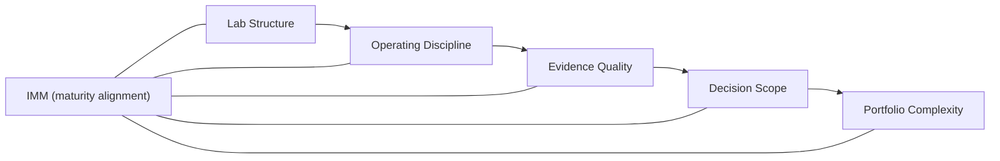

import CaseVignetteCard from "@site/src/components/CaseVignetteCard/CaseVignetteCard";

## Laboratorios de innovación y madurez: el papel del Modelo de Madurez en Innovación (IMM)

El Modelo de Madurez en Innovación (IMM) es un modelo de progresión de capacidad usado para ayudar a explicar por qué los laboratorios de innovación se estancan, se fragmentan o escalan. Enmarca cómo la preparación institucional moldea los resultados que los laboratorios pueden entregar realísticamente en el tiempo.

En la práctica, esto significa que las evaluaciones de madurez deben influir en la asignación de recursos, la carga de gobernanza y el alcance del portafolio.

#### Snapshot de IMM (ejemplo)

| Pilar IMM | Señales de etapa temprana | Señales maduras | Métrica | Intervención típica |
| --- | --- | --- | --- | --- |
| Claridad de gobernanza | Roles y derechos de decisión poco claros | Derechos de decisión documentados y aplicados | Tiempo de respuesta de decisión | Actualizar matriz de decisión |
| Disciplina de evidencia | Experimentos ad hoc | Plantillas estandarizadas de experimentos | Tasa de validación de hipótesis | Plantillas de evidencia y revisión |
| Lógica de portafolio | Admisión oportunista | Niveles de portafolio priorizados | Ratio de balance de portafolio | Rúbrica de admisión y cadencia |
| Reutilización de capacidad | Herramientas únicas | Kits de herramientas y playbooks reutilizables | Tasa de reutilización | Biblioteca de métodos compartidos |
| Preparación de talento | Brechas de habilidades por rol | Cobertura multifuncional de habilidades | Índice de cobertura de roles | Plan de capacitación y asignación de personal |
| Alineación de entrega | Traspasos débiles | Acuerdos formales de entrega | Tasa de adopción | Gobernanza conjunta de entrega |

:::note[Puntos de control de decisión]
Apoyo a la decisión: alinear la carga de gobernanza, el alcance del portafolio y el modelo de recursos al nivel de madurez evaluado.
:::

Regla de asignación de recursos basada en madurez: la asignación de personal, las herramientas y la gobernanza deben escalar con la madurez demostrada en lugar de la ambición. Usa umbrales de evidencia y métricas de ciclo de decisión para prevenir el escalamiento prematuro, como el tiempo de respuesta de decisión y la tasa de validación de hipótesis.

:::tip[Definición]
**Contabilidad de innovación**: una disciplina de medición que rastrea evidencia, velocidad de aprendizaje y calidad de decisión a través del portafolio.
:::

El siguiente diagrama muestra cómo la alineación de madurez influye en la estructura del laboratorio, las prácticas de evidencia y el alcance de decisión.

**Diagrama — Superposición IMM sobre Laboratorios de Innovación**

Los laboratorios son a menudo más efectivos cuando se diseñan para su nivel de madurez en lugar de un estado final aspiracional. Las herramientas sin alineación de madurez pueden aumentar el riesgo creando deuda de proceso y expectativas operativas frágiles.

<CaseVignetteCard
  title="Asignación de recursos basada en madurez"
  context="Un programa de madurez en innovación alineó el crecimiento de capacidad con umbrales de evidencia."
  intervention="Las evaluaciones de madurez se vincularon a decisiones de asignación de recursos."
  outcome="El crecimiento de capacidad siguió umbrales de evidencia en lugar de solo ambición."
  lesson="La asignación de recursos alineada a madurez puede reducir riesgos de escalamiento prematuro."
  source={<>
    Doulab (n.d.).{" "}
    <a
      href="https://doulab.net/services/innovation-maturity"
      target="_blank"
      rel="noopener noreferrer"
    >
      Innovation Maturity Model program
    </a>
  </>}
/>

**Implicación de decisión:** la evaluación de madurez debe determinar la carga de gobernanza y la asignación de recursos antes de expandir el alcance del portafolio.
