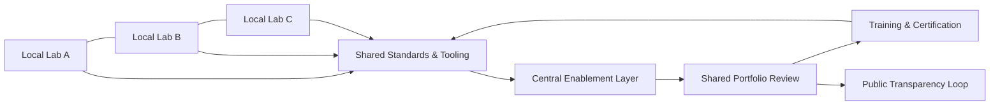

import CaseVignetteCard from "@site/src/components/CaseVignetteCard/CaseVignetteCard";

## Más allá del Laboratorio de Innovación: redes nacionales

Las redes nacionales pueden coordinar múltiples laboratorios bajo estándares, gobernanza y prácticas de evidencia compartidos. VILF puede ser central aquí describiendo cómo múltiples laboratorios operan como un sistema en lugar de proyectos independientes.

En la práctica, esto significa criterios de admisión compartidos, estándares de evidencia y revisión de portafolio entre laboratorios.

:::tip[Definición]
**Habilitación de red**: los estándares compartidos, la capacitación, las herramientas y la gobernanza que permiten a los laboratorios operar consistentemente entre instituciones.
:::

Las Redes Nacionales de Laboratorios de Innovación constituyen colaboraciones estratégicas diseñadas para amplificar la capacidad innovadora de una nación interconectando diversos laboratorios locales y regionales en una red expansiva. Estas redes habilitan una estrategia coherente y nacional para investigación y desarrollo a través de varios sectores aprovechando las fortalezas únicas de diferentes regiones e instituciones, fomentando así una innovación nacional de base amplia.

Operativamente, esto se manifiesta como capas de coordinación que equilibran la especialización local con las prioridades nacionales.

La premisa detrás de las Redes Nacionales de Laboratorios de Innovación es que la resolución colaborativa de problemas y los recursos compartidos producen resultados más eficientes e impactantes que los esfuerzos aislados. Integrando laboratorios a través de divisiones geográficas e institucionales, estas redes cultivan un entorno rico en innovación que optimiza la utilización de recursos y facilita el intercambio de conocimiento, ideas y tecnologías.

Tal integración no solo mejora la eficiencia de recursos sino que también promueve el intercambio de conocimiento y tecnologías a través de varios sectores. Estas redes típicamente abarcan una variedad de partes interesadas, incluyendo entidades gubernamentales, instituciones académicas, el sector privado y organizaciones sin fines de lucro, todas colaborando en una agenda unificada para abordar desafíos nacionales como salud, sostenibilidad energética y avance tecnológico a través de la innovación. *(*Etzkowitz & Leydesdorff, 2000*)*.

Cada laboratorio dentro de la red puede enfocarse en áreas especializadas de investigación, pero sus esfuerzos coordinados contribuyen a objetivos nacionales generales. El valor estratégico de las Redes Nacionales de Laboratorios de Innovación es que movilizan el espectro completo del potencial innovador de un país. *(*Porter, 1998*)*.

Alentando la colaboración intersectorial, estas redes pueden impulsar avances científicos y tecnológicos que apoyan la competitividad nacional y el crecimiento económico. *(*Chesbrough, 2006*)*.

### Por qué fallan las redes (coordinación + gobernanza)

Las redes a menudo fallan cuando los costos de coordinación exceden los beneficios compartidos, o cuando los derechos de decisión no son claros entre instituciones. Las rupturas comunes incluyen admisión fragmentada, estándares inconsistentes de evidencia y arbitraje débil del portafolio *(*OECD OPSI, 2023*)*.

### Diseño de red mínima viable (MVN)

- **Rúbrica de admisión compartida:** un estándar de admisión para todos los laboratorios.
- **Estándar mínimo de evidencia:** una plantilla común para experimentos y puntos de control de decisión.
- **Revisión de portafolio entre laboratorios:** foro trimestral de gobernanza para decisiones de asignación.
- **Unidad de habilitación:** un pequeño equipo central que mantiene herramientas, capacitación y cadencia.

### Primitivas de gobernanza de red

- **Matriz de derechos de decisión:** define quién puede aprobar, pausar o terminar iniciativas.
- **Niveles de portafolio:** separa exploración, validación y escalamiento entre laboratorios.
- **Log común de evidencia:** asegura que el aprendizaje entre instituciones sea visible.
- **Protocolo de revisión por pares:** construye confianza en los resultados y evita esfuerzos duplicados.

### Bucles de evidencia y aprendizaje entre instituciones

La evidencia a menudo necesita viajar entre laboratorios en lugar de quedarse local. Los ciclos de revisión compartidos, las métricas comparables y la documentación estandarizada permiten a las redes reutilizar insights y evitar la experimentación redundante. Aquí es donde VILF apoya la coordinación duradera en el tiempo.

### Diagrama: de un único laboratorio → red multi-laboratorio (VILF)

:::note[Puntos de control de decisión]
Apoyo a la decisión: clarificar qué capa de gobernanza es dueña de la revisión de portafolio, la reutilización de capacidad y los estándares compartidos.
:::

### Viñeta de caso: RedLab (República Dominicana) - De diseño de laboratorio a habilitación de red

**Hechos documentados públicamente:** RedLab es una red nacional de laboratorios públicos de innovación con gobernanza publicada y detalles de programa en el [caso de estudio de Doulab](https://doulab.net/case-studies/ogtic-redlab) y cobertura pública del lanzamiento en [El Caribe](https://www.elcaribe.com.do/panorama/ogtic-lanza-la-red-de-laboratorios-de-innovacion-redlab/) *(*Doulab, n.d.; El Caribe, 2023*)*.

**Nota del practicante (detalle no público):** algunas prácticas de habilitación descritas en talleres no están documentadas públicamente y se anotan aquí solo en términos generales.

- **Elementos de diseño que habilitaron el escalamiento:** lenguaje compartido, cadencia de gobernanza, estructura de cohorte, capa de habilitación y traspasos de evidencia.
- **Lecciones transferibles para otros países:** empezar pequeño, alinear incentivos, estandarizar evidencia, hacer explícita la gobernanza e invertir en habilitación.
- **Qué medir en el año 1:** flujo de cohorte, calidad de evidencia, tasa de adopción, tasa de reutilización y tiempo de ciclo de decisión.

### Objetivos de las Redes Nacionales de Laboratorios de Innovación

Las Redes Nacionales de Laboratorios de Innovación requieren implementación con varios objetivos estratégicos: mejorar las capacidades de innovación de una nación y fomentar el crecimiento económico a través de la colaboración sistémica y la optimización de recursos.

- **Maximizar la utilización y alineación de recursos**: alinear los esfuerzos locales y regionales de innovación con las prioridades nacionales para racionalizar las actividades de investigación y desarrollo y reducir la inversión duplicada. *(*Etzkowitz & Leydesdorff, 2000*)*.

- **Estimular el desarrollo económico y la comercialización**: impulsar la innovación para producir nuevas tecnologías, productos y servicios conectando instituciones académicas con líderes de la industria que puedan llevar innovaciones al mercado. *(*Porter, 1998*)*.

- **Mejorar la competitividad global y las asociaciones**: construir un ecosistema robusto de innovación que posicione al país como líder en áreas tecnológicas clave, atrayendo inversión extranjera y colaboraciones internacionales. *(*Chesbrough, 2006*)*.

- **Sostener un ecosistema responsivo de innovación**: fomentar la colaboración continua entre universidades, gobierno e industria para mantener el pipeline de innovación responsivo a las necesidades actuales y futuras. Este énfasis de sostenibilidad ayuda a mantener las inversiones en innovación produciendo beneficios de largo plazo. *(*Nonaka & Takeuchi, 1995*)*.

<CaseVignetteCard
  title="Laboratorios rurales y seguridad alimentaria"
  context="Laboratorios rurales distribuidos se enfocaron en investigación agrícola en regiones con necesidades distintas."
  intervention="Una red nacional alineó la investigación agrícola local con una agenda compartida de seguridad alimentaria."
  outcome="Los pipelines de investigación se coordinaron entre laboratorios para reducir duplicación y enfocarse en prioridades compartidas."
  lesson="Los mecanismos de alineación ayudan a convertir la investigación localizada en capacidad nacional de innovación."
  source={<>Etzkowitz & Leydesdorff, 2000</>}
/>

<CaseVignetteCard
  title="Comercialización de energías renovables"
  context="Una agenda nacional de innovación priorizó la comercialización de energías renovables."
  intervention="Universidades y firmas de energía se coordinaron a través de una red de laboratorios para desarrollar y probar tecnologías."
  outcome="Los proyectos conjuntos apoyaron el camino de la investigación a los pilotos listos para mercado."
  lesson="La coordinación intersectorial puede acortar el camino del descubrimiento a la comercialización."
  source={<>Porter, 1998</>}
/>

<CaseVignetteCard
  title="Escalamiento de clúster biotecnológico"
  context="Un país buscó construir competitividad internacional en biotecnología."
  intervention="Una red nacional concentró financiamiento y talento para apoyar hubs biotecnológicos e infraestructura compartida."
  outcome="La red apoyó la visibilidad del clúster y atrajo interés de socios."
  lesson="El desarrollo concentrado de capacidad puede elevar la visibilidad global cuando la gobernanza lo apoya."
  source={<>Chesbrough, 2006</>}
/>

### Estructura de las Redes Nacionales de Laboratorios de Innovación

La estructura de las Redes Nacionales de Laboratorios de Innovación facilita la colaboración a través de varios sectores y disciplinas, optimizando la asignación de recursos y fomentando la innovación a escala nacional. Esta estructura típicamente involucra múltiples capas de coordinación e integración, cada una jugando un papel central en racionalizar el proceso de innovación a través de diferentes regiones y sectores.

- **Organismo Central de Coordinación**: en el núcleo de las Redes Nacionales de Laboratorios de Innovación está un organismo central de coordinación responsable de supervisar todas las actividades de la red. Este organismo establece direcciones estratégicas, asigna recursos y monitorea el progreso a través de todos los laboratorios dentro de la red. *(*Chesbrough, 2006*)*.

- **Hubs Regionales de Innovación**: la estructura de la red a menudo incluye hubs regionales de innovación que se enfocan en áreas específicas de experiencia relevantes para su contexto geográfico o económico. Estos hubs actúan como nodos de innovación, especializándose en tecnologías o industrias vitales para su economía regional. *(*Etzkowitz & Leydesdorff, 2000*)*.

- **Plataformas de Colaboración Intersectorial**: la estructura de la red incluye plataformas donde representantes de la industria, academia y gobierno pueden discutir desafíos, compartir conocimiento y desarrollar proyectos conjuntos. Estas plataformas integran perspectivas y experiencia diversas para abordar problemas complejos y multifacéticos. *(*Porter, 1998*)*.

- **Servicios de Soporte y Recursos Compartidos**: las Redes Nacionales de Laboratorios de Innovación a menudo proporcionan servicios de soporte y recursos compartidos para mejorar las capacidades de los laboratorios a nivel nacional. Estos incluyen acceso a instalaciones de investigación avanzada, experiencia legal y comercial, y oportunidades de financiamiento. *(*Nonaka & Takeuchi, 1995*)*.

<CaseVignetteCard
  title="Agencia central de coordinación"
  context="Múltiples sectores requerían coordinación bajo un plan económico nacional."
  intervention="Una agencia central coordinó las prioridades de investigación entre laboratorios."
  outcome="Las decisiones de asignación de recursos se volvieron más consistentes entre sectores."
  lesson="La coordinación central clarifica los trade-offs de prioridad cuando múltiples laboratorios compiten por recursos."
  source={<>Chesbrough, 2006</>}
/>

<CaseVignetteCard
  title="Hubs regionales de biotecnología marina"
  context="Una región costera construyó especialización en biotecnología marina."
  intervention="Los hubs regionales se alinearon con universidades locales y socios industriales."
  outcome="La experiencia del dominio se profundizó y el intercambio de conocimiento mejoró entre regiones."
  lesson="Los hubs regionales pueden enfocar la especialización mientras permanecen conectados a estándares nacionales."
  source={<>Etzkowitz & Leydesdorff, 2000</>}
/>

<CaseVignetteCard
  title="Plataformas de colaboración transfronteriza"
  context="La innovación transfronteriza requería plataformas compartidas para la colaboración."
  intervention="Una red multi-país estableció foros conjuntos y pipelines compartidos de proyectos."
  outcome="Se lanzaron iniciativas conjuntas a través de sectores y geografías."
  lesson="Las plataformas de colaboración reducen la fricción en la innovación multi-institución."
  source={<>Porter, 1998</>}
/>

<CaseVignetteCard
  title="Servicios compartidos de comercialización"
  context="Los laboratorios necesitaban servicios compartidos de comercialización sin duplicar inversión."
  intervention="Una red ofreció acceso compartido a servicios legales, de patentes y asesoría de mercado."
  outcome="Los laboratorios redujeron el tiempo al mercado y mejoraron el acceso a experiencia especializada."
  lesson="Los servicios compartidos pueden reducir costos mientras elevan la capacidad base."
  source={<>Nonaka & Takeuchi, 1995</>}
/>

Este enfoque estructurado permite a las Redes Nacionales de Laboratorios de Innovación operar eficiente y efectivamente, maximizando el impacto de sus esfuerzos colectivos y asegurando que las innovaciones desarrolladas dentro de la red puedan contribuir significativamente a las metas de desarrollo nacional.

### Componentes clave de redes exitosas

Las Redes Nacionales de Laboratorios de Innovación exitosas dependen de varios componentes que apoyan su efectividad en fomentar la innovación generalizada a nivel nacional. Estos componentes estructuran las redes para maximizar la colaboración, aprovechar los recursos eficientemente e impulsar resultados impactantes.

Expandir para componentes clave de la red

- **Liderazgo Estratégico y Gobernanza**: el liderazgo fuerte establece la visión, dirección y prioridades de la red. Una estructura efectiva de gobernanza apoya decisiones estratégicas que se alinean con las metas nacionales de innovación y mantiene la rendición de cuentas en todos los niveles.

- **Sistemas Integrados de Comunicación**: la comunicación fluida a través de la red apoya el intercambio de conocimiento, ideas y recursos. Esto incluye infraestructura tecnológica para la colaboración virtual y protocolos para actualizaciones y retroalimentación regulares entre diferentes laboratorios.

- **Fuentes Diversas de Financiamiento**: la sostenibilidad de los laboratorios de innovación a menudo depende de mecanismos de financiamiento diversos y robustos. Esto puede incluir financiamiento gubernamental, inversión del sector privado y subvenciones internacionales.

- **Modelos Operativos Adaptables**: adaptar los modelos operativos según sea necesario permite a los laboratorios responder a desafíos y oportunidades emergentes. Esta agilidad apoya la relevancia y efectividad de la red en el tiempo, particularmente en entornos tecnológicos y de mercado que cambian rápidamente.

- **Fuertes Alianzas Industriales y Académicas**: las colaboraciones con universidades y líderes de la industria enriquecen los laboratorios con insights de investigación y mercado. Estas alianzas mejoran la calidad de la innovación y ayudan en la comercialización y aplicación práctica de las salidas de investigación.

- **Métricas Claras de Éxito**: establecer y monitorear métricas claras de éxito ayuda a evaluar las actividades de la red y tomar decisiones guiadas por datos. Estas métricas deben alinearse con las metas estratégicas de la red y las metas económicas o sociales más amplias de la nación.

- **Programas de Desarrollo de Talento**: invertir en desarrollo de talento apoya un flujo continuo de individuos calificados que pueden impulsar la innovación. Esto incluye reclutar talento y proporcionar programas continuos de capacitación y desarrollo para mantener las habilidades relevantes.

- **Apoyo de Política y Regulatorio**: las políticas y regulaciones de apoyo son vitales para nutrir la innovación. Esto puede implicar racionalizar los procesos de propiedad intelectual, proporcionar incentivos fiscales para investigación y desarrollo, o reducir obstáculos burocráticos para nuevos proyectos.

- **Énfasis Cultural en la Innovación**: cultivar una cultura nacional que valore y apoye la innovación mejora la efectividad de estas redes. Esto involucra campañas de concientización pública, programas educativos e iniciativas de engagement comunitario que destacan la importancia de la innovación en el desarrollo nacional.

Estos componentes, cuando se integran efectivamente, crean un marco robusto que apoya el éxito y la sostenibilidad de las Redes Nacionales de Laboratorios de Innovación. Enfocándose en estos elementos centrales, los países pueden aprovechar el potencial completo de sus recursos regionales y nacionales, impulsando avances significativos en innovación.

### Desafíos y soluciones

Establecer y mantener una Red Nacional de Laboratorios de Innovación exitosa involucra navegar varios desafíos, cada uno requiriendo soluciones estratégicas para apoyar la efectividad y sostenibilidad de la red.

- **Coordinando entidades diversas**: mejorar la coordinación entre las entidades diversas involucradas en la red implementando herramientas centralizadas de gestión y plataformas de comunicación. Las reuniones regulares inter-laboratorio y los procedimientos estandarizados de reporte ayudan a mantener la alineación y fomentar la unidad entre los miembros.

- **Sosteniendo la estabilidad de financiamiento**: construir una estrategia de financiamiento multifacética que incluya subvenciones gubernamentales, alianzas del sector privado y financiamiento internacional. La defensa del apoyo gubernamental estable, junto con evidencia de valor económico y social, apoya la estabilidad.

- **Equilibrando objetivos nacionales con autonomía local**: definir objetivos nacionales claros mientras se permite a los laboratorios locales flexibilidad para adaptar proyectos a necesidades regionales.

- **Gestionando la propiedad intelectual**: desarrollar un marco robusto para gestionar la propiedad intelectual que proteja los derechos de los inventores mientras se facilita la comercialización de la innovación.

- **Manteniéndose tecnológicamente actualizado**: mantener la relevancia tecnológica a través del desarrollo profesional continuo y las alianzas con proveedores de tecnología.

- **Midiendo el impacto consistentemente**: implementar métricas comprensivas que reflejen con precisión el impacto de la red tanto en los resultados de innovación como en los indicadores sociales y económicos más amplios.

<CaseVignetteCard
  title="Visibilidad de dashboard de red"
  context="La coordinación de red requería visibilidad a través de múltiples laboratorios."
  intervention="Un dashboard compartido rastreó proyectos y decisiones entre laboratorios."
  outcome="La cadencia de toma de decisiones mejoró a través de la visibilidad compartida."
  lesson="Las herramientas de visibilidad compartida pueden apoyar la coordinación entre entidades."
  source={<>Chesbrough, 2006 (Observación de practicante alineada con el contexto citado)</>}
/>

<CaseVignetteCard
  title="Estabilidad de fondos de contrapartida"
  context="Los programas multi-laboratorio necesitaban financiamiento estable para sostener operaciones."
  intervention="Los fondos de contrapartida combinaron inversión pública y privada."
  outcome="La estabilidad de financiamiento mejoró a través de incentivos compartidos."
  lesson="Los fondos de contrapartida pueden mejorar la estabilidad de financiamiento en redes."
  source={<>Etzkowitz & Leydesdorff, 2000</>}
/>

<CaseVignetteCard
  title="Alineación de gobernanza por niveles"
  context="Los objetivos nacionales y las prioridades locales necesitaban alineación."
  intervention="Un modelo de gobernanza por niveles estableció dirección nacional con discreción local."
  outcome="Los laboratorios locales mantuvieron flexibilidad mientras se alineaban con prioridades nacionales."
  lesson="La gobernanza por niveles puede equilibrar objetivos nacionales y autonomía local."
  source={<>Etzkowitz & Leydesdorff, 2000</>}
/>

<CaseVignetteCard
  title="Gestión centralizada de PI"
  context="La propiedad de PI de la red requería tratamiento consistente entre laboratorios."
  intervention="Una oficina centralizada de PI gestionó solicitudes, licencias y términos de ingresos."
  outcome="Las decisiones de PI siguieron estándares compartidos entre instituciones."
  lesson="La gestión centralizada de PI puede reducir la fragmentación en redes."
  source={<>Etzkowitz & Leydesdorff, 2000</>}
/>

<CaseVignetteCard
  title="Cadencia de auditoría tecnológica"
  context="La capacidad tecnológica en los laboratorios corría el riesgo de rezagarse respecto al cambio del mercado."
  intervention="Auditorías tecnológicas regulares emparejadas con actualizaciones de equipo focalizadas."
  outcome="Los laboratorios mantuvieron herramientas y prácticas actualizadas."
  lesson="Las auditorías periódicas pueden mantener la relevancia tecnológica."
  source={<>Kline & Rosenberg, 1986</>}
/>

<CaseVignetteCard
  title="Métricas estandarizadas de impacto"
  context="El impacto de la red era difícil de comparar entre instituciones."
  intervention="Se adoptaron herramientas estandarizadas de evaluación de impacto."
  outcome="El reporte de impacto se volvió más comparable y consistente."
  lesson="Las métricas comunes pueden mejorar la consistencia del reporte de impacto."
  source={<>Freeman, 1987</>}
/>

### Tendencias y oportunidades futuras

A medida que las Redes Nacionales de Laboratorios de Innovación continúan evolucionando, varias tendencias y oportunidades futuras están emergiendo que podrían moldear su impacto y efectividad. Estos desarrollos ofrecen posibilidades para mejorar las capacidades de innovación y abordar desafíos sociales más amplios.

- **Mayor integración de la Inteligencia Artificial (IA)**: la Inteligencia Artificial puede mejorar la capacidad de procesar datos y generar insights a escala.

- **Enfoque en innovaciones sostenibles**: hay un énfasis creciente en desarrollar innovaciones que impulsen el crecimiento económico y aborden la sostenibilidad ambiental y social.

- **Expansión de redes globales de colaboración**: a medida que desafíos como el cambio climático y las pandemias trascienden las fronteras nacionales, hay una oportunidad significativa de expandir la colaboración más allá de las fronteras nacionales.

- **Engagement público mejorado y alfabetización en innovación**: las tendencias futuras sugieren un enfoque incrementado en el engagement público y la alfabetización en innovación.

<CaseVignetteCard
  title="Escaneo de señales con IA"
  context="Las redes buscaron una detección más rápida de señales en portafolios complejos de innovación."
  intervention="Se usaron herramientas de IA para escanear tecnologías emergentes y necesidades del mercado."
  outcome="Los equipos de portafolio identificaron señales más rápidamente."
  lesson="Las herramientas de IA pueden apoyar la detección temprana de señales."
  source={<>Russell & Norvig, 2016</>}
/>

<CaseVignetteCard
  title="Cambio de portafolio hacia sostenibilidad"
  context="Los laboratorios nacionales persiguieron prioridades de innovación alineadas con sostenibilidad."
  intervention="Los programas se enfocaron en energías renovables y agricultura sostenible."
  outcome="El enfoque del portafolio cambió hacia resultados de sostenibilidad."
  lesson="Las prioridades de sostenibilidad pueden moldear los portafolios de innovación."
  source={<>Elkington, 1997</>}
/>

<CaseVignetteCard
  title="Asociaciones transfronterizas de laboratorios"
  context="Los desafíos transfronterizos requerían respuestas coordinadas."
  intervention="Los laboratorios se asociaron con pares en el extranjero en dominios de problemas compartidos."
  outcome="La colaboración se expandió más allá de las fronteras nacionales."
  lesson="Las asociaciones transfronterizas pueden extender la capacidad de la red."
  source={<>Friedman, 2007</>}
/>

<CaseVignetteCard
  title="Talleres de engagement público"
  context="Los laboratorios buscaron aportes públicos sobre prioridades de innovación."
  intervention="Se usaron talleres públicos y engagement en etapa temprana."
  outcome="Los aportes informaron las elecciones de portafolio y aumentaron la legitimidad."
  lesson="El engagement público temprano puede informar la dirección del portafolio."
  source={<>Lane, 1999</>}
/>

Estos desarrollos a menudo se describen como remodelando la práctica nacional e internacional de innovación en el tiempo, con un énfasis más fuerte en colaboración, inteligencia y sostenibilidad.

<CaseVignetteCard
  title="Lanzamiento público de RedLab"
  context="RedLab se lanzó como una red nacional de laboratorios públicos de innovación."
  intervention="La gobernanza y los métodos compartidos se documentaron públicamente."
  outcome="La narrativa de lanzamiento enfatizó los métodos compartidos y la evidencia."
  lesson="La documentación pública puede clarificar cómo las redes coordinan métodos compartidos."
  source={<>
    Doulab (n.d.).{" "}
    <a
      href="https://doulab.net/case-studies/ogtic-redlab"
      target="_blank"
      rel="noopener noreferrer"
    >
      OGTIC RedLab Innovation Network case study
    </a>;{" "}
    El Caribe (2023).{" "}
    <a
      href="https://www.elcaribe.com.do/panorama/ogtic-lanza-la-red-de-laboratorios-de-innovacion-redlab/"
      target="_blank"
      rel="noopener noreferrer"
    >
      OGTIC lanza la Red de Laboratorios de Innovación (RedLab)
    </a>
  </>}
/>
