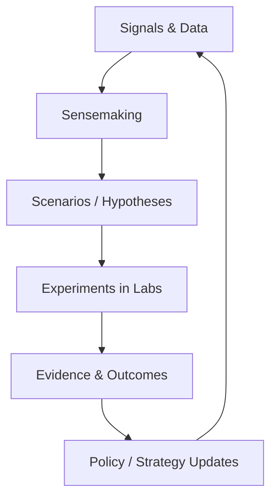

import CaseVignetteCard from "@site/src/components/CaseVignetteCard/CaseVignetteCard";

## Laboratorios de Innovación en un mundo de incertidumbre: prospectiva estratégica y Vigía Futura

Los laboratorios de innovación sin prospectiva pueden volverse reactivos, respondiendo a choques externos en lugar de moldear espacios de oportunidad. El monitoreo de tendencias es útil para rastrear señales superficiales, pero la prospectiva estratégica reformula la incertidumbre en elecciones accionables.

Operativamente, esto se manifiesta como traspasos explícitos de las salidas de prospectiva hacia la revisión de portafolio y la selección de experimentos.

Vigía Futura es una capacidad de prospectiva estratégica y observatorio regional que produce señales, escenarios e índices para informar las elecciones de portafolio en el tiempo. La prospectiva puede alimentar a los laboratorios; los laboratorios pueden probar futuros. Esta interacción puede convertir la incertidumbre en un bucle continuo de aprendizaje a través de estrategia, experimentación y escala.

### Las 3 salidas de prospectiva que los laboratorios realmente necesitan

- **Escenarios:**
  - **Artefacto de salida:** conjunto de escenarios con implicaciones para las prioridades de misión.
  - **Cadencia:** refresco semestral.
  - **Dueño:** líder de prospectiva con aporte de gobernanza de portafolio.
  - **Cómo cambia las decisiones de portafolio:** desplaza la inversión hacia opciones robustas.
- **Señales tempranas:**
  - **Artefacto de salida:** log de señales con relevancia evaluada.
  - **Cadencia:** revisión mensual.
  - **Dueño:** equipo de investigación e inteligencia.
  - **Cómo cambia las decisiones de portafolio:** activa sprints exploratorios de descubrimiento.
- **Apuestas de capacidad:**
  - **Artefacto de salida:** hoja de ruta de capacidad con umbrales de evidencia.
  - **Cadencia:** actualización trimestral.
  - **Dueño:** director del laboratorio y comité de gobernanza.
  - **Cómo cambia las decisiones de portafolio:** protege las capacidades de horizonte largo del sesgo de corto plazo.

<CaseVignetteCard
  title="Vinculación de señales de prospectiva"
  context="Los laboratorios públicos de innovación buscaron vincular las señales de prospectiva con las elecciones de portafolio."
  intervention="Las revisiones de práctica documentaron cómo las señales informaron las decisiones de portafolio."
  outcome="Los aportes de prospectiva se vincularon con las decisiones de portafolio en laboratorios públicos."
  lesson="Las señales de prospectiva pueden informar la elección de portafolio cuando se documentan y revisan."
  source={<>OECD OPSI, 2023</>}
/>

:::note[Puntos de control de decisión]
Apoyo a la decisión: determinar cuándo los aportes de prospectiva justifican un cambio de portafolio o un nuevo ciclo de experimentación.
:::

El siguiente diagrama muestra el bucle cerrado entre los aportes de prospectiva, la experimentación y las actualizaciones de estrategia.

**Diagrama — Bucle de retroalimentación Prospectiva–Laboratorio**

<CaseVignetteCard
  title="Revisiones de práctica de prospectiva"
  context="Las revisiones globales de práctica evaluaron los aportes de prospectiva en laboratorios públicos."
  intervention="Las revisiones compararon cómo los aportes moldearon las elecciones de portafolio."
  outcome="Los aportes de prospectiva se vincularon con patrones de elección de portafolio."
  lesson="Las revisiones de práctica pueden mostrar cómo los aportes de prospectiva moldean los portafolios."
  source={<>
    OECD OPSI (2023).{" "}
    <a
      href="https://oecd-opsi.org/blog/innovation-labs-through-the-looking-glass/"
      target="_blank"
      rel="noopener noreferrer"
    >
      Innovation labs through the looking glass: Experiences across the globe
    </a>
  </>}
/>

**Malinterpretación común:** la prospectiva reemplaza la experimentación en lugar de proveer aportes que los laboratorios deben probar y validar.

## Lista de comprobación de implementación (copiar/pegar)

### Día 0–7

- Definir la carta del laboratorio y publicar un brief de una página.
- Asignar derechos de decisión y publicar una matriz de decisión nombrada.
- Establecer criterios de admisión y liberar una rúbrica de admisión de una página.
- Establecer línea base de tres métricas de resultado y registrar una tabla de línea base.
- Seleccionar dos problemas prioritarios y documentar briefs de problema.
- Establecer una cadencia de revisión y publicar un calendario de 90 días.
- Formar un equipo central multifuncional y listar la cobertura de roles.
- Establecer estándares de evidencia y publicar una plantilla de experimento.

### Día 8–30

- Ejecutar dos sprints de descubrimiento y publicar dos memos de evidencia.
- Validar una hipótesis y registrar una decisión Go / Revisar / No-Go.
- Construir una lista de portafolio y asignar cada elemento a un nivel.
- Establecer un mapa de partes interesadas y publicar un registro de dependencias.
- Definir un backlog de aprendizaje y registrar diez elementos priorizados.
- Lanzar un piloto y documentar umbrales de éxito.
- Capturar la utilización de recursos y publicar un resumen mensual de costos.
- Conducir una retrospectiva y publicar un log de mejora de decisión.

### Trimestre 2

- Escalar un piloto validado y publicar un brief de preparación de escala.
- Completar una revisión de portafolio y emitir un memo escrito de asignación.
- Ejecutar una revisión entre laboratorios y publicar estándares compartidos de evidencia.
- Actualizar la evaluación de madurez y registrar cambios por pilar.
- Capacitar dos cohortes y publicar resultados de certificación.
- Publicar una actualización pública de transparencia con métricas de resultado.
- Reducir el tiempo de ciclo en un porcentaje definido y registrar el delta.
- Entregar una revisión de gobernanza y publicar reglas actualizadas de decisión.

<CaseVignetteCard
  title="Listas de comprobación de programas nacionales"
  context="Los programas nacionales de laboratorios usaron cadencia y puntos de control de evidencia para gestionar la entrega."
  intervention="Las listas de comprobación y los puntos de control de decisión se documentaron en la guía del programa."
  outcome="La cadencia y los puntos de control de evidencia se usaron para gestionar el flujo del portafolio."
  lesson="Las listas de comprobación con cadencia pueden apoyar los puntos de control de evidencia en programas nacionales de laboratorios."
  source={<>
    Doulab (n.d.).{" "}
    <a
      href="https://doulab.net/case-studies/ogtic-redlab"
      target="_blank"
      rel="noopener noreferrer"
    >
      OGTIC RedLab Innovation Network case study
    </a>
  </>}
/>
